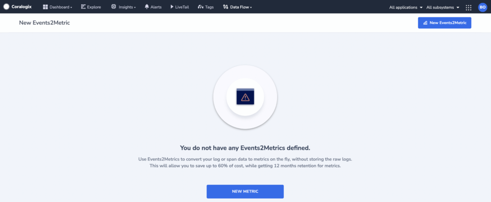
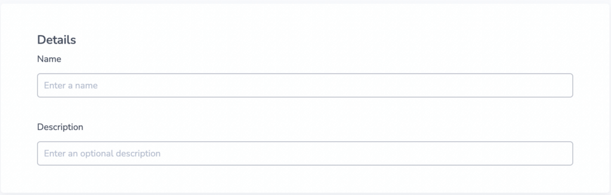
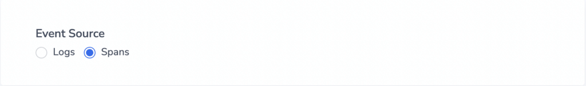
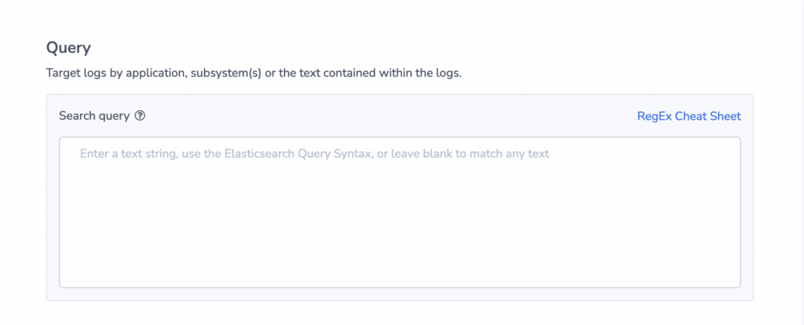
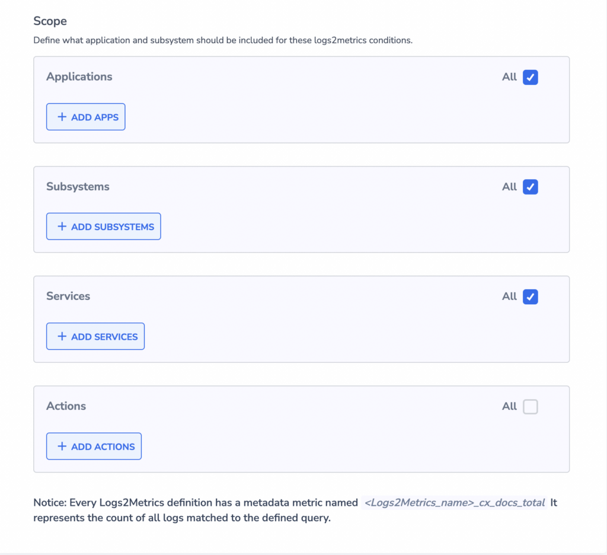
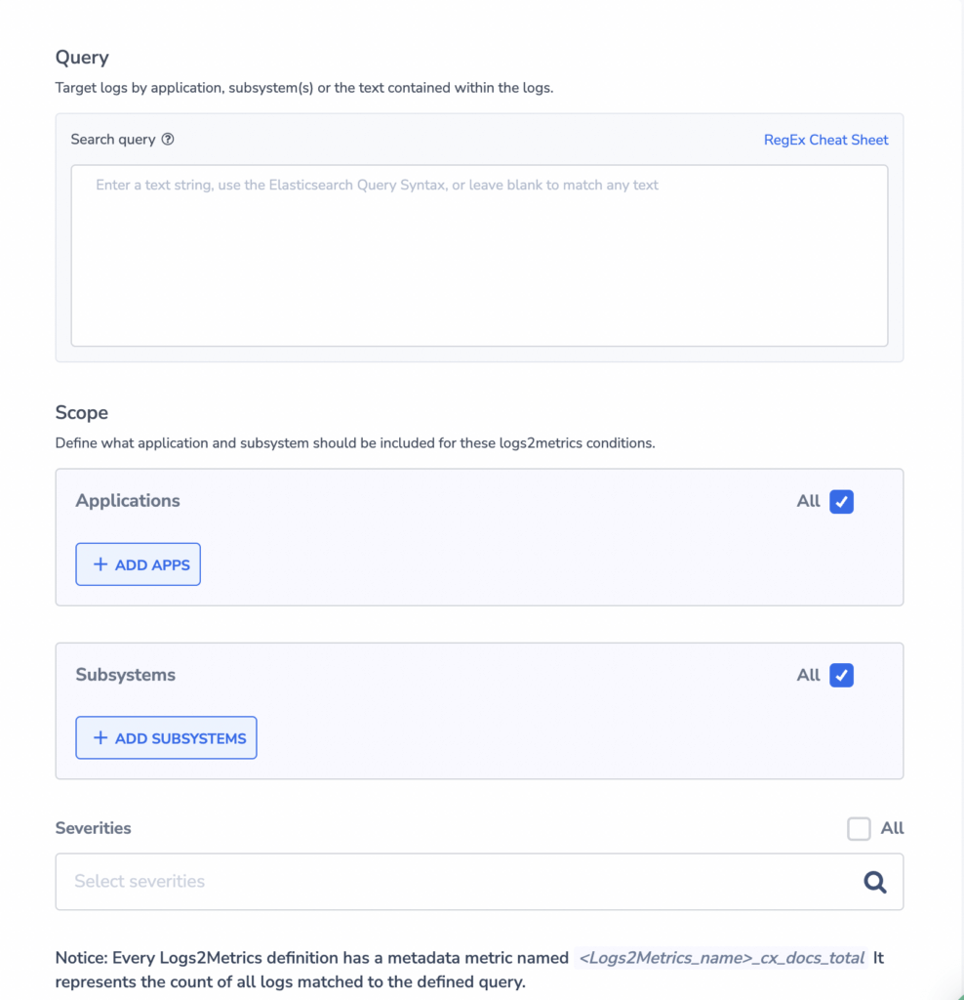
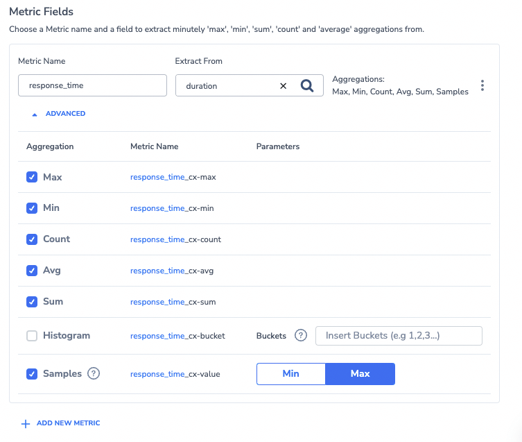
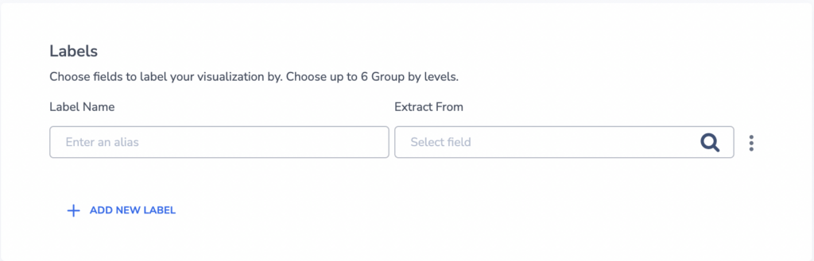
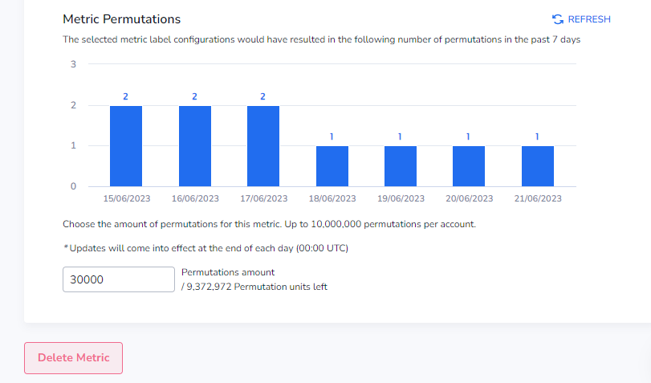

Coralogix **Events2Metrics** enables you to generate metrics from your **spans** and **logs** to optimize storage without sacrificing important data.

Define a query and Coralogix will execute it every minute and store different data aggregations in a long-term index. Metrics start to gather from the point in time in which they were defined. The available query time range for your Events2Metrics indices is 90 days. With Events2Metrics activated, you can create up to 30 metric rules and set the retention period to any length, providing ample opportunity for data analysis without retention restrictions. Each organization is limited to a quota of 10M total metric permutations per day.

## Activation

**STEP 1**. In your navigation pane, click **Data Flow** > **Events2Metrics**. Click **NEW METRIC**.

**STEP 2**. Input **Details**.

- **Name.** The name chosen will appear in the field representing this metric in the long-term index.

- **Description.** Describe your metric.

**STEP 3**. Select your **Event Source**. Choose either **Logs** or **Spans**.

**STEP 4**. Define your **Query**.

- Use a written text query or a Lucene type of query.

**STEP 5**. Define **Scope**.

- For **spans**:
    - Filter by **Applications**, **Subsystems**, and **Service**. For **Actions**, filter particular HTTP requests and their associated services.

- For **logs**:
    - Filter by **Applications**, **Subsystems**, and **Severities**.

**STEP 6**. Define **Metric Fields (optional)**.

- **Notes**:
    - Define up to 10 fields for which the metrics will be collected.
    
    - For each metric, you can choose an aggregation function that will aggregate the stream of the data and calculate **Max**/**Min**/**Count**/**Avg**/**Sum**/**Histogram**/**Samples** in 1 minute granularity.
    
    - A **Histogram** bucket is a range of values within a histogram. When you create a histogram, you specify the ranges of the values that will be used to group the data. Each bucket in the histogram represents the number of observations that fall within the range of values for that bucket. More granular buckets provide more accurate percentiles during querying, but will increase the number of time series and storage.
    
    - When selecting **Histogram** aggregation, you will need to provide the buckets that represent the distribution of the data.
    
    - An **example** Histogram bucket from a CPU metric looks as follows: `0, 10, 30, 45, 50, 60, 70, 85, 90, 100` - numbers separated by commas.
    
    - When selecting **Samples**, you will also need to select either **Min** or **Max** aggregation. Coralogix collects 4 samples per minute, with each sample representing a quarter of a minute. When we receive data from the same quarter, we take the minimum or the maximum (depending on the selection) from the old and new data.

**STEP 7**. Define **Labels**.

- Create up to six labels. Contact our support staff should you need more.

**STEP 8.** Choose the maximum amount of **Metric Permutations** allowed for this metric.

**Notes**:

- Each organization is limited to a quota of 10M total metric permutations per day.

- Each metric rule has a particular permutation quota. It appears in grey in the input field.

- Metric rules are blocked when a particular quota or the overall organization quota has been met, whichever comes first.

- Given the set Alert conditions above, the graph displays the number of permutations per day that would have theoretically resulted in the previous 7 days for this metric rule for [high and medium priority logs](https://coralogixstg.wpengine.com/docs/data-usage/). Use this information to determine the maximum amount of permutations you would like to allow for this metric moving forward, based on the theoretical usage. Choose a number that is high enough to allow average daily permutations, but not so high that it will cause you to pass your overall daily quota.

## **Default Metrics**

With every **Events2Metrics** created in Coralogix, a default metric is created. This metric counts the total logs or spans that matches the query and the scope that was provided in the **Events2Metrics** setup. The metric name will be **`<Events2Metrics Name>_cx_docs_total`** , and it can be queried via Grafana, as with any other metric. This default metric can be grouped by the labels that were defined in the Labels section.

### **Usage**

A **Count** metric is enabled for tracking the number of spans or logs that match the **Events2Metrics** filters.

- In Grafana, explore the number of spans or logs meeting the **Events2Metrics** conditions using **Query**, **Applications**, **Subsystems**, and **Severities**.

- You may also utilize PromQL while creating a [Metric Alert](https://coralogixstg.wpengine.com/docs/metric-alerts-promql/) and query the default metric.

## Additional Resources

Check out this [video tutorial](https://www.youtube.com/watch?v=mlRzUSX6uM0).

## Support

**Need help?**

Our world-class customer success team is available 24/7 to walk you through your setup and answer any questions that may come up.

Feel free to reach out to us **via our in-app chat** or by sending us an email at [support@coralogixstg.wpengine.com](mailto:support@coralogixstg.wpengine.com).
