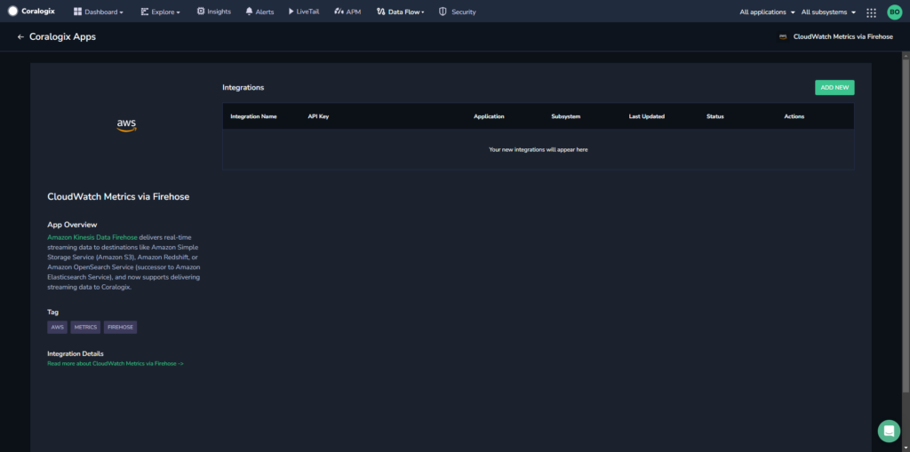
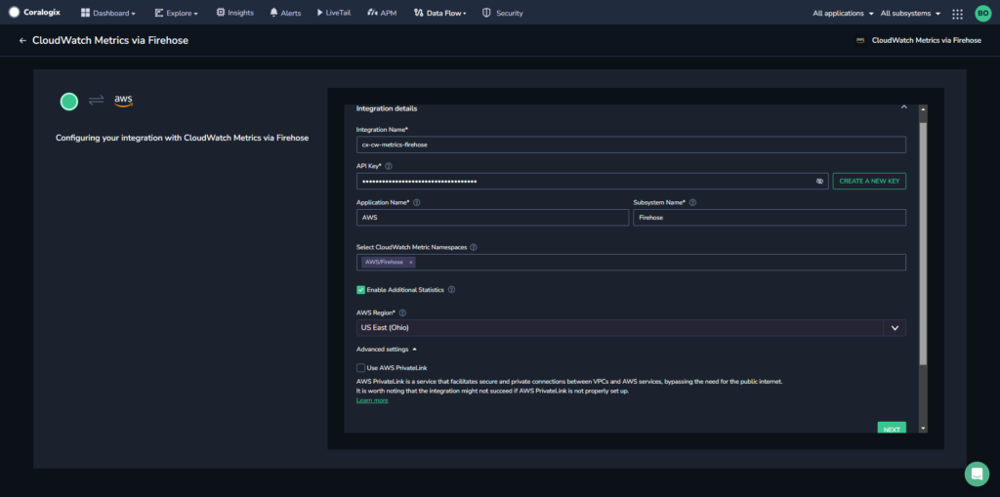
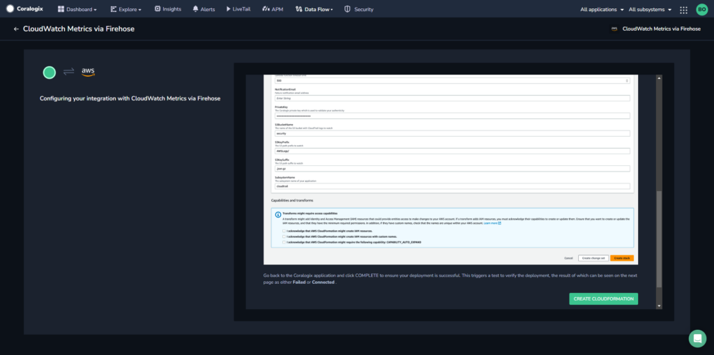
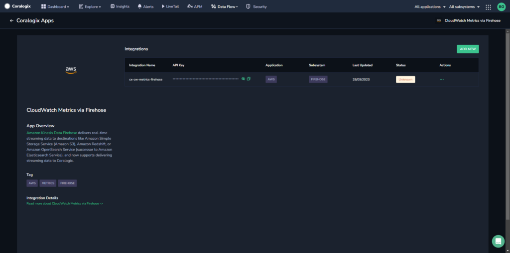

Streamline the process of ingesting and analyzing metrics from your AWS resources using our automated **CloudWatch Metrics via Firehose** integration package.

## Overview

Enable this integration to see all of your [AWS Kinesis Data Firehose](https://aws.amazon.com/kinesis/data-firehose/) metrics in Coralogix, an [AWS Partner Network (APN) Advanced Technology Partner with AWS  Competencies in DevOps](https://coralogixstg.wpengine.com/blog/coralogix-aws-devops-competency/). This includes metrics generated by your AWS services and applications, such as AWS Lambda, Amazon EC2, Amazon CloudWatch, and custom applications running on AWS infrastructure.

Enjoy its many benefits:

- **Scalability.** AWS Kinesis Data Firehose is highly scalable, accommodating growing data volumes as your applications and infrastructure expand.

- **Centralized Monitoring.** Centralizing your metrics in Coralogix provides a single location for monitoring and analyzing all your data, simplifying troubleshooting and performance optimization.

- **Real-Time Insights.** The integration allows for real-time data streaming, ensuring you have immediate access to critical metrics and can respond quickly to anomalies or issues.

- **Customizable Data Flow.** You can configure what metrics and log data to send, ensuring that you only transmit relevant information, which can help reduce noise and improve focus.

- **Monitoring Made Easy**. Coralogix offers a variety of out-of-the-box [extension packages](https://coralogixstg.wpengine.com/docs/extension-packages/). Each tailored extension unlocks a set of predefined items – alerts, parsing rules, dashboards, saved views, actions, and more – allowing you to jumpstart Coralogix monitoring of your external-facing resources.

## **Prerequisites**

- Metrics bucket [configured](https://coralogixstg.wpengine.com/docs/archive-s3-bucket-forever/).

## **Configuration**

**STEP 1**. From your Coralogix toolbar, navigate to **Data Flow** > **Integrations**.

**STEP 2.** In the Integrations section, select **CloudWatch Metrics via Firehose**.



**STEP 3.** Click **ADD NEW**.



**STEP 4.** Input your integration details.

- **Integration Name.** Enter a name for your integration and either enter your [Send-Your-Data API key](https://www.notion.so/d6f178687d464c58b9988fe223c719cc?pvs=21) or click **CREATE A NEW KEY** to create a new API key for the integration.

- **Application Name.** Enter an [application name](https://coralogixstg.wpengine.com/docs/application-and-subsystem-names/). The default name is AWS.

- **Subsystem Name.** Enter a [subsystem name](https://coralogixstg.wpengine.com/docs/application-and-subsystem-names/). The default name is Firehose.

- **CloudWatch Metric Namespaces.** Select from the dropdown menu the namespaces you want to bring into the Coralogix platform.

- **Enable Additional Statistics.** Enabling [additional statistics](https://docs.aws.amazon.com/AWSCloudFormation/latest/UserGuide/aws-properties-cloudwatch-metricstream-metricstreamstatisticsconfiguration.html) is **recommended** in order to receive detailed percentile data on key AWS metrics. However, enabling it may also incur additional costs from AWS. For out more about AWS pricing [here](https://aws.amazon.com/cloudwatch/pricing/%5C).
    - The configuration used for the additional statistics is as follows:

```
[
  {
    "AdditionalStatistics": ["p50", "p75", "p95", "p99"],
    "IncludeMetrics": [
      {"Namespace": "AWS/EBS", "MetricName": "VolumeTotalReadTime"},
      {"Namespace": "AWS/EBS", "MetricName": "VolumeTotalWriteTime"},
      {"Namespace": "AWS/ELB", "MetricName": "Latency"},
      {"Namespace": "AWS/ELB", "MetricName": "Duration"},
      {"Namespace": "AWS/Lambda", "MetricName": "PostRuntimeExtensionsDuration"},
      {"Namespace": "AWS/S3", "MetricName": "FirstByteLatency"},
      {"Namespace": "AWS/S3", "MetricName": "TotalRequestLatency"}
    ]
  }
]
```

- **AWS Region.** Select your AWS region from the dropdown menu.

- **AWS PrivateLink**. Enabling the use of AWS PrivateLink is **recommended** in order to ensure a secure and private connection between your VPCs and AWS services. Find out more [here](https://coralogixstg.wpengine.com/docs/coralogix-amazon-web-services-aws-privatelink-endpoints/).

**STEP 6.** Click **NEXT**.



**STEP 7.** Review the instructions for your integration and click **CREATE CLOUDFORMATION**.

**STEP 8.** You will be rerouted to the AWS website. Verify that all of the auto pre-populated values are correct. Click **Create Stack**.

**STEP 9.** Go back to the Coralogix application and click **COMPLETE** to close the module. Revert back to the integration page.



**STEP 10.** \[**Optional**\] Deploy the [extension package](https://coralogixstg.wpengine.com/docs/extension-packages/) of your choice to complement your integration needs.

- AWS EBS

- AWS EC2

- AWS ElastiCache

- AWS RDS

**STEP 11.** View the metrics in your Coralogix dashboard, either using [Custom Dashboards](https://coralogixstg.wpengine.com/docs/custom-dashboards/) \[**recommended**\] or hosted [Grafana View](https://coralogixstg.wpengine.com/docs/hosted-grafana-view/).

## Transformation Lambda

The [CloudWatch Metric Streams Lambda transformation function](https://github.com/coralogix/cloudwatch-metric-streams-lambda-transformation) is used as part of Kinesis Firehose to enrich the metrics from CloudWatch Metric Streams with AWS resource tags. Find out more [here](https://github.com/coralogix/cloudwatch-metric-streams-lambda-transformation/blob/main/README.md).

## Destination Errors

You may encounter these common destinations errors. View their possible solutions below.

| Message | Solution |
| --- | --- |
| The delivery timed out before a response was received and will be retried. If this error persists, contact the AWS Firehose service team. | None needed – no data loss |
| Delivery to the endpoint was unsuccessful. See Troubleshooting HTTP Endpoints in the Firehose documentation for more information. Response received with status code. 502… | Coralogix returned HTTP 502 error code, firehose will resend the data. None needed – no data loss |

## Limitations

CloudWatch Metric Streams does not send metrics that are older than 2 hours. This means that some CloudWatch metrics are calculated at the end of a day and reported with the beginning timestamp of the same day. This includes S3 daily storage metrics and some billing metrics.

Should you need these metrics, we **recommend** using [Cloudwatch Exporter using Prometheus](https://github.com/prometheus/cloudwatch_exporter) alongside our new CloudWatch integration designed to retrieve those metrics. For updated information, contact **Coralogix Support**.

## Additional Resources

<table><tbody><tr><td>Documentation</td><td><strong><a href="https://coralogixstg.wpengine.com/docs/guide-first-steps-coralogix/">Get Started with Coralogix</a></strong></td></tr></tbody></table>

## Support

**Need help?**

Our world-class customer success team is available 24/7 to walk you through your setup and answer any questions that may come up.

Feel free to reach out to us **via our in-app chat** or by sending us an email at [support@coralogixstg.wpengine.com](mailto:support@coralogixstg.wpengine.com).
