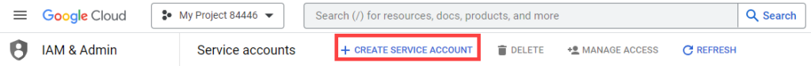
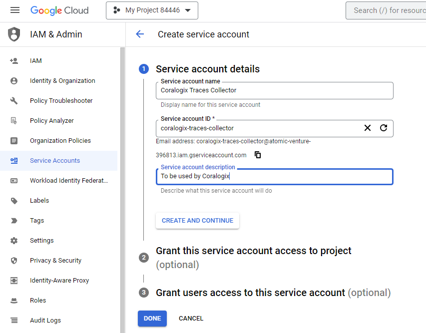
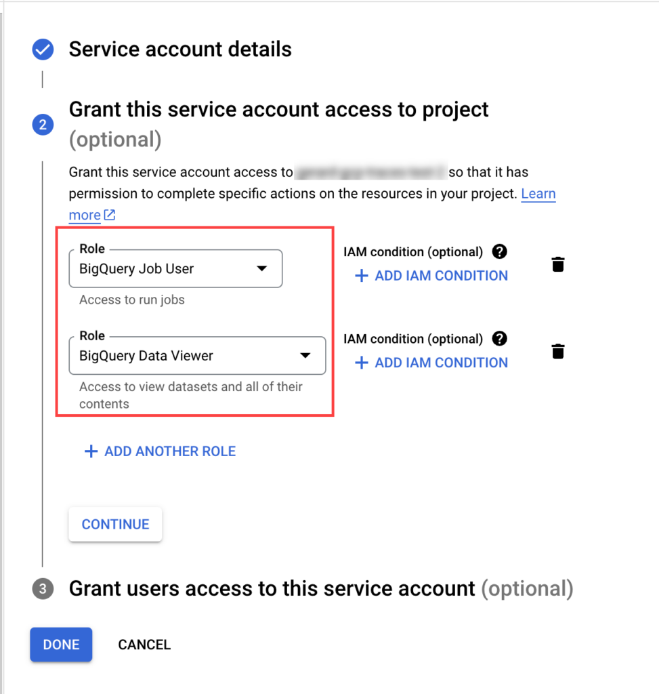
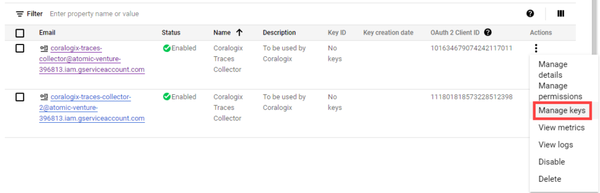
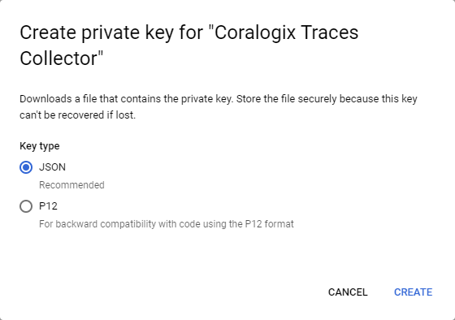
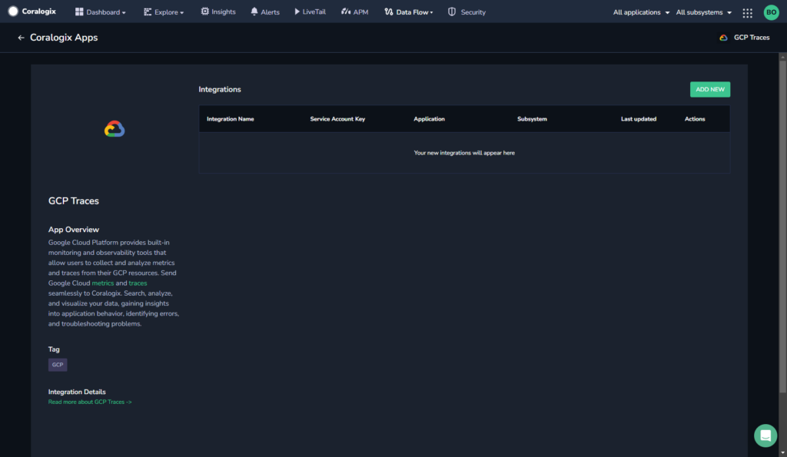
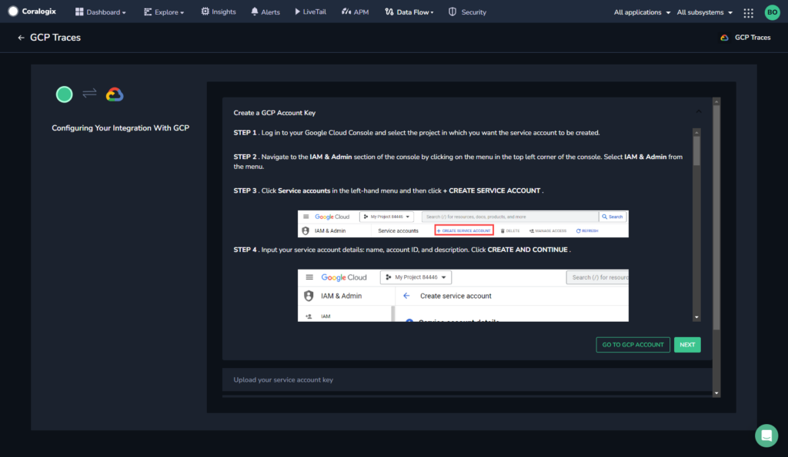
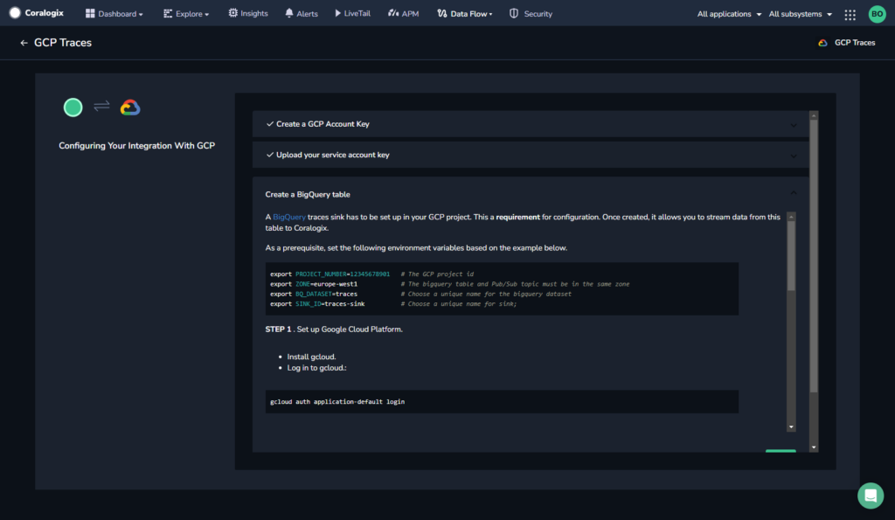
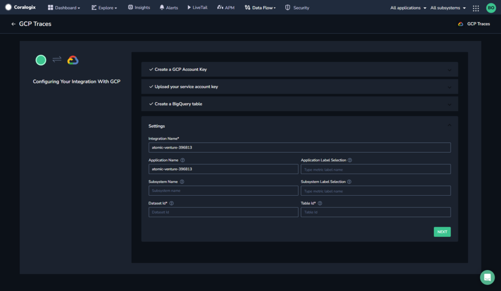
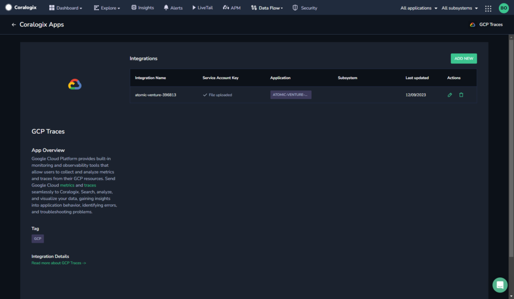

Google Cloud Platform provides built-in monitoring and observability tools that allow users to collect and analyze metrics and traces from their GCP resources. Send **Google Cloud traces** seamlessly to Coralogix. Search, analyze, and visualize your data, gaining insights into application behavior, identifying errors, and troubleshooting problems.

Find documentation on sending us your **Google Cloud metrics** [here](https://coralogixstg.wpengine.com/docs/gcp-metrics/).

## Overview

This tutorial details how to send your Google Cloud traces for ingestion by Coralogix. It requires that you configure GCP to send all your traces to a BigQuery sink, then create a service account giving Coralogix access to the BigQuery table holding the trace records. The table will be scanned periodically, with traces imported to Coralogix.

## Prerequisites

- [Google Cloud SDK](https://cloud.google.com/sdk/) installed

## Create a GCP Service Account

A prerequisite for sending your Google Cloud traces to Coralogix is creating a GCP service account.

**STEP 1**. Log in to your Google Cloud Console and select the project in which you want the service account to be created.

**STEP 2**. Navigate to the IAM & Admin section of the console by clicking on the menu on the top left corner of the console. Select **IAM & Admin** from the menu.

**STEP 3**. Click **Service accounts** in the left-hand menu and then click **\+ CREATE SERVICE ACCOUNT**.



**STEP 4**. Input your service account details: name, account ID, and description. Click **CREATE AND CONTINUE**.



**STEP 5**. Select roles for the service account. To collect traces, the roles `BigQuery Job User` and `BigQuery Data Viewer` are required..



**STEP 6**. Click **Done**.

**STEP 7.** An overview of all of your service accounts will appear. Find the service account you just created. Click the three dots in the left-most Action column and select **Manage keys**.



**STEP 8**. Click **Add Key**. Select JSON **Key type**. Store the key locally, as you will need it for the UI.



**STEP 9.** Click **CREATE** to create and download the key file.

## Create a GCP Traces Integration

### Set Up a BigQuery Traces Sink

A [BigQuery](https://cloud.google.com/bigquery/docs/release-notes#July_06_2022) traces sink has to be set up in your GCP project. This a **requirement** for configuration. Once created, it allows you to stream data from this table to Coralogix.

As a prerequisite, set the following environment variables based on the example below.

```
export PROJECT_NUMBER=12345678901   # The GCP project id
export ZONE=europe-west1            # The bigquery table and Pub/Sub topic must be in the same zone
export BQ_DATASET=traces            # Choose a unique name for the bigquery dataset
export SINK_ID=traces-sink          # Choose a unique name for sink
 

```

**STEP 1**. Set up Google Cloud Platform.

- Install gcloud.

- Log in to gcloud:

```
gcloud auth application-default login

```

- Enable the necessary APIs:

```
gcloud services enable dataflow compute_component logging storage_component storage_api bigquery pubsub datastore.googleapis.com cloudresourcemanager.googleapis.com

```

**STEP 2**. Create the destination dataset.

```
bq --location=$ZONE mk \\
--dataset \\
--description="Traces" \\
$PROJECT_ID:$BQ_DATASET


```

**Notes**:

- The vse command may be modified to conform to your [dataset settings](https://cloud.google.com/bigquery/docs/datasets#bq).

- GCP will write traces in a table named `cloud_trace` in the dataset created in this step.

- Save the name of your dataset as the **Dataset ID**, and the name of your table as the **Table ID** for use in this integration.

**STEP 3**. Create the sink.

```
gcloud alpha trace sinks create $SINK_ID bigquery.googleapis.com/projects/$PROJECT_NUMBER/datasets/$BQ_DATASET


```

A successful setup will produce an output similar to this:

```
You can give permission to the service account by running the following command.
gcloud projects add-iam-policy-binding bigquery-project \\
--member <serviceAccount:export-0000001cbe991a08-3434@gcp-sa-cloud-trace.iam.gserviceaccount.com> \\
--role roles/bigquery.dataEditor


```

**STEP 4**. Copy the command printed in the terminal in the previous step and replace `bigquery-project` with your project id.

**STEP 5**. Verify the sink was created successfully with the following command:

```
gcloud alpha trace sinks list

```

### Create an Integration

To start collecting traces for a GCP project, an integration must be created. The configuration requires the BigQuery dataset name (**Dataset ID**) and table name (**Table ID**) created in the previous section.

**STEP 1.** From your Coralogix toolbar, navigate to **Data Flow** > **Integrations**.

**STEP 2.** From the **Integrations** section, select **GCP Traces**.



**STEP 3.** Click **\+ ADD NEW**.



**STEP 4.** Click **SELECT FILE** and select the key file that you created in the previous section.

A confirmation appears that the file uploaded successfully.

**STEP 5.** Click **NEXT**.



**STEP 6.** Create the BigQuery table according to the instructions in the integration.

**STEP 7.** Click **NEXT**.



**STEP 8.** Select the application and subsystem settings.

- **Integration Name.** The Project ID. This is auto-populated using the service account key.

- **Application Name.** The default [application](https://coralogixstg.wpengine.com/docs/application-and-subsystem-names/) name. This is auto-populated using the service account key.

- **Application / Subsystem Label Selection.** Select labels that will be used to create the application name. The first label in `application_name_labels` matching a resource attribute name or a trace label will be used as application name. If no match is found and `application_name` is not empty, that value will be used. Otherwise, application name will be left empty. The same logic applies to **Subsystem Label Selection**.

- **Subsystem Name.** The default [subsystem](https://coralogixstg.wpengine.com/docs/application-and-subsystem-names/) name.

- **Dataset ID.** The name of the destination dataset created during your BigQuery traces sink setup.

- **Table ID.** The name of the table created in the dataset during your BigQuery traces sink setup. The default is `cloud_trace`.

**Step 9.** Click **NEXT**.



## Support

**Need help?**

Our world-class customer success team is available 24/7 to walk you through your setup and answer any questions that may come up.

Feel free to reach out to us **via our in-app chat** or by sending us an email at [support@coralogixstg.wpengine.com](mailto:support@coralogixstg.wpengine.com).
