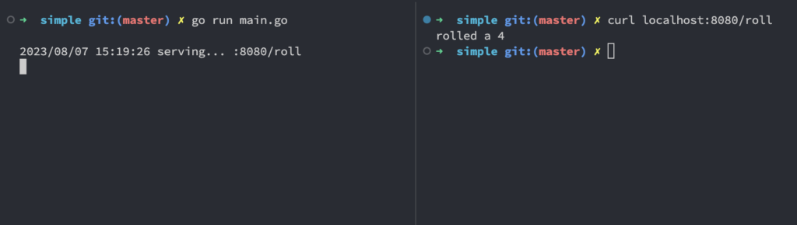
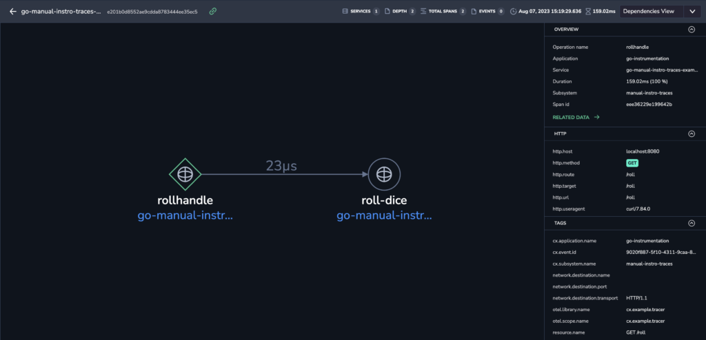

This tutorial demonstrates how to instrument Golang applications to capture traces using OpenTelemetry and send them to Coralogix.

The [OpenTelemetry-Go](https://opentelemetry.io/docs/instrumentation/go/) instrumentation for traces is currently **stable,** while instrumentation for metrics in **mixed beta**. The OpenTelemetry Go SDK is documented [here](https://pkg.go.dev/go.opentelemetry.io/otel).

Only [manual instrumentation](https://opentelemetry.io/docs/instrumentation/go/manual/) is supported for Golang. The examples provided here do not represent a concrete standard for instrumenting Golang applications but serve as guides for basic implementation. You should review your code base and identify the best approach to manual instrumentation for your specific project.

### Prerequisites

- A Coralogix account, set up on the Coralogix [domain](https://coralogixstg.wpengine.com/docs/coralogix-domain/)

- [Golang](https://go.dev/doc/install) installed

### Traces

First, we will demonstrate instrumentation for a simple web application for traces.

#### Setup

```shell
# create app directory
mkdir goapp
cd goapp

# initialise golang app
go mod init github.com/my/app

# create main.go
touch main.go

# note that for each new module/package added to main.go
# you will need run:
go mod tidy


```

#### Initialise Trace Provider

```golang
package main

import (
  "context"
  "crypto/tls"
  "fmt"
  "log"
  "net/http" // Import the missing http package
  "os"
  "time"

  "github.com/coralogix/coralogix-opentelemetry-go/sampler"
  "go.opentelemetry.io/otel"
  "go.opentelemetry.io/otel/attribute"
  "go.opentelemetry.io/otel/exporters/otlp/otlptrace/otlptracegrpc"
  "go.opentelemetry.io/otel/trace"
  "go.opentelemetry.io/otel/sdk/resource"
  sdktrace "go.opentelemetry.io/otel/sdk/trace"
  semconv "go.opentelemetry.io/otel/semconv/v1.24.0"
  "google.golang.org/grpc/credentials"
  "math/rand"
)

const (
    traceName = "my_trace"
    coralogixEndpoint = "ingress.eu2.coralogix.com:443" //adjust your coralogix endpoint for your environment ->https://coralogix.com/docs/coralogix-endpoints/
    cxApplicationName = "go-instrumentation"
    cxSubsystemName = "manual-instro-traces"
)

func init() {
  ctx := context.Background()

    // 1. define trace connection options
  var headers = map[string]string{
    "Authorization": "Bearer <your_private_key" + os.Getenv("CX_TOKEN"),
  }

  traceConnOpts := []otlptracegrpc.Option{
    otlptracegrpc.WithTimeout(1 * time.Second),
    otlptracegrpc.WithEndpoint(coralogixEndpoint),
    otlptracegrpc.WithHeaders(headers),
    otlptracegrpc.WithTLSCredentials(credentials.NewTLS(&tls.Config{})),
  }

  // 2. set up a trace exporter
  exporter, err := otlptracegrpc.New(ctx, traceConnOpts...)
  if err != nil {
    log.Fatalf("failed to create trace exporter: %v", err)
  }

  // 3 define span resource attributes,
    // these resource attributes will be added to all Spans
	res, err := resource.Merge(
		resource.Default(),
		resource.NewWithAttributes(
			semconv.SchemaURL,
			semconv.ServiceNameKey.String("go-manual-instro-traces-example"),
			// cx.application.name and cx.subsystem.name are required for the
			// spans being sent to the coralogix platform
			attribute.String("cx.application.name", cxApplicationName),
			attribute.String("cx.subsystem.name", cxSubsystemName),
		),
	)
    // 4. create batch span processor
    //      Note: SpanProcessor is a processing pipeline for spans in the trace signal.
    //      SpanProcessors registered with a TracerProvider and are called at the start and end of a
    //      Span's lifecycle, and are called in the order they are registered.
    //      https://pkg.go.dev/go.opentelemetry.io/otel/sdk/trace#SpanProcessor
  sp := sdktrace.NewSimpleSpanProcessor(exporter)

    // 5. add span processor and resource attributes to the trace provider
  tp := sdktrace.NewTracerProvider(
    sdktrace.WithSampler(sampler.NewCoralogixSampler(sdktrace.AlwaysSample())),
    sdktrace.WithResource(res),
    sdktrace.WithSpanProcessor(sp),
  )

    // 6. set the global trace provider
  otel.SetTracerProvider(tp)
}
```

The code above imports the required packages and defines an init function that instantiates and configures the global trace provider. The trace provider is configured to send traces to the Coralogix Domain `ingress.coralogixstg.wpengine.com:443` using the `SimpleSpanProcessor`. It also fetches the Coralogix Private key from the env variable `CX_TOKEN`.

#### Add Traces and Spans

Next we will create a simple webserver that returns a random number between 0 and 6 when called.

```golang
// http handle to roll dice
func rollhanler(w http.ResponseWriter, r *http.Request) {
  // 1. get tracer
  tracer := otel.Tracer("cx.example.tracer")

  // 2. start a span
  ctx, span := tracer.Start(r.Context(), "rollhandle", trace.WithSpanKind(trace.SpanKindServer))
  defer span.End()

  roll := rolldice(ctx)

  // 3. add attributes to the span
  // Note: these attribute could also be added using middleware
  span.SetAttributes(
    attribute.String("span.kind", "server"),
    attribute.String("resource.name", r.Method+" "+r.URL.Path),
    attribute.String("http.method", r.Method),
    attribute.String("http.url", r.URL.Path),
    attribute.String("http.route", r.URL.Path),
    attribute.String("http.target", r.URL.String()),
    attribute.String("http.useragent", r.UserAgent()),
    attribute.String("http.host", r.Host),
  )

  fmt.Fprintf(w, "rolled a %d\n", roll)
}

// rolldice returns a random number between 1 and 6
func rolldice(ctx context.Context) int {
  roll := rand.Intn(6) + 1

  // 1. get tracer
  tracer := otel.Tracer(traceName)

  // 2. start a span from context
  _, span := tracer.Start(ctx, "roll-dice")
  defer span.End()

  // 3. add attributes to the span
  span.SetAttributes(attribute.Int("dice.roll", roll))

  return roll
}

func main() {
  http.HandleFunc("/roll", rollhanler)
  log.Println("serving... :8080/roll")
  http.ListenAndServe(":8080", nil)
}
```

Above we have defined to 2 functions, `rollhandler` which is the http handler function that is executed when the endpoint `/roll` is called, and `rolldice` which is a function that is used to generate the random number.

The above demonstrates a key feature and requirement of Instrumentation, managing context. When starting a trace in the `rollhandle` function, a context is passed to the `tracer.Start` function, this function in turn returns a new context. We then use the returned context when calling the `rolldice` function. This chain of passing contexts between functions and creating traces from the context allows the tracer to establish and represent relationships between functions.

We can run the application by doing the following:



When we execute the code above, this will create the following trace on our Coralogix console:



We can see that by passing the contexts correctly between functions, we get a proper representation of the relationship between them.

#### Troubleshooting and Validation

If traces are not visible in the Coralogix console, you can run the following checks.

- Make sure your Coralogix PrivateKey is assigned to the environment variable `CX_TOKEN` and the `coralogixEndpoint` variable repris correct for your Coralogix Domain.

- Traces can be written to stdout to verify if they are being generated correctly, below we define an `init()` function that initialise the tracer with a `stdouttrace.Exporter` that prints to stdout:

```golang
func initConsole() {

	// Set up a trace exporter that writes to Stdout
    // requires import: "go.opentelemetry.io/otel/exporters/stdout/stdouttrace"
	exporter, err := stdouttrace.New(
		stdouttrace.WithWriter(os.Stdout),
		// Use human-readable output.
		stdouttrace.WithPrettyPrint(),
		// Do not print timestamps for the demo.
		stdouttrace.WithoutTimestamps(),
	)

	// exporter, err = otlptrace.New()

	if err != nil {
		log.Fatalf("failed to create trace exporter: %v", err)
	}

	// Set global trace provider
	resource := resource.NewWithAttributes(semconv.SchemaURL, semconv.ServiceNameKey.String("manual-instro-traces"))

	// define a batch span processor to export spans
	bsp := sdktrace.NewBatchSpanProcessor(exporter)

	// create a trace provider
	traceprovider := sdktrace.NewTracerProvider(
		sdktrace.WithResource(resource),
		sdktrace.WithSpanProcessor(bsp),
	)

	// Set the Tracer Provider globally
	otel.SetTracerProvider(traceprovider)
	otel.SetTextMapPropagator(propagation.TraceContext{})
}

```

You can view more on Instrumentation in Golang using OpenTelemetry [here](https://opentelemetry.io/docs/instrumentation/go/).

### Metrics

Now we will demonstrate instrumentation for metrics using the same web application.

#### Initialise Metric Provider

```golang
package main

import (
	"context"
	"crypto/tls"
	"fmt"
	"log"
	"math/rand"
	"net/http"
	"os"
	"time"

	"go.opentelemetry.io/otel"
	"go.opentelemetry.io/otel/attribute"
	"go.opentelemetry.io/otel/exporters/otlp/otlpmetric/otlpmetricgrpc"
	"go.opentelemetry.io/otel/metric"

	sdkmetrics "go.opentelemetry.io/otel/sdk/metric"
	"go.opentelemetry.io/otel/sdk/resource"
	semconv "go.opentelemetry.io/otel/semconv/v1.4.0"
	"google.golang.org/grpc/credentials"
)

const (
	coralogixEndpoint = "ingress.coralogixstg.wpengine.com:443"
	cxApplicationName = "go-instrumentation"
	cxSubsystemName   = "manual-instro-traces"
	traceName         = "cx.example.tracer"
)

func init() {
	ctx := context.Background()
	// 1. define metrics connection options
	var headers = map[string]string{
		"Authorization": "Bearer " + os.Getenv("CX_TOKEN"),
	}

	metricsConnOpts := []otlpmetricgrpc.Option{
		otlpmetricgrpc.WithTimeout(1 * time.Second),
		otlpmetricgrpc.WithEndpoint(coralogixEndpoint),
		otlpmetricgrpc.WithHeaders(headers),
		otlpmetricgrpc.WithTLSCredentials(credentials.NewTLS(&tls.Config{})),
	}

	// 2. set up a metrics exporter
	metricsExporter, err := otlpmetricgrpc.New(ctx, metricsConnOpts...)
	if err != nil {
		log.Fatalf("failed to create metrics exporter: %v", err)
	}

	reader := sdkmetrics.NewPeriodicReader(metricsExporter)

	// 3. create a controller

	// 3. define resource attributes,
	// these resource attributes will be added to all metrics
	resource := resource.NewWithAttributes(
		semconv.SchemaURL,
		semconv.ServiceNameKey.String("go-manual-instro-traces-example"),

		// cx.application.name and cx.subsystem.name are required for the
		// metrics being sent to the coralogix platform
		attribute.String("cx.application.name", cxApplicationName),
		attribute.String("cx.subsystem.name", cxSubsystemName),
	)

	// 4. create batch metrics processor
	//      Note: MetricsProcessor is a processing pipeline for metrics in the metrics signal.
	//      MetricsProcessors registered with a MeterProvider and are called at the start and end of a
	//      Metric's lifecycle, and are called in the order they are registered.
	//      https://pkg.go.dev/go.opentelemetry.io/otel/sdk/metric#MetricsProcessor
	mp := sdkmetrics.NewMeterProvider(
		sdkmetrics.WithResource(resource),
		sdkmetrics.WithReader(reader),
	)

	// 5. set the global meter provider
	otel.SetMeterProvider(mp)
}

```

Above we define an `init` function that initializes the metrics instrumentation components for the application. It defines connection options for communicating with the Coralogix platform, including authorisation headers and endpoint details. An exporter is then set up to send metrics to Coralogix, and a periodic reader reads and exports these metrics at regular intervals. A metrics processor is then established to manage the collection, batching, and export of metrics data, and this processor is set as the default global meter provider. This ensures that the application is ready to capture and relay metrics to Coralogix seamlessly.

As before, the Coralogix Private Key will be read in using an Environment variable, **CX\_TOKEN**

#### HTTP Request Counter

We will implement a simple HTTP Request Counter metric. To do this, we will define a web app with middleware that increments the counter for each request received.

```golang
// requestCounterMiddleware - middleware that counts each request
func requestCounterMiddleware(reqCount metric.Int64Counter, next http.HandlerFunc) http.HandlerFunc {
	return func(w http.ResponseWriter, r *http.Request) {
		ctx := r.Context()
		// increment counter
		reqCount.Add(ctx, 1)
		next(w, r)
	}
}
```

This middleware function increments a counter each time an HTTP request passes through it. Its parameters are the counter (`reqCount`) and the next HTTP handler (`next`) in the pipeline. Upon invocation:

- It retrieves the context from the incoming request.

- Increments the request counter.

- Proceeds to the next HTTP handler in the chain.

```golang
// http handle to roll dice
func rollhanler(w http.ResponseWriter, r *http.Request) {
	fmt.Fprintf(w, "rolled a %d\n", rand.Intn(6)+1)
}

```

We have defined an HTTP handler function which, when invoked, simulates rolling a dice and responds with the outcome to the client.

```golang
func main() {

	// define a meter
	meter := otel.Meter("goapp")

	// Create two synchronous instruments: counter and histogram
	reqCounter, err := meter.Int64Counter(
		"http.request.counter",
		metric.WithDescription("HTTP Request counter"),
	)

	if err != nil {
		log.Fatalf("failed to create request count metric: %v", err)
	}

	http.HandleFunc("/roll", requestCounterMiddleware(reqCounter, rollhanler))
	log.Println("serving... :8080/roll")
	http.ListenAndServe(":8080", nil)
}
```

The main function does the following:

- Initializes a meter named "goapp" to produce metrics instruments.

- Defines an Int64Counter named "http.request.counter", serving as a counter for incoming HTTP requests.

- Registers the "/roll" endpoint, wrapping the `rollhandler` with the `requestCounterMiddleware` to ensure each request is counted.

The application can be run and tested using the same method as described for the traces example.

#### Troubleshooting and Validation

Sent metrics can be view by visiting **_Grafana_** -> _**Explore**_ -> **_Browse Metrics_**

If you wish to validate that that the application is generating metrics correctly, similar to traces, it is possible to export metrics to stdout.

First we define a stdout exporter and create a reader.

```golang
	// requires import: "go.opentelemetry.io/otel/exporters/stdout/stdoutmetric"
        stdoutexporter, err := stdoutmetric.New()
	if err != nil {
		log.Fatalf("failed to create metrics exporter: %v", err)
	}

	stdoutreader := sdkmetrics.NewPeriodicReader(stdoutexporter)
```

Then add the reader to the Metric Provider.

```golang
	mp := sdkmetrics.NewMeterProvider(
		sdkmetrics.WithResource(resource),
		sdkmetrics.WithReader(reader),
		sdkmetrics.WithReader(stdoutreader), // <----
	)
```

Metrics will be printed to stdout as well as sent to Coralogix. Note that metrics are not sent instantly when there is a delay using the Periodic Reader.

## Service Flows

For customers with functional Golang OpenTelemetry instrumentation, this section guides reconfiguring the existing setup to define, report, and monitor Coralogix [Service Flows](https://coralogixstg.wpengine.com/docs/service-flows/).

New customers or those who haven’t configured the Golang OpenTelemetry instrumentation must follow the **Setup** instructions above. The steps in this section are included in those instructions.

Add to the package:

```
  "github.com/coralogix/coralogix-opentelemetry-go/sampler"
```

Add to the code:

```
sdktrace.WithSampler(sampler.NewCoralogixSampler(trace.AlwaysSample())),
```

Run:

```
go mod tidy
```

## Support

**Need help?**

Our world-class customer success team is available 24/7 to walk you through your setup and answer any questions that may come up.

Feel free to reach out to us **via our in-app chat** or by sending us an email at [support@coralogixstg.wpengine.com](mailto:support@coralogixstg.wpengine.com).
