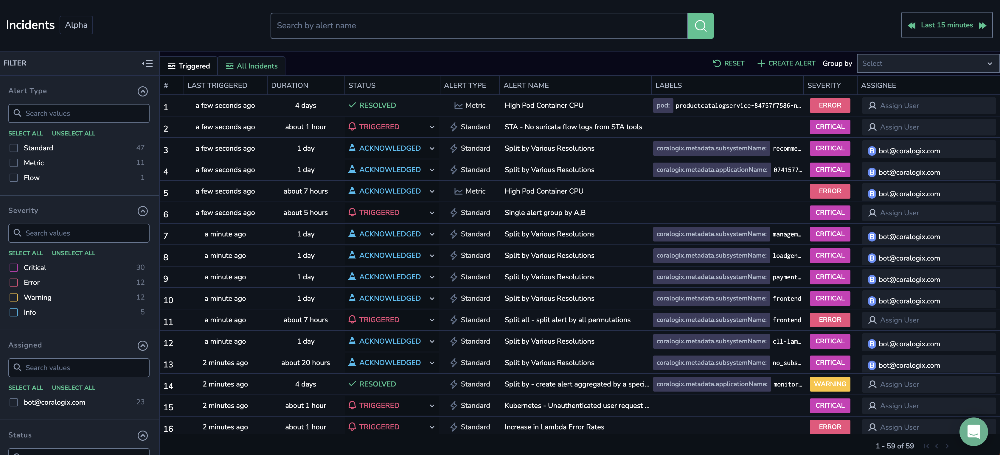

Our **Incidents** **Screen** displays all of your triggered alert events within the Coralogix platform. View all those events which are currently triggered or those triggered within a specific time frame. With easy-to-use functionalities and the ability to drill-down into events of interest, the feature ensures top-notch monitoring and analysis.

## Overview

The Coralogix **Incidents Screen** simplifies your alert response journey from start to finish. Perfect for DevOps teams and SREs looking to eliminate context switching, users can easily identify triggered [alert](https://coralogixstg.wpengine.com/docs/getting-started-with-coralogix-alerts/) events of interest and drill-down into the underlying logs, metrics, and traces all from within the Coralogix platform. Coralogix uniquely enables users to analyze any relevant archived data alongside events that triggered the current alert. This unified approach brings events and observability together for faster triage, analysis and remediation.

## Benefits

Use the **Incidents Screen** to:

- **View** all those alerts events which are currently triggered or those triggered within a specific time frame.

- **Organize** incidents by alert definition.

- **Search** alerts by name.

- **Filter** alerts by type, severity, or other chosen parameters.

- **Select** and **modify** incident status.

- **Instantly** **drill-down** into any triggered event to view its contextual information and underlying data.

## How It Works

Triggered alert events, bundled as incidents, are presented in your **Incidents Screen** according to the **Group By Tags** and **Notification Settings** set in your alert definition.

### Group By Tags

The **Incidents** **Screen** presents all of the individual permutations for all key-value tags that are selected in the **Group By** **Conditions** defined in your [alert](https://coralogixstg.wpengine.com/docs/getting-started-with-coralogix-alerts/).

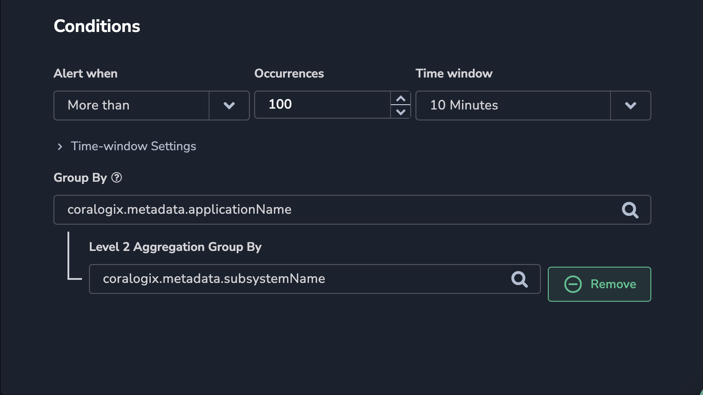

The Group By feature allows you to group alerts by one or more key-value tags that are aggregated into a histogram. An alert is triggered whenever the condition threshold is met for a specific aggregated key within a specified timeframe.

If using 2 tags for Group By, matching logs, metrics or traces will first be aggregated by the parent tag (ie. `applicationName`), then by the child tag (ie. `subsystemName`). An alert will fire when the threshold meets the unique combination of both parent and child. Only data that includes the selected Group By tags will be included in the count.

For every alert that is triggered, one or more events form an incident. If the user has defined them in his / her alert setup, specific events within an incident are organized by key-value Group By tags.

### Notification Settings

Incident events are organized by the **Notification Settings** defined in your [alert](https://coralogixstg.wpengine.com/docs/getting-started-with-coralogix-alerts/).

- If you choose to trigger a **single** alert when at least one key-value tag combination meets your Group By Conditions, all events for that alert will be consolidated within one incident in your **Incidents Screen**.

- If you choose to trigger a **separate** alert for each key-value combination that meets your Group By Conditions, you will see separate incidents for each key-value tag combination.

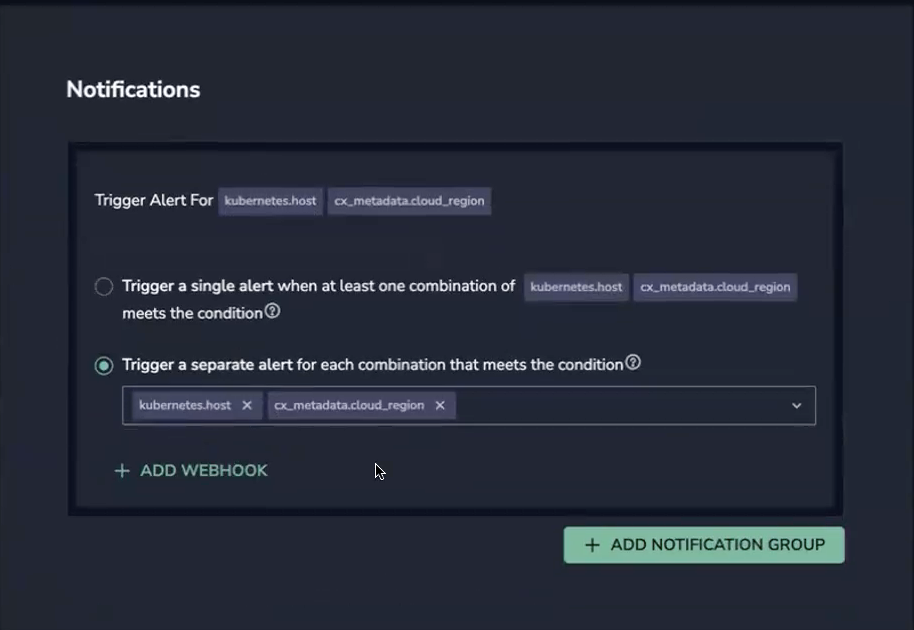

## Prerequisites

- [S3 archive bucket](https://coralogixstg.wpengine.com/docs/archive-s3-bucket-forever/) defined for querying alert logs in your **Explore Screen**

## Incidents Screen

To view all of your triggered alerts, navigate to **Alerts > Incidents** in your Coralogix toolbar.

### Triggered Incidents

The **Triggered** tab presents all those alert events which are currently triggered and have yet to be resolved. Events are sorted by ‘Last Triggered’ timestamp.

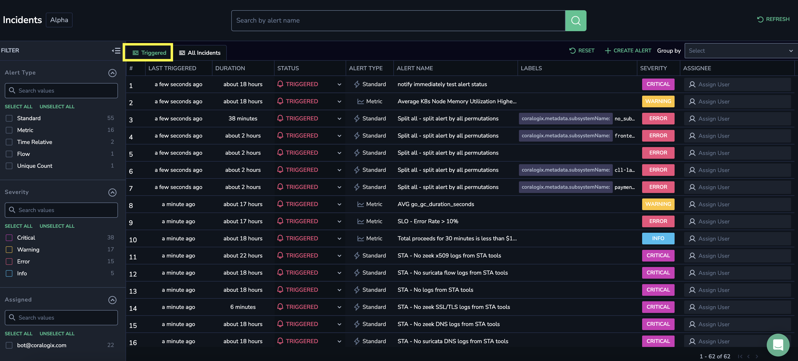

### All Incidents

The **All Incidents** tab presents all those events triggered within a specific time frame of your choosing, regardless of their current status and duration. Events are sorted by ‘Last Triggered’ timestamp.

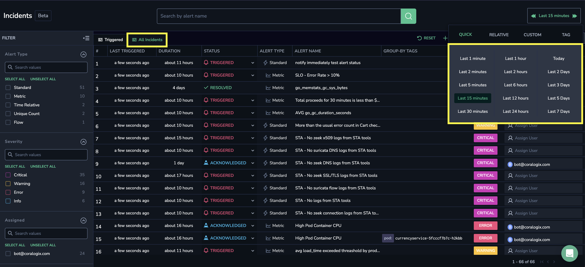

Beyond our default time frame selection (QUICK), you have the option of querying incidents for a timeframe relative to the present time (RELATIVE) or within a custom timeframe (CUSTOM). In addition, our [Version Benchmarks](https://coralogixstg.wpengine.com/docs/software-builds-display/) feature allows you to use tags to compare between timelines (TAG).

### Group by Alert Definition

For both the **Triggered** and **All Incidents** tabs, you may group events by alert definition in the upper right-hand corner of your screen. Doing so will aggregate all alert permutations, consolidating individual incidents under one alert name.

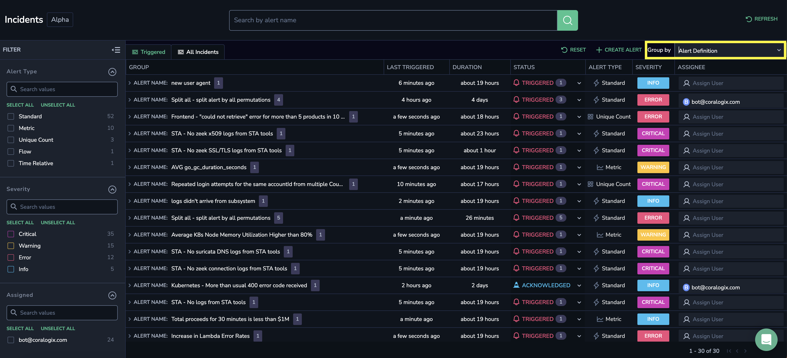

Expand an alert group to view the individual permutations that triggered the alert, with additional information about each permutation. This includes alert status, alert type, permutation details, etc. An alert group can contain up to 1,000 permutations.

### Filter Incidents

Filter incidents using the filters in the left-hand sidebar.

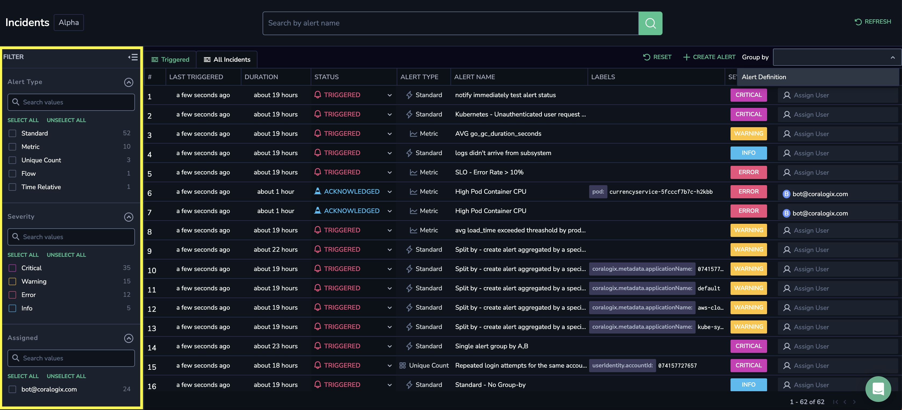

Filter incidents by alert type, alert severity, and state.

## Incident Status

Incidents may have one of three statuses: TRIGGERED, ACKNOWLEDGED, or RESOLVED. Statuses change on an automatic or manual basis.

### Automatic Change to Status

Once a triggered alert is resolved, the status of the original incident automatically changes to RESOLVED. If you have activated the **Notify When Resolved** settings in your alert, a new resolve event is sent.

Once resolved, an incident is closed. If the alert is then triggered, a new incident appears.

### Manual Change to Status

Clicking on a TRIGGERED status will present a drop-down menu in which you can choose to ACKNOWLEDGE or RESOLVE an incident. Doing so automatically defines you as the assignee. You may unassign yourself or replace the assignee.

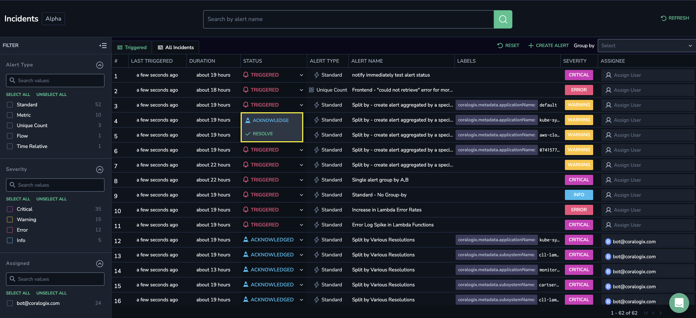

Modify incident status from your **Incidents Screen** or **Incident Details Screen**.

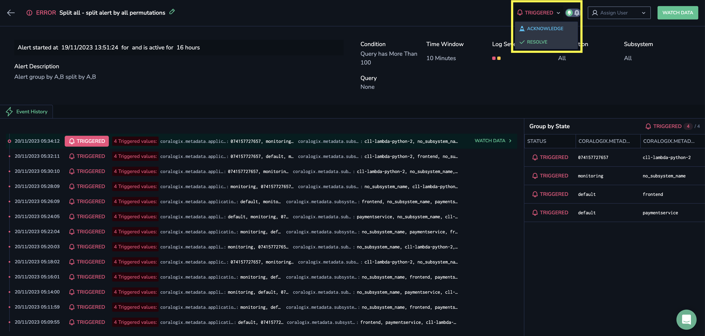

## Incident Details Screen

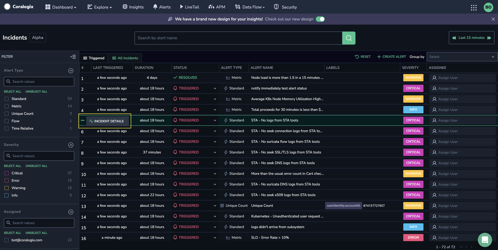

Clicking on left-hand ellipses (…) of any incident permutation opens the **Incident Details** Screen, which presents the details of the incident from start to finish:

- Alert name and status (triggered, acknowledged or resolved)

- Event history and timestamp

- Severity, time window, application and subsystem

- Alert query

- Assignee

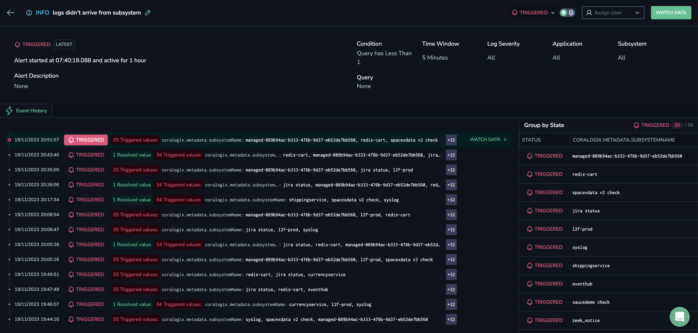

Open an alert definition and edit by clicking on the pen icon.

### Group By State

For **single** alerts when at least one key-value tag pair combination meets your Group By Conditions, the **Group By State** grid displays all of the permutations for the key-value tags established.

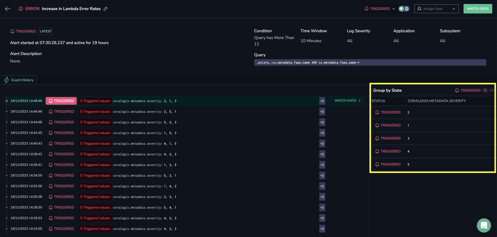

### Watch Data

Click WATCH DATA for any event to see its triggered logs, metrics or traces.

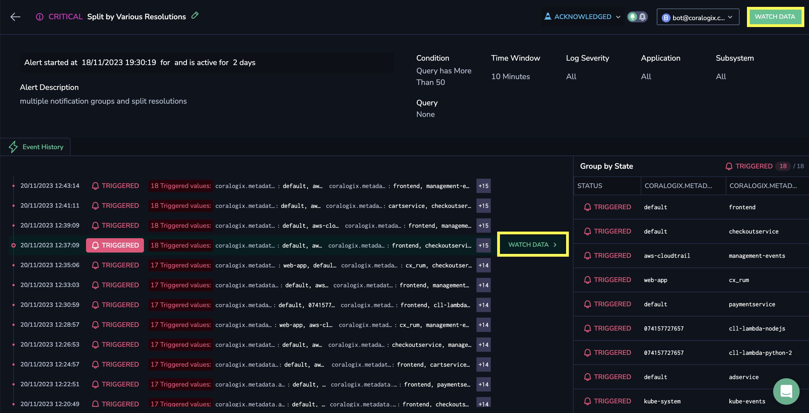

- Clicking WATCH DATA in the upper-right screen will present you with the raw data for the last event in the incident.

- Clicking WATCH DATA next to a specific event will present you with the raw data for that event.

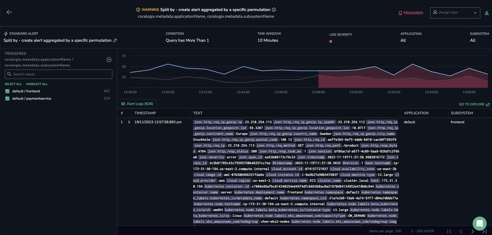

## Additional Resources

<table><tbody><tr><td>Documentation</td><td><strong><a href="https://coralogixstg.wpengine.com/docs/archive-s3-bucket-forever/">Connect S3 Archive</a> <a href="https://coralogixstg.wpengine.com/docs/getting-started-with-coralogix-alerts/">Get Started with Coralogix Alerts</a></strong></td></tr></tbody></table>

## Support

**Need help?**

Our world-class customer success team is available 24/7 to walk you through your setup and answer any questions that may come up.

Feel free to reach out to us **via our in-app chat** or by sending us an email at [support@coralogixstg.wpengine.com](mailto:support@coralogixstg.wpengine.com).
