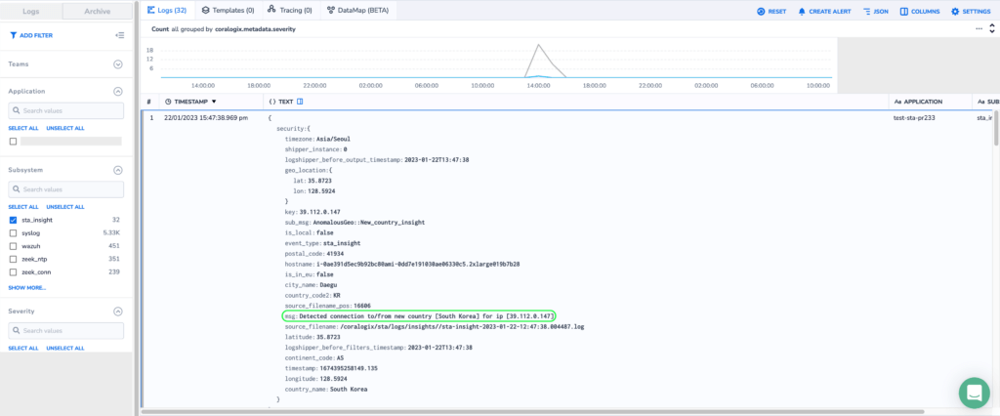

[STA](https://coralogixstg.wpengine.com/docs/sta-detection-encrypted-traffic/) is a tool for analyzing network traffic and host based activities. Using open-source services such as `zeek` and `suricata`, it enriches these events with other internal services.

To reduce the total cost of ownership of the STA, we have introduced a new insights service within the STA that will automatically detect possible threats and security related anomalies in your traffic. 

Using the Coralogix Platform, configure alerts based on those insights and receive instant notifications if anomalies occur.

## Insights Overview

The following table contains a detailed list of the possible insights that can be detected by the `sta-insights` events.

Note:

To reduce the chances for false-positives, during the first three days the STA will only learn the patterns seen in the traffic. After that it will start sending events about anomalies to Coralogix.

### Types of Insights

<table><tbody><tr><td class="has-text-align-left" data-align="left"><strong>Name</strong></td><td class="has-text-align-left" data-align="left"><strong>Description</strong></td><td><strong>Possible Attacks</strong></td><td><strong>Message</strong></td><td><strong>Sub Message</strong></td></tr><tr><td class="has-text-align-left" data-align="left">File Similarity Insight</td><td class="has-text-align-left" data-align="left">changes to file paths that are very similar to others which encountered recently</td><td>File encryption based Ransomware</td><td><code>"Detected changes to file paths very similar to others seen recently &lt;hamming_distance&gt;"</code></td><td><code>AnomalousSimhash::Document_Similarity_insight</code></td></tr><tr><td class="has-text-align-left" data-align="left">Connection To Suspiciously Looking Domain Name</td><td class="has-text-align-left" data-align="left">connections to suspicious domain using frequency score algorithms</td><td>DGA activities</td><td><code>Detected connection to suspiciously looking domain name &lt;value&gt;</code></td><td><code>AnomalousDomain-stats::Connection_to_suspiciously_looking_domain_name_insight</code></td></tr><tr><td class="has-text-align-left" data-align="left">Connection to baby domains</td><td class="has-text-align-left" data-align="left">connections to domains that created less than 90 days</td><td>Phishing, C2C attacks</td><td><code>Detected baby domain &lt;value&gt; connection</code></td><td><code>AnomalousDomain-stats::Baby-domain-connection_insight</code></td></tr><tr><td class="has-text-align-left" data-align="left">Connection to possible malicious IPs/Domains</td><td class="has-text-align-left" data-align="left">connection to IPs/Domains which flagged as malicious by at least one DNSRBL</td><td>Phishing, C2C attacks</td><td><code>Detected connection to IPs/Domains flagged as malicious by at least one DNSRBL</code></td><td><code>AnomalousDNSRBL::Malicious_domain_ip_insight</code></td></tr><tr><td class="has-text-align-left" data-align="left">New top level domain</td><td class="has-text-align-left" data-align="left">encountered with new top level domain</td><td>Phishing, C2C attacks</td><td><code>Detected new top_level_domain &lt;value&gt;</code></td><td><code>AnomalousTLD::New_TLD_Insight</code></td></tr><tr><td class="has-text-align-left" data-align="left">Connection with redirection to another domain</td><td class="has-text-align-left" data-align="left">connection to URL which redirects to another domain</td><td>Evasion techniques</td><td><code>Detected connection to URL redirecting to another domain &lt;value&gt; redirected to &lt;redirected_value&gt;</code></td><td><code>AnomalousUnsortenURL::url_redirecting_to_another_domain_insight</code></td></tr><tr><td class="has-text-align-left" data-align="left">DNS over TCP</td><td class="has-text-align-left" data-align="left">detects DNS queries over TCP</td><td>download/upload payloads via DNS</td><td><code>Detected dns over tcp</code></td><td><code>AnomalousDns::Dns_over_tcp_insight</code></td></tr><tr><td class="has-text-align-left" data-align="left">Public IP echo requests</td><td class="has-text-align-left" data-align="left">detects requests for public IP using echo commands such as <code>ifconfig.me</code></td><td>Geographical identification</td><td><code>Detected Request for public IP echo &lt;command&gt;</code></td><td><code>AnomalousRdp::New_Rdp_cookie_insight</code></td></tr><tr><td class="has-text-align-left" data-align="left">SSH/RDP new country connection</td><td class="has-text-align-left" data-align="left">detects connection using SSH/RDP from a new country</td><td>C2C attacks</td><td><code>Detected ssh/rdp connection to new country &lt;name&gt; for ip &lt;value&gt;</code></td><td><code>AnomalousNewCountryConnection::SSH_RDP_New_Country_Conn_Insight</code></td></tr><tr><td class="has-text-align-left" data-align="left">Number of lateral connections in given time</td><td class="has-text-align-left" data-align="left">detects more than 10 wide internal connections from one source in 10 minutes</td><td>Network scan/propagation</td><td><code>Detected more than &lt;number&gt; lateral connections in &lt;time_in_minutes&gt; &lt;machine_tag_name&gt;</code></td><td><code>AnomalousConn::10_lateral_connections_in_10min_insight</code></td></tr><tr><td class="has-text-align-left" data-align="left">number of NXDOMAIN responses in given time</td><td class="has-text-align-left" data-align="left">detects more than 100 NXDOMAIN responses in 10 minutes</td><td>DGA activities</td><td><code>Detected more than 100 NXDOMAIN responses in 10min</code></td><td><code>AnomalousNXDOMAIN::100_NXDOMAIN_responses_in_10min_insight</code></td></tr><tr><td class="has-text-align-left" data-align="left">Connection to/from new country</td><td class="has-text-align-left" data-align="left">detects connection to/from new encountered country</td><td>C2C attacks, DGA activity</td><td><code>Detected connection to/from new country &lt;name&gt; for ip &lt;value&gt;</code></td><td><code>AnomalousGeo::New_country_insight</code></td></tr><tr><td class="has-text-align-left" data-align="left">New FTP command</td><td class="has-text-align-left" data-align="left">detects new encountered FTP commands</td><td>File transfer anomalies</td><td><code>Detected new ftp command &lt;command&gt;</code></td><td><code>AnomalousFtp::New_Ftp_command_insight</code></td></tr><tr><td class="has-text-align-left" data-align="left">new HTTP method</td><td class="has-text-align-left" data-align="left">detects new encountered HTTP method</td><td>Network anomalies, Log4Shell for example</td><td><code>Detected new http method &lt;name&gt;</code></td><td><code>AnomalousHttp::New_HTTP_method_insight</code></td></tr><tr><td class="has-text-align-left" data-align="left">SSH/RDP with new destination connection</td><td class="has-text-align-left" data-align="left">detects connection using SSH/RDP to a new destination</td><td>C2C attacks, DGA activity</td><td><code>Detected ssh/rdp connection to new destination &lt;dest_host,tag_name&gt; for ip &lt;value&gt;</code></td><td><code>AnomalousNewCountryConnection::SSH_RDP_New_Destination_Conn_Insight</code></td></tr><tr><td class="has-text-align-left" data-align="left">New MySQL instance</td><td class="has-text-align-left" data-align="left">detects new MySQL instance creation query</td><td>Rogue server</td><td><code>Detected New MySQL query &lt;source_ip_tag_name&gt;</code></td><td><code>AnomalousMySQL::New_MySQL_query_insight</code></td></tr><tr><td class="has-text-align-left" data-align="left">New AWS outbound connection</td><td class="has-text-align-left" data-align="left">Detects new AWS outbound connection</td><td>C2C attacks</td><td><code>Detected new outbound connection &lt;orig_host,tag_name&gt;</code></td><td><code>AnomalousConn::New_AWS_outbound_connection_insight</code></td></tr><tr><td class="has-text-align-left" data-align="left">new RDP cookie</td><td class="has-text-align-left" data-align="left">detects new RDP cookie</td><td>brute force attempt, lateral movement, network propagation/scanning, etc.</td><td><code>Detected new rdp cookie &lt;cookie&gt;</code></td><td><code>AnomalousRdp::New_Rdp_cookie_insight</code></td></tr><tr><td class="has-text-align-left" data-align="left">New software type</td><td class="has-text-align-left" data-align="left">detects new software type</td><td>Malicious executable software, C2C attacks</td><td><code>Detected new software type &lt;type&gt;</code></td><td><code>AnomalousSoftware::New_Software_type_insight</code></td></tr><tr><td class="has-text-align-left" data-align="left">New software with reported CVEs</td><td class="has-text-align-left" data-align="left">detects new software with reported CVEs</td><td>Execution of known Exploited Vulnerabilities</td><td><code>Detected connection to new software &lt;name&gt; &lt;version&gt; with CVEs &lt;values&gt;</code></td><td><code>AnomalousNIST::New_software_with_CVEs_insight</code></td></tr><tr><td class="has-text-align-left" data-align="left">New MySQL command</td><td class="has-text-align-left" data-align="left">detects new MySQL command</td><td>C2C attacks, SQL injection</td><td><code>Detected new MySql command &lt;command&gt;</code></td><td><code>AnomalousMySql::New_MySql_command_insight</code></td></tr><tr><td class="has-text-align-left" data-align="left">New tunnel type</td><td class="has-text-align-left" data-align="left">detects new tunnel type for traffic</td><td>C2C attack, man in the middle</td><td><code>Detected new tunnel type &lt;type&gt;</code></td><td><code>AnomalousTunnel::New_Tunnel_type_insight</code></td></tr><tr><td class="has-text-align-left" data-align="left">Outbound connection from DB server</td><td class="has-text-align-left" data-align="left">detects outbound connection from data base server</td><td>C2C attack, data exfiltration</td><td><code>Detected outbound connection from DB &lt;name&gt; server on port &lt;port&gt;</code></td><td><code>AnomalousSatatsInfo::outbound_connection_from_DB_server_insight</code></td></tr><tr><td class="has-text-align-left" data-align="left">Outbound connection using services</td><td class="has-text-align-left" data-align="left">detects connections/attempts via SMB, SSH, FTP, Kerbros, MySQL, LDAP</td><td>Data exfiltration, outbound scanning, etc.</td><td><code>Detected outbound connection to service &lt;name&gt;</code></td><td><code>AnomalousConn::outbound_&lt;service&gt;_connection_insight</code></td></tr><tr><td class="has-text-align-left" data-align="left">invalid certification via TLS connection</td><td class="has-text-align-left" data-align="left">detects TLS connection with invalid certification</td><td>Man in the middle</td><td><code>Detected TSL connection with invalid certification</code></td><td><code>AnomalousConn::TSL_connection_with_invalid_certification_insight</code></td></tr></tbody></table>

## Handle Insights

After insight events are sent to Coralogix, you can find them under the `Explore` section with subsystem name `sta_insight`.

<figure>

<figcaption>

Example - New Country Connection Insight

</figcaption>

</figure>

  
To enable alerts from within Coralogix, navigate to the `Alerts` section and set them accordingly. Find out more regarding alerts [here](https://coralogixstg.wpengine.com/docs/coralogix-user-defined-alerts/).

## Support

**Need help?**

Our world-class customer success team is available 24/7 to walk you through your setup and answer any questions that may come up.

Feel free to reach out to us **via our in-app chat** or by sending us an email at [support@coralogixstg.wpengine.com](mailto:support@coralogixstg.wpengine.com).
