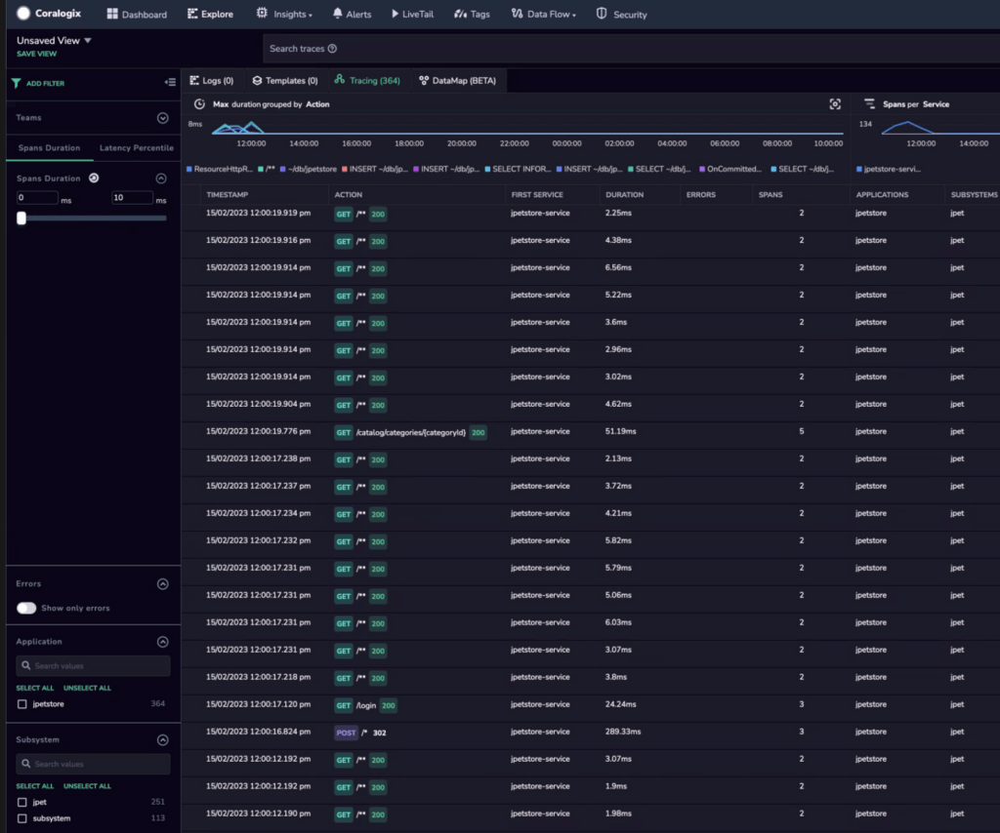
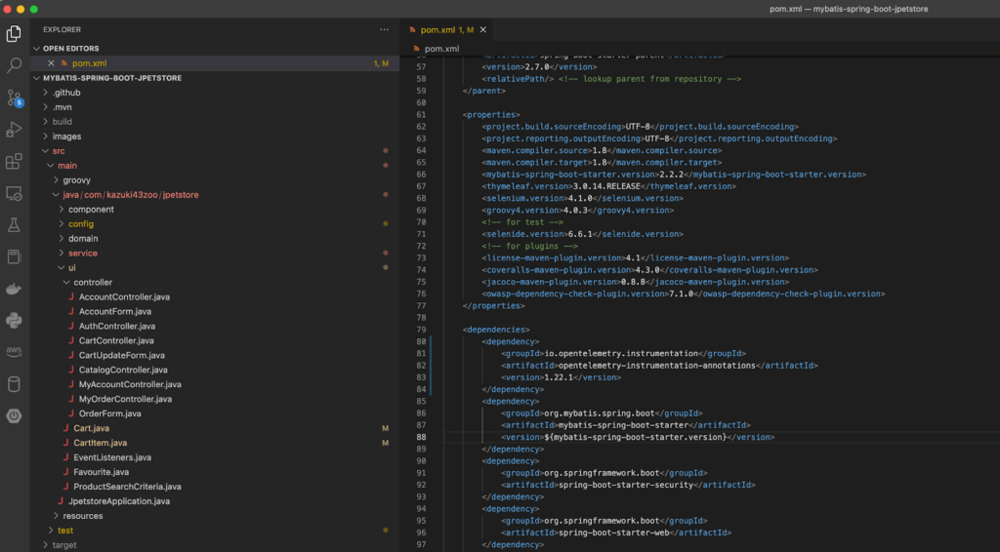
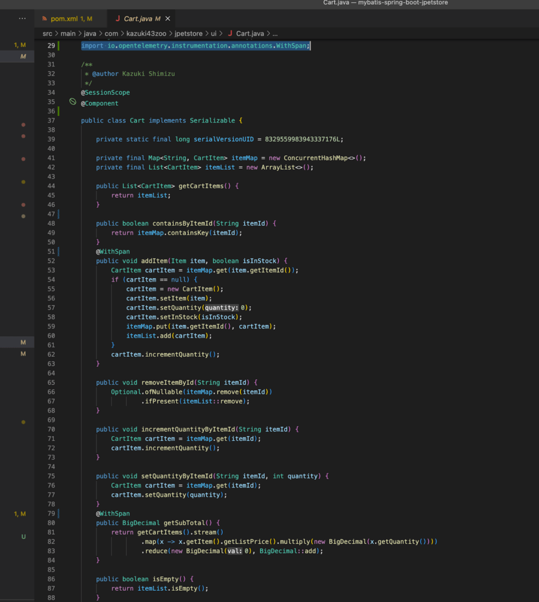
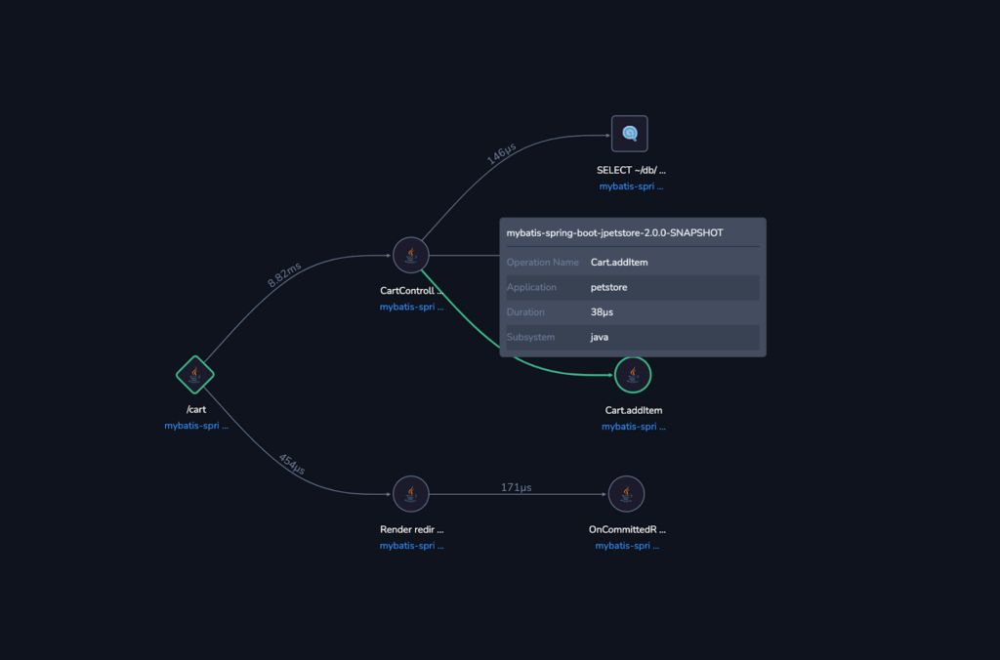
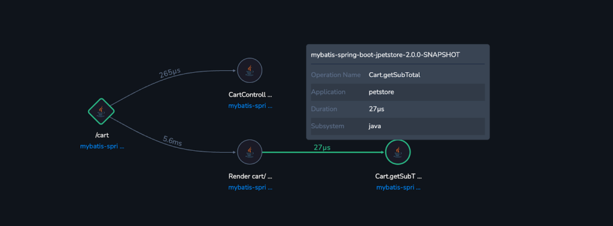

This tutorial demonstrates how to instrument your Java applications to capture [OpenTelemetry](https://coralogixstg.wpengine.com/docs/opentelemetry/) traces and send them to Coralogix.

OpenTelemetry-Java automatic instrumentation is the most efficient method for adding instrumentation to Java applications. Requiring minimal modifications to the code, it uses a Java agent that can be attached to any **Java 8+** application and dynamically injects bytecode to capture telemetry from several popular libraries and frameworks.

**Note**! While this tutorial demonstrates how to send data directly to Coralogix, we do **not recommend** doing so. Instead, we recommend using the [OpenTelemetry Collector](https://github.com/open-telemetry/opentelemetry-helm-charts/tree/main/charts/opentelemetry-collector) as a centralized place for sending your data to us.

## Installation

The instructions below conform to the [latest](https://github.com/open-telemetry/opentelemetry-java-instrumentation/releases/latest) OpenTelemetry Java Auto Instrumentation, currently Java agent version **`1.22.1`**.

**STEP 1**. Download and distribute the agent JAR.

- Download the [latest OpenTelemetry Java agent](https://github.com/open-telemetry/opentelemetry-java-instrumentation/releases/latest/download/opentelemetry-javaagent.jar).

- Apply the agent to each service host or container that requires access to it.

- The JVM will require access to the agent to function properly.

**STEP 2**. Update the JVM configuration.

Either of the following options may be used as the template, with the following changes:

- `JAVA_TOOL_OPTIONS`: Replace the path to the java agent JAR and the `coralogix-opentemetry` JAR files with the file's location downloaded and distributed in **STEP 1** above.

- `OTEL_EXPORTER_OTLP_ENDPOINT`: Select the [OpenTelemetry endpoint](https://coralogixstg.wpengine.com/docs/coralogix-endpoints/) associated with your Coralogix domain.

- `OTEL_RESOURCE_ATTRIBUTES`: Specify your Service.Name.

- `OTEL_RESOURCE_ATTRIBUTES`: Specify Your Coralogix [Send-Your-Data API key](https://coralogixstg.wpengine.com/docs/send-your-data-api-key/), [application](https://coralogixstg.wpengine.com/docs/application-and-subsystem-names/), and [subsystem name](https://coralogixstg.wpengine.com/docs/application-and-subsystem-names/).

- Specify 4 RESOURCE\_ATTRIBUTES for application and subsystem:
    - `application.name`: Replace with the name used for the identification of your Coralogix application name
    
    - `api.name`: Replace with the name used for the identification of your Coralogix subsystem name
    
    - `cx.application.name`: Replace with the name used for the identification of your Coralogix application name
    
    - `cx.subsystem.name`: Replace with the name used for the identification of your Coralogix subsystem name

**Option 1** (**recommended**): Leveraging environment variables

- Pass the Configuration parameters as system properties environment variables in the JVM:

```
export JAVA_TOOL_OPTIONS="-javaagent:path/to/opentelemetry-javaagent.jar -Dotel.javaagent.extensions=build/libs/opentelemetry-java-instrumentation-extension-demo-1.0-all.jar"

export OTEL_TRACES_EXPORTER="otlp"
export OTEL_EXPORTER_OTLP_TRACES_PROTOCOL="grpc"
export OTEL_EXPORTER_OTLP_ENDPOINT="<coralogix_otel_endpoint>"
export OTEL_EXPORTER_OTLP_TRACES_HEADERS="Authorization=Bearer <CXPrivateKey>"
export OTEL_RESOURCE_ATTRIBUTES=service.name=<ServiceName>,application.name=<CXApplicationName>,api.name=<CXSubsystemName>,cx.application.name=<CXApplicationName>,cx.subsystem.name=<CXSubsystemName>

java -javaagent:</path/to/>opentelemetry-javaagent.jar -jar myapp.jar

```

- View the full range of configuration options [here](https://opentelemetry.io/docs/instrumentation/java/automatic/agent-config/).

**Option 2**: Changing the Java command line

- Enable the instrumentation agent using the `-javaagent` flag to the JVM and pass the Configuration parameters as Java system properties (`-D` flags):

```
java -javaagent:path/to/opentelemetry-javaagent.jar \\
    -Dotel.javaagent.extensions=build/libs/opentelemetry-java-instrumentation-extension-demo-1.0-all.jar"
    -Dotel.traces.exporter=otlp \\
    -Dotel.exporter.otlp.traces.protocol=grpc \\
    -Dotel.exporter.otlp.traces.endpoint=<coralogix_otel_endpoint> \\
    -Dotel.exporter.otlp.traces.headers=Authorization=Bearer "<CXPrivateKey>" \\
    -Dotel.resource.attributes=service.name=<ServiceName>,application.name=<CXApplicationName>,api.name=<CXSubsystemName>,cx.application.name=<CXApplicationName>,cx.subsystem.name=<CXSubsystemName> \\
    -jar myapp.jar
```

## Troubleshooting

Confirm that the instrumentation was installed by looking for the following log lines in your console:

```
[otel.javaagent 2023-02-14 10:40:00:811 +0000] [main] INFO io.opentelemetry.javaagent.tooling.VersionLogger - opentelemetry-javaagent - version: 1.21.1


```

## Example

[JPetStore](https://github.com/mybatis/jpetstore-6) 6 is a full web application built on top of MyBatis 3, Spring 5, and Stripes.

**STEP 1**. Install a version of the Java Development Kit. It will not deploy when using only the Java Runtime Environment.

**STEP 2**. [Download](https://www.oracle.com/uk/java/technologies/downloads/#java19) the JDK for your platform.

**STEP 3**. Clone the [jpetstore](https://github.com/kazuki43zoo/mybatis-spring-boot-jpetstore.git) git repo:

```
git clone <https://github.com/kazuki43zoo/mybatis-spring-boot-jpetstore.git>

```

**STEP 4**. Run the following:

```
./mvnw clean package -DskipTests=true
```

**STEP 5**. [Download](https://github.com/open-telemetry/opentelemetry-java-instrumentation/releases/latest/download/opentelemetry-javaagent.jar) the OpenTelemetry agent.

**STEP 6**. Apply the environment variables:

```
export OTEL_TRACES_EXPORTER="otlp"
export OTEL_EXPORTER_OTLP_TRACES_PROTOCOL="grpc"
export OTEL_EXPORTER_OTLP_ENDPOINT="<coralogix_otel_endpoint>"
export OTEL_EXPORTER_OTLP_TRACES_HEADERS="Authorization=Bearer <CXPrivateKey>"
export OTEL_RESOURCE_ATTRIBUTES=service.name=<ServiceName>,application.name=<CXApplicationName>,api.name=<CXSubsystemName>,cx.application.name=<CXApplicationName>,cx.subsystem.name=<CXSubsystemName>

```

**STEP 7**. Run the project with the agent:

```
java -javaagent:</path/to/>opentelemetry-javaagent.jar -jar mybatis-spring-boot-jpetstore-2.0.0-SNAPSHOT.jar

```

**STEP 8**. Navigate to [](http://localhost:8080/)[http://localhost:8080/](http://localhost:8080/).

**STEP 9**. View the traces in your Coralogix dashboard.



## Additional Instrumentation using Annotations

**STEP 1**. Open the project with your favorite IDE/text editor.

**STEP 2**. Edit the `pom.xml` file and add the following maven dependency:

```
<dependency>
	<groupId>io.opentelemetry.instrumentation</groupId>
	<artifactId>opentelemetry-instrumentation-annotations</artifactId>
	<version>1.22.1</version>
</dependency>

```



**STEP 3**. Edit file src/main/java/com/kazuki43zoo/jpetstore/ui/Cart.java.

**STEP 4**. Add this import to the Java file where the methods you want to trace are present.

```
import io.opentelemetry.instrumentation.annotations.WithSpan;

```

**STEP 5**. Before the function you wish to trace, add the annotation “WithSpan”.



**Example**: `cart.java`

**STEP 6.** Rebuild your springboot application applying the changes (using either your IDE or command line).

**STEP 7**. Run your application again with the Otel agent:

```
java -javaagent:</path/to/>opentelemetry-javaagent.jar -jar mybatis-spring-boot-jpetstore-2.0.0-SNAPSHOT

```

## Validation

In your Coralogix dashboard, navigate to **Explore** > Tracing to view the traces generated by your application.

Your traces should now contain additional spans on annotated methods.





## Service Flows

For customers with functional Java OpenTelemetry instrumentation, this section guides reconfiguring the existing setup to define, report, and monitor Coralogix [Service Flows](https://coralogixstg.wpengine.com/docs/service-flows/).

For new customers or those who haven’t configured the Java OpenTelemetry instrumentation, you must follow the **Installation** instructions above. The steps in this section are included in those instructions.

- Download v1.1 of the `coralogix-opentelemetry` extension jar from our [jfrog artifatory](https://cgx.jfrog.io/artifactory/maven/com/coralogix/opentelemetry-java-extensions/).

- Update the JVM configuration to include `JAVA_TOOL_OPTIONS`. Replace the path to the Java `agent JAR and the coralogix-opentemetry JAR files with the file's location` downloaded and distributed in **STEP 1**.

- If leveraging environment variables as part of the JVM configuration (Option 1), add the following:

```
export JAVA_TOOL_OPTIONS="-javaagent:path/to/opentelemetry-javaagent.jar -Dotel.javaagent.extensions=path/to/opentelemetry-java-extensions-1.1.jar"
```

- If changing the Java command line as part of the JVM configuration (Option 2), add the following:

```
java -javaagent:path/to/opentelemetry-javaagent.jar -Dotel.javaagent.extensions=path/to/opentelemetry-java-extensions-1.0.jar -jar your-jar
```

## **Support**

**Need help?**

Our world-class customer success team is available 24/7 to walk you through your setup and answer any questions that may come up.

Feel free to reach out to us **via our in-app chat** or by sending us an email at [support@coralogixstg.wpengine.com](mailto:support@coralogixstg.wpengine.com).
