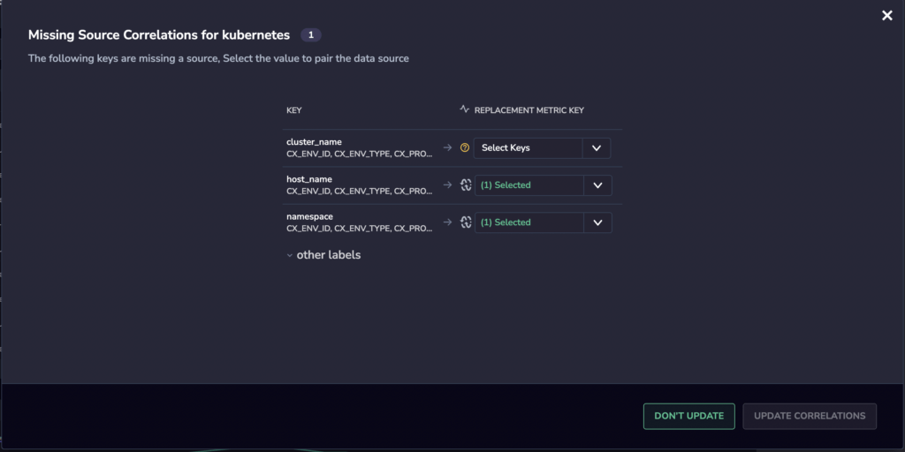
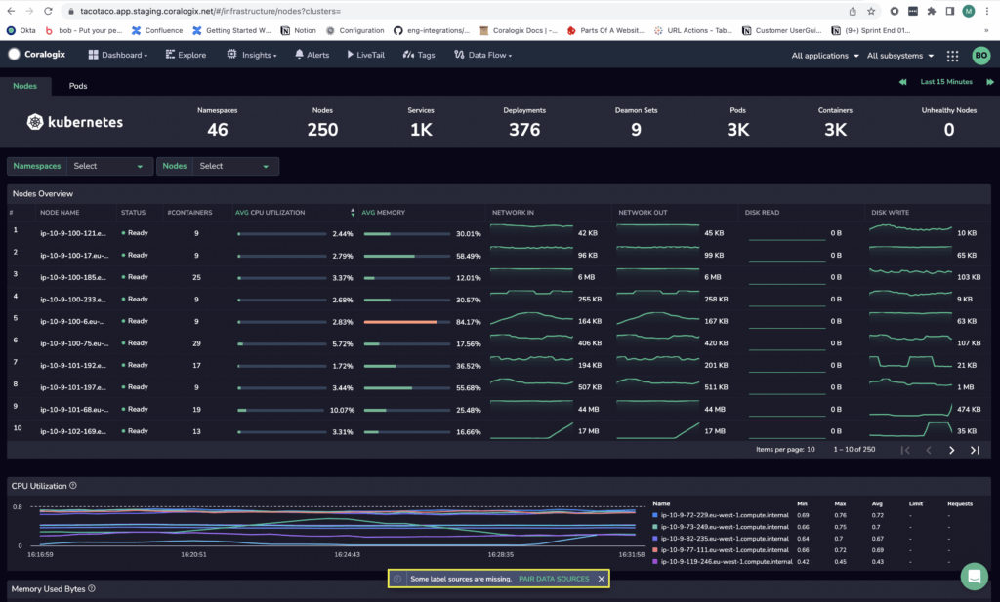

With our new **Label Mapping** feature, as you view your data sources in your [Kubernetes Dashboard](https://coralogixstg.wpengine.com/docs/kubernetes-dashboard/), you will be instantly notified when metric labels are missing from your data. We will guide you to easily locate these metric labels in your data and correlate them to the metrics in your Kubernetes Dashboard.

## Feature

Use the **Label Mapping** feature to:

- Highlight missing keys in your Coralogix data sources

- Provide a list of metric labels in your data that are relevant to the data displayed in your [Kubernetes Dashboard](https://coralogixstg.wpengine.com/docs/kubernetes-dashboard/)

- Enjoy full customization of the labels identifying your metrics

## Pair Data Sources

**STEP 1**. You will receive an alert when parts of your data are not yet correlated to Coralogix data sources: “Some label sources are missing. PAIR DATA SOURCES.” This alert may appear in an empty state in your dashboard, during your discovery process, or when you click on a Nodes / Pods tool tip.

**STEP 2**. Click on the message and you will be redirected to a **Missing Source Correlations** pop-up page. The pop-up will display a list of keys missing a source used for the current page. Select the value in your data to pair with the relevant Coralogix data source.

**STEP 3**. (Optional) View OTHER LABELS in the expanded drop down menu and customize according to your needs.

**STEP 4**. Click UPDATE CORRELATIONS.

**STEP 5**. Once updated, your Coralogix dashboard will reload. The previously missing dependencies will now appear as a new field on the page.

## Additional Resources

**[Kubernetes Dashboard](https://coralogixstg.wpengine.com/docs/kubernetes-dashboard/)**

## Support

**Need help?**

Our world-class customer success team is available 24/7 to walk you through your setup and answer any questions that may come up.

Feel free to reach out to us **via our in-app chat** or by sending us an email at [**support@coralogixstg.wpengine.com**](mailto:support@coralogixstg.wpengine.com).
