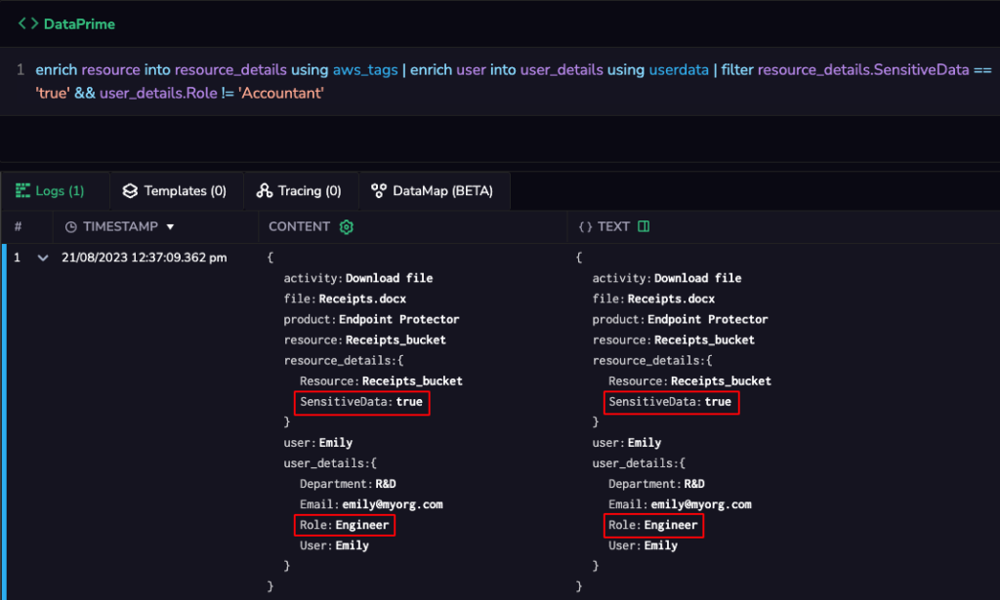
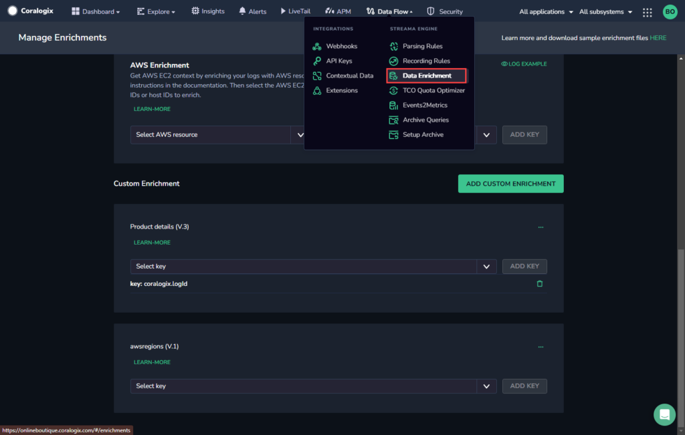

## Overview

Coralogix enables you to enrich and filter your logs using additional context from a lookup table. For example, enrich user activity logs with the user’s department and then retrieve logs of all users in the Finance department.

A lookup table, also known as a reference table, is a specific type of data structure used to simplify data lookup operations. It's a table that contains a set of values or information that can be used to quickly find corresponding values in another dataset. Lookup tables are especially useful when you want to map one value to another, such as converting a code to a meaningful description.

When it comes to log analysis, lookup tables help to add the relevant context to your logs. This enhances the efficiency, accuracy, and consistency of log analysis by simplifying data enrichment, normalization, and interpretation. This is particularly valuable when dealing with obscure or unclear log data that requires contextual information for users to understand any given situation and to take appropriate action.

## How Can I Use Lookup Tables?

Take a look at the following use cases to get a feel for the many ways in which lookup tables can help you.

### Use Case 1: **Detecting Unauthorized Access to Cloud Resources**

In cloud environments, multiple users, teams, and applications interact with a diverse range of resources. These resources can include databases, VMs, storage buckets, and more. Ensuring that only authorized users access specific resources is crucial for maintaining data integrity and security. Detecting unauthorized access quickly is paramount, as it can prevent potential data breaches, financial losses, and reputational damage.

By incorporating information from lookup tables directly into log entries, you can provide analysts with more context making it easier for them to identify and respond to unauthorized access attempts. For instance, if an analyst is reviewing log entries related to user interactions with cloud resources, the lookup table can bring context on the user role (e.g. based on identity store) and the sensitivity level of the cloud resource (e.g. based on AWS resource tags). This makes it far easier for you to to identify unauthorized access to sensitive data, improve your organization’s security posture and adhere to compliance requirements.

See example below. For more details and syntax, [see our DataPrime Cheatsheet](https://coralogixstg.wpengine.com/docs/dataprime-cheat-sheet/#enrich).



### Use Case 2: **User Behavior Profiling for Better Product Development and Targeted Marketing**

Analyzing user behavior through logs can reveal patterns and preferences that guide product development and marketing efforts. Lookup tables can match user IDs with customer profiles, enabling deeper analysis and personalization - without wasting any time searching through extensive databases for each log entry. By enhancing user behavior understanding, you can develop targeted and cost-effective campaigns while improving customer satisfaction.

### Use Case 3: **Product SKU Mapping for Better Inventory Management and Increased Sales**

E-commerce businesses can analyze log data to track product popularity, availability and customer buying patterns. Lookup tables that map SKU codes to product names enable efficient product performance analysis.

With instant access to product names based on SKUs, you can eliminate the need to query product databases repeatedly. This can help you optimize inventory management, pricing strategies, and marketing campaigns, leading to increased revenue and reduced inventory costs.

## Configuration

First, upload the lookup table:

**STEP 1.** From your Coralogix toolbar, go to **Data Flow** > **Data Enrichment.**

**STEP 2.** Scroll down to the **Custom Enrichment** section, and click **Add Custom Enrichment**.



**STEP 3.** Name your new enrichment and provide an (optional) description.

**STEP 4.** Select and upload the CSV file that contains your lookup table.

**STEP 5.** Click **CREATE**.

## Enriching Your Logs

There are two possible ways to enrich your logs:

- Select a log key to look up for a key value and enrich the logs automatically during ingestion. The logs are saved with the enriched fields. The advantages of this mode:
    - Logs are automatically enriched.
    
    - The logs themselves include the enrichment data, which makes it easier to consume everywhere (by any query, and also by third-party products that read the logs from the S3 bucket).

- Use the DataPrime `enrich` operator to look up a value in this table and enrich the log dynamically for the purpose of the query. The advantages of this mode:
    - It allows you to enrich old logs already ingested into Coralogix.
    
    - The enrichment does not increase the size of the stored logs, as the enrichment is done dynamically, only for the query results.

## Syntax for Data Enrichment Using the DataPrime Enrich Operator

```
enrich <value_to_lookup> into <enriched_key> using <lookup_table>

```

The `<value_to_lookup>` (name of a log key or the actual value) will be looked up in the Custom Enrichment `<lookup_table>` and a key called `<enriched_key>` will be added to the log, containing all table columns as sub-keys. If the `<value_to_lookup>` is not found in the `<lookup_table>`, the `<enriched_key>` will still be added but with “null” values, in order to preserve the same structure for all result logs. You can then filter the results using the DataPrime capabilities, such as filtering logs by specific value in the enriched field.

### **Example**

For the original log:

```
{
"userid": "111",
...
}

```

And the Custom Enrichment lookup table called “my\_users”:

| ID | Name | Department |
| --- | --- | --- |
| 111 | John | Finance |
| 222 | Emily | IT |

Running the following query:

```
enrich $d.userid into $d.user_enriched using my_users

```

Gives the following enriched log:

```
{
"userid": "111",
"user_enriched": {
	"ID: "111",
	"Name": "John",
	"Department": "Finance"
	},
...
}

```

**Notes:**

- Run the DataPrime query `source <lookup_table>` to view the enrichment table.

- If the original log already contains the enriched key:
    - If `<value_to_lookup>` exists in the `<lookup_table>`, the sub-keys will be updated with the new value. If the `<value_to_lookup>` does not exist, their current value will remain.
    
    - Any other sub-keys which are not columns in the `<lookup_table>` will remain with their existing values.

- All values in the `<lookup_table>` are considered to be strings. This means that:
    - The `<value_to_lookup>` must be in a string format.
    
    - All values are enriched in a string format. You may then convert them to your preferred format (e.g. JSON, timestamp) using the appropriate functions.

## Examples

* * *

### Example 1

This example uses a MySQL query log that contains queries and their return-code. The return-code is then enriched using a lookup table `mysql_return_codes` that contains the message-templates for each return code. These message are then aggregated, showing the top 10 most-occurring messages.

```
# logs data:
...
{ "event_type": "mysql_query_log", "query": ..., "return_code": 1020 }
...
{ "event_type": "mysql_query_log", "query": ..., "return_code": 1027 }
...

# mysql_return_codes enrichment data (CSV):
Error,Message
...
1020,Record has changed since last read in table '%s'.
...
1026,Error writing file '%s' (errno: %d - %s).
1027,'%s' is locked against change.
...

# Query
source logs
| filter event_type == 'mysql_query_log'
**| enrich return_code into return_code_details using mysql_return_codes**
| top 10 return_code_details.Message by count()

# Output
{ 
  "return_code_details": { "Message": "Can't write. duplicate key in table '%s'." },
  "_count": 2873
}
{ 
  "return_code_details": { "Message": "'%s' is locked against change." },
  "_count": 804
}
...

```

### Example 2

In this example, we have logs that contain a “product\_type” key. We’d like to count the number of products that belong to the `Furniture` category. Each product type belongs to a category, and that mapping resides in the `product_type_details` lookup table. However, the product-types in the lookup table are written in upper-case (e.g. `CHAIRS`), and in the logs, the product-type is not necessarily in upper-case (e.g. `Chairs`). The query uses `enrich toUpperCase(product_type) ...` in order to enrich the data based on the upper-case version of the product-type in the logs.

```
# logs data:
{ 
 "product_type": "Chairs",
 "product_name": "Kitchen Chair - Blue"
 ...
}
{
  "product_type": "Electric Guitars",
  "product_name": "Les Paul 70s Deluxe"
  ...
}

# product_type_details data (CSV)
type,category
...
"CHAIRS","Furniture"
"ELECTRIC GUITARS","Musical Instruments"
...

# Query
source logs
| enrich **toUpperCase(product_type)** into details using product_type_details
| filter details.category == 'Furniture'
| count

# Results
...
{ "product_type": "Chairs", ... , "details": { "category": "Furniture" } }
{ "product_type": "Tables", ... , "details": { "category": "Furniture" } }
...


```

* * *

## Support

**Need help?**

Our world-class customer success team is available 24/7 to walk you through your setup and answer any questions that may come up.

Feel free to reach out to us **via our in-app chat** or by sending us an email to [support@coralogixstg.wpengine.com](mailto:support@coralogixstg.wpengine.com).
