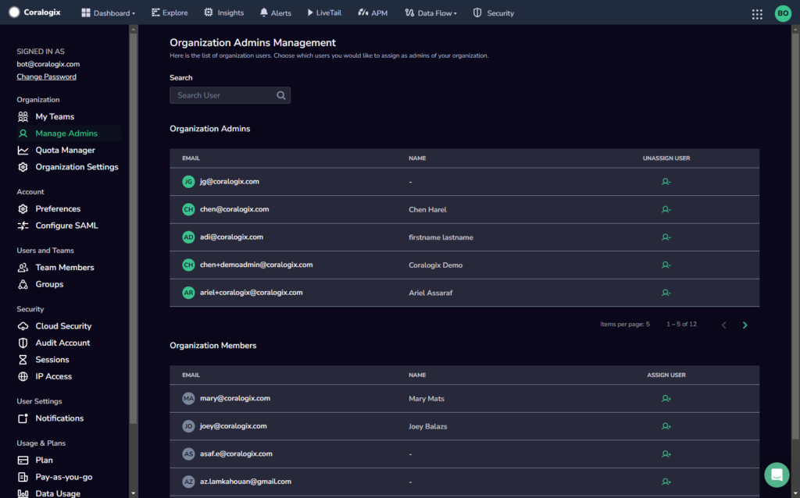

Use the **Manage Admins** page to view, add, and remove [Organization Administrators](http://www.coralogixstg.wpengine.com/docs/managing-your-organization) belonging your organization.

## Overview

The **Manage Admins** page contains a list of all of the Organization Administrators (Org Admins) in your organization. It also contains a list of those users who are members of your organization, but not currently administrators.

To help manage the organization, the Org Admin may add additional administrators with the same permissions and authorities. They can assign several users to be Org Admins and can unassign users who are currently assigned as Org Admins.

## Add an Organization Administrator

**STEP 1.** Search for the member in the list of organization members.

**STEP 2.** Click the ASSIGN USER icon next to their name.

## Remove an Organization Administrator

**STEP 1.** Search for the member in the list of organization admins.

**STEP 2.** Click the UNASSIGN USER icon next to their name.

## Additional Resources

<table><tbody><tr><td>Documentation</td><td><strong><a href="http://www.coralogixstg.wpengine.com/docs/managing-your-organization">Managing Your Organization</a> <strong><a href="http://www.coralogixstg.wpengine.com/docs/managing-your-organization-my-teams">My Teams</a></strong> <a href="http://www.coralogixstg.wpengine.com/docs/managing-your-organization-quota-manager">Quota Manager</a></strong> <a href="http://www.coralogixstg.wpengine.com/docs/managing-your-organization-organization-settings"><strong>Organization Settings</strong></a></td></tr></tbody></table>

## Support

**Need help?**

Our world-class customer success team is available 24/7 to walk you through your setup and answer any questions that may come up.

Feel free to reach out to us **via our in-app chat** or by sending us an email at [support@coralogixstg.wpengine.com](mailto:support@coralogixstg.wpengine.com).
