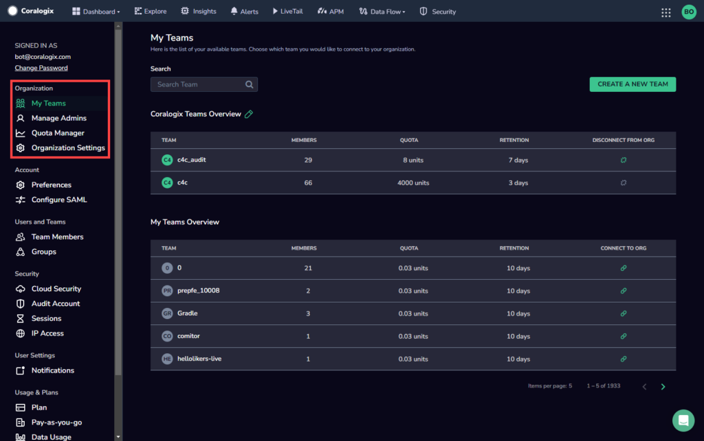
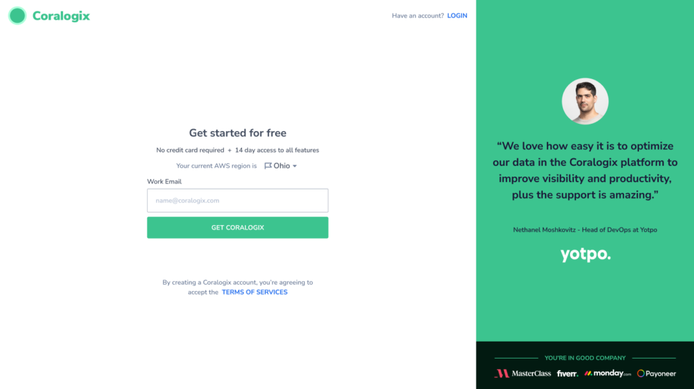
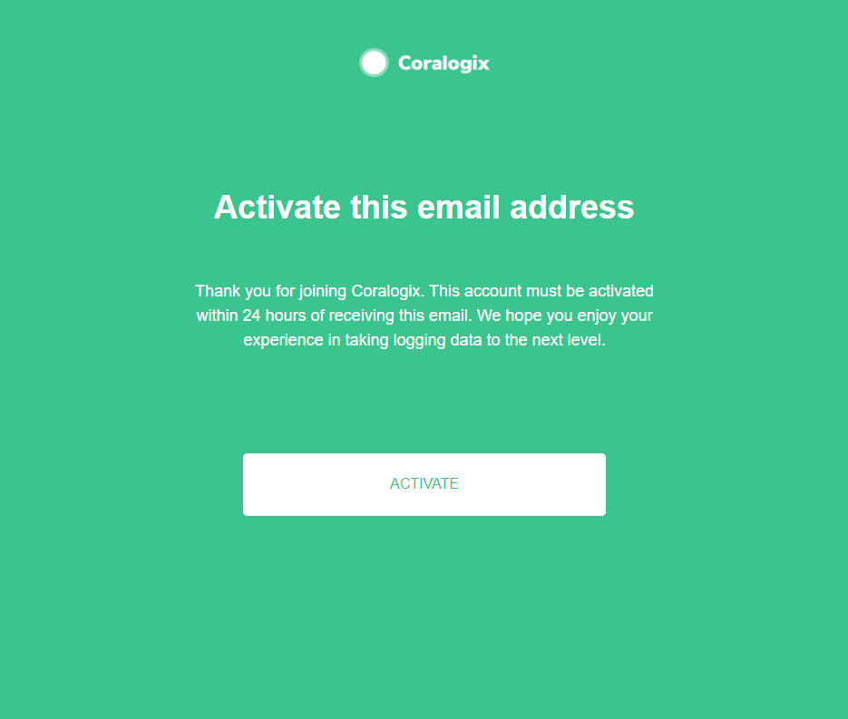
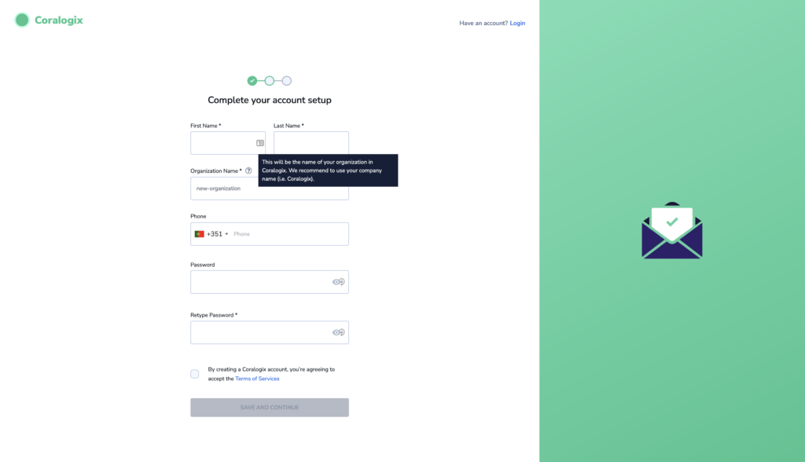
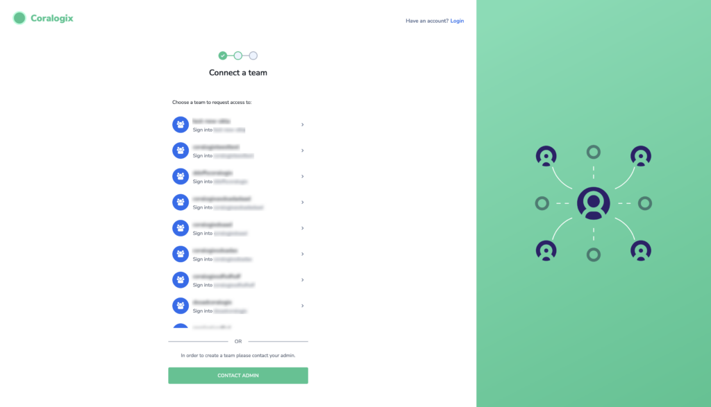
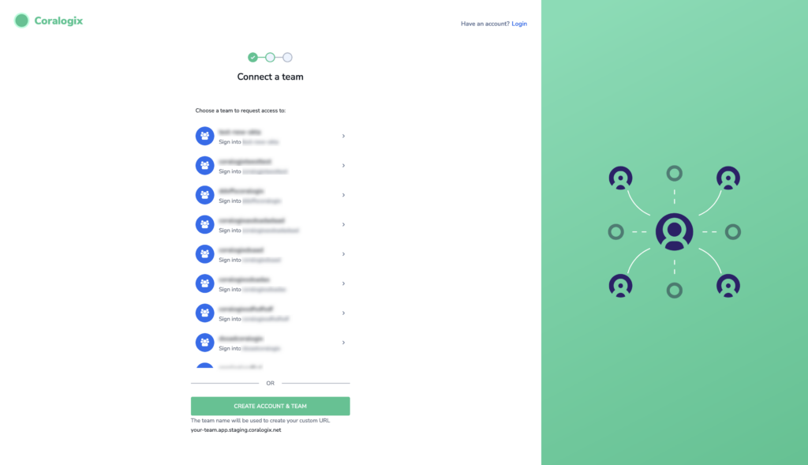
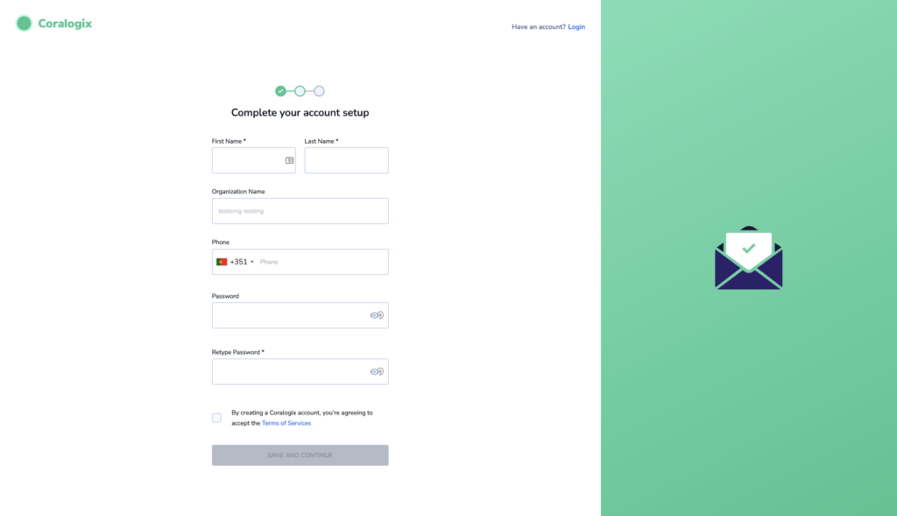
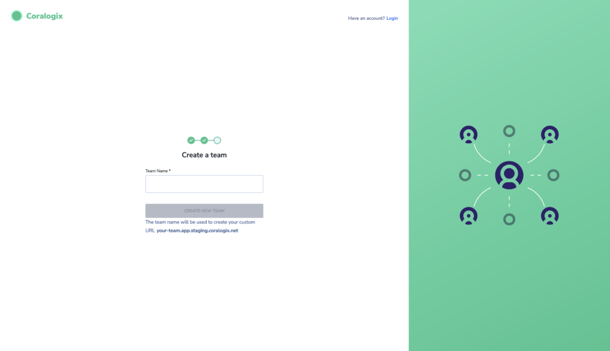
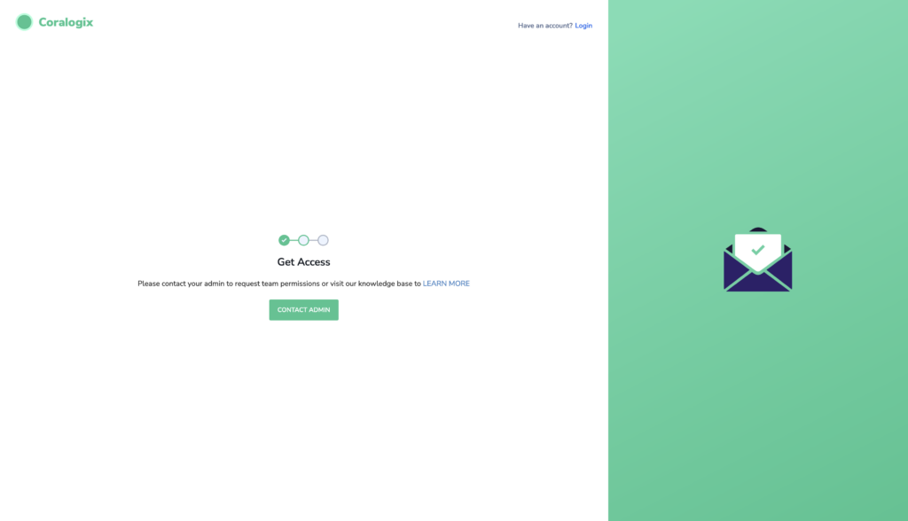

Coralogix offers the option of **collectively managing multiple teams per organization** via an Organization Administrator.

## Overview & Concepts

### Organization

An **organization** in Coralogix is a group of teams associated with a single Coralogix customer that are managed together by an Organization Administrator. Organizations enable you to treat your teams as part of an entity, rather than as individual Coralogix customers. Multiple domains may be treated as part of one organization.

The benefits of managing your teams as part of an organization include:

- **Flexibility**. Move data usage units between different teams in your organization.

- **Cost Optimization**. More efficient data usage allows for [pricing benefits](https://coralogixstg.wpengine.com/pricing/).

### Teams in Coralogix

A **team** in Coralogix is a platform environment with its own unique URL and settings. An organization may have multiple teams, with each team consisting of multiple users. Teams are best used within an organization to truly compartmentalize data and enable true separation between users. This allows you to ship specific data to one team while shipping a different set of data to a different set of users.

### Organization Administrator

The **Organization Administrator** (Org Admin) is the first user created in an organization and is responsible for its overall management. The Org Admin is the only user with permission to access the Organization Settings.

If an Org Admin was not automatically created for your organization, or if you are an existing customer wishing to enjoy Organization settings, contact Coralogix Support at [support@coralogixstg.wpengine.com](https://www.notion.so/38f0d5d1f2494a599f342afaa90d4b53?pvs=21).

### Organization Settings

Org Admins have a dedicated section in their settings from which they can access the following:

- **My Teams.** Add, connect, and disconnect teams within your organization.

- **Manage Admins.** Grant org admin status to other users so that they can can view and/or create teams.

- **Quota Manager.** View how each team consumes their Coralogix units and and move units between teams.

- **Organization Settings.** Establish which domains may join the organization and what what organizational attributes will be granted to different users during the signup process.

These settings give the Org Admin complete control over their organization and enable them to maintain the structure of their organization as they deem appropriate.

## Access Organization Settings

**STEP 1**. Navigate to your personal settings on the right-hand side of your Coralogix toolbar. Click on **Settings** in the lower left-hand corner.

**STEP 2**. In the left-hand side bar, select one of the following tabs in your organization menu:

- ****[My Teams](http://www.coralogixstg.wpengine.com/docs/managing-your-organization-my-teams)

- [Manage Admins](http://www.coralogixstg.wpengine.com/docs/managing-your-organization-manage-admins)

- [Quota Manager](http://www.coralogixstg.wpengine.com/docs/managing-your-organization-quota-manager)

- [Organization Settings](http://www.coralogixstg.wpengine.com/docs/managing-your-organization-organization-settings)

## Create an Organization

In order to begin working with Coralogix, the first step is to create your organization. As part of creating your organization, you will also create your first user (the Org Admin) and your first team.

**Note:** If users from your organization (who share the same work email domain) are already registered with Coralogix, the organization may have already been created. In that case, you may be able to join an existing team or create a new team. If these options are not possible, you will be instructed to contact your Org Admin to request to be added to an existing team or create a new team.

The following procedure assumes no other users who share your work email domain are registered with Coralogix.

**STEP 1**. [Sign up](https://signup.coralogixstg.wpengine.com/#/) for a Coralogix account by providing your work email.

**STEP 2.** Check your email to verify your account. Click **ACTIVATE**, and you will be rerouted to the Coralogix page.

**STEP 3.** Complete your user account setup. If you are the first from your organization to set up a Coralogix account, you will be prompted to input your organization name and will automatically become the Org Admin. Click **SAVE AND CONTINUE**.

**STEP 4.** You will be prompted to create a new team. Enter a name for the team, then click **CREATE NEW TEAM**.

## Subsequent Users

Once an organization has been created, subsequent users who open an account with the same organization domain or affiliated domain defined by the Org Admin will have different signup options depending on the [permissions set by the Org Admin](http://www.coralogixstg.wpengine.com/docs/managing-your-organization-organization-settings).

When joining an existing team with SSO configured, users will be required to sign in using their SSO credentials. When not using SSO, the user will need to create an account and only then will they be able to login.

**If an org admin allows subsequent users to join an existing team:**

- **Option 1:** In this case the Organization administrator chose to **enable** joining existing organization teams, but chose to **disable** the option to allow the user to create new teams to be automatically connected to the organization. The user can either choose one of the team or chose the option to contact their administrator (as seen in the image below). If they choose to contact their administrator, an email will be sent on their behalf and the org admin can chose what additional steps will be taken (e.g. create a new team for the user or invite them to one of the existing teams).

- **Option 2:** In this case, the Org Admin chose to **enable** joining existing teams and also **enable** the option to allow the user to create new teams to be automatically connected to the organization. The user may either join an existing team, or create a new team.

If they choose to create a new team, the **Complete Your Account Setup** page appears. They need to fill in their details, then click **SAVE AND CONTINUE**.

The **Create New Team** page will appear. The user should enter a name for their new team and click **CREATE NEW TEAM**.

After Creating the team, the user is automatically logged in and redirected to their new Coralogix Team page.

**If the org admin does not allow subsequent users to join an existing team:**

- **Option 3:** In this case, the org admin chose to **disable** joining existing teams, but **enable** the option to allow the user to create new teams to be automatically connected to the organization.

- If they choose to create a new team, the **Complete Your Account Setup** page appears. They need to fill in their details, then click **SAVE AND CONTINUE**.

- The **Create New Team** page will appear. The user should enter a name for their new team and click **CREATE NEW TEAM**.

After Creating the team, the user is automatically logged in and redirected to their new Coralogix Team page.

- **Option 4:** In this case, the org admin chose to **disable** joining existing teams and also **disable** the option to allow the user to create new teams to be automatically connected to the organization. The user may contact their Org Admin to request to be added to a team as shown in the image below. If they do that, an email will be sent on their behalf and the org admin can chose what additional steps will be taken (e.g. create a new team for the user or invite them to one of the existing teams).

## Additional Resources

<table><tbody><tr><td>Getting Started</td><td><a href="https://coralogixstg.wpengine.com/docs/guide-first-steps-coralogix/"><strong>Getting Started with Coralogix</strong></a> <a href="https://coralogixstg.wpengine.com/docs/user-team-management/"><strong>Team and User Management</strong></a></td></tr><tr><td>Managing Your Organization</td><td><strong><a href="http://www.coralogixstg.wpengine.com/docs/managing-your-organization-my-teams">My Teams </a><a href="http://www.coralogixstg.wpengine.com/docs/managing-your-organization-manage-admins">Manage Admins</a> <strong><a href="http://www.coralogixstg.wpengine.com/docs/managing-your-organization-quota-manager">Quota Manager</a></strong></strong> <strong><a href="http://www.coralogixstg.wpengine.com/docs/managing-your-organization-organization-settings"><strong>Organization Settings</strong></a></strong></td></tr></tbody></table>

## Support

If you are **new customer** and an Org Admin was not automatically created for your organization, or if you are an **existing customer** wishing to enjoy Organization settings, contact **Coralogix Support**.

Feel free to reach out to us **via our in-app chat** or by sending us an email at [support@coralogixstg.wpengine.com](mailto:support@coralogixstg.wpengine.com).
