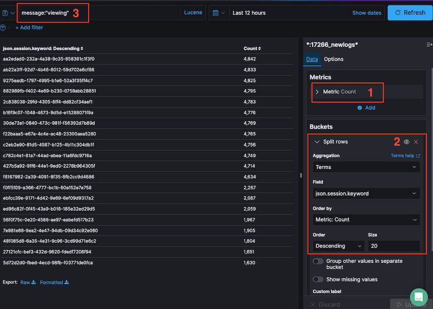
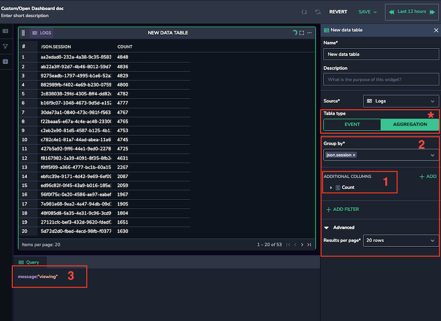
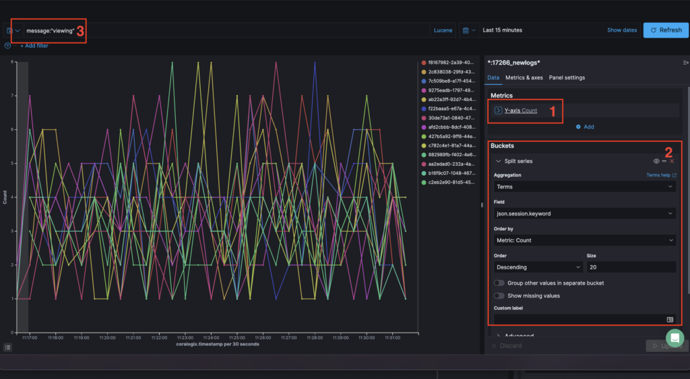
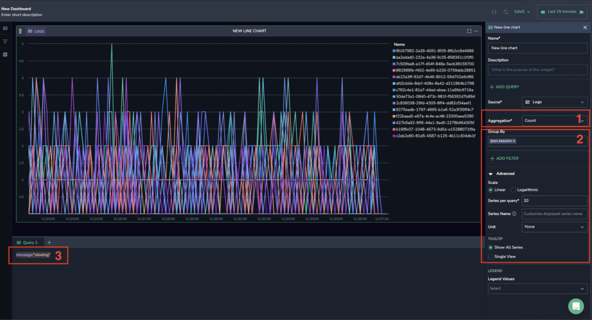
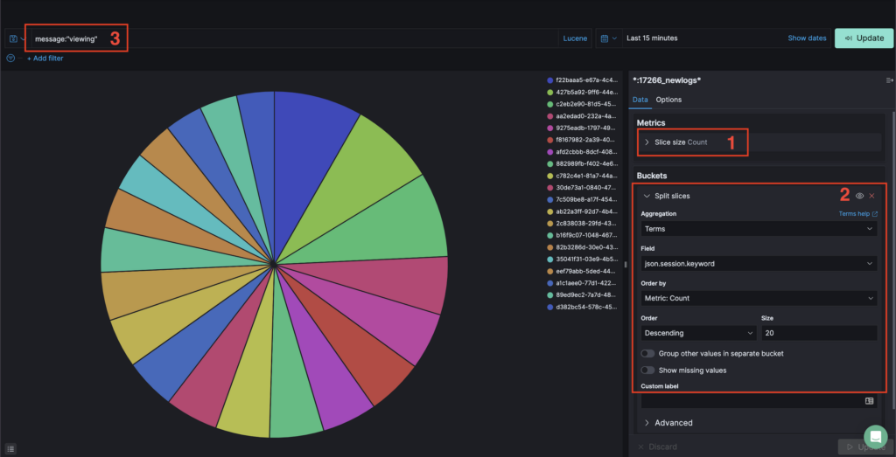
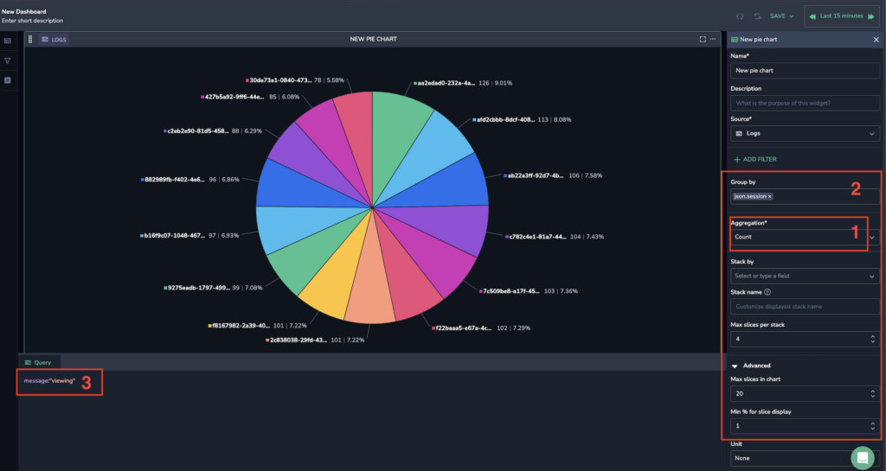
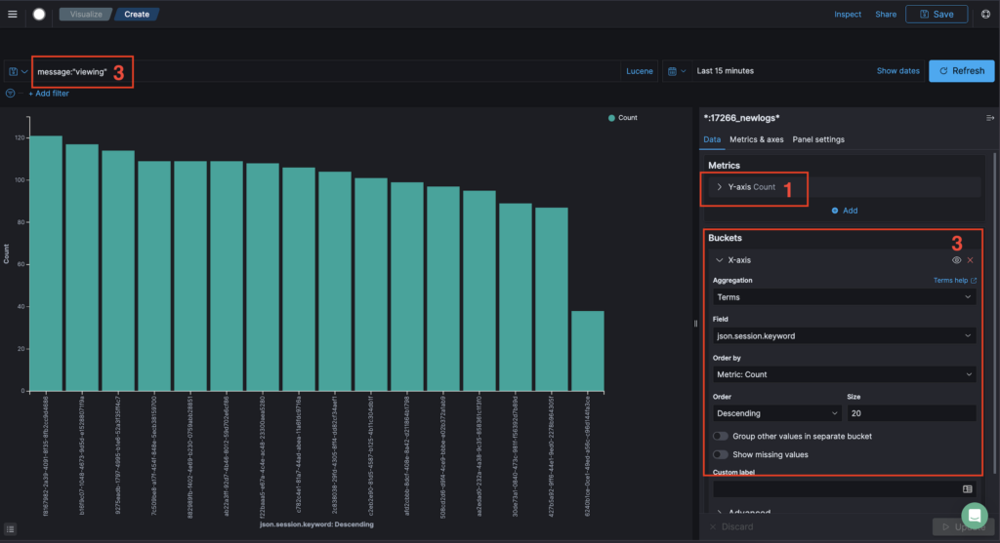
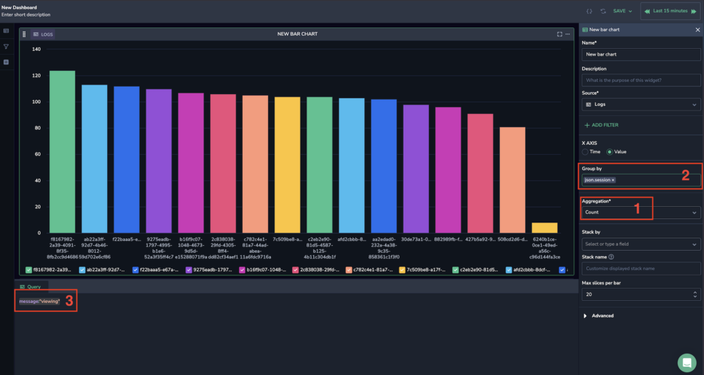
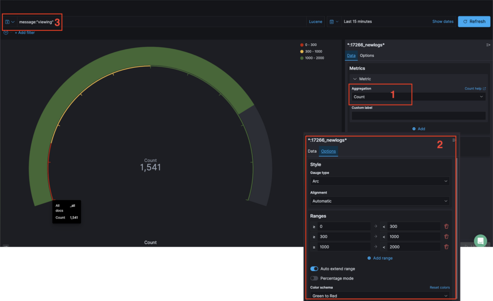
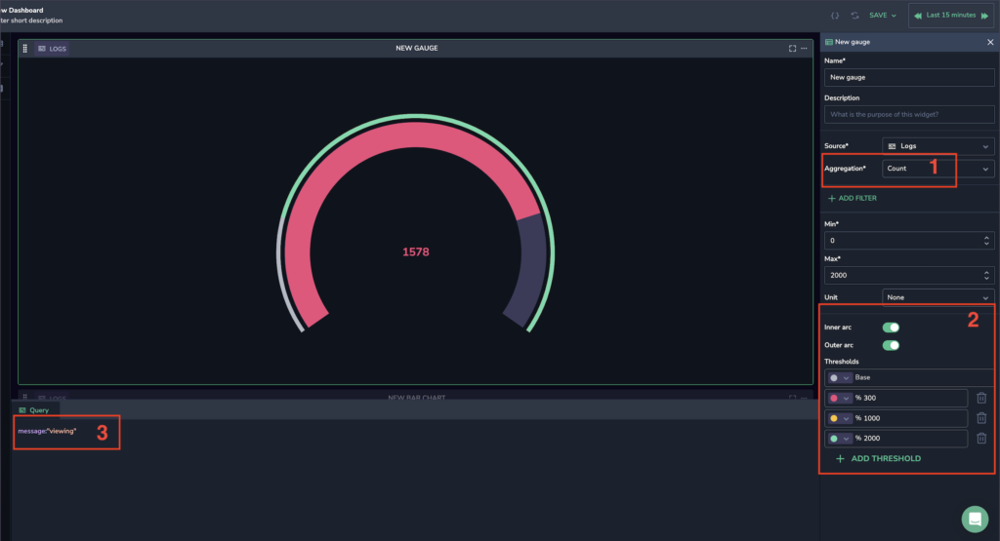

Coralogix [Custom Dashboards](https://coralogixstg.wpengine.com/docs/custom-dashboards/) provides you with the ideal dashboard experience, allowing you to create unlimited, personalized custom dashboards using our five visualizations: [Data Table](http://www.coralogixstg.wpengine.com/docs/custom-dashboards-data-tables), [Line Chart](http://www.coralogixstg.wpengine.com/docs/custom-dashboards-line-charts), [Gauge](http://www.coralogixstg.wpengine.com/docs/custom-dashboards-gauges), [Pie Chart](http://www.coralogixstg.wpengine.com/docs/custom-dashboards-pie-charts) and [Bar Chart](http://www.coralogixstg.wpengine.com/docs/custom-dashboards-bar-charts). Each visualization - supporting logs, metrics and spans - can be used to define and create a dashboard catered to your specific observability needs.

The following tutorial demonstrates how to migrate from OpenSearch to Coralogix [Custom Dashboards](https://coralogixstg.wpengine.com/docs/custom-dashboards/). Using a series of examples, it illustrates which OpenSearch dashboard parameters correlate with those in Coralogix Custom Dashboards.

## Data Tables

Migrate a [data table](https://coralogixstg.wpengine.com/docs/custom-dashboards-data-tables/) from your OpenSearch dashboard to your Coralogix Custom dashboard.

### OpenSearch Dashboard

### Custom Dashboards

### Migrate Parameters

For each section (1, 2, 3, or \*), migrate the parameters from your OpenSearch dashboard to your Coralogix Custom dashboard.

| Section | OpenSearch Dashboard Parameter | Coralogix Custom Dashboard Parameter | Notes |
| --- | --- | --- | --- |
| 1 | Aggregation | Aggregation |  |
| 2 | Split rows | Group-by |  |
| 3 | Lucene query | Query bar |  |
| \* | \--- | Data Table: Event or Aggregation | Data-table has two options:  
\- Event: log grid  
\- Aggregation: data table |

For example, transfer the aggregation value in Section 1 of your OpenSearch Dashboard to the aggregation parameter value in Section 1 of your Coralogix Custom dashboard.

For additional information on data tables, see the full tutorial on [Data Tables in Custom Dashboards](https://coralogixstg.wpengine.com/docs/custom-dashboards-data-tables/).

## Line Charts

Migrate a [line chart](https://coralogixstg.wpengine.com/docs/custom-dashboards-line-charts/) from your OpenSearch dashboard to your Coralogix custom dashboard.

### OpenSearch Dashboard

### Custom Dashboards

### Migrate Parameters

For each section (1, 2, or 3), migrate the parameters from your OpenSearch dashboard to your Coralogix Custom dashboard.

| Section | OpenSearch Dashboard Parameter | Coralogix Custom Dashboard Parameter |
| --- | --- | --- |
| 1 | Y-axis count | Aggregation |
| 2 | Split-series | Group by |
| 2 | Size | Series per query |
| 3 | Lucene query | Query bar |

For example, transfer the Y-axis count values in Section 1 of your OpenSearch Dashboard to the aggregation parameter value in Section 1 of your Coralogix Custom dashboard.

For additional information on line charts, see the full tutorial on [Line Charts in Custom Dashboards](https://coralogixstg.wpengine.com/docs/custom-dashboards-line-charts/).

## Pie Charts

Migrate a [pie chart](https://coralogixstg.wpengine.com/docs/custom-dashboards-pie-charts/) from your OpenSearch dashboard to your Coralogix Custom dashboard.

### OpenSearch Dashboard

### Custom Dashboards

### Migrate Parameters

For each section (1, 2, or 3), migrate the parameters from your OpenSearch dashboard to your Coralogix Custom dashboard.

| Section | OpenSearch Dashboard Parameter | Coralogix Custom Dashboard Parameter |
| --- | --- | --- |
| 1 | Slice size | Aggregation |
| 2 | Split-series field | Group by |
| 2 | Split-series (second level) | Stack by |
| 2 | Size | Max slices in chart (under Advanced) |
| 3 | Lucene query | Query bar |

For example, transfer the slice size value in Section 1 of your OpenSearch dashboard to the aggregation parameter value in Section 1 of your Coralogix Custom dashboard.

For additional information on pie charts, see the full tutorial on [Pie Charts in Custom Dashboards](https://coralogixstg.wpengine.com/docs/custom-dashboards-pie-charts/).

## Bar Charts

Migrate a [bar chart](https://coralogixstg.wpengine.com/docs/custom-dashboards-bar-charts/) from your OpenSearch Dashboard to your Coralogix Custom dashboard.

### OpenSearch Dashboard

### Custom Dashboards

### Migrate Parameters

For each section (1, 2, or 3), migrate the parameters from your OpenSearch dashboard to your Coralogix Custom dashboard.

| Section | OpenSearch Dashboard Parameter | Coralogix Custom Dashboard Parameter | Notes |
| --- | --- | --- | --- |
| 1 | Y-axis count | Aggregation |  |
| 2 | Split-series field | Group by | If you apply the X-axis in OpenSearch Dashboard with a date histogram, you should choose X-axis as Time in Custom Dashboards (above the Group by field). |
| 2 | Size | Max bars per chart (under Advanced) |  |
| 2 | Split-series (second level) | Stack by |  |
| 3 | Lucene query | Query bar |  |

For example, transfer the Y-axis Count value in Section 1 of your OpenSearch dashboard to the aggregation parameter value in Section 1 of your Coralogix Custom dashboard.

For additional information on bar charts, see the full tutorial on [Bar Charts in Custom Dashboards](https://coralogixstg.wpengine.com/docs/custom-dashboards-bar-charts/).

## Gauges

Migrate a [gauge](https://coralogixstg.wpengine.com/docs/custom-dashboards-gauges/) from your OpenSearch dashboard to your Coralogix Custom dashboard.

### OpenDashboard

### CustomDashboards

### Migrate Parameters

For each section (1, 2, or 3), migrate the parameters from your OpenSearch dashboard to your Coralogix Custom dashboard.

| Section | OpenSearch Dashboard Parameter | Coralogix Custom Dashboard Parameter |
| --- | --- | --- |
| 1 | Aggregation | Aggregation |
| 2 | Gauge Ranges | Thresholds |
| 2 | Arc settings | Arc settings |
| 3 | Lucene query | Query bar |

For example, transfer the aggregation value in Section 1 of your OpenSearch Dashboard to the aggregation parameter value in Section 1 of your Coralogix Custom dashboard.

For additional information on gauges, see the full tutorial on [Gauges in Custom Dashboards](https://coralogixstg.wpengine.com/docs/custom-dashboards-gauges/).

## Additional Resources

<table><tbody><tr><td>Documentation</td><td><a href="https://coralogixstg.wpengine.com/docs/custom-dashboards/"><strong>Custom Dashboards</strong></a> <strong><a href="http://www.coralogixstg.wpengine.com/docs/custom-dashboards-line-charts">Line Charts</a> <a href="http://www.coralogixstg.wpengine.com/docs/custom-dashboards-data-tables">Data Tables</a> <a href="http://www.coralogixstg.wpengine.com/docs/custom-dashboards-gauges">Gauges</a> <a href="http://www.coralogixstg.wpengine.com/docs/custom-dashboards-pie-charts">Pie Charts</a> <a href="http://www.coralogixstg.wpengine.com/docs/custom-dashboards-bar-charts">Bar Charts</a></strong></td></tr></tbody></table>

## Support

**Need help?**

Our world-class customer success team is available 24/7 to walk you through your setup and answer any questions that may come up.

Feel free to reach out to us **via our in-app chat** or by sending us an email at [support@coralogixstg.wpengine.com](mailto:support@coralogixstg.wpengine.com).
