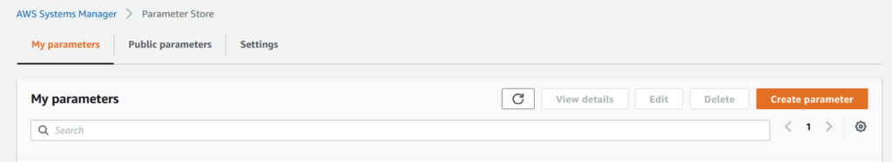
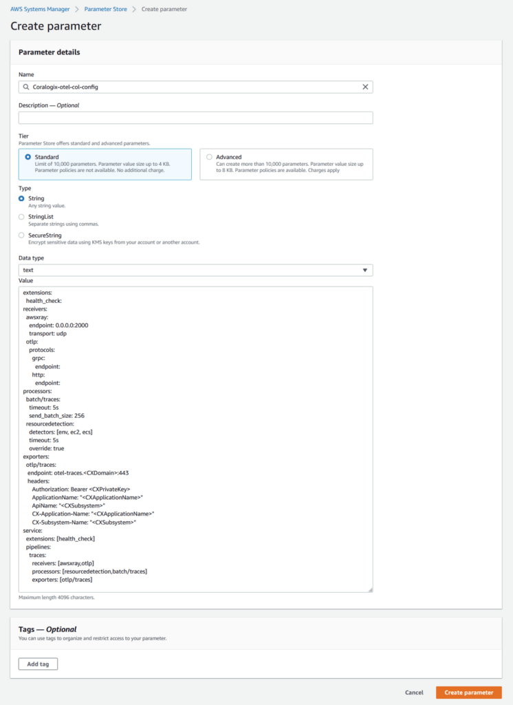
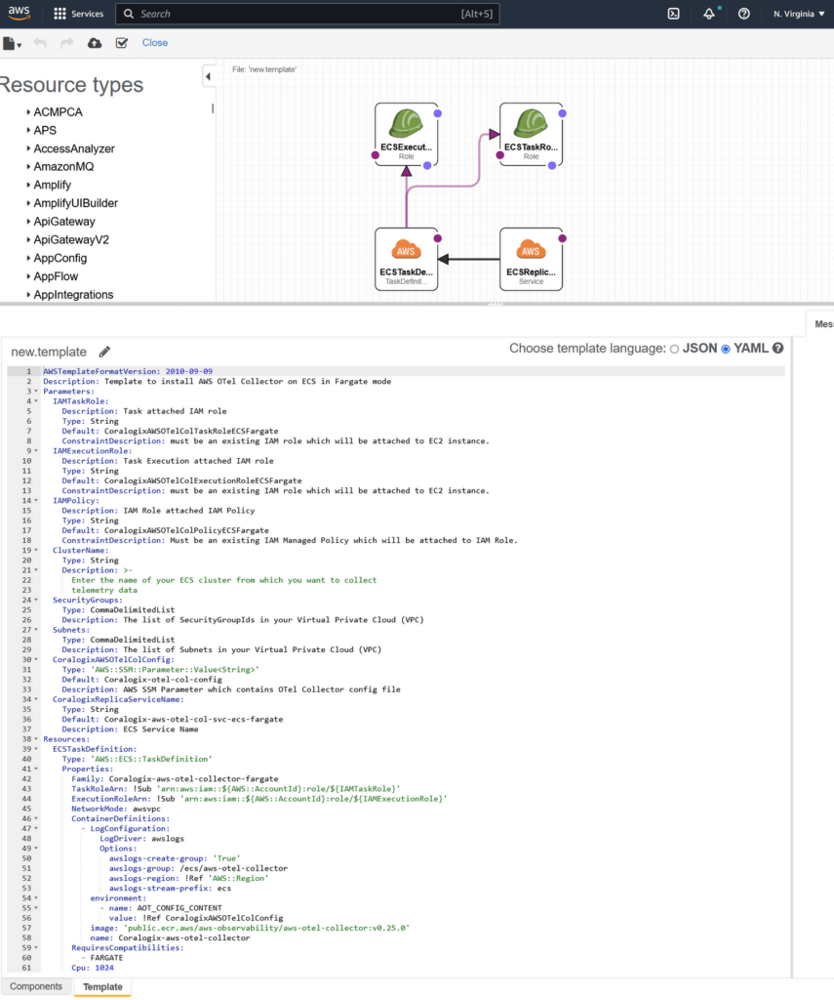
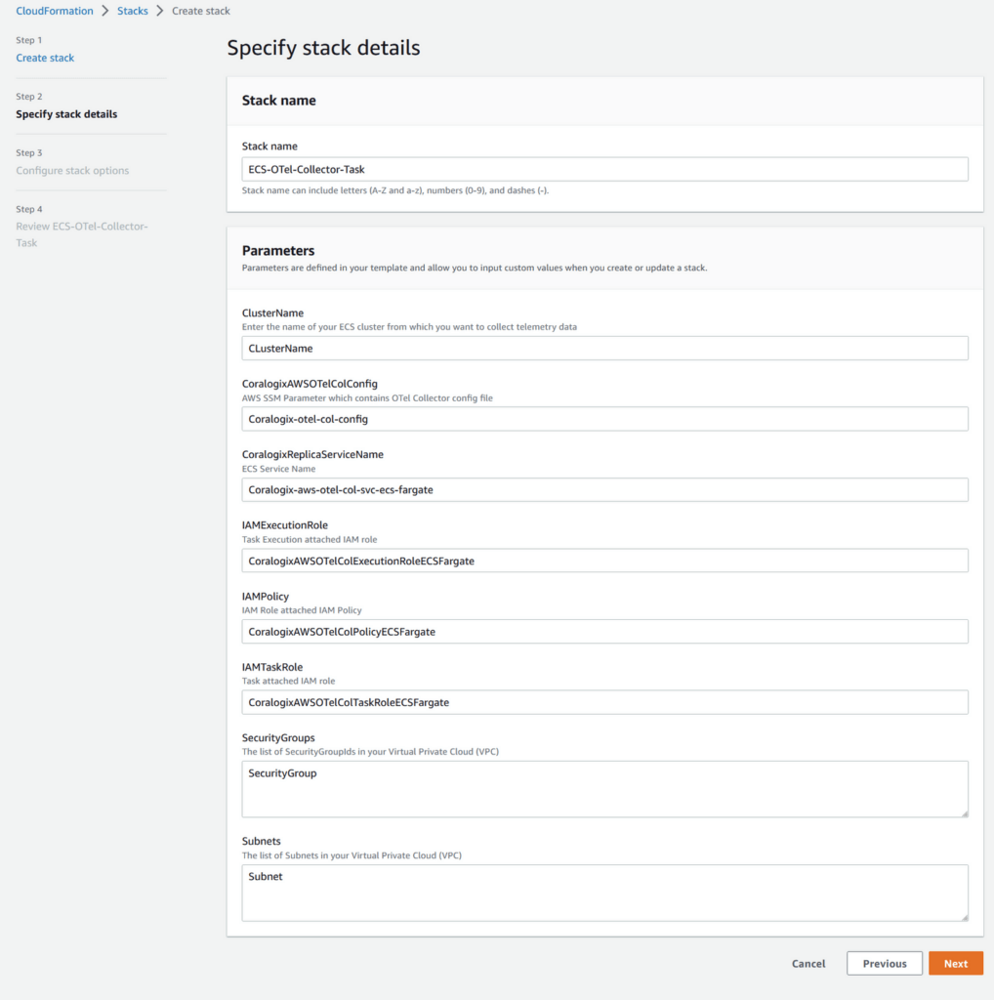
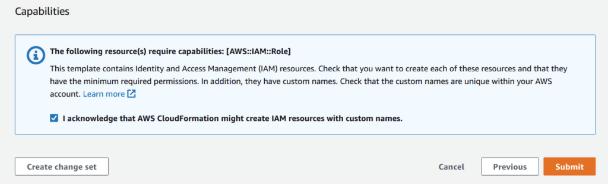

This tutorial demonstrates how to install and configure OpenTelemetry (OTel) Collector to send your traces on ECS Fargate to Coralogix.

## Installation & Configuration

1\. In your AWS Console, go to **AWS Systems Manager** under **Application Management**.

2\. Click on **Parameter Store**.

3\. **Create parameter**. Specify the name of the new parameter `Coralogix-otel-col-config`.



4\. Paste the OTel Collector configuration in the `value`.

```
extensions:
  health_check:
receivers:
  awsxray:
    endpoint: 0.0.0.0:2000
    transport: udp
  otlp:
    protocols:
      grpc:
        endpoint: 0.0.0.0:4317
      http:
        endpoint:
processors:
  batch/traces:
    timeout: 5s
    send_batch_size: 256
  resourcedetection:
    detectors: [env, ec2, ecs]
    timeout: 5s
    override: true
exporters:
  otlp/traces:
   endpoint: <CXOtelEndpoint>
   headers:
      Authorization: Bearer <CXPrivateKey>
      ApplicationName: "<CXApplicationName>"
      ApiName: "<CXSubsystem>"
      CX-Application-Name: "<CXApplicationName>"
      CX-Subsystem-Name: "<CXSubsystem>"
service:
  extensions: [health_check]
  pipelines:
    traces:
      receivers: [awsxray,otlp]
      processors: [resourcedetection,batch/traces]
      exporters: [otlp/traces]

```

5\. Input the following environment variables:

- `CXDomain`: Coralogix [domain](https://coralogixstg.wpengine.com/docs/coralogix-domain/) associated with your account

- `` `CXApplicationName` `` & `` `CXSubsystem` ``: [ApplicationName and subsystem](https://coralogixstg.wpengine.com/docs/application-and-subsystem-names/) names

- `CXPrivateKey`: Coralogix [Send-Your-Data API key](https://coralogixstg.wpengine.com/docs/send-your-data-api-key/)

- `CXOtelEndpoint`: [OpenTelemetry endpoint](https://coralogixstg.wpengine.com/docs/coralogix-endpoints/) associated with your Coralogix domain



6\. Click **Create Parameter**.

7\. In your AWS Console , go to **CloudFormation**.

8\. Click **Create Stack**.

9\. Copy the following CloudFormation template to CloudFromation Designer. It installs the OTel Collector and defines the ECS task.

```
AWSTemplateFormatVersion: 2010-09-09
Description: 'Template to install AWS OTel Collector on ECS in Fargate mode'
Parameters:
  IAMTaskRole:
    Description: Task attached IAM role
    Type: String
    Default: CoralogixAWSOTelColTaskRoleECSFargate
    ConstraintDescription: must be an existing IAM role which will be attached to EC2 instance.
  IAMExecutionRole:
    Description: Task Execution attached IAM role
    Type: String
    Default: CoralogixAWSOTelColExecutionRoleECSFargate
    ConstraintDescription: must be an existing IAM role which will be attached to EC2 instance.
  IAMPolicy:
    Description: IAM Role attached IAM Policy
    Type: String
    Default: CoralogixAWSOTelColPolicyECSFargate
    ConstraintDescription: Must be an existing IAM Managed Policy which will be attached to IAM Role.
  ClusterName:
    Type: String
    Description: Enter the name of your ECS cluster from which you want to collect telemetry data
  SecurityGroups:
    Type: CommaDelimitedList
    Description: The list of SecurityGroupIds in your Virtual Private Cloud (VPC)
  Subnets:
    Type: CommaDelimitedList
    Description: The list of Subnets in your Virtual Private Cloud (VPC)
  CoralogixAWSOTelColConfig:
    Type: AWS::SSM::Parameter::Value<String>
    Default: Coralogix-otel-col-config
    Description: AWS SSM Parameter which contains OTel Collector config file
  CoralogixReplicaServiceName:
    Type: String
    Default: Coralogix-aws-otel-col-svc-ecs-fargate
    Description: ECS Service Name
Resources:
  ECSTaskDefinition:
    Type: 'AWS::ECS::TaskDefinition'
    Properties:
      Family: Coralogix-aws-otel-collector-fargate
      TaskRoleArn: !Sub 'arn:aws:iam::${AWS::AccountId}:role/${IAMTaskRole}'
      ExecutionRoleArn: !Sub 'arn:aws:iam::${AWS::AccountId}:role/${IAMExecutionRole}'
      NetworkMode: awsvpc
      ContainerDefinitions:
        - Name: Coralogix-aws-otel-collector
          Image: public.ecr.aws/aws-observability/aws-otel-collector:v0.25.0
          LogConfiguration:
            LogDriver: awslogs
            Options:
              awslogs-create-group: 'True'
              awslogs-group: /ecs/aws-otel-collector
              awslogs-region: !Ref 'AWS::Region'
              awslogs-stream-prefix: ecs
          Environment:
            - Name: AOT_CONFIG_CONTENT
              Value: !Ref CoralogixAWSOTelColConfig
      RequiresCompatibilities:
        - FARGATE
      Cpu: 1024
      Memory: 2048
    DependsOn:
      - ECSTaskRole
      - ECSExecutionRole
  ECSReplicaService:
    Type: 'AWS::ECS::Service'
    Properties:
      TaskDefinition: !Ref ECSTaskDefinition
      Cluster: !Ref ClusterName
      LaunchType: FARGATE
      SchedulingStrategy: REPLICA
      DesiredCount: 1
      ServiceName: !Ref CoralogixReplicaServiceName
      NetworkConfiguration:
        AwsvpcConfiguration:
          AssignPublicIp: ENABLED
          SecurityGroups: !Ref SecurityGroups
          Subnets: !Ref Subnets
  ECSTaskRole:
    Type: 'AWS::IAM::Role'
    Properties:
      Description: Allows ECS tasks to call AWS services on your behalf.
      AssumeRolePolicyDocument:
        Version: 2012-10-17
        Statement:
          - Effect: Allow
            Principal:
              Service: ecs-tasks.amazonaws.com
            Action: 'sts:AssumeRole'
      Policies:
        - PolicyName: !Ref IAMPolicy
          PolicyDocument:
            Version: 2012-10-17
            Statement:
              - Effect: Allow
                Action:
                  - 'logs:PutLogEvents'
                  - 'logs:CreateLogGroup'
                  - 'logs:CreateLogStream'
                  - 'logs:DescribeLogStreams'
                  - 'logs:DescribeLogGroups'
                  - 'xray:PutTraceSegments'
                  - 'xray:PutTelemetryRecords'
                  - 'xray:GetSamplingRules'
                  - 'xray:GetSamplingTargets'
                  - 'xray:GetSamplingStatisticSummaries'
                  - 'ssm:GetParameters'
                Resource: '*'
      RoleName: !Ref IAMTaskRole
  ECSExecutionRole:
    Type: 'AWS::IAM::Role'
    Properties:
      Description: >-
        Allows ECS container agent makes calls to the Amazon ECS API on your
        behalf.
      AssumeRolePolicyDocument:
        Version: 2012-10-17
        Statement:
          - Sid: ''
            Effect: Allow
            Principal:
              Service: ecs-tasks.amazonaws.com
            Action: 'sts:AssumeRole'
      ManagedPolicyArns:
        - 'arn:aws:iam::aws:policy/service-role/AmazonECSTaskExecutionRolePolicy'
        - 'arn:aws:iam::aws:policy/CloudWatchLogsFullAccess'
        - 'arn:aws:iam::aws:policy/AmazonSSMReadOnlyAccess'
      RoleName: !Ref IAMExecutionRole

```

10\. Click **Create Stack**.





11\. Update **ECS Cluster Name**, **Security Group Ids**, **Subnets in your VPC**.

12\. Click **Next**.



12\. Tick ‘I acknowledge that AWS…’ and click **Submit**.

## Validation

1\. To validate that your stack was deployed, go to the [CloudFormation Stacks console](https://console.aws.amazon.com/cloudformation/home#/stacks?filteringStatus=active&filteringText=&viewNested=true&hideStacks=false) and check if the **ECS-OTel-Collector-Task** stack status is **CREATE\_COMPLETE**.

2\. To validate that your deployment is properly running, go to the [ECS Console](https://console.aws.amazon.com/ecs/home), select the proper region, and select the cluster you used to deploy the AWS OpenTelemetry Collector. Navigate to the **Tasks** tab and check if the task is running.

3\. To use OTEL to ship traces, click on the task and expand the **Containers** list. In the **Network > Private IP** or **Public** **IP** sections, send telemetry data to these addresses on port 4317.

## Limits & Quotas

Coralogix places a **hard limit of 10MB** of data to our [Otel endpoints](https://coralogixstg.wpengine.com/docs/coralogix-endpoints/), with a **recommendation of 2MB**.

## Support

**Need help?**

Our world-class customer success team is available 24/7 to walk you through your setup and answer any questions that may come up.

Feel free to reach out to us **via our in-app chat** or by sending us an email at [support@coralogixstg.wpengine.com](mailto:support@coralogixstg.wpengine.com).
