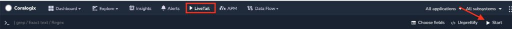
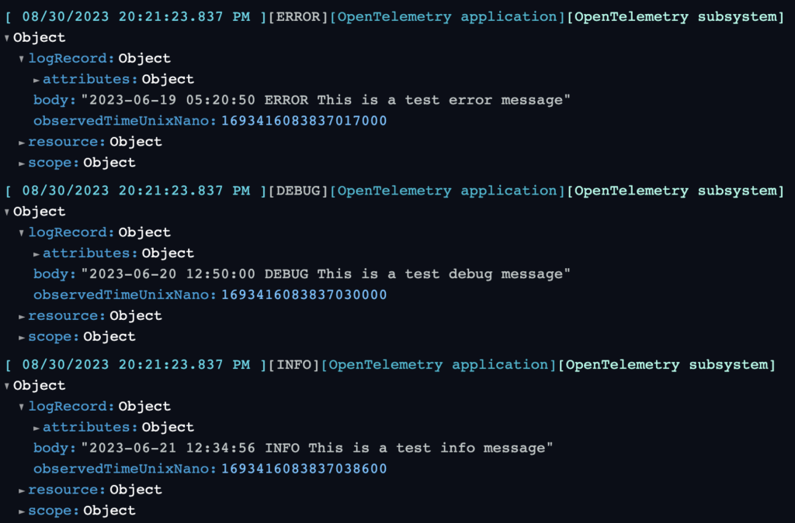
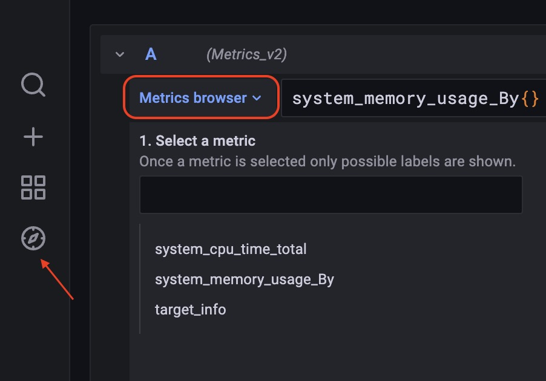

This tutorial demonstrates configuring [OpenTelemetry](https://coralogixstg.wpengine.com/docs/opentelemetry/) (OTEL) Collector to send your logs and metrics to Coralogix using Docker.

## Prerequisites

- Docker [installed](https://docs.docker.com/engine/install/)

## Configuration

**STEP 1**. Create a configuration file. Copy this template file and save it as `config.yaml`.

```
receivers:
  filelog:
    start_at: beginning
    include:
      - /example.log
    include_file_path: true
    multiline: {line_start_pattern: "\\n"}
	hostmetrics:
	    collection_interval: 30s
	    scrapers:
	      cpu:
	      memory:
exporters:
  coralogix:
    domain: "Domain"
    private_key: "Private key"
    application_name: "Application Name"
    subsystem_name: "Subsystem Name"
    timeout: 30s

service:
  pipelines:
    logs:
      receivers: [ filelog ]
      exporters: [ coralogix ]
    metrics:
      receivers: [ hostmetrics ]
      exporters: [ coralogix ]

```

Provide the following variables.

| Variable | Description |
| --- | --- |
| Private Key | Your Coralogix [**Send-Your-Data API key**](https://coralogixstg.wpengine.com/docs/send-your-data-api-key/) |
| Application Name | The name of your [**application**](https://coralogixstg.wpengine.com/docs/application-and-subsystem-names/), as it will appear in your Coralogix dashboard. For example, a company named SuperData might insert the SuperData string parameter. If SuperData wants to debug its test environment, it might use SuperData–Test. |
| Subsystem Name | The name of your [**subsystem**](https://coralogixstg.wpengine.com/docs/application-and-subsystem-names/), as it will appear in your Coralogix dashboard. Applications often have multiple subsystems (ie. Backend Servers, Middleware, Frontend Servers, etc.). In order to help you examine the data you need, inserting the subsystem parameter is vital. |
| Domain | Your Coralogix **[domain](https://coralogixstg.wpengine.com/docs/coralogix-domain/)** |

**STEP 2**. Save this log file as `example.log`.

```
2023-06-19 05:20:50 ERROR This is a test error message
2023-06-20 12:50:00 DEBUG This is a test debug message
2023-06-21 12:34:56 INFO This is a test info message

```

**STEP 3**. Pull a docker image and run the collector in a container. To load your custom configuration `config.yaml` and the log file `example.log` from your current working directory, mount the files as a volume into the container. Find out more [here](https://opentelemetry.io/docs/collector/getting-started/#docker).

```
docker pull otel/opentelemetry-collector-contrib
docker run -d -v "$(pwd)"/config.yaml:/etc/otelcol-contrib/config.yaml -v "$(pwd)"/example.log:/example.log otel/opentelemetry-collector-contrib
```

## **Validation**

Validate your configuration.

### Logs

In your Coralogix navigation pane, click **LiveTrail** **\> Start** to view your logs.





### Metrics

**STEP 1**. Navigate to [hosted Grafana view](https://coralogixstg.wpengine.com/docs/hosted-grafana-view/).

**STEP 2**. In the left-hand panel, click **Explore > Metrics browser.** Select the metrics that you would like to see.



## Additional Resources

<table><tbody><tr><td>Documentation</td><td><a href="https://coralogixstg.wpengine.com/docs/opentelemetry/"><strong>OpenTelemetry</strong></a></td></tr></tbody></table>

## **Support**

**Need help?**

Our world-class customer success team is available 24/7 to walk you through your setup and answer any questions that may come up.

Feel free to reach out to us **via our in-app chat** or by sending us an email at [support@coralogixstg.wpengine.com](mailto:support@coralogixstg.wpengine.com).
