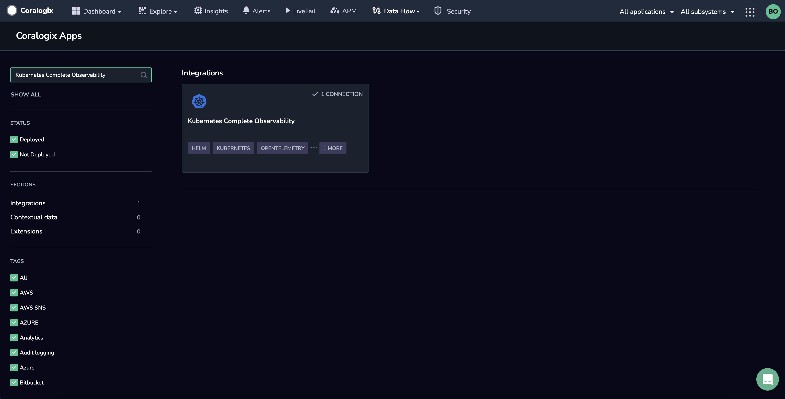
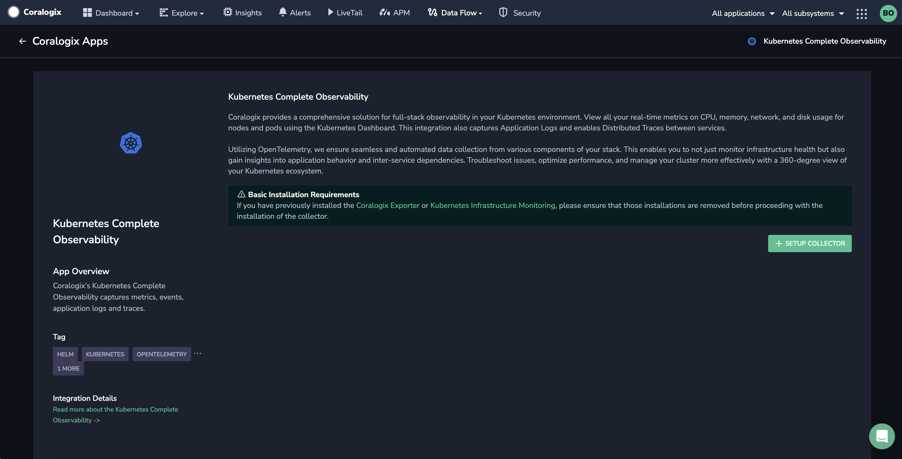
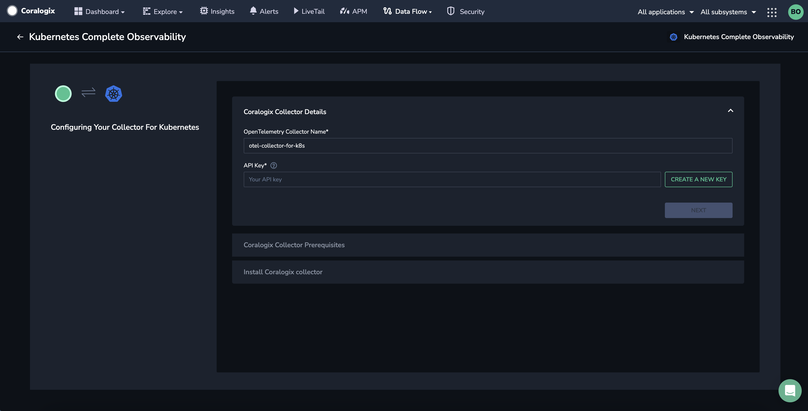
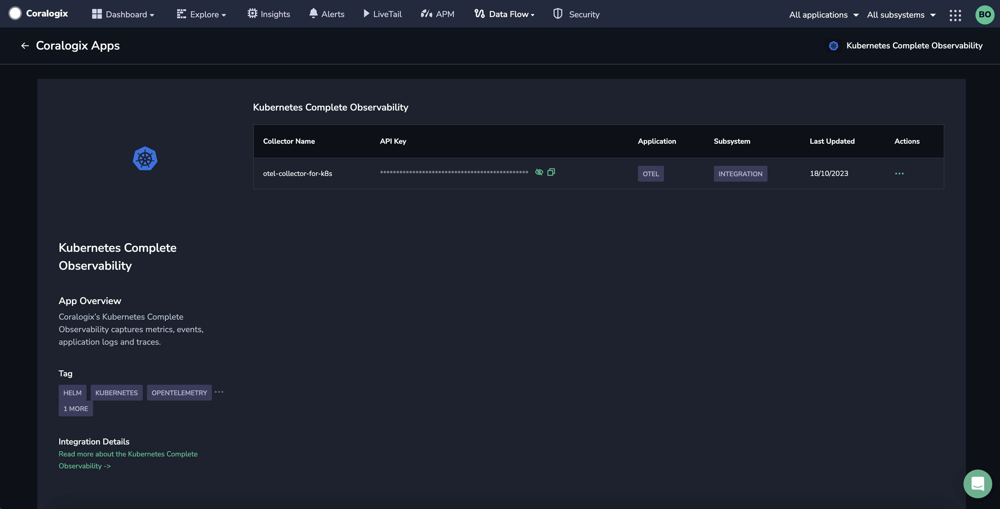

Coralogix’s **Kubernetes Complete Observability** provides a comprehensive solution for full-stack observability in your Kubernetes environment.

## Overview

View all of your nodes, pods and cluster metrics, pod logs, Kubernetes events, and your distributed traces pipeline. Take advantage of our Kubernetes Dashboard using our pre-configured OpenTelemetry Collector.

Utilizing [OpenTelemetry](https://coralogixstg.wpengine.com/docs/opentelemetry/), we ensure seamless and automated data collection from various components of your stack. This enables you to monitor infrastructure health and gain insights into application behavior and inter-service dependencies. Troubleshoot issues, optimize performance and manage your cluster more effectively with a 360-degree view of your Kubernetes ecosystem.

## Prerequisites

- [Kubernetes](https://kubernetes.io/) (v1.24+) installed, with the command-line tool [kubectl](https://kubernetes.io/docs/tasks/tools/#kubectl)

- [Helm](https://helm.sh/) (v3.9+) installed and configured

**Note**! If you have previously installed the Coralogix Exporter or [Kubernetes Infrastructure Monitoring](https://coralogixstg.wpengine.com/docs/kubernetes-collector/), they must be **removed** before proceeding with this integration.

## Installation

**STEP 1.** In your Coralogix toolbar, navigate to **Data Flow** > **Integrations**.

**STEP 2.** From the Integrations section, select **Kubernetes Complete Observability**.

**STEP 3.** On the Coralogix OpenTelemetry Collector integration page, click **\+ SETUP COLLECTOR**.

**STEP 4.** Enter a name for your integration.

**STEP 5.** Enter one of your [Send-Your-Data API keys](https://coralogixstg.wpengine.com/docs/send-your-data-api-key/) or click **CREATE NEW KEY** to generate a new dedicated API key.

**STEP 6.** Click **NEXT**.

**STEP 7.** Check the Helm version by using the `helm version` command. You are required to use Helm v3.9 or above.

**STEP 8.** Add the Coralogix Helm repository to your Helm configuration by copying and running the command.

Run the command `helm repo update` to update Helm's local repository cache.

Click **NEXT**.

**STEP 9.** OpenTelemetry Agent requires a secret called `coralogix-keys` with the [Send-Your-Data API key](https://coralogixstg.wpengine.com/docs/send-your-data-api-key/) created in **STEP 5**. It is defined as `PRIVATE_KEY` inside the same namespace in which the chart is installed. If the secret is not present, create it by copying and running the command shown in the installer.

**STEP 10.** Copy and run the `helm upgrade` command shown in the installer. Make sure you replace the `<cluster name>` with your Kubernetes cluster name.

**STEP 11.** Mark the checkbox to confirm you have run the Helm command. Click **COMPLETE**.

## Limits & Quotas

- Coralogix places a **hard limit of 10MB** of data to our [**OpenTelemetry Endpoints**](https://coralogixstg.wpengine.com/docs/coralogix-endpoints/), with a **recommendation of 2MB**.

- Metric names must be a maximum of 255 characters.

- Attribute keys for metric data must be a maximum of 255 characters.

## Next Steps

**Advanced configuration** instructions can be found [here](https://coralogixstg.wpengine.com/docs/set-up-kubernetes-observability-using-opentelemetry-advanced-configuration/).

**Validation** instructions can be found [here](https://coralogixstg.wpengine.com/docs/validation-kubernetes-observability-using-opentelemetry/).

## Additional Resources

<table><tbody><tr><td>Documentation</td><td><a href="https://github.com/coralogix/telemetry-shippers/tree/master/otel-integration/k8s-helm#prerequisites"><strong>GitHub Repository</strong></a> <strong><a href="https://coralogixstg.wpengine.com/docs/kubernetes-dashboard/">Kubernetes Dashboard</a></strong></td></tr></tbody></table>

## Support

**Need help?**

Our world-class customer success team is available 24/7 to walk you through your setup and answer any questions that may come up.

Feel free to reach out to us **via our in-app chat** or by sending us an email at [support@coralogixstg.wpengine.com](mailto:support@coralogixstg.wpengine.com).
