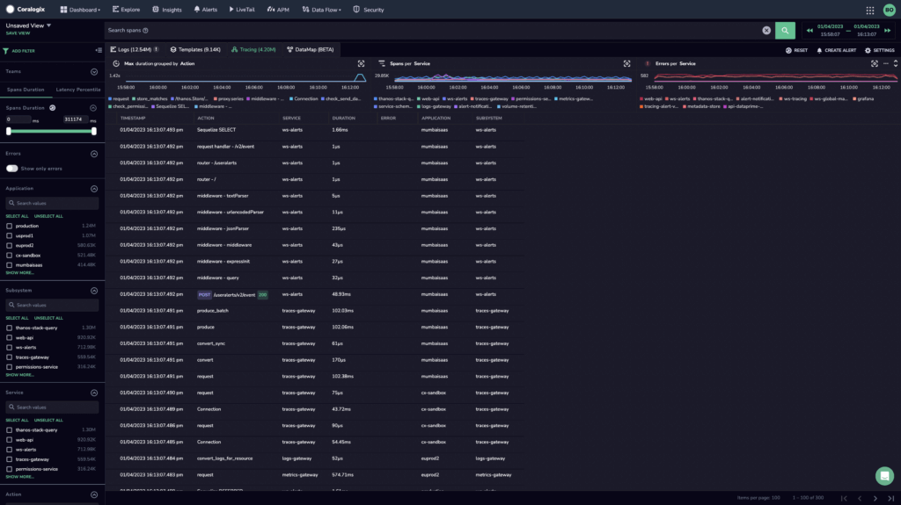
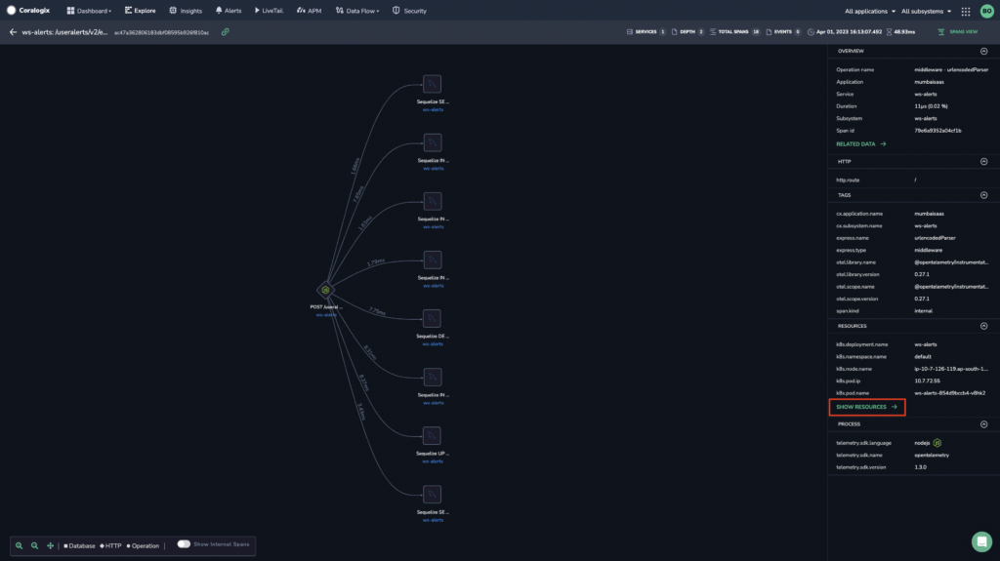

Our [application performance monitoring](https://coralogixstg.wpengine.com/blog/application-performance-monitoring-visibility/) (APM) provides you with all logs relevant to a particular span context, granting a full picture of the services that power your applications.

Use our newest layers of observability – `**POD**` and `**HOST**` – to:

- Instantly view all of your pod and host metrics, including resource consumption and associated network information

- Compare metrics within a specific pod and across pods from a specific service

- Correlate between Kubernetes spans, logs, and metrics for a specific pod and/or host

- Troubleshoot log span errors

- Annotate deployment tags based on span context

## **Concepts**

Spans and traces form the basis of your Coralogix APM journey.

Using this telemetry data, Coralogix allows you to observe **application resource consumption** and **infrastructure resource consumption** using two new observability layers.

| POD | application resource consumption | Key factors that impact response times and throughput of applications |
| --- | --- | --- |
| HOST | infrastructure resource consumption | Usage of IT resources, systems, and processes |

## Access Pod & Host Features

**STEP 1**. In your navigation pane, click **Explore** > Tracing. Click on the trace of interest.

**STEP 2**. Click **VIEW RESOURCES →** in your right-hand tool bar.

**STEP 3**. Click on the `POD` and `HOST` tabs, in addition to `RELATED LOGS` and `SPAN LOGS`.

## **Additional Resources**

<table><tbody><tr><td><strong>Documentation</strong></td><td><a href="https://coralogixstg.wpengine.com/blog/application-performance-monitoring-visibility/">Application Performance Monitoring</a> <a href="https://coralogixstg.wpengine.com/docs/distributed-tracing/">Distributed Tracing</a></td></tr><tr><td><strong>Blog</strong></td><td><a href="https://coralogixstg.wpengine.com/blog/application-performance-monitoring-visibility/">One Click Visibility: Coralogix Expands APM Capabilities to Kubernetes</a></td></tr></tbody></table>

## **Support**

**Need help?**

Our world-class customer success team is available 24/7 to walk you through your setup and answer any questions that may come up.

Feel free to reach out to us **via our in-app chat** or by sending us an email at **[support@coralogixstg.wpengine.com](mailto:support@coralogixstg.wpengine.com)**.
