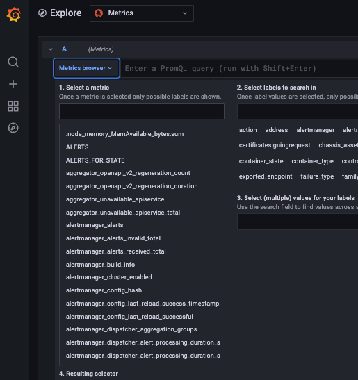

Prometheus is currently the leading tool for metric collection, it's easy to integrate and easy to use.

Still, short-term retention is a big struggle faced by Prometheus users.

Coralogix helps you overcome this struggle by providing you a way to automatically ship your metrics into your Coralogix account and store them long-term without making complex changes to your Prometheus architecture.

**New!** You can now enjoy our new [APM](https://coralogixstg.wpengine.com/docs/apm/) features when using OpenTelemetry collector with a Kubernetes processor and Prometheus.

## Send Prometheus Metrics to Coralogix

#### Endpoint

Select a **Prometheus RemoteWrite** [endpoint](https://coralogixstg.wpengine.com/docs/coralogix-endpoints/) for the domain associated with your Coralogix account.

#### YAML File

Under root level add remote\_write using the following format:

```
remote_write:
- url: <Remote_write URL>
  name: '<customer_name>'
  remote_timeout: 120s
  bearer_token: '<Send_Your_Data_private_key>'
```

#### Using Prometheus operator -

Prometheus Operator provides Kubernetes native deployment.

You can add remoteWrite in the following format (note the camel case):

```
remoteWrite:
    url: <Remote_write URL>
    name: '<customer_name>'
    remoteTimeout: 120s
    bearerToken: '<Send_Your_Data_private_key>'
```

#### Guidelines -

- URL – query params that send metric information to Coralogix. These params contain appLabelName, subSystemLabelName and severityLabelName. The parameters you should provide are the **keys** you choose to send to Coralogix, they are mapped to metric labels.

- Name – The name of the time series.

- Remote timeout - Timeout for requests to the remote write endpoint.

- Bearer Token - This token identifies you into your Coralogix account.  Access your [Send-Your-Data API key](https://coralogixstg.wpengine.com/docs/send-your-data-api-key/).

- Severities values that are valid in Coralogix are Debug, Verbose, Info, Warning, Error, and Critical. The default severity when leaving severityLabelName empty is Info.

#### Server responses -

- `HTTP 200`: The protobuf file is valid and contains Prometheus Metadata.

- `HTTP 201`: The protobuf file is valid and processed by Coralogix.

- `HTTP 204`: The protobuf file is valid, but the Prometheus.WriteRequest is empty.

- `HTTP 400`: The REST API request itself was malformed. Check the query params.

- `HTTP 401`: The customer is unauthorized. Verify your [Send-Your-Data API key](https://coralogixstg.wpengine.com/docs/send-your-data-api-key/).

### Grafana Visibility

Coralogix enables you to integrate and view your metrics from Grafana as well.


To connect Grafana to your account you can follow this tutorial: [https://coralogixstg.wpengine.com/tutorials/grafana-plugin/](https://coralogixstg.wpengine.com/tutorials/grafana-plugin/)

### Coralogix Visibility

To view the metrics in Coralogix:

1. Navigate to 'Grafana Explore'

3. Choose 'Metrics' as a data source.

5. Expand 'Metrics browser.'

7. Select a metric.



**Enabling Metrics Archive in Coralogix**

Learn more on how to enable your S3 archive for metrics:  
[Connect S3 Archive](https://coralogixstg.wpengine.com/docs/archive-s3-bucket-forever/)

## Limits & Quotas

Coralogix places the following limits on endpoints:

- A **hard limit of 10MB** of data to our **OpenTelemetry** **endpoint**, with a **recommendation of 2MB**

- A **hard limit of 2411724 bytes** of data to our **Prometheus RemoteWrite** **endpoint**, with a **recommendation** for any amount less than this limit

Limits apply to single requests, regardless of timespan.

## Support

**Need help?**

Our world-class customer success team is available 24/7 to walk you through your setup and answer any questions that may come up.

Feel free to reach out to us **via our in-app chat** or by sending us an email at [support@coralogixstg.wpengine.com](mailto:support@coralogixstg.wpengine.com).
