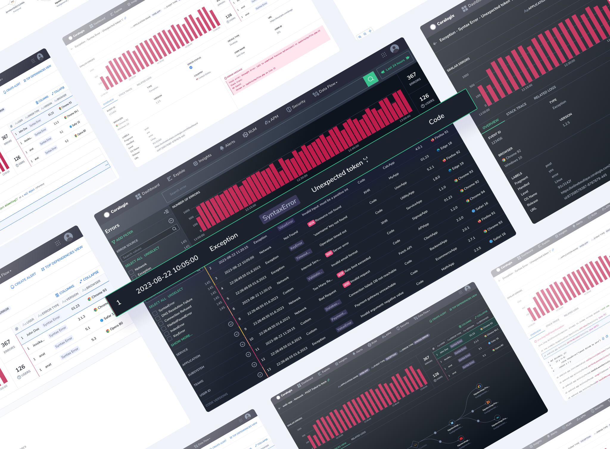
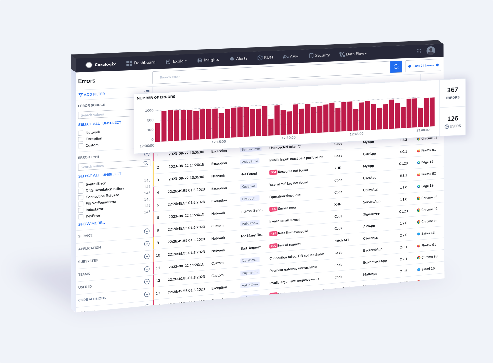

Coralogix's **Real User Monitoring (RUM)** is an advanced monitoring solution that provides unparalleled visibility into your application's frontend performance, all from the perspective of real users in real time. With **RUM**, you can gain a comprehensive understanding of how your application performs across a variety of browsers, devices, and networks, allowing you to quickly detect issues that might be affecting your users' experience.

**RUM** is designed to be as seamless as possible, correlating every user journey with backend metrics, traces, logs, and network performance data. This means that you can quickly identify the root cause of any problems and resolve them with cross-stack context, reducing your mean time to resolution and improving your overall service quality. What’s more, this feature is powered by our [Streama© technology](https://coralogixstg.wpengine.com/how-it-works/), allowing your data to run on the Coralogix monitoring pipeline, at a third of the cost, without prior indexing.

Whether you're looking to optimize your app's performance, reduce downtime, or simply improve your user experience, **RUM** provides the tools and insights you need to optimize engagement with your application.

## What is Real User Monitoring?

**RUM** is a web performance monitoring technique that collects data on how real users interact with a website or web application. It tracks metrics such as page load times, network requests, and user interactions to provide insights into the actual user experience. By integrating a JavaScript snippet into web pages, RUM captures data from users' browsers, allowing website owners to identify performance issues, optimize user experience, and make data-driven decisions for improving their website's overall performance.

RUM allows you to optimize your website’s overall performance using four types of functionalities for monitoring web and mobile applications.

- **Error Tracking.** Monitor and analyze errors that occur on the client-side during real user interactions with your website or web application. Identify and understand issues that users encounter over time and versions to enhance the overall user experience. Find out more [here](https://coralogixstg.wpengine.com/docs/error-tracking/).

- **User Sessions**. Investigate each and every user session - a user journey on your web or mobile application, including page views and associated telemetry. A user session typically starts when a user visits a website or performs a specific action and ends when the user either closes the browser window, navigates to a different website, or remains inactive for a specified period. Understand how users are engaging with your site over time and how performance metrics might change within a single session.

- **Page** **Performance.** Measure and analyze how a web page or web application performs from the perspective of real users. Inspect page load time and rendering speed, which reflect the users' experience while accessing the site.

- **RUM Analytics.** Collect real user analytics - including page views, unique visitors, geographic distribution, and user interaction with your application (page visited, resources loaded, clicks, interactions, feature usage, and errors).

RUM is available for [Monitoring](https://coralogixstg.wpengine.com/docs/optimize-log-management-costs/#monitoring-data-medium-priority) and [Compliance](https://coralogixstg.wpengine.com/docs/optimize-log-management-costs/#compliance-data-low-priority) priority-level data, in addition to [Frequent Search](https://coralogixstg.wpengine.com/docs/optimize-log-management-costs/#frequent-search-data-high-priority).

## How Streama Enables Optimized RUM

**RUM** is powered by our [Streama© technology](https://coralogixstg.wpengine.com/how-it-works/), which enables [error tracking](https://coralogixstg.wpengine.com/docs/error-tracking/) as part of the streaming process, without prior indexing. In other words, we process your data first and delay storage and indexing until all important decisions have been made. Use this technology to rapidly track thousands of components and proactively troubleshoot errors that you have monitored.

## How Can I Use RUM?

RUM is valuable for a wide range of companies and individuals who operate websites or web applications. By gaining insights into real user experiences, these entities can make data-driven decisions to optimize their digital platforms and achieve their business objectives. Check out some of these use-cases below.

- **Error Tracking**. An e-commerce fashion retailer uses RUM to track user interactions on its website. The RUM tool detects that some users encounter a JavaScript error when trying to add items to their cart. The retailer promptly investigates and finds that the error is caused by a recent code update. With the insights provided by RUM, the retailer rolls back the problematic code and deploys a fix, ensuring a smooth shopping experience for all users.

- **User Sessions.** A game development company leverages RUM to gain insights into player behavior. The RUM tool reveals that players tend to drop off at a certain level in the game. By analyzing user sessions, the company’s developer discovers that the level is too challenging for many players, leading to disengagement. Armed with this knowledge, the developer tweaks the level design to strike a better balance, resulting in improved player retention and more positive reviews.

- **Page Performance**. An electronics retailer relies on RUM to monitor their website's performance. The RUM tool highlights that users on mobile devices experience slower load times on the checkout page. Using these RUM insights, the retailer identifies that an overly complex checkout form is causing delays. They simplify the form, leading to faster load times and reduced cart abandonment.

## Getting Started

- Set up and configure **Real User Monitoring** via the [RUM Integration Package](https://coralogixstg.wpengine.com/docs/rum-integration-package/) to hit the ground running with our various RUM features. The package includes automatic configuration of the RUM Browser SDK, as well as upload of your source maps. Once configured, all network requests and errors in your system will be captured and sent to Coralogix.

- [Get familiar](https://coralogixstg.wpengine.com/docs/error-tracking/) with **Error Tracking**. Use our dedicated [user manual](https://coralogixstg.wpengine.com/docs/error-tracking-user-manual/) to track your errors and engage with our user-friendly UI. To access the **Error Tracking** screen in your Coralogix toolbar, navigate to **Explore** > **Error Tracking**.

## Additional Resources

<table><tbody><tr><td>Documentation</td><td><a href="https://coralogixstg.wpengine.com/docs/rum-integration-package/"><strong>RUM Integration Package</strong></a> <a href="https://coralogixstg.wpengine.com/docs/browser-sdk-installation-guide/"><strong>Browser SDK Installation Guide</strong></a> <a href="https://coralogixstg.wpengine.com/docs/error-tracking/"><strong>Error Tracking</strong></a> <strong><a href="https://coralogixstg.wpengine.com/docs/error-tracking-user-manual/">Error Tracking: User Manual</a></strong></td></tr></tbody></table>

## Support

**Need help?**

Our world-class customer success team is available 24/7 to walk you through your setup and answer any questions that may come up.

Feel free to reach out to us **via our in-app chat** or by sending us an email at [support@coralogixstg.wpengine.com](mailto:support@coralogixstg.wpengine.com).
