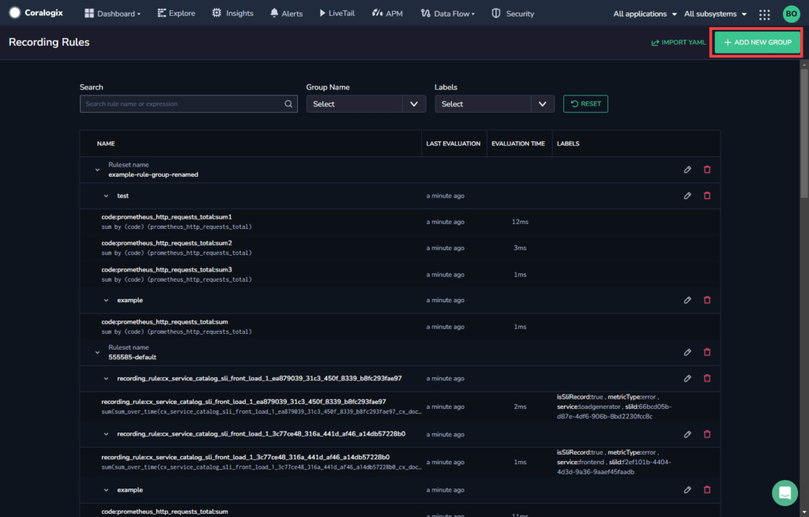
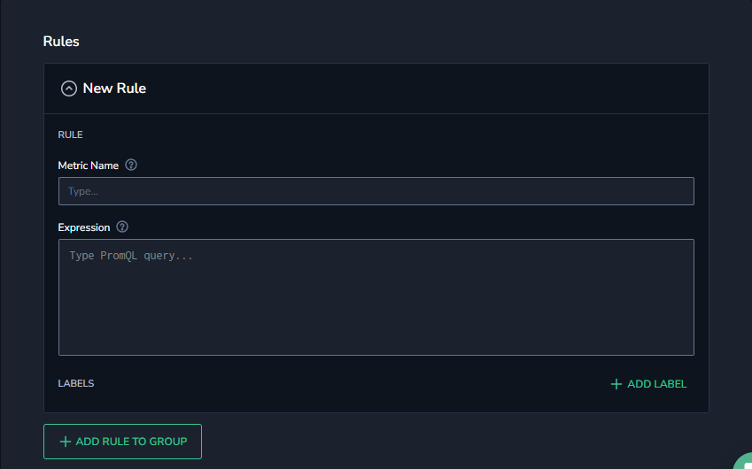
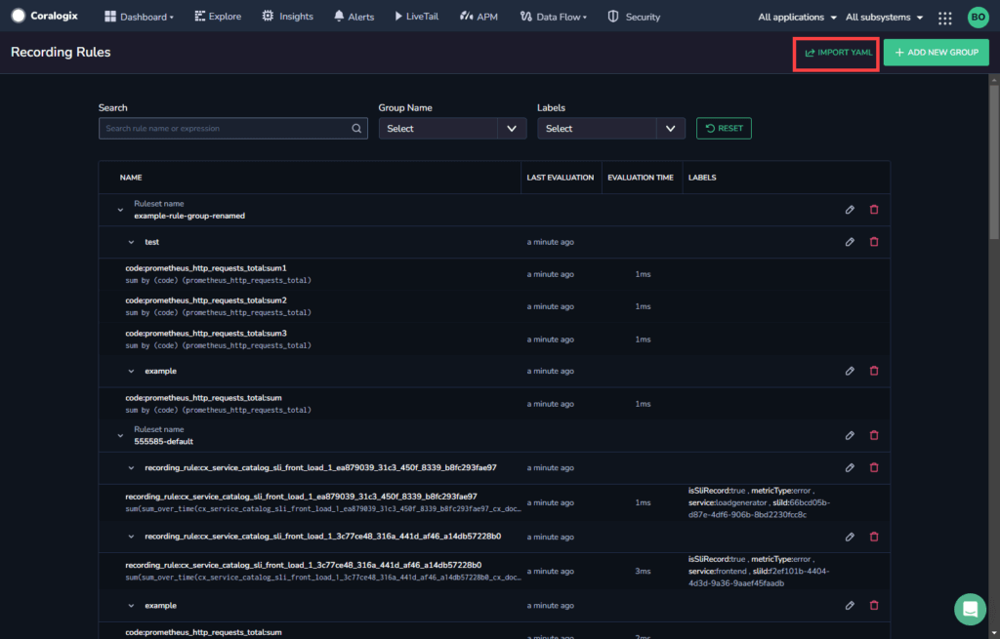

**Recording rules** allow you to preprocess and derive new time series from existing ones. By recording a new metric time series, you can simplify complex and resource-intensive PromQL queries into a leaner and more quickly queried metric. The newly recorded metric can be used in various dashboard visualizations and delivers high-performance analytics.

## Overview

Create recording rules using your Coralogix UI or import existing rules from a YAML file using our [Recording Rules API](https://coralogixstg.wpengine.com/docs/recording-rules/). These rules are executed in the background at a regular interval specified in the rule group.

A recording rule is defined by:

- a name

- a query expression

- an optional set of labels to add to the resulting time series

The query expression is used to select the time series upon which the rule will operate. It may include aggregation functions such as sum, min, max, etc. When a rule is executed, it evaluates the query expression over a range of time specified in the configuration file as `evaluation_interval`. It then creates a new time series for each unique combination of label values resulting from the evaluation.

## Prerequisites

- [Coralogix account](https://dashboard.coralogixstg.wpengine.com/#/signup) set up to send metrics

- S3 bucket [set up and defined](https://coralogixstg.wpengine.com/docs/archive-s3-bucket-forever/)

## Add a New Rule

Add a new recording rule using your Coralogix UI.

**STEP 1.** In your navigation pane, click **Data Flow** > Recording Rules to view the existing list of recording rules.

**STEP 2.** Click **\+ ADD NEW GROUP**.

**STEP 3.** Select the rule set for the new group. Either select from the **Select set for this group** dropdown, or click **\+ ADD NEW SET** to add the rule group to a new rule set.

**STEP 4.** Enter a name for the group and select the **Evaluation interval** (how frequently the rule is run) and **Series limit** (the number of permutations the rule can create) for the new group.

**Notes:**

- The default setting for the **Evaluation interval** is 30 seconds (the minimum is 15 seconds). Note that the evaluation interval set in the rule must be greater than the time it will actually take to evaluate. If the frequency is shorter than the actual evaluation time, the recording rule will fail.

- The default setting for the **Series limit** is 0, which means “no limit”.

**STEP 5.** Enter a **Name** for the metric and enter the **Expression** as a PromQL query.

**STEP 6.** \[Optional\] Add **Labels** and **Values** to the rule.

**STEP 7.** You may add additional rules for the rule group by repeating Steps 1-4 for each additional rule.

**STEP 8.** Click **Save Rule Group** at the top of the screen.

## Import Rules From a YAML File

To import rules from an existing YAML file:

**STEP 1.** In your navigation pane, click **Data Flow** > Recording Rules to view the existing list of recording rules.

**STEP 2.** Click **IMPORT YAML**.

**STEP 3.** Select the YAML file to import and click **Open**.

If the upload is successful, the imported rules appear in the Recording Rules page.

If the upload fails for any reason, an error message appears with the reason for the failure.

## Additional Resources

<table><tbody><tr><td>Documentation</td><td><a href="https://coralogixstg.wpengine.com/docs/recording-rules/">Recording Rules API</a></td></tr></tbody></table>

## Support

**Need help?**

Our world-class customer success team is available 24/7 to walk you through your setup and answer any questions that may come up.

Feel free to reach out to us **via our in-app chat** or by sending us an email at [support@coralogixstg.wpengine.com](mailto:support@coralogixstg.wpengine.com).
