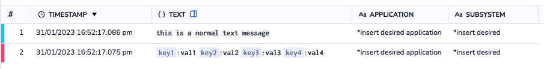

Send your logs using our Rest API `/bulk` endpoint.

## Endpoint URL

Create an endpoint URL by inputting your Coralogix account [domain](https://coralogixstg.wpengine.com/docs/coralogix-domain/) as follows: https://ingress.**<domain>**/logs/v1/bulk.

## Schema

### **Endpoint Details**

<table><tbody><tr><td>URL</td><td>https://ingress.<strong>&lt;domain&gt;</strong>/logs/v1/bulk</td></tr><tr><td>HTTP Method</td><td>POST</td></tr><tr><td>Content-Type</td><td>application/json</td></tr><tr><td>Header</td><td>Authorization: Bearer &lt;<a href="https://coralogixstg.wpengine.com/docs/send-your-data-api-key/">Send-Your-Data API key</a>&gt;</td></tr></tbody></table>

- We **recommend** sending logs in batches to minimize network calls.

- Group logs from the same application, subsystem, and computer under a single API call using the “logEntries” property.

- The API is limited to a message size of 2MB which is approximately 3,000 medium-sized logs.

- If you are using Ajax or a similar technology, you may need to send the data with JSON.stringify()).

### **POST Body**

| Required | Property Name | Property Type | Notes |
| --- | --- | --- | --- |
| Yes | applicationName | string | usually used to separate environments |
| Yes | subsystemName | string | usually used to separate components |
|  | computerName | string |  |
| Yes | logEntries | array of logs |  |

### **Log**

| Required | Property Name | Property Type | Notes |
| --- | --- | --- | --- |
|  | timestamp | number | UTC milliseconds since 1970 (supports sub millisecond via a floating point) |
| Yes | severity | number | 1 – Debug, 2 – Verbose, 3 – Info, 4 – Warn, 5 – Error, 6 – Critical |
| Yes | text | string |  |
|  | hiResTimestamp | string | UTC nanoseconds since 1970(supports millisecond, microsecond and nanosecond) |
|  | className | string |  |
|  | methodName | string |  |
|  | threadId | string |  |
|  | category | string |  |

## Example

```
curl --location --request POST '<https://ingress.<domain>/logs/v1/bulk>' \\
  --header 'Content-Type: application/json' \\
  --header 'Authorization: Bearer <Send-Your-Data API key>' \\
  --data-raw '{
    "applicationName": "*insert desired application name*",
    "subsystemName": "*insert desired subsystem name*",
    "computerName": "*insert computer name*",
    "logEntries": [
      {
	        "timestamp": 1675148539123.342,
        "severity": 3,
        "text": "this is a normal text message",
        "category": "cat-1",
        "className": "class-1",
        "methodName": "method-1",
        "threadId": "thread-1"
      }, {
        "hiResTimestamp": "1675148539789123123",
        "severity": 5,
        "text": "{\\"key1\\":\\"val1\\",\\"key2\\":\\"val2\\",\\"key3\\":\\"val3\\",\\"key4\\":\\"val4\\"}",
        "category": "DAL",
        "className": "UserManager",
        "methodName": "RegisterUser",
        "threadId": "a-352"
    }]}'

```

- If you are sending a JSON payload, **we suggest** escaping it and then inserting it into the text field, which should be sent as string.

- If `timestamp` is present, use milliseconds or microseconds. If not, we will inject the UTC time at the time the request is received.

## **Coralogix Dashboard**

View your logs, with all metadata fields, in your Coralogix dashboard.



## **Support**

**Need help**? Our world-class customer success team is available 24/7 to walk you through your setup and answer any questions that may come up.

Feel free to reach out to us **via our in-app chat** or by sending us an email at **[support@coralogixstg.wpengine.com](mailto:support@coralogixstg.wpengine.com)**.
