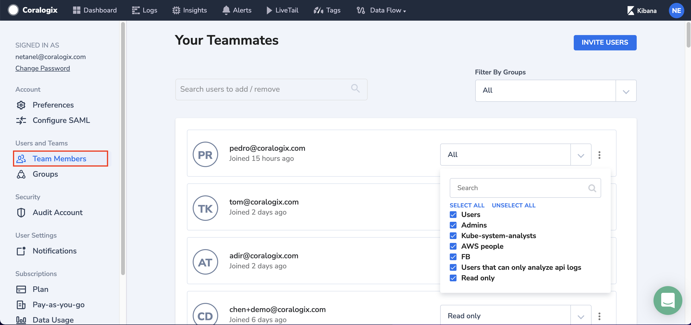
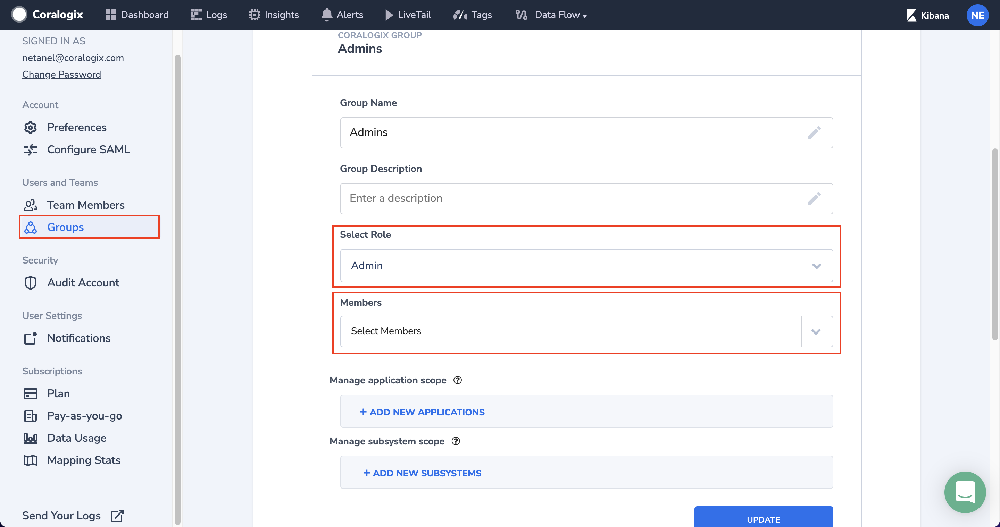

As part of our [team and user management](https://coralogixstg.wpengine.com/docs/user-team-management/) options, ****r**ole-based access control (RBAC)** allows account administrators to grant some or all team members specific [application and subsystem](https://coralogixstg.wpengine.com/docs/application-and-subsystem-names/) data permissions, as well as action permissions. You can also assign team users into multiple groups with different action permissions to any sub-set of users. As indicated previously, by default 3 groups are created: **Admins**, **Users,** and **Read-only.**

User roles are determined when a user is initially invited to a Team (in the [Invites page](https://coralogixstg.wpengine.com/tutorials/user-team-management/)). You may change users roles by either assigning them to a different group from the **Team Members** page:

Or by adding the user to the group by choosing him in the **Members** option. You can also change permissions to an entire group by changing the role in the **Select Role** option.

In **Manage application scope** you may choose specific applications that will be visible to the group across Coralogix. For example, in the **AWS people** group, choosing application "AWS" will give access to aws-related information only to the users who are members of the AWS people group (access to view aws logs in the Logs view, aws logs in the LiveTail view, aws-related alerts, AWS traces etc.). You can also choose a different **Filter type** to include several applications which start, end or include a search term.

The same goes for **Manage subsystem scope**.

**Notes**:

- If application and subsystem are not specified, then users have access to all applications and subsystems.

- In case a user does not have the permission to view a specific subsystem, the relevant trace will be marked as N\\A(out of scope) and the relevant spans will not be visible (grayed out) for him (only latency will be shown).

## Support

**Need help?**

Our world-class customer success team is available 24/7 to walk you through your setup and answer any questions that may come up.

Feel free to reach out to us **via our in-app chat** or by sending us an email at [support@coralogixstg.wpengine.com](mailto:support@coralogixstg.wpengine.com).
