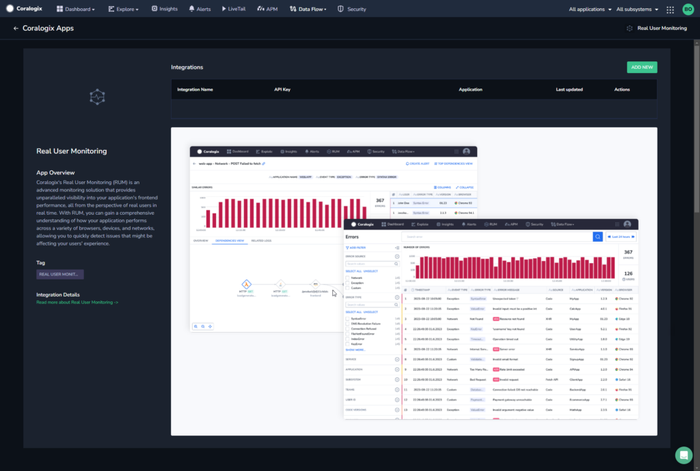
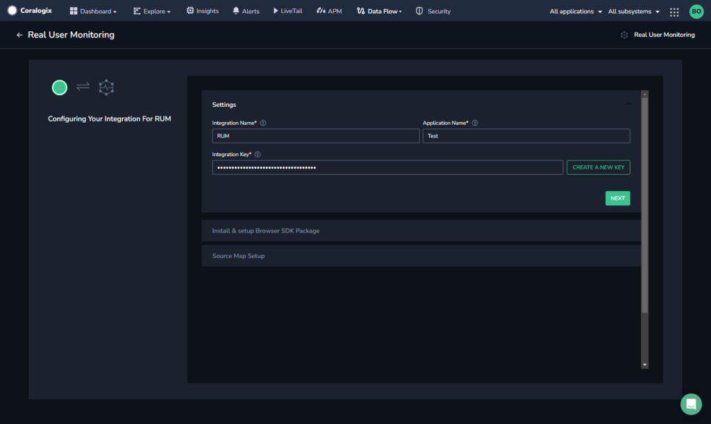
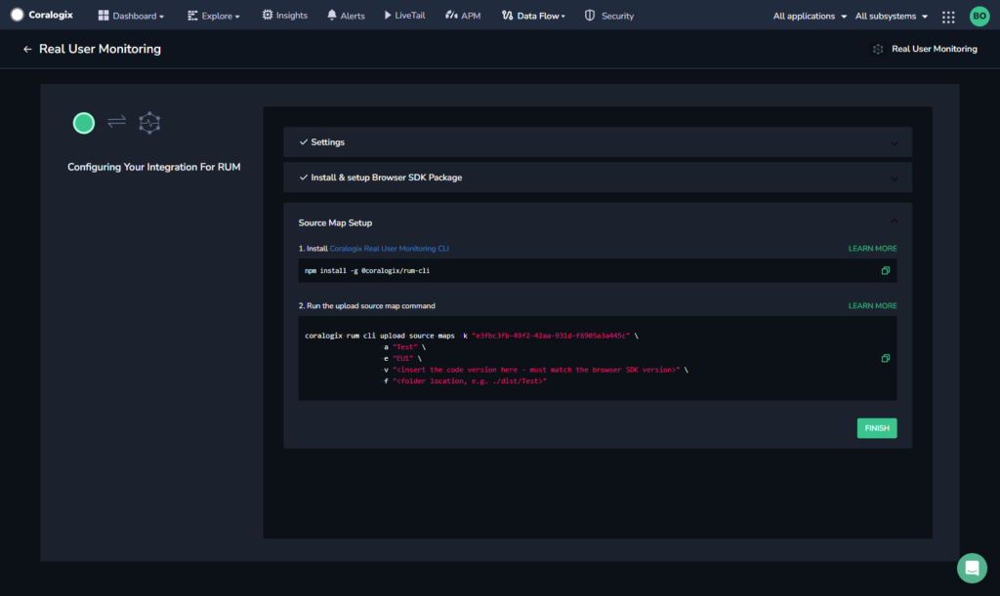
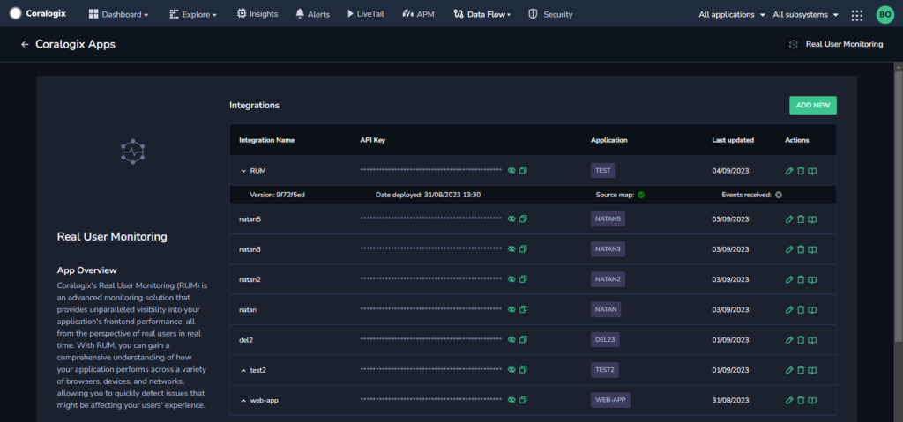

Set up and configure **Real User Monitoring** via the **RUM Integration Package** to hit the ground running with our various RUM features. The package includes automatic configuration of the RUM Browser SDK, as well as upload of your source maps. Once configured, all network requests and errors in your system will be captured and sent to Coralogix.

## Overview

The **RUM Integration Package** includes automatic configuration of the [RUM Browser SDK](https://coralogixstg.wpengine.com/docs/browser-sdk-installation-guide/), as well as upload of your application source maps. Once configured, all network requests and errors in your system will be captured and sent to Coralogix.

### Rum Browser SDK

As part of our [Real User Monitoring](https://coralogixstg.wpengine.com/docs/real-user-monitoring/) (RUM) toolkit, Coralogix offers multi-faceted [Error Tracking](https://coralogixstg.wpengine.com/docs/error-tracking/)**,** enabled by our [RUM Browser SDK](https://coralogixstg.wpengine.com/docs/browser-sdk-installation-guide/). Integrated into the front end of web applications, this light-weight code tool detects and captures errors that arise within users’ browsers, including JavaScript runtime errors, unhandled exceptions, network errors, and application (custom logic) errors. The SDK collects essential error information and additional contextual data, such as browser details and URLs, and securely sent it to our platform through logs for further analysis.

### Source Maps

Take advantage of this integration package to upload source maps for your applications to the Coralogix RUM service.

Source map files are files commonly used in web development to facilitate the debugging process of minified or transpiled code. When JavaScript or CSS code is minified or transformed into a more compact form for production, it becomes challenging to trace errors back to the original source code due to the loss of meaningful variable names, line numbers, and structure. Source map files address this issue by providing a mapping between the minified code and its original, human-readable source code. This enables developers to debug efficiently by allowing browsers and debugging tools to display accurate error messages and stack traces based on the original code, aiding in the identification and resolution of issues in the development process.

## Installation

**STEP 1.** From your Coralogix toolbar, navigate to **Data Flow** > **Integrations**.

**STEP 2.** Select the **Real User Monitoring** Integration Package from the list of integrations.

**STEP 3.** Click **\+ ADD NEW**.

**STEP 4.** Enter a name for your integration.

**STEP 5.** Click **CREATE NEW KEY** to create an API key for your RUM integration. This key will be used in the following steps.

**STEP 6.** Click **NEXT**.

**STEP 7.** Integrate the Browser SDK into your frontend application using the code snippets generated by the integration.

**STEP 8.** Click **FINISH** to end the installation here, or \[Recommended\] click **SET UP SOURCE MAP** to upload your source map and gain full data observability and make the best of the error tracking tool.

**STEP 9.** Copy and run the setup source map command. Click **FINISH**.

The integration is completed and appears under the list of integrations.

Clicking on the integration name expands the row to show you the version, date deployed, whether or not a source map was uploaded and whether or not data is being received.

## Additional Resources

<table><tbody><tr><td>Documentation</td><td><a href="https://coralogixstg.wpengine.com/docs/real-user-monitoring/"><strong>Real User Monitoring</strong></a> <a href="https://coralogixstg.wpengine.com/docs/browser-sdk-installation-guide/"><strong>RUM Browser SDK</strong></a></td></tr></tbody></table>

## Support

**Need help?**

Our world-class customer success team is available 24/7 to walk you through your setup and answer any questions that may come up.

Feel free to reach out to us **via our in-app chat** or by sending us an email at [support@coralogixstg.wpengine.com](mailto:support@coralogixstg.wpengine.com).
