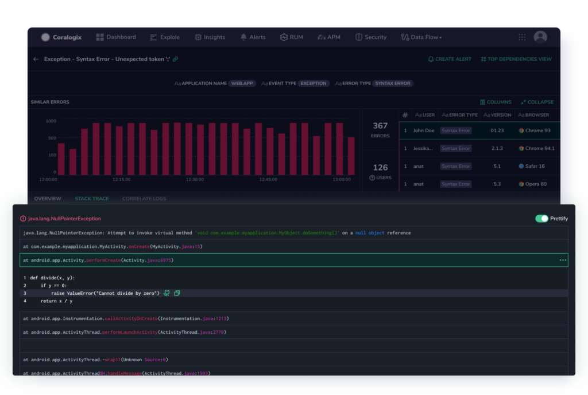

Take advantage of our **Real User Monitoring (RUM) CLI** to easily upload the **source maps** for your applications to the Coralogix RUM service.

## Overview

Source map files are files commonly used in web development to facilitate the debugging process of minified or transpiled code. When JavaScript or CSS code is minified or transformed into a more compact form for production, it becomes challenging to trace errors back to the original source code due to the loss of meaningful variable names, line numbers, and structure. Source map files address this issue by providing a mapping between the minified code and its original, human-readable source code. This enables developers to debug efficiently by allowing browsers and debugging tools to display accurate error messages and stack traces based on the original code, aiding in the identification and resolution of issues in the development process.

Take advantage of our RUM CLI to easily upload the source maps for your applications to the Coralogix RUM service.

Information on how to automatically upload your source maps using the **RUM Integration Package** can be found [here](https://coralogixstg.wpengine.com/docs/rum-integration-package/).

## **Install the RUM CLI**

**STEP 1.** Open a terminal or command prompt.

**STEP 2.** Run the following command to install the CLI globally:

```
npm i @coralogix/rum-cli

```

**STEP 3**. Once the installation is complete, you can use the CLI by running the `coralogix-rum-cli` command in your terminal.

## **Commands**

Here are some example commands for using the Coralogix RUM CLI:

### Upload Source Maps

```
coralogix-rum-cli upload-source-maps -k <privateKey> -a <application> -v <version> -f <folderPath> -e <env> -c <commitHash> -n <repoName> -o <orgName>

```

### Display Help

```
coralogix-rum-cli upload-source-maps --help

```

## **Uploading Source Maps**

Three options exist for uploading source maps.

- Upload source maps during the onboarding process.

- Upload source maps from the Coralogix RUM user interface. \[**Recommended** if you didn’t upload during the onboarding process\]

- Upload source maps manually using the Coralogix RUM CLI (explained in this document).

When uploading source maps using the RUM CLI, use the following options:

| Option | Description |
| --- | --- |
| `k, --private-key <privateKey>` | Your **Alerts, Rules and Tags API Key** to authenticate with the Coralogix API |
| `a, --application <application>` | Name of the application |
| `-v, --version <version>` | The application version  
Must match the version used by the RUM SDK |
| `f, --folder-path <folderPath>` | Path to the folder containing the source maps. |
| `e, --env <env>` | Your environment |
| `c, --commit-hash <commitHash>` | GitHub commit hash (optional) |
| `n, --repo-name <repoName>` | GitHub repository name (optional) |
| `o, --org-name <orgName>` | GitHub organization name (optional) |
| `h, --help` | Display help |

## **Upload Source Maps Using a Script**

To simplify the process of uploading source maps using the Coralogix RUM CLI, you can create a bash script that automates the task. Follow these steps to set up the script for CI and non-CI integrations.

### **CI Integration**

**STEP 1.** Create a new file named `upload-source-maps.sh` and open it for editing.

**STEP 2.** Copy and paste the following script into the file, replacing the placeholder values with your actual information:

```bash
#! /usr/bin/env bash

# Replace these values with your actual information
REPO_NAME="your-repo-name"
ORG_NAME="your-github-username"
APPLICATION="your-application-name"
ENV="your-environment"
SOURCE_MAPS_PATH="your-source-maps-path"
PRIVATE_KEY="your-coralogix-private-key"
VERSION="your-application-version"

# Get the commit hash using git rev-parse
COMMIT_HASH=$(git rev-parse HEAD)

# Run Coralogix RUM CLI to upload source maps
coralogix-rum-cli upload-source-maps -k "$PRIVATE_KEY" -a "$APPLICATION" -v "$VERSION" -f "$SOURCE_MAPS_PATH" -e "$ENV" -c "$COMMIT_HASH" -n "$REPO_NAME" -o "$ORG_NAME"

```

**Note:** The `$RELEASE_ID` must align with the content of the version field in your `CoralogixRum.init()` configuration in [Coralogix SDK for Browsers](https://coralogixstg.wpengine.com/docs/browser-sdk-installation-guide/).

* * *

### **Non-CI Integration**

**STEP 1.** Open a terminal window.

**STEP 2.** Run the following command:

```
coralogix-rum-cli upload-source-maps -k "$PRIVATE_KEY" -a "$APPLICATION" -v "$VERSION" -f "$SOURCE_MAPS_PATH" -e "$ENV" -c "$COMMIT_HASH" -n "$REPO_NAME" -o "$ORG_NAME"

```

**Note:** The `$VERSION` must align with the content of the version field in your `CoralogixRum.init()` configuration in [Coralogix SDK for Browsers](https://coralogixstg.wpengine.com/docs/browser-sdk-installation-guide/).

* * *

## **Available Environments**

The Coralogix RUM CLI supports the following environments:

- AP1

- AP2

- EU1

- EU2

- US1

Please use the appropriate environment value when specifying the `-e, --env option`.

## **Optional GitHub Information**

Use this GitHub information to add context to your source maps.

| Option | Description |
| --- | --- |
| `c, --commit-hash <commitHash>` | This option allows you to provide the GitHub commit hash associated with the source maps. Including this hash can help in tracking down issues specific to a particular commit. |
| `n, --repo-name <repoName>` | By specifying the GitHub repository name, you're indicating the repository where the source code is hosted. This information aids in correlating source maps with the correct repository. |
| `o, --org-name <orgName>` | This option enables you to input your GitHub organization user, helping to attribute the source maps to the appropriate organization user. Providing these GitHub-related options can enhance the accuracy of source map management and issue tracking within Coralogix RUM. However, they are not mandatory and can be omitted if not applicable. |

## Limitations

The source map folder size limit is **100MB** and should not be exceeded.

## Additional Resources

<table><tbody><tr><td>Documentation</td><td><a href="https://coralogixstg.wpengine.com/docs/real-user-monitoring/"><strong>Coralogix Real User Monitoring</strong></a><br><a href="https://www.npmjs.com/package/@coralogix/browser"><strong>Coralogix SDK for Browsers</strong></a></td></tr><tr><td>External Links</td><td><a href="https://www.npmjs.com/package/@coralogix/rum-cli"><strong>Coralogix RUM CLI Library</strong></a></td></tr></tbody></table>

## Support

**Need help?**

Our world-class customer success team is available 24/7 to walk you through your setup and answer any questions that may come up.

Feel free to reach out to us **via our in-app chat** or by sending us an email at [support@coralogixstg.wpengine.com](mailto:support@coralogixstg.wpengine.com).
