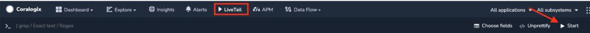
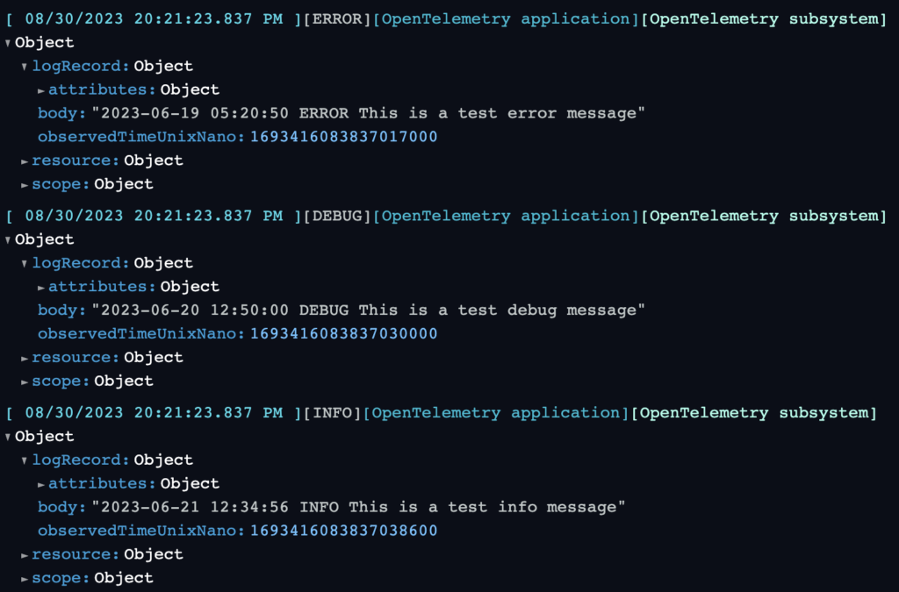
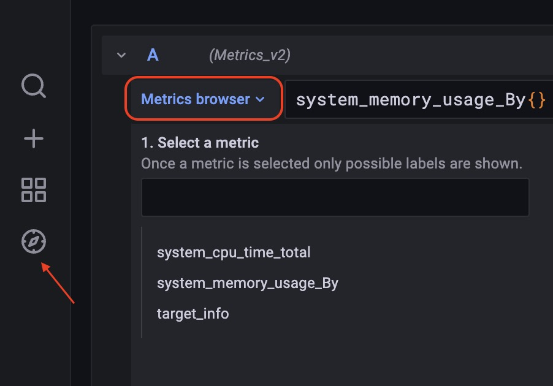

This tutorial demonstrates how to configure [OpenTelemetry](https://coralogixstg.wpengine.com/docs/opentelemetry/) (OTEL) Collector to send your logs and metrics to Coralogix when running OpenTelemetry as a CLI application or service.

## Prerequisites

- OpenTelemetry CLI application or service installed

**Notes**:

To use the Coralogix Exporter, ensure that you have installed [opentelemetry-collector-contrib](https://github.com/open-telemetry/opentelemetry-collector-contrib). You can download the relevant version for your OS using this [link](https://github.com/open-telemetry/opentelemetry-collector-releases/releases/).

## Configuration

**STEP 1**. Create a configuration file. Copy this template file and save it as `config.yaml`.

```
receivers:
  filelog:
    start_at: beginning
    include:
      - /example.log
    include_file_path: true
    multiline: {line_start_pattern: "\\n"}
	hostmetrics:
	    collection_interval: 30s
	    scrapers:
	      cpu:
	      memory:
exporters:
  coralogix:
    domain: "Domain"
    private_key: "Private key"
    application_name: "Application Name"
    subsystem_name: "Subsystem Name"
    timeout: 30s

service:
  pipelines:
    logs:
      receivers: [ filelog ]
      exporters: [ coralogix ]
    metrics:
      receivers: [ hostmetrics ]
      exporters: [ coralogix ]

```

Provide the following variables.

| Variable | Description |
| --- | --- |
| Private Key | Your Coralogix **[Send-Your-Data API key](https://coralogixstg.wpengine.com/docs/send-your-data-api-key/)** |
| Application Name | The name of your **[application](https://coralogixstg.wpengine.com/docs/application-and-subsystem-names/)**, as it will appear in your Coralogix dashboard. For example, a company named SuperData might insert the SuperData string parameter. If SuperData wants to debug its test environment, it might use SuperData–Test. |
| Subsystem Name | The name of your **[subsystem](https://coralogixstg.wpengine.com/docs/application-and-subsystem-names/)**, as it will appear in your Coralogix dashboard. Applications often have multiple subsystems (ie. Backend Servers, Middleware, Frontend Servers, etc.). In order to help you examine the data you need, inserting the subsystem parameter is vital. |
| Domain | Your Coralogix **[domain](https://coralogixstg.wpengine.com/docs/coralogix-domain/)** |

**STEP 2**. Save this log file as `example.log`.

```
2023-06-19 05:20:50 ERROR This is a test error message
2023-06-20 12:50:00 DEBUG This is a test debug message
2023-06-21 12:34:56 INFO This is a test info message

```

**STEP 3**. Run the example file. Choose the command that mirrors your installation type.

- OTEL installed as an application

```
./otelcol-contrib --config config.yaml

```

- OTEL installed as a service

```
otelcol-contrib --config config.yaml

```

## **Validation**

Validate your configuration.

### Logs

In your Coralogix navigation pane, click **LiveTrail** **\> Start** to view your logs.





### Metrics

**STEP 1**. Navigate to [hosted Grafana view](https://coralogixstg.wpengine.com/docs/hosted-grafana-view/).

**STEP 2**. In the left-hand panel, click **Explore > Metrics browser.** Select the metrics that you would like to see.



## Additional Resources

<table><tbody><tr><td>Documentation</td><td><strong><a href="https://coralogixstg.wpengine.com/docs/opentelemetry/">OpenTelemetry</a></strong></td></tr></tbody></table>

## **Support**

**Need help?**

Our world-class customer success team is available 24/7 to walk you through your setup and answer any questions that may come up.

Feel free to reach out to us **via our in-app chat** or by sending us an email at [support@coralogixstg.wpengine.com](mailto:support@coralogixstg.wpengine.com).
