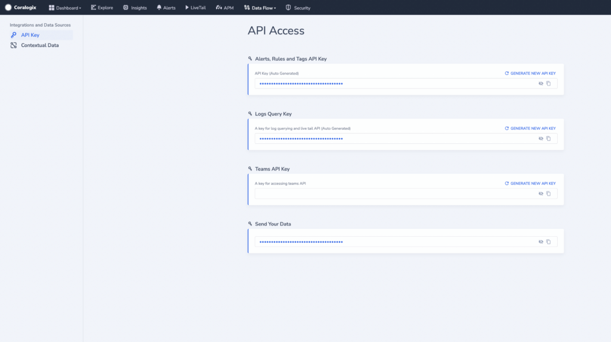

Coralogix provides an API that allows you to manage your [Send-Your-Data API keys](https://coralogixstg.wpengine.com/docs/send-your-data-api-key/).

## Prerequisites

- Coralogix Alerts, Rules and Tags AP Key. Access this in your navigation pane by clicking **Data Flow** > API Keys.



- Select a [Management API Endpoint](https://coralogixstg.wpengine.com/docs/management-api-endpoints/).

## Create a New 'Send Your Data' API Key

```
grpcurl -H "Authorization: Bearer <YOUR-API-KEY>" -d @ <CORALOGIX-DOMAIN> com.coralogix.apikeys.v1.ApiKeysManagementService/CreateKey <<EOF
{
  "key_name": "my-api-key",
  "roles": [{
    "id": 8
  }],
  "owner": {
    "team_id": {
      "id": 000000
    }
  }
}
EOF

```

### Request Args

| Field | Description |
| --- | --- |
| Key Name | Name of the key |
| Roles | Defines what roles this key will be assigned to. The only value that should be used is role id 8, which is a SendData role. |
| Owner | Defines who can be the owner of the key. The only available value at present is the team\_id. |

### Response

The response will be a message with information about the created key.

```
{
  "apiKey": {
    "keyId": {
      "value": "c8d84762-9aff-4f90-93ef-1762757e0c2c"
    },
    "keyName": "my-api-key",
    "isKeyActive": true,
    "keyValue": {
      "value": "<key_value>"
    },
    "dateCreated": "2023-03-30T10:00:58Z"
  }
}

```

| Field | Description |
| --- | --- |
| Key Id | ID of the key |
| Key Name | Assigned name to the key |
| Is Key Active | Defines if key is in active state |
| Key Value | Value of the key. For securely stored keys, this is the only time it will be visible. |
| Date Created | Creation date |

## Rename a 'Send Your Data' API Key

```
grpcurl -H "Authorization: Bearer <YOUR-API-KEY>" -d @ <CORALOGIX-DOMAIN> com.coralogix.apikeys.v1.ApiKeysManagementService/RenameKey <<EOF
{
    "key_id": {
        "value": "f0e68232-8bcc-4932-8e39-b320d74df9b1"
    },
    "new_key_name": "my-api-key-new-name"
}
EOF

```

### Request args

| Field | Description |
| --- | --- |
| Key Id | ID of the key |
| New Key Name | New name that will be correlated with the ke |

### Response

The response will be an empty message.

## Activate a 'Send Your Data' API Key

```
grpcurl -H "Authorization: Bearer <YOUR-API-KEY>" -d @ <CORALOGIX-DOMAIN> com.coralogix.apikeys.v1.ApiKeysManagementService/SetActive <<EOF
{
  "active": false,
  "key_id": {
    "value": "f0e68232-8bcc-4932-8e39-b320d74df9b1"
  }
}
EOF

```

### Request args

| Field | Description |
| --- | --- |
| Active | Defines if key should be active or not |
| Key Id | ID of the key |

### Response

The response will be an empty message.

## Delete a 'Send-Your-Data' API Key

```
grpcurl -H "Authorization: Bearer <YOUR-API-KEY>" -d @ <CORALOGIX-DOMAIN> com.coralogix.apikeys.v1.ApiKeysManagementService/DeleteKey <<EOF
{
  "key_id": {
    "value": "f0e68232-8bcc-4932-8e39-b320d74df9b1"
  }
}
EOF

```

### Request args

| Field | Description |
| --- | --- |
| Key Id | ID of the key |

### Response

The response will be an empty message.

## Get a 'Send Your Data' API Key

```
grpcurl -H "Authorization: Bearer <YOUR-API-KEY>" -d @ <CORALOGIX-DOMAIN> com.coralogix.apikeys.v1.ApiKeysManagementService/GetKeys <<EOF
{
  "role_id": {
    "id": 8
  },
  "owner": {
    "team_id": {
      "id": 000000
    }
  }
}
EOF

```

### Request args

| Field | Description |
| --- | --- |
| Role id | Defines role for which associated keys will be returned |
| Owner | Defines who is the owner of the keys |

### Response

The response will be an message with list of all API :

```
{
  "apiKeys": [
    {
      "keyId": {
        "value": "4863c538-2a47-4091-b90e-7088836ab569"
      },
      "keyName": "T4",
      "isKeyActive": true,
      "dateCreated": "2023-03-29T08:56:09Z"
    },
    {
      "keyId": {
        "value": "4ff895e6-7ef7-4828-97bc-7fa82e8ca47a"
      },
      "keyName": "T1",
      "isKeyActive": true,
      "keyValue": {
        "value": "cxtp_HRiXteLAhcxPQJY1ZPfYGdOhdQEd73"
      },
      "dateCreated": "2023-03-29T07:38:42Z"
    }
  ]
}

```

| Field | Description |
| --- | --- |
| Key Id | ID of the key |
| Key Name | Assigned name to the key |
| Is Key Active | Defines if key is in active state |
| Key Value | Optional value of the key. If key is stored securely, this field will not be sent. |
| Date Created | Creation date |

## Get a 'Send Your Data' API Key by ID

```
grpcurl -H "Authorization: Bearer <YOUR-API-KEY>" -d @ <CORALOGIX-DOMAIN> com.coralogix.apikeys.v1.ApiKeysManagementService/GetKeyById <<EOF
{
  "key_id": {
    "value": "4ff895e6-7ef7-4828-97bc-7fa82e8ca47a"
  }
}
EOF

```

### Request args

| Field | Description |
| --- | --- |
| Key ID | ID of the key |

### Response

The response will be an message with API key information:

```
{
  "apiKey": {
    "keyId": {
      "value": "4ff895e6-7ef7-4828-97bc-7fa82e8ca47a"
    },
    "keyName": "key1",
    "isKeyActive": true,
    "keyValue": {
      "value": "<key_value>"
    },
    "dateCreated": "2023-03-29T07:38:42Z"
  }
}

```

| Field | Description |
| --- | --- |
| Key Id | ID of the key |
| Key Name | Assigned name to the key |
| Is Key Active | Defines if key is in active state |
| Key Value | Optional value of the key. If key is stored securely, this field will not be sent. |
| Date Created | Creation date |

## **Support**

**Need help?**

Our world-class customer success team is available 24/7 to walk you through your setup and answer any questions that may come up.

Feel free to reach out to us **via our in-app chat** or by sending us an email at **[support@coralogixstg.wpengine.com](mailto:support@coralogixstg.wpengine.com)**.
