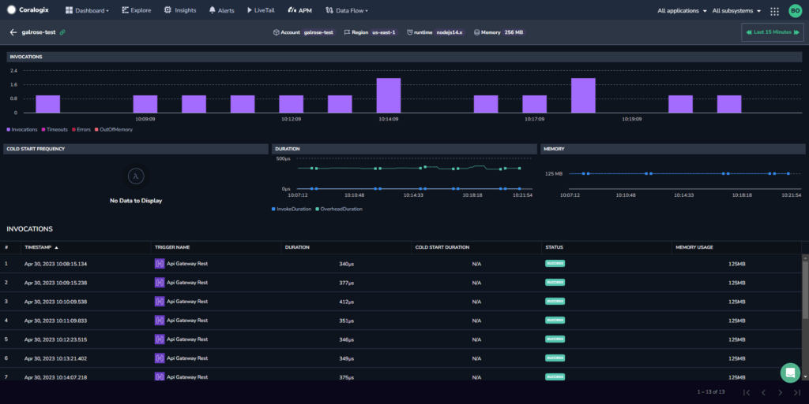
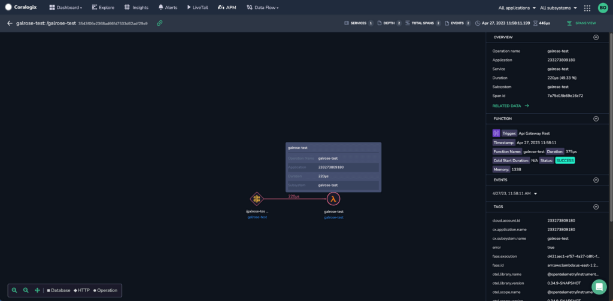

Our **Serverless Monitoring** feature provides customers using the [Coralogix AWS Lambda Telemetry Exporter](https://coralogixstg.wpengine.com/docs/coralogix-aws-lambda-telemetry-exporter/) with the ability to better control and understand your Lambda servers on both macro and granular levels.

## Feature

For each Lambda function, view its triggers, the AWS account to which the function belongs, region, runtime, invocations, errors, timeouts, last invocation, average latency, and whether the function is out of memory.

## Prerequisites

In order to monitor AWS Lambda functions using our [Serverless Monitoring](https://coralogixstg.wpengine.com/docs/serverless-monitoring/) feature, you are required to follow these steps.

**STEP 1**. Set up [Coralogix AWS Resource Metadata Collection](https://coralogixstg.wpengine.com/docs/aws-resource-metadata-collection/).

**STEP 2**. You have two options for Lambda monitoring; choose one.

- Set up Lambda monitoring to get **full telemetry**, including traces. This is available for Node.js and Python (v3.8 or newer). View the relevant documentation [here](https://coralogixstg.wpengine.com/docs/aws-lambda-auto-instrumentation/).

- Set up Lambda monitoring to get only **basic telemetry**, including logs, or to select other runtimes. With this option, you are only required to set up the Coralogix AWS Lambda Telemetry Exporter. View the relevant documentation [here](https://coralogixstg.wpengine.com/docs/coralogix-aws-lambda-telemetry-exporter/).

## Access the Serverless Tab

**STEP 1.** From your navigation pane, click **APM.** Select the **Serverless** tab.

**STEP 2.** Select the timeframe for which you want to view information.

**STEP 3.** Select a function to view the drill down.

## Drill Down

Clicking on a specific function provides you with more in-depth information about it.

The drill down shows the metadata of the Lambda function being examined, including several graphs, as well as the breakdown of when the function was triggered and how.

### Invocations

The INVOCATIONS graph presents an aggregative breakdown of how often the function was triggered. Each bar in the graph shows the number of invocations, errors, and timeouts for a segment of time (the exact length of time is calculated dynamically depending on the time range shown).

### Cold Start Frequency

The COLD START FREQUENCY graph presents you the frequency of cold starts over time. Cold starts occur when the function is triggered and has to start from scratch (in contrast with invocations where the function is woken up from a sleep state).

### Duration

The DURATION graph presents you with the length of time a function ran. It includes both invoked Lambdas and cold starts and allows you to see the time taken for each.

### Memory

The MEMORY graph presents how much memory was used by the triggered Lambda function.

## Related Data

Clicking on a specific invocation of the Lambda function brings you to the Related Data page. This page shows the Lambda function together with the chain of actions that occurred before and after it was triggered.

The left-hand pane presents the trace view, while the right-hand pane presents information about the Lambda function (such as triggers, resources, events, logs, tags, etc.).

## Additional Resources

<table><tbody><tr><td>Documentation</td><td><strong><a href="https://coralogixstg.wpengine.com/docs/aws-lambda-auto-instrumentation/">AWS Lambda Auto Instrumentation</a> <a href="https://coralogixstg.wpengine.com/docs/coralogix-aws-lambda-telemetry-exporter/">Coralogix AWS Lambda Telemetry Exporter</a> <a href="https://coralogixstg.wpengine.com/docs/aws-resource-metadata-collection/">Coralogix AWS Resource Metadata Collection</a> <a href="https://coralogixstg.wpengine.com/docs/aws-lambda-opentelemetry-wrappers/">AWS OpenTelemetry Wrappers</a></strong></td></tr></tbody></table>

## Support

**Need help?**

Our world-class customer success team is available 24/7 to walk you through your setup and answer any questions that may come up.

Feel free to reach out to us **via our in-app chat** or by sending us an email at [support@coralogixstg.wpengine.com](mailto:support@coralogixstg.wpengine.com).
