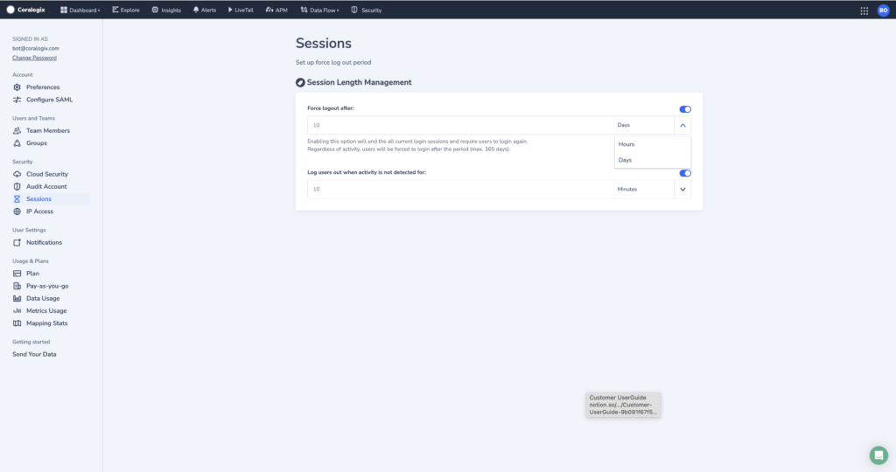
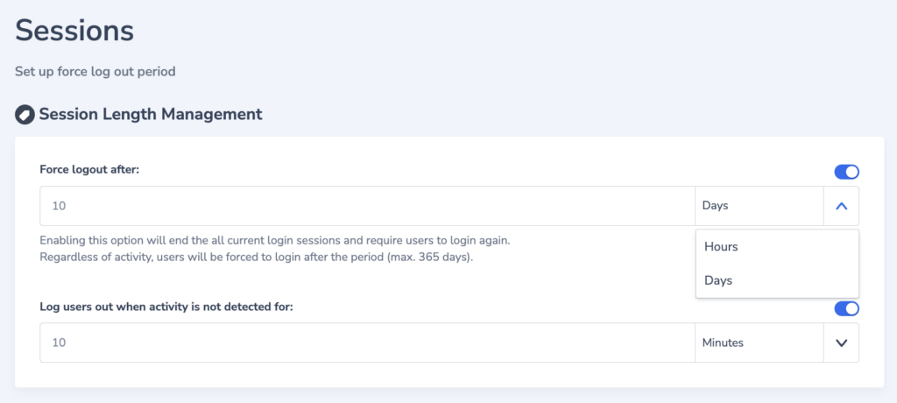

As part of their [user management](https://coralogixstg.wpengine.com/docs/user-team-management/), team administrators can define the duration of idle sessions for all team members. Enabling this option will end all current login sessions after a period of time and require users to log in again.

## Access Session Length Management Settings

**STEP 1**. Access your **settings** in the upper-right hand corner of your Coralogix dashboard.

**STEP 2**. In the left-hand sidebar, in the **Security** section, select **Sessions**.

## Manage Settings

Admins have the option of activating up to two states using toggle buttons.

- **Force logout**. Enabling this option will end all of the current login sessions and require users to login again. Regardless of activity, users will be required to log in after a period of time, which can be set in hours or days.

- **Log users out when activity is not detected**. Enabling this option will end the current login session for any user whose activity has not been detected for a period of time, which can be set in minutes or hours.

Find out more about team and user management [here](https://coralogixstg.wpengine.com/docs/user-team-management/).

## Additional Resources

<table><tbody><tr><td>Documentation</td><td><strong><a href="https://coralogixstg.wpengine.com/docs/user-team-management/">Team &amp; User Management</a></strong></td></tr></tbody></table>

## Support

**Need help?**

Our world-class customer success team is available 24/7 to walk you through your setup and answer any questions that may come up.

Feel free to reach out to us **via our in-app chat** or by sending us an email at [support@coralogixstg.wpengine.com](mailto:support@coralogixstg.wpengine.com).
