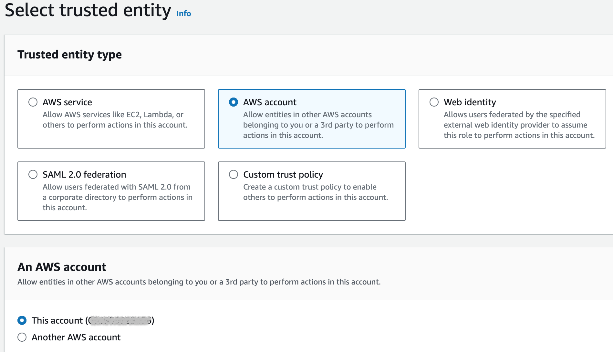
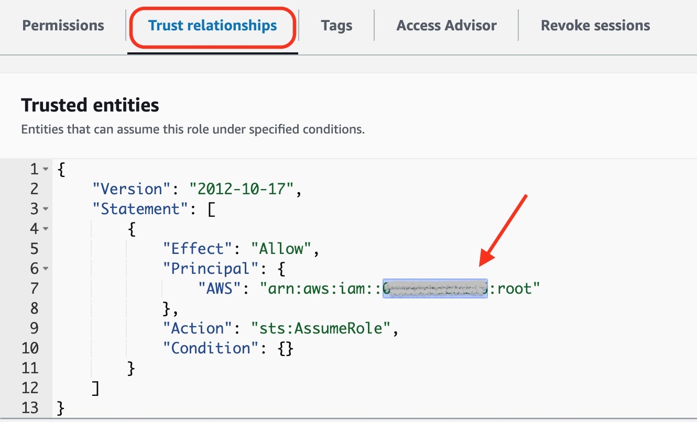
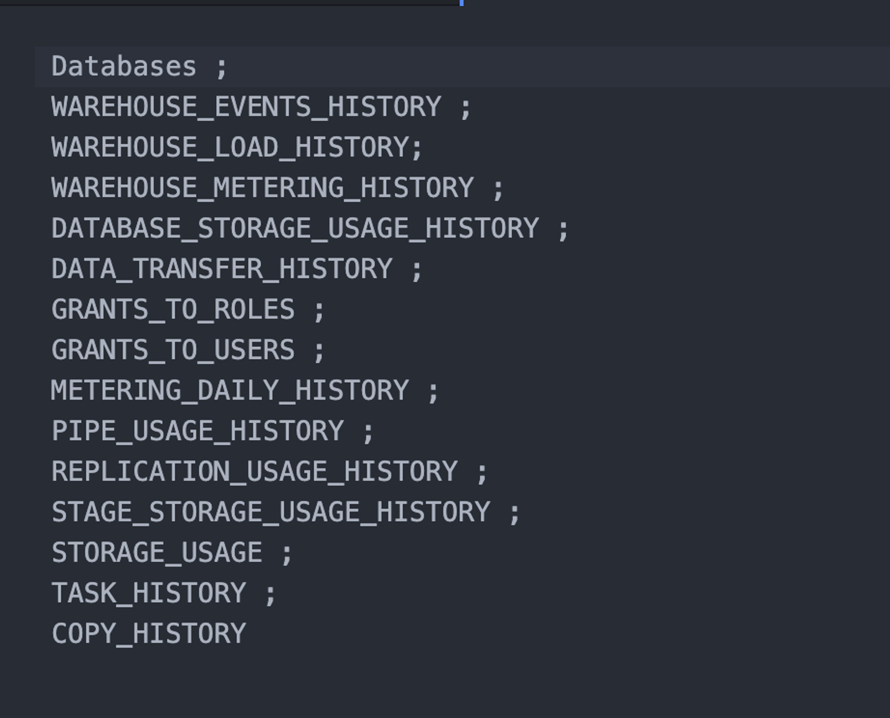
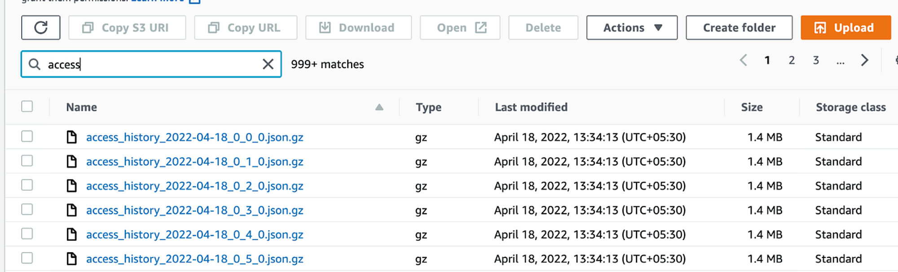
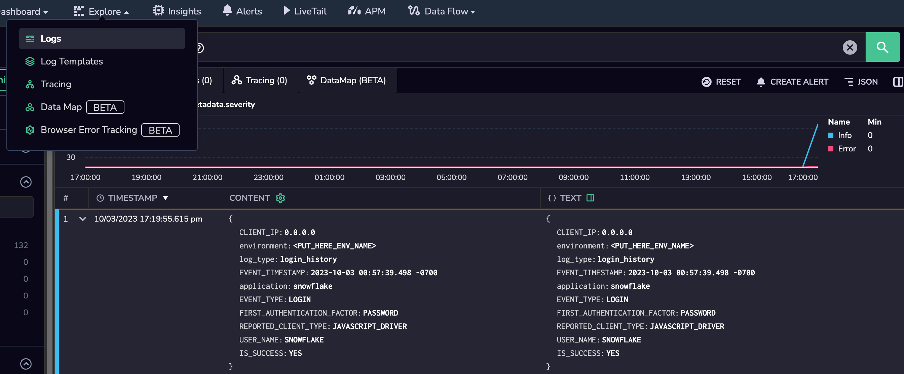

This tutorial demonstrates how to centralize logging for **Snowflake** by sending your logs to Coralogix.

## Overview

[Snowflake](https://www.snowflake.com/en/) is a cloud-based data warehousing platform. Designed for storing, processing, and analyzing large volumes of data, it provides a data warehousing service that is highly scalable, allowing organizations to store and query data efficiently in the cloud.

Snowflake does not have direct built-in integration with Coralogix to export the logs and audit related data. This step-by-step guide will teach you how to set up an AWS S3 bucket, to which you can export your Snowflake logs and audit data. Coralogix then ingests the data and presents it for optimized visualization and analysis in our platform.


## **Prerequisites**

- AWS S3 bucket [created](https://docs.aws.amazon.com/AmazonS3/latest/userguide/creating-bucket.html)

- For those wishing to run all below script via commands, SnowSQL (the command line interface for Snowflake) installed

- **ACCOUNTADMIN** role to execute all below commands

## Send Snowflake Data to Your S3 Bucket

### Upload Data to the S3 Bucket

**STEP 1**. Create an IAM policy.

Configure access permissions for your S3 bucket by following Step 1 [here](https://docs.snowflake.com/en/user-guide/data-load-s3-config-storage-integration.html) to create IAM policy now create an IAM role which will be used by Snowflake to unload data into S3 bucket.

**STEP 2**. Configure an IAM role.

- In your AWS account, navigate to IAM > Roles > Create role.

- Select AWS account and select **This account**, regardless of account ID.



- Leave the remaining settings unchanged.

**STEP 3**. Create an S3 storage integration.

```
create or replace storage integration s3_integration
  type = external_stage
  storage_provider = s3
  enabled = true
  storage_aws_role_arn = '<PUT_HERE_AWS_ROLE_ARN>'
  storage_allowed_locations = ('<PUT_HERE_AWS_S3_BUCKET_PATH>');

```

**STEP 4**. Create a JSON file format.

```
create or replace file format my_json_format
  type = json
  COMPRESSION = 'gzip'
  null_if = ('NULL', 'null');

```

**STEP 5**. Create an S3 stage.

```
use database '<PUT_HERE_DB_NAME>';
use schema '<PUT_HERE_DB_SCHEMA_NAME_TO_USE>';
create or replace stage my_s3_stage
 storage_integration = s3_integration
 url = '<PUT_HERE_AWS_S3_BUCKET_PATH>'
 file_format = my_json_format;

```

**STEP 6.** To get your snowflake Account ID, run this command:

```
DESC INTEGRATION s3_integration;

```

- Under STORAGE\_AWS\_IAM\_USER\_ARN, you will find your snowflake account ID.

- In the role created in [STEP 1](#UploadDatatotheS3Bucket), under the **Trust relationships** tab, edit the account ID by changing it to your snowflake account ID.



**STEP 6**. Execute an unload command to push data from tables to stage and in turn to AWS S3.

```
use database ‘<PUT_HERE_DB_NAME>’;
use WAREHOUSE ‘<PUT_HERE_WAREHOUSE_NAME>’;copy into@my_s3_stage/login_history from (SELECT OBJECT_CONSTRUCT(‘application’, ‘snowflake’ ,’environment’, ‘<PUT_HERE_ENV_NAME>’, ‘log_type’, ‘login_history’, ‘EVENT_TIMESTAMP’, EVENT_TIMESTAMP, ‘EVENT_TYPE’, EVENT_TYPE, ‘USER_NAME’, USER_NAME, ‘CLIENT_IP’, CLIENT_IP, ‘REPORTED_CLIENT_TYPE’, REPORTED_CLIENT_TYPE, ‘FIRST_AUTHENTICATION_FACTOR’,FIRST_AUTHENTICATION_FACTOR, ‘IS_SUCCESS’, IS_SUCCESS, ‘ERROR_CODE’, ERROR_CODE, ‘ERROR_MESSAGE’, ERROR_MESSAGE) from snowflake.account_usage.Login_history) FILE_FORMAT = (TYPE = JSON) ;copy into@my_s3_stage/access_history from (SELECT OBJECT_CONSTRUCT(‘application’, ‘snowflake’ ,’environment’, ‘<PUT_HERE_DB_NAME>’, ‘log_type’, ‘access_history’, ‘QUERY_START_TIME’,QUERY_START_TIME, ‘USER_NAME’, USER_NAME, ‘DIRECT_OBJECTS_ACCESSED’,DIRECT_OBJECTS_ACCESSED, ‘BASE_OBJECTS_ACCESSED’, BASE_OBJECTS_ACCESSED, ‘OBJECTS_MODIFIED’, OBJECTS_MODIFIED) from snowflake.account_usage.Access_History ) FILE_FORMAT = (TYPE = JSON);

```

**Notes**:

- The above scripts the `copy into` command to unload / extract data from various tables like _login\_history,_ _access\_history_, _query\_history_, _sessions_, etc.

- This example uses `OBJECT_CONSTRUCT` to selectively get data from columns and to add that against the specified name while preparing a Json formatted file.

- \[**Recommended**\] To gain a better understanding and visibility into the logs, add custom data while unloading data from tables to JSON format. In the above script, application, environment and log\_type tags in the JSON have been added, allowing for categorization of logs by environment.

**STEP 6**. \[**Optional**\] Repeat and write scripts for all below tables in which Snowflake stores logs and audit related data.

All these tables and views are present in the **snowflake.account\_usage** schema.



### Validation

Once the above commands are run, you should see logs files created in your S3 bucket.



## Send Data From Your S3 Bucket to Coralogix

Coralogix provides multiple methods in which you can collect logs from Amazon S3. Send us your CloudTrail data from your Amazon S3 bucket using an **AWS Lambda function**, with one of two event-driven design patterns:

- Invoke the Lambda **directly through an S3 event**

- Send the S3 event to a **Simple Notification Service (SNS)** queue, which in turn triggers the Lambda

Use any of our [customized log collection options](https://coralogixstg.wpengine.com/docs/amazon-s3-data-collection-options/) to allow Coralogix to ingest the logs stored in your Amazon S3 bucket and process them for further analysis and monitoring.

## Validation

In your Coralogix toolbar, navigate to **Explore** > **Logs**. View your logs in your Coralogix dashboard.



## Additional Resources

<table><tbody><tr><td>Documentation</td><td><a href="https://coralogixstg.wpengine.com/docs/guide-first-steps-coralogix/"><strong>Getting Started with Coralogix</strong></a><br><strong><a href="https://coralogixstg.wpengine.com/docs/coralogix-features-tour/">Coralogix Features Tour</a></strong></td></tr></tbody></table>

## Support

**Need help?**

Our world-class customer success team is available 24/7 to walk you through your setup and answer any questions that may come up.

Feel free to reach out to us **via our in-app chat** or by sending us an email at [support@coralogixstg.wpengine.com](mailto:support@coralogixstg.wpengine.com).
