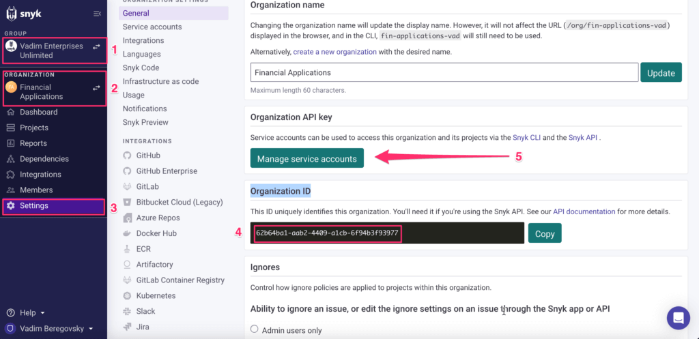
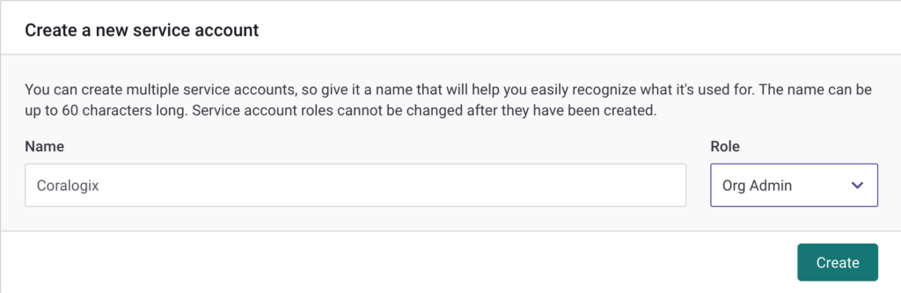
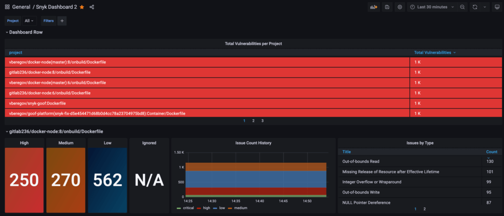

This tutorial demonstrates how to conduct [Snyk](https://snyk.io/) vulnerability monitoring with Coralogix by exporting Snyk's security testing data using [Prometheus](https://coralogixstg.wpengine.com/docs/prometheus/).

## Overview

This Docker was designed by the LunarTech team and was written in Go. This exporter enables you to automatically export Snyk’s security testing data into Prometheus by scraping [Snyk’s API](https://snyk.docs.apiary.io/#)**.**

## Prerequisites

- Active [Snyk account](https://snyk.io/)

## Snyk Setup

You are required to obtain your **Organization ID** and **Organization API key** in your Synk UI.

**To obtain your Organization ID**:

**STEP 1**. In your left-hand sidebar, select your Synk Group.

**STEP 2**. Select your Snyk Organization.

**STEP 3**. Navigate to **Settings**.

**STEP 4**. Copy your Organization ID.



**To access your Organization API key**:

**STEP 5**. Complete **STEPS 1-4** above, then click **Manage service accounts**.

**STEP 6**. Create a new service account and token for Coralogix.

- Input **Name** & **Role**.

- Click **Create**.



**STEP 7**. Copy the Organization API key.

## Configuration

**STEP 1**. Run the docker command with the following arguments:

```
docker run -p9532:9532 [quay.io/lunarway/snyk_exporter](<http://quay.io/lunarway/snyk_exporter>) --snyk.api-token 'API TOKEN' --log.level="info" --snyk.organization='ORG ID’

```

The output should appear as follows:

```
time="2023-04-25T18:45:37Z" level=info msg="Starting Snyk exporter for organization '62b64ba1-aab2-4409-a1cb-6f94b3f93977'" source="main.go:67"
time="2023-04-25T18:45:37Z" level=info msg="Listening on :9532" source="main.go:111"
time="2023-04-25T18:45:37Z" level=info msg="Snyk API scraper starting" source="main.go:140"
time="2023-04-25T18:45:37Z" level=info msg="Running Snyk API scraper for organizations: Financial Applications" source="main.go:174"
time="2023-04-25T18:45:37Z" level=info msg="Collecting for organization 'Financial Applications'" source="main.go:196"

```

The Docker output should appear as follows:

```
time="2023-04-25T18:52:54Z" level=info msg="Recorded 585 results for organization 'Financial Applications'" source="main.go:205"
time="2023-04-25T18:52:54Z" level=info msg="Exposing 585 results as metrics" source="main.go:216"

```

**STEP 2**. Update **Prometheus RemoteWrite** by following [these instructions](https://coralogixstg.wpengine.com/docs/prometheus/).

```
remote_write:
- url: <endpoint>
  name: '<customer_name>'
  remote_timeout: 120s
  bearer_token: '<Send_Your_Data_private_key>'

```

- `url`: Select a **Prometheus RemoteWrite** [endpoint URL](https://coralogixstg.wpengine.com/docs/coralogix-endpoints/) for the domain associated with your Coralogix account

- `name`: Name of the timeseries

- `bearerToken`: Your Coralogix [Send-Your-Data API key](https://coralogixstg.wpengine.com/docs/send-your-data-api-key/)

## Validation

**STEP 1**. Access the Coralogix Grafana instance to ensure metrics are being published and scraped. Query the **snyk\_vulnerabilities\_total** metric.

**STEP 2**. Install the [Grafana Snyk dashboard](https://github.com/vberegov/snyk-grafana/blob/main/snyk.json) to obtain an overview of the data.



## Additional Resources

<table><tbody><tr><td><strong>Documentation</strong></td><td><a href="https://coralogixstg.wpengine.com/docs/prometheus/">Prometheus</a></td></tr></tbody></table>

## Support

**Need help?**

Our world-class customer success team is available 24/7 to walk you through your setup and answer any questions that may come up.

Feel free to reach out to us **via our in-app chat** or by sending us an email at [support@coralogixstg.wpengine.com](mailto:support@coralogixstg.wpengine.com).
