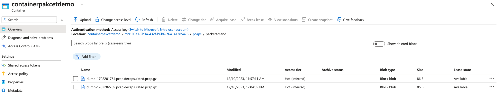
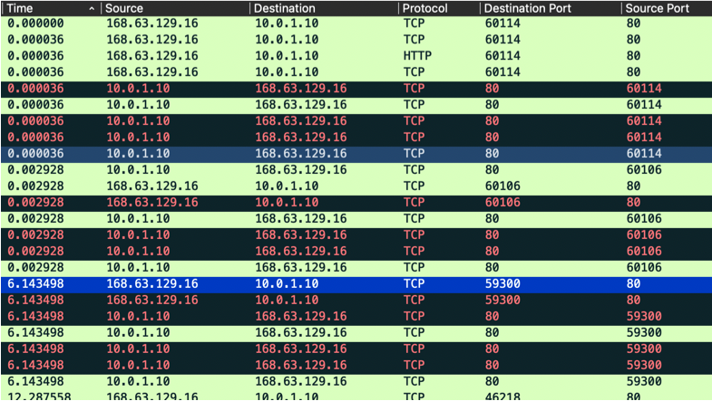

Take advantage of the **Coralogix STA** to store packets captured by the feature as compressed PCAP files, available for after-the-fact investigations of your data.

## Overview

Coralogix [Security Traffic Analyzer](https://coralogixstg.wpengine.com/docs/coralogix-sta-virtual-tap/) (STA) can store compressed PCAP files containing captured packets. This feature proves indispensable for conducting comprehensive post-event investigations. During deployment, users can designate storage destinations, such as an S3 bucket in AWS, facilitating the seamless upload of captured packets to the specified repository.

The significance of capturing traffic lies in its diverse applications, including the ability to monitor and track suspicious network activities. For example, users can pinpoint potential threats by scrutinizing specific database activities indicated by port numbers. Moreover, the meticulous tracking of network traffic addresses regulatory and auditory compliance requirements.

This tutorial guides you through setting up the Coralogix STA to capture and store packets effectively.

## Configuration

### Upon Deployment

The following examples specify storage for the packets in a Terraform installation:

**Azure**

```
...
Azure-StorageAccountPackets   = "stapacketdemo"
Azure-StorageContainerPackets = "containerpakcetdemo"
...
```

**AWS**

```
...
STA-PacketsS3BucketRequired         = false
STA-PacketsS3Bucket                 = ""
...
```

Notes:

- If the **STA-PacketsS3BucketRequired** variable is set to true, the provided bucket will be used to save the network packets.

- The stack will create one if no bucket is provided in the **PacketsS3Bucket** variable.

### On a Running STA

You may configure the storage after STA installation by adding the storage name to the sta.conf file, as follows:

```
"upload_pcaps_to": "https://stapacketdemo.blob.core.windows.net/containerpakcetdemo"
```

## Filtering the Traffic

Due to the large volume of traffic usually observed by the STA, it is recommended to utilize a filter pre-capture. This is done by editing and uploading the sta.conf file.

The STA uses the BPF filter method to sniff traffic matching the provided filter.

To add a BPF filter, add the field named `capturing_bpf_filter` with the wanted filter. Find out more [here](https://biot.com/capstats/bpf.html).

The following example presents a part of a **sta.conf** file, when using a storage bucket to capture only port 80:

```
...
"upload_pcaps_to": "https://stapacketdemo.blob.core.windows.net/containerpakcetdemo",
"sync_config_from": "https://stastoragedemo.blob.core.windows.net/stacontainerdemo",
"capturing_bpf_filter": "port 80",
...
```

**Notes**:

- The above filter allows the STA to sniff packets with source or destination port 80 and upload them to the storage bucket specified for the packets.

- After editing and reuploading the **sta.conf** file, run the following command:

```
sta-force-sync-configs
```

## Accessing the Files

Once the storage is configured to store the packets, they will be uploaded as zipped PCAP files.



After applying the filter, the traffic will be captured accordingly (using Wireshark):



**Notes**:

- Ensure the file format validation of the configuration file. If the file is in JSON format, ensure it is valid before uploading it back to the STA.

- To **stop** **capturing** traffic, leave the field with an empty value: `"upload_pcaps_to": ""`.

- To **stop** **filtering** and continue capturing all traffic, leave the filter field with an empty value: `"capturing_bpf_filter": ""`.

## Support

**Need help?**

Our world-class customer success team is available 24/7 to walk you through your setup and answer any questions that may come up.

Feel free to reach out to us **via our in-app chat** or by emailing [support@coralogixstg.wpengine.com](mailto:support@coralogixstg.wpengine.com).
