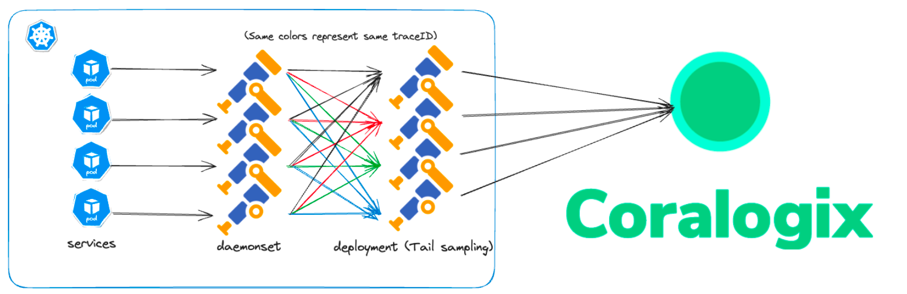

Are you looking for a way to improve traces observability without breaking the bank? Look no further!

In our [previous tutorial](https://coralogixstg.wpengine.com/blog/configure-otel-demo-send-telemetry-data-coralogix/), we showed you how to set up the new [OpenTelemetry Community Demo Application](https://github.com/open-telemetry/opentelemetry-demo) and send telemetry data to [Coralogix](https://coralogixstg.wpengine.com/), giving you the ability to understand the interactions between your services and visualize, alert and query them on your Coralogix dashboard.

_But what about cost?_ Ingesting all of your traces and spans can quickly add up and can be unnecessary in order to gain visibility into the health of your applications. That’s where **trace** **sampling** comes in - in particular, **tail sampling.**

By sampling your traces, you can significantly reduce the amount of data ingested into Coralogix, maintaining full visibility into your services without incurring heavy charges. Try it out with the OTel Demo App.

## Intro

Coralogix offers a number of tutorials demonstrating how to use the OTel Collector in a [load-balanced configuration](https://github.com/open-telemetry/opentelemetry-collector-contrib/blob/main/exporter/loadbalancingexporter/README.md) with [tail sampling enabled](https://github.com/open-telemetry/opentelemetry-collector-contrib/blob/main/processor/tailsamplingprocessor/README.md) on the collector nodes using the [OTel Demo App](https://github.com/open-telemetry/opentelemetry-demo).

The [tail sampling processor](https://github.com/open-telemetry/opentelemetry-collector-contrib/blob/main/processor/tailsamplingprocessor/README.md) and [probabilistic sampling processor](https://github.com/open-telemetry/opentelemetry-collector-contrib/blob/main/processor/probabilisticsamplerprocessor/README.md) allow you to sample traces based on a set of rules at the collector level.

This allows you to define more advanced rules to keep accrued visibility over error or high latency traces.

Note: To achieve this in your environment your code should be [instrumented with OpenTelemetry](https://opentelemetry.io/docs/instrumentation/) and emit the telemetry data to the OTel Collector.

## **What is Tail Sampling? Why is it Important?**

Tail sampling is a method of trace sampling in which sampling decisions are made at the _end_ of the workflow, allowing for a more accurate sampling decision. This is in contrast to head-based sampling, in which the the sampling decision is made at the _beginning_ of a request and usually at random. Tail sampling grants you the option of filtering your traces based on specific criteria, a plus when compared with head-based sampling.

So why is tail sampling important, and why should you do it?

- **Enjoy** f**ocused observability**. Tail sampling is a powerful tool for focused observability, allowing you to zero in on the traces that matter to you most. View only those traces that are of interest to you.

- **Identify issues**. Tail sampling is useful for identifying issues in your distributed system while saving on observability costs.

- **Save on costs**. By selectively exporting a predetermined subset of your traces, you can lower data ingestion and storage costs, while still being able to identify and troubleshoot issues.

## Tutorials

Choose one of tutorials below to use the OTel Collector in a [load balanced configuration](https://github.com/open-telemetry/opentelemetry-collector-contrib/blob/main/exporter/loadbalancingexporter/README.md) with [tail sampling enabled](https://github.com/open-telemetry/opentelemetry-collector-contrib/blob/main/processor/tailsamplingprocessor/README.md) on the collector nodes, using the OTel Demo:

- [Tail Sampling with Coralogix and Otel Using Docker](https://coralogixstg.wpengine.com/docs/tail-sampling-with-opentelemetry-using-docker/)

- [Tail Sampling with Coralogix and Otel Using Kubernetes](https://coralogixstg.wpengine.com/docs/tail-sampling-with-opentelemetry-using-kubernetes/)

## Additional Resources

<table><tbody><tr><td><strong>Documentation</strong></td><td><a href="https://coralogixstg.wpengine.com/docs/opentelemetry/">OpenTelemetry</a></td></tr><tr><td><strong>Tutorials</strong></td><td><a href="https://coralogixstg.wpengine.com/docs/tail-sampling-with-opentelemetry-using-docker/">Tail Sampling with Coralogix and Otel Using Docker</a> <a href="https://coralogixstg.wpengine.com/docs/tail-sampling-with-opentelemetry-using-kubernetes/">Tail Sampling with Coralogix and Otel Using Kubernetes</a></td></tr><tr><td><strong>Videos</strong></td><td><a href="https://www.youtube.com/watch?v=nJcYQQF4qH0&amp;ab_channel=Coralogix">Integrate Traces into Coralogix using Otel, Kubernetes, &amp; Helm</a> <a href="https://www.youtube.com/watch?v=GWggKh4ny30&amp;ab_channel=Coralogix">Capture Kubernetes Logs, Transform with Logs2Metrics, and Render with DataMap</a></td></tr></tbody></table>

## **Support**

**Need help?**

Our world-class customer success team is available 24/7 to walk you through your setup and answer any questions that may come up.

Feel free to reach out to us **via our in-app chat** or by sending us an email at [support@coralogixstg.wpengine.com](mailto:support@coralogixstg.wpengine.com).
