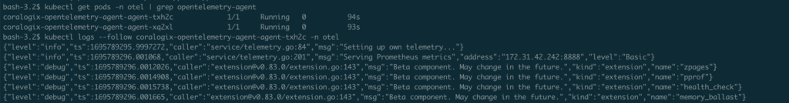
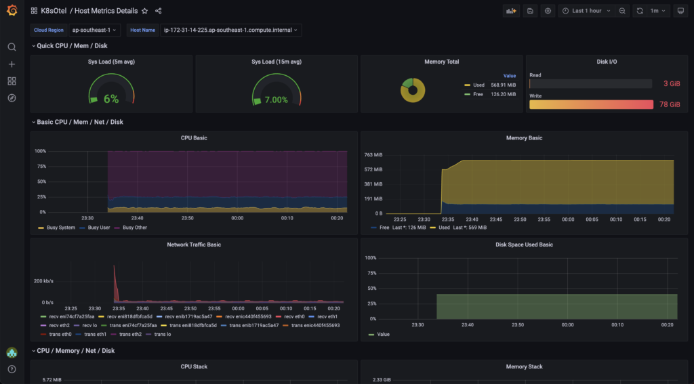
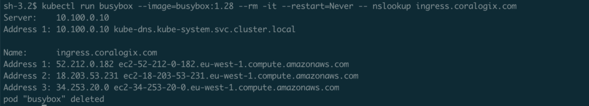

Troubleshoot any issues with the setup or configuration of [Kubernetes Observability using OpenTelemetry](https://coralogixstg.wpengine.com/docs/introduction-to-kubernetes-observability-using-opentelemetry/).

## Overview

Once you have completed the installation process for the [OpenTelemetry Integration](https://github.com/coralogix/telemetry-shippers/tree/master/otel-integration/k8s-helm) chart and instrumented applications, your telemetry data may not appear in your Coralogix account. This could indicate one of the following scenarios:

- The Helm installation has failed due to an error or that your installation is unsuccessful.

- Your application has not been configured to send data to Coralogix via this container.

This tutorial will guide you on how to efficiently troubleshoot these issues.

## OpenTelemetry Agent

In order to find the source of the problem, we recommend you take a number of steps, including troubleshooting your **OpenTelemetry Agent logs** and sending sample telemetry. If the demo works successfully, the problem lies in the configuration of your application. If the demo fails to work, the problem lies in the configuration of the collector. You will find tools to solve both of these issues below.

### **OpenTelemetry Agent Logs**

**STEP 1**. Following installation, expect Kubernetes to run a pod with your chosen installation name. Ensure this is the case by running the following command:

```
kubectl get pods -o wide -n $NAMESPACE | grep opentelemetry-agent

```

**STEP 2**. Locate and copy the full name of the OpenTelemetry collector agent in your list of pods. The pod should appear exactly once with the STATUS “**Running**.” If the STATUS is “**Pending**”, rerun the command. The AGE appearing should be the time that has elapsed since your last HELM upgrade.

**STEP 3**. Once you have located this specific pod, use the default logging tool command `kubectl logs` for retrieving its logs. Running this command with the `--follow` flag streams logs from the specified resource, allowing you to live tail its logs from your terminal.

```
kubectl logs --follow <paste full name of opentelemtry collector agent pod here> -n <namespace>

```

Here is an example of the expected output of **STEPS 1-3**:



**STEP 4**. Rerun this set of commands at any later stage as necessary.

### OpenTelemetry **Cluster Collector**

Your Kubernetes Dashboard may not be receiving data or may be giving an incomplete view (e.g. Kubernetes events missing). In order to solve the issue, take the following steps.

**STEP 1**. Check that the OpenTelemetry Agent and OpenTelemetry Cluster Collector pods have a `Running` status in your cluster. If not, retrieve and troubleshoot the logs.

```
> kubectl get pods -o wide -n $NAMESPACE
NAME                                                  READY   STATUS    RESTARTS   AGE   IP              NODE                                               NOMINATED NODE   READINESS GATES
coralogix-opentelemetry-agent-jhl6q                   1/1     Running   0          43m   172.31.27.209   ip-172-31-27-209.ap-southeast-1.compute.internal   <none>           <none>
coralogix-opentelemetry-collector-84d684d45c-2h4rt    1/1     Running   0          43m   172.31.31.122   ip-172-31-27-209.ap-southeast-1.compute.internal   <none>           <none>
otel-integration-kube-state-metrics-bbc57cd9b-9kgrp   1/1     Running   0          43m   172.31.18.170   ip-172-31-27-209.ap-southeast-1.compute.internal   <none>           <none>

```

**STEP 2**. Ensure that the **Kubernetes OpenTelemetry** extension package in your Coralogix account has been installed with the **Latest Version** and all relevant **Applications** and **Subsystems** are selected.

**STEP 3**. Explore any missing data from the **Kubernetes OpenTelemetry** extensions, including Grafana Dashboards:

- In your Coralogix toolbar, navigate to **Grafana** > **Dashboards** > **Manage**. Under the **K8sOtel** folder, explore the installed dashboards.

- Any graph or panel showing “**No data”** indicates missing data. This could mean one of two things:
    - Problem with exporting telemetry from the collectors.
    
    - Misconfiguration of the components on the collector.



## Validate Your Endpoints

Validating your [Coralogix Endpoints](https://coralogixstg.wpengine.com/docs/coralogix-endpoints/) will allow you to test the connectivity in your domain structure from the Kubernetes cluster.

The following `kubectl` command creates a temporary `busybox` pod, which executes the `nslookup` command to the endpoint and outputs the results:

```
kubectl run busybox --image=busybox:1.28 --rm -it --restart=Never -- nslookup <endpoint>

```

Here is an example of the expected results for an endpoint in the EU1 region:



If you receive an error, this may mean that your cluster lacks connectivity to the domain server.

## Collector **Configuration Issues**

If the OpenTelemetry Integration chart exhibits unexpected behaviour, incorrect telemetry is being sent, or there is a failure when installing via Helm, this may indicate that the contents of the `values.yaml` file do not match the expected structure found in the [default values file](https://github.com/coralogix/telemetry-shippers/blob/master/otel-integration/k8s-helm/values.yaml), or the Helm templating has failed to override the [default values](https://github.com/coralogix/telemetry-shippers/blob/master/otel-integration/k8s-helm/values.yaml) as expected for the changes made.

These are some troubleshooting tips to help resolve the issue.

**STEP 1**. Refer to and compare your configurations with the default [values.yaml](https://github.com/coralogix/telemetry-shippers/blob/master/otel-integration/k8s-helm/values.yaml) file of the OpenTelemetry Integration chart.

**STEP 2**. View how the configurations have been overridden by extracting the deployed ConfigMaps manifests.

- Run the following to get a list of ConfigMaps:

```
> kubectl get configmap -n $NAMESPACE
NAME                                DATA   AGE
coralogix-opentelemetry-agent       1      4d
coralogix-opentelemetry-collector   1      4d
kube-root-ca.crt                    1      118d

```

- Extract either of the ConfigMap Manifests with the following:

```
kubectl get configmap -n otel -o yaml coralogix-opentelemetry-agent
kubectl get configmap -n otel -o yaml coralogix-opentelemetry-collector

```

Read more about [Helm Values Files](https://helm.sh/docs/chart_template_guide/values_files/) to get additional information on the underlying Helm values templating.

## Next Steps

Check out these Kubernetes Observability using OpenTelemetry [FAQs](https://coralogixstg.wpengine.com/docs/faqs-kubernetes-observability-using-opentelemetry/).

## Support

**Need help?**

Our world-class customer success team is available 24/7 to answer any questions that may come up.

Feel free to reach out to us **via our in-app chat** or by sending us an email at [support@coralogixstg.wpengine.com](mailto:support@coralogixstg.wpengine.com)
