**User Sessions** provides valuable insights into user experience by tracking and analyzing how users interact with your web applications. Use this tutorial to learn what user sessions are, how to use them effectively, and how they can enhance your [Real User Monitoring](https://coralogixstg.wpengine.com/docs/real-user-monitoring/) (RUM) capabilities.

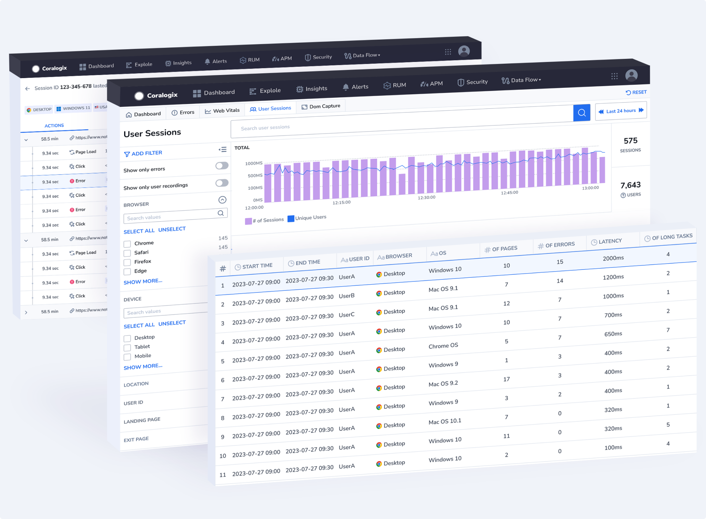

## Benefits

User Sessions offer the following benefits:

- **Performance Insights**. Monitor the performance of your web applications by analyzing user sessions in real-time. Identify slow page loads, errors, and other performance bottlenecks affecting user experience.

- **User Engagement.** Track user behavior to understand how users navigate within your application. Analyze user paths, actions, and interactions.

- **Issue Resolution.** Quickly detect and diagnose issues through session data and metrics. Prioritize and resolve performance problems that impact user satisfaction.

- **Data-Driven Decisions.** Make informed decisions based on user behavior and session data. Optimize your application for improved user experience.

## Key Concepts

- **User Sessions** refer to a sequence of user interactions in a web application within a defined time frame. Each view is associated with a **`session_id`**, allowing you to consolidate actions or other elements in one session.

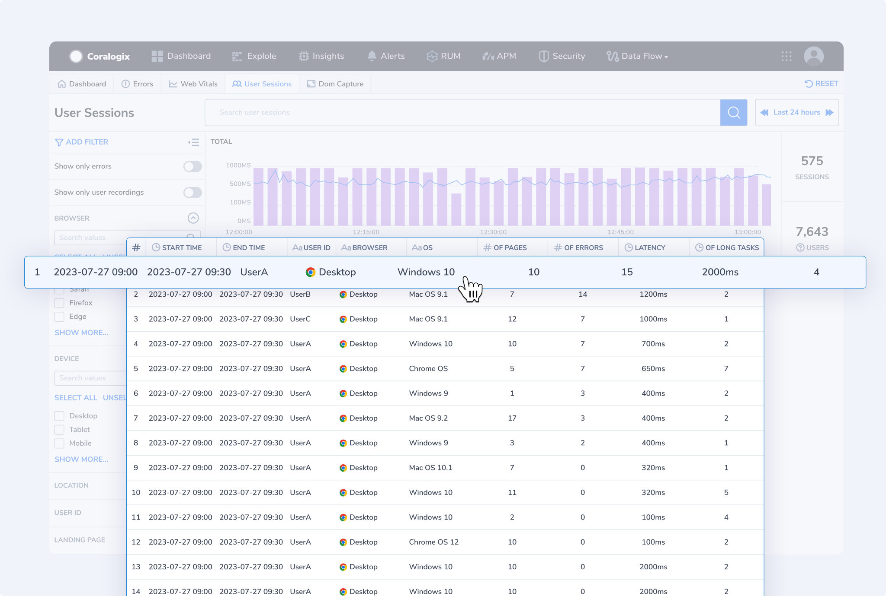

- **Page Views** are when users load a page on your website or application. Tracking page views helps you understand the most popular pages and how often they are accessed. Each view is attached to a **`view_id`** within the same session.

- **User Actions** encompass a wide range of specific behaviors and interactions that users perform while using the application. These actions may include navigation actions - page visits, clicking links, menu navigation; interaction with UI elements - button clicks, dropdown selection, checkbox selection; form submissions; media and content interactions - media playback or image zoom; e-commerce and user account actions; error and exception handling; or content creation. They provide valuable insights into how users engage with the system. Each action is attached to an **`action_id`** within the same session.

- **Resources** refer to various elements and assets that a web page loads when a user interacts with a web application. These resources can include images, scripts, stylesheets, fonts, API request, media, etc. Each is associated with a **`resource_id`**.

- **Errors** refer to any unexpected issues or failures that occur during a user's interaction with a web application. [Monitoring errors](https://coralogixstg.wpengine.com/docs/error-tracking/) within User Sessions is crucial for identifying and resolving issues that can negatively impact the user experience. Detecting and tracking errors can help pinpoint where problems occur and facilitate rapid troubleshooting and resolution. Each is associated with an **`error_id`**.

- **Long Tasks** refer to specific actions or tasks within a web application that take a relatively long time to complete. These tasks can cause delays in the user experience and lead to performance issues. Long tasks may include rendering complex graphics, heavy JavaScript execution, or large file downloads. Each is associated with a **`LongTask_id`**.

## Getting Started

**STEP 1**. In your Coralogix toolbar, navigate to **RUM** > **User Sessions**.

**STEP 2**. Click on the **User Sessions** tab.

View the following:

- **Graph**. Presents a visualization of all sessions for all users.

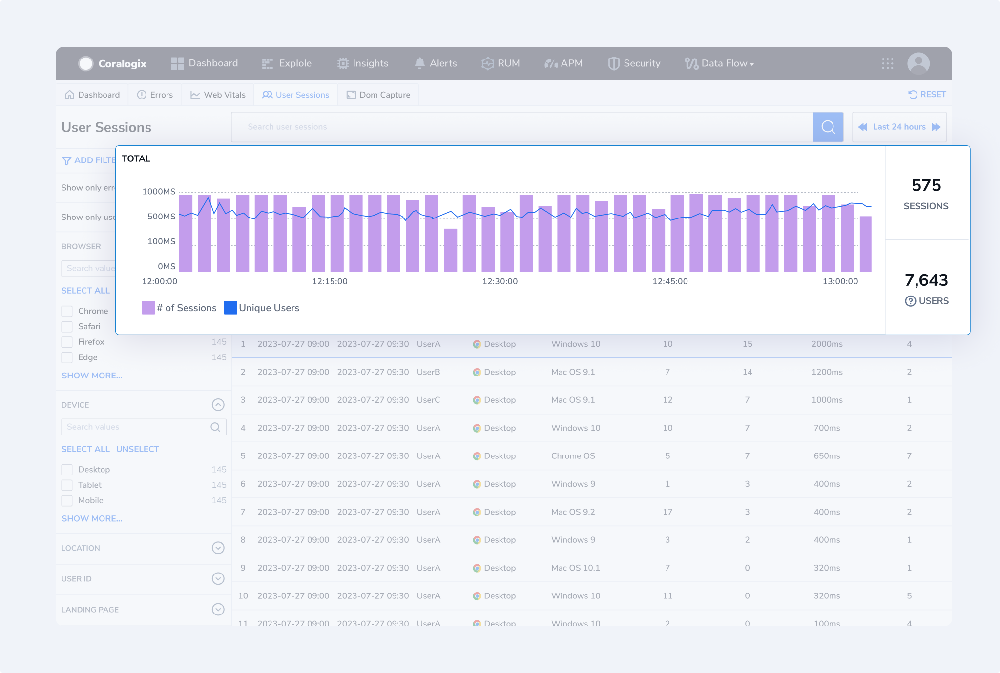

- **Sessions Grid**. Each line represents one user session. It includes start and end times, user\_id, browser type, OS, number of pages visited, latency (total blocking times), and the number of long tasks.

- **Filter Panel**. The left-hand panel presents you with various filtering options. You can filter and display only those sessions with errors or user recordings, among other options.

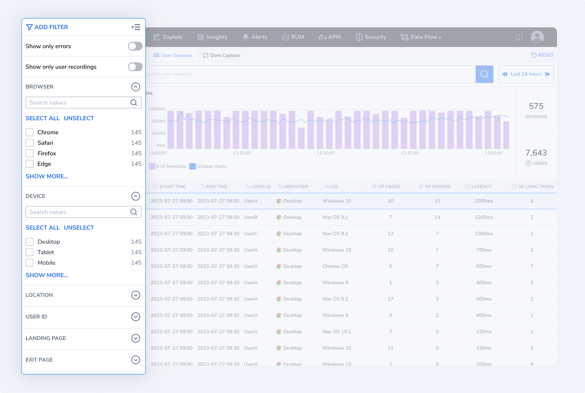

- **Geo Location**. Displays your application's user sessions distributed across the globe. Hover over a particular country to view the KPIs for that specific region.

## User Session Drill Down

Click on a specific user session to drill down. Select from a series of tabs: **ACTIONS**, **RESOURCES**, **ERRORS**, and **CORRELATE LOGS.**

## Actions

Clicking on the **ACTIONS** tab will present you with the following information for a particular user session:

- **Session Header**. This includes information for the entire session, including session ID, duration, user ID, browser, operating system, device type, country, number of pages visited, number of errors, number of actions, number of resources, number of page loads, number of keyboard inputs, and end pages. The header includes a drop-down menu where you can choose to investigate all pages or narrow your investigation down to a specific page.

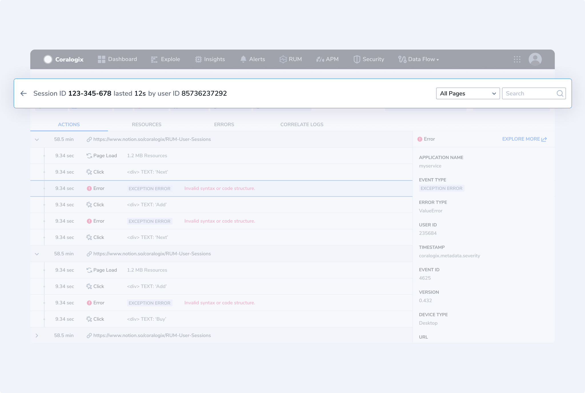

- **Page Header**. For each page within the user session, you will see a page header, which includes rendering and loading times, the number of errors and clicks on a page, and the number of inputs. On the right-hand side of the page header, use the **page header icons** to view aggregated page information: rendering time, loading time, number of errors, clicks, page load, and user inputs.

- **Action Grid**. Under each page header, you will see an **Action Grid**, which displays all of the events that occurred on that particular page.

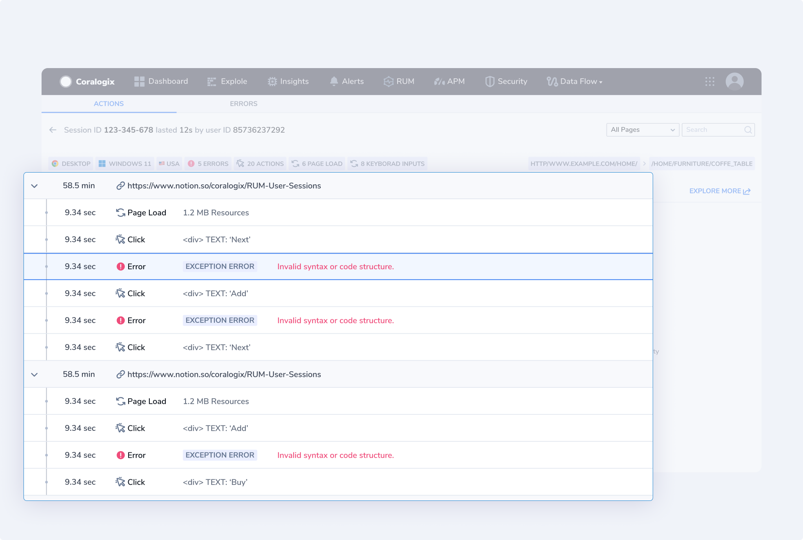

The **Action Grid** includes:

- Page navigation information. Including load time, page size, number of resources, page referral, URL params, and UTMs.

- User interactions. Including action type (such as `click`, `input`, `scroll type`), element data, and timestamp.

- Error information. Including error type and message, stack message, timestamp, user impact, correlated actions, and failed requests.

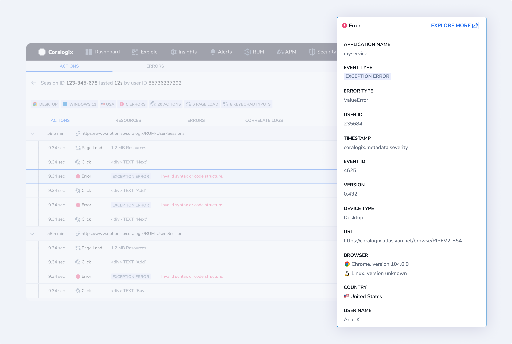

## Resources

Clicking on the **RESOURCES** tab will present you with all of the resources for a particular URL. The tab includes:

- **Session Header**. This includes information for the entire session, including session ID, duration, user ID, and application type.

- **Filters**. You have the option of viewing all resources or filtering by resource type to narrow down to a specific type.

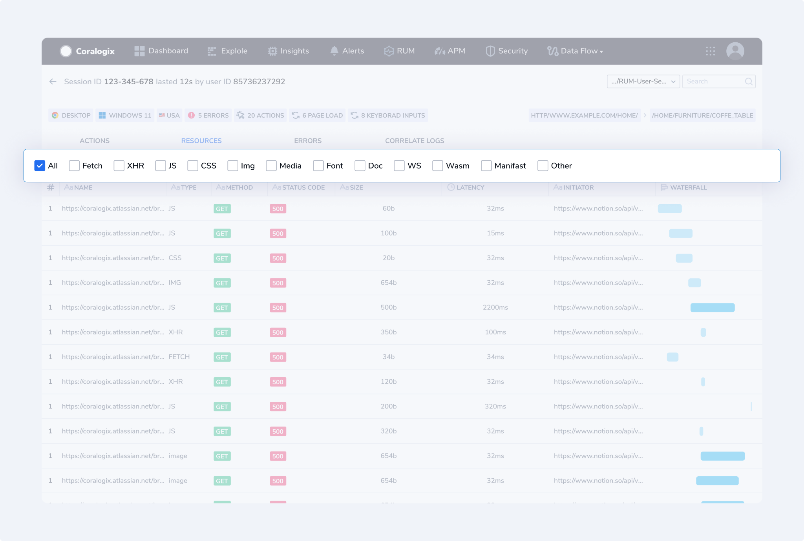

- **Resources Grid**. For each resource, view the resource name, type, method, status code, size, latency, initiator, and associated waterfall. The waterfall is a visual representation that displays the loading and rendering of resources on a web page in chronological order, similar to a waterfall. **Sort** and **filter** grid results to pinpoint a resource serving as a bottleneck.

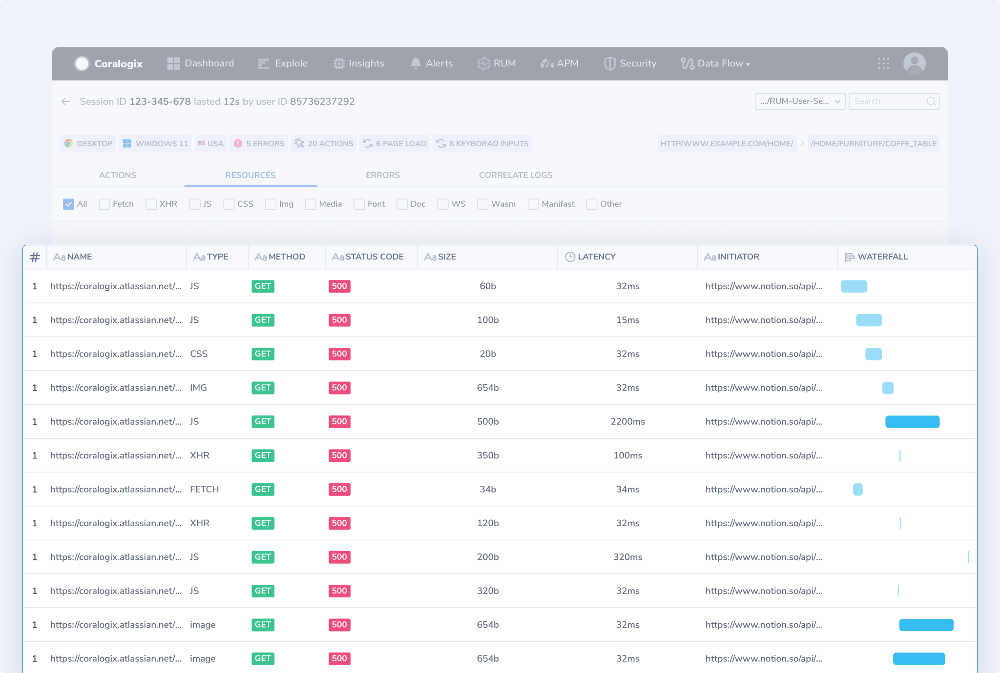

Clicking on the waterfall for a particular resource will produce a popup displaying queuing, stalling, and request and response times for a particular resource.

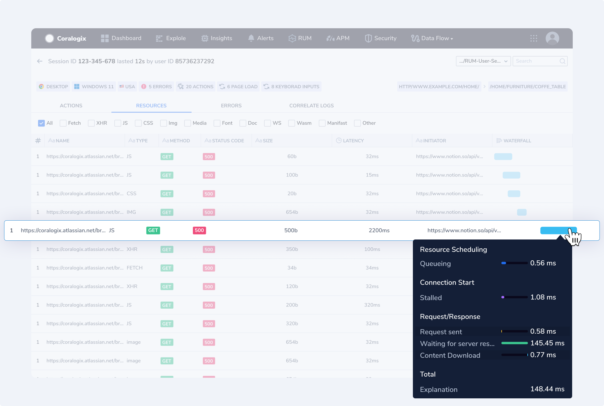

## Errors

Clicking on the **ERRORS** tab will present you with all of the errors in a user session.

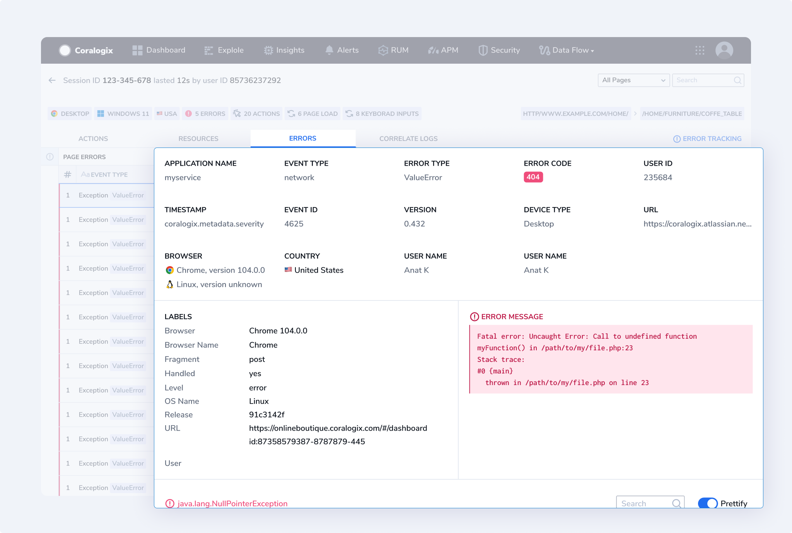

The tab includes:

- **Session Header**. This includes information for the entire session including: session ID, duration, user ID, and application type.

- **Errors Tab**. For each error, view the application name, event and error type, error code, user ID, timestamp, event ID, application code version, device type, URL, browser, country, and user name.

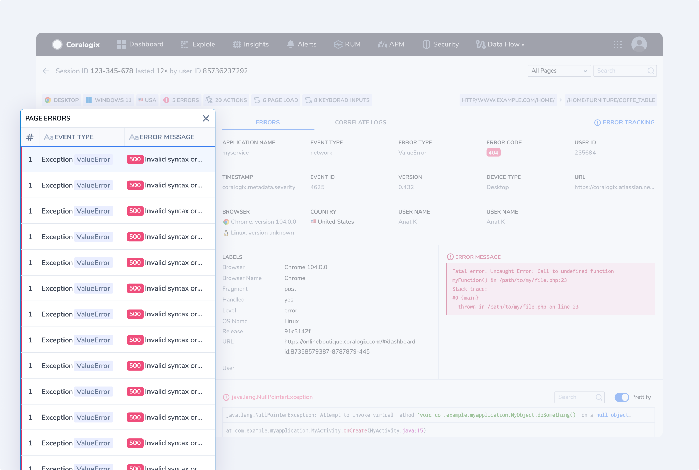

- **Labels**. Presents all associated labels for a particular error as configured in the [Browser SDK](https://coralogixstg.wpengine.com/docs/browser-sdk-installation-guide/). Customize labels to enrich your data in accordance with your needs.

- **Error Message**. Presents the error message in its entirety.

## Correlate Logs

Clicking on the **CORRELATE LOGS** tab will present you with all of the logs for a user session.

## Support

**Need help?**

Our world-class customer success team is available 24/7 to walk you through your setup and answer any questions that may come up.

Feel free to reach out to us **via our in-app chat** or by sending us an email at [support@coralogixstg.wpengine.com](mailto:support@coralogixstg.wpengine.com).
