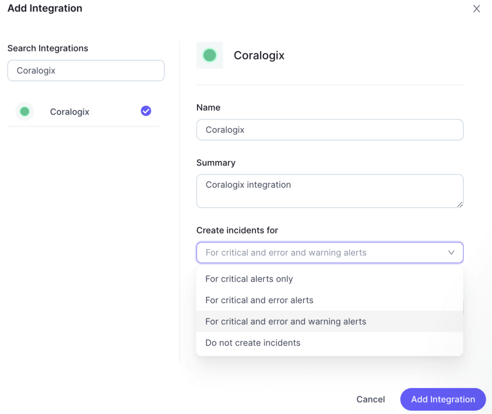
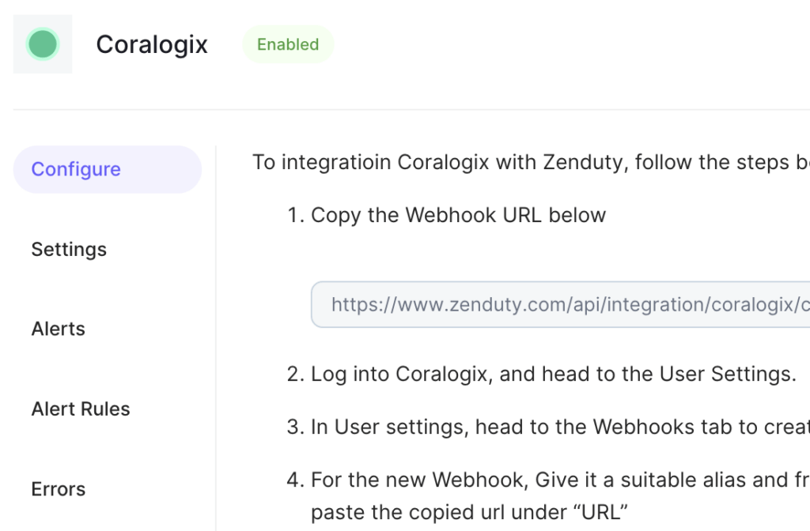
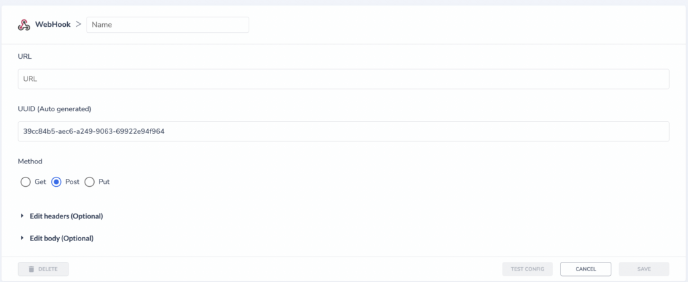
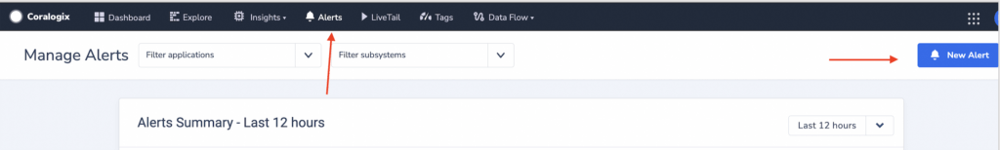
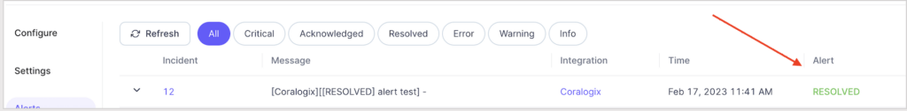

Zenduty is an incident management platform that helps businesses manage and resolve incidents quickly and efficiently. It provides a range of features such as alert management, on-call scheduling, incident response automation, and post-mortem analysis. Coralogix now supports seamless integration with [Zenduty](https://www.zenduty.com/).

## Configuration

**STEP 1**. Navigate to **‘Teams’** on your Zenduty dashboard and click on the team to which the integration will be added.

**STEP 2**. Select **‘Services’** and click on the relevant Service.

**STEP 3**. Under **‘Integrations’**, click **‘Add New Integration’**. Give it a name and select the application **‘Coralogix’** from the dropdown menu.  
  
**STEP 4**. Provide the details 'Name', 'Summary', 'Create incidents for ', 'set default Urgency' and click on **‘Add Integration’**  

**STEP 5**. Click **‘Configure’** and copy the generated Webhook URL.  

## Coralogix Setup

**STEP 1**. Navigate to **Data Flow** > **Webhooks** in your Coralogix account. 

**STEP 2**. Select the **Webhooks** tab to create a new webhook.   
  
**STEP 3**. For the new webhook, give it a suitable name and paste the copied URL from Zenduty Configure.   

**STEP 4**. Save the webhook.

**STEP 5**. Validate your configuration by clicking the **‘Test Configuration’** button. The test alert should appear on your Zenduty Alert log.

**STEP 6**. Click **Alerts** in your navigation bar to set the destination in the new alert.   

**STEP 7**. Define the **‘Alert Name’** and **‘Description’**. Severity is to be set to **‘Warning’** or **‘Critical’** for a new incident to be created. 

**STEP 8**. Define the conditions for which the alert is to be triggered.

**STEP 9**. Under **‘Recipients’**, search and add the previously defined Zenduty webhook. 

**Note**: If ‘Notify when Resolved’ option is enabled, then when the conditions go back to normal, the incident will be auto-resolved.   
In Zenduty, Incident will be auto resolved.

**STEP 10**. Save the Alert.

## Support

**Need help?**

Our world-class customer success team is available 24/7 to walk you through your setup and answer any questions that may come up.

Feel free to reach out to us **via our in-app chat** or by sending us an email at [support@coralogixstg.wpengine.com](mailto:support@coralogixstg.wpengine.com).
