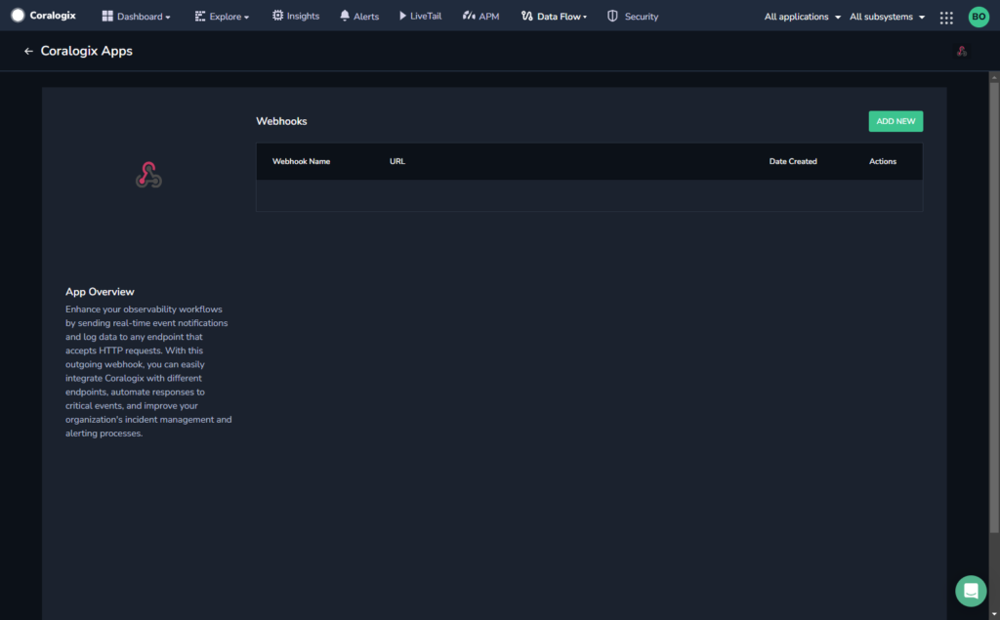
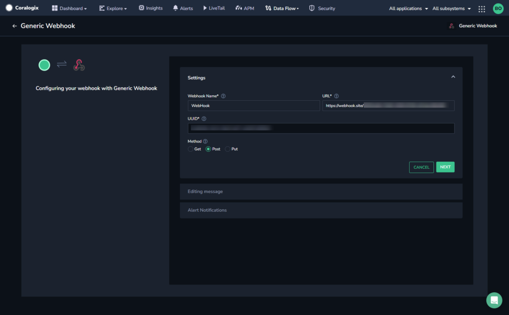
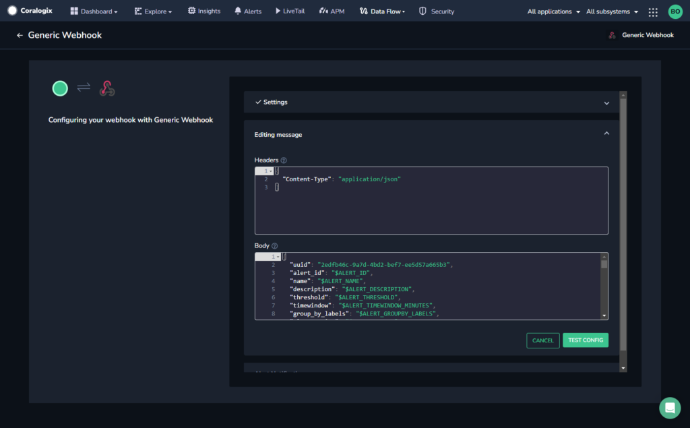
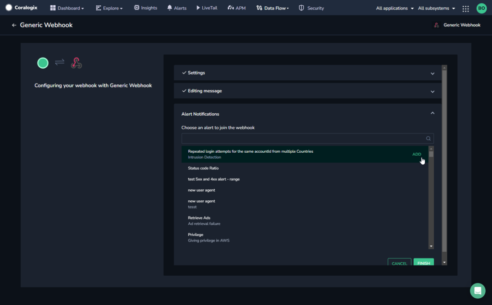

Enhance your observability workflows by sending real-time event notifications and log data to any endpoint that accepts HTTP requests. With this **generic** **outbound webhook**, you can easily integrate Coralogix with different endpoints, automate responses to critical events, and improve your organization's incident management and alerting processes.

## Create a Webhook

**STEP 1.** From the Coralogix toolbar, navigate to **DATA FLOW** > **EXTENSIONS.**

**STEP 2.** In the **Outbound Webhooks** section, click **GENERIC WEBHOOK**.

**STEP 3.** Click **\+ ADD NEW**.

**STEP 4.** Enter a webhook name and the URL to which you want to send an event notification.

The UUID field is auto-populated.

**STEP 5.** Select an HTTP method for the webhook (GET, POST, or PUT).

**STEP 6.** Click **NEXT**.

**STEP 7.** \[**Optional**\] Edit the message to customize the header and body of the messages that will be sent when the webhook is triggered.

Here is a list of all available placeholders you may use and a description of each one.

\[table id=39/\]

**STEP 8.** Click **TEST CONFIG**.

The system sends an HTTP call with the specified parameters to check that your configuration is valid. If the HTTP call is received successfully, a confirmation message is displayed.

**STEP 9.** Once the configuration is validated, [configure your alert notifications](https://coralogixstg.wpengine.com/docs/alert-notifications-outbound-webhooks/).

## Additional Resources

<table><tbody><tr><td>Documentation</td><td><strong><a href="https://coralogixstg.wpengine.com/docs/alert-notifications-outbound-webhooks/">Configure Alert Notifications for Outbound Webhooks</a></strong></td></tr></tbody></table>

## Support

**Need help?**

Our world-class customer success team is available 24/7 to walk you through your setup and answer any questions that may come up.

Feel free to reach out to us **via our in-app chat** or by sending us an email at [support@coralogixstg.wpengine.com](mailto:support@coralogixstg.wpengine.com).
