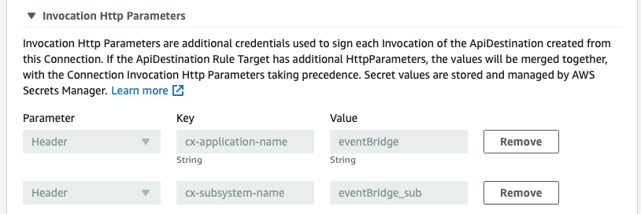
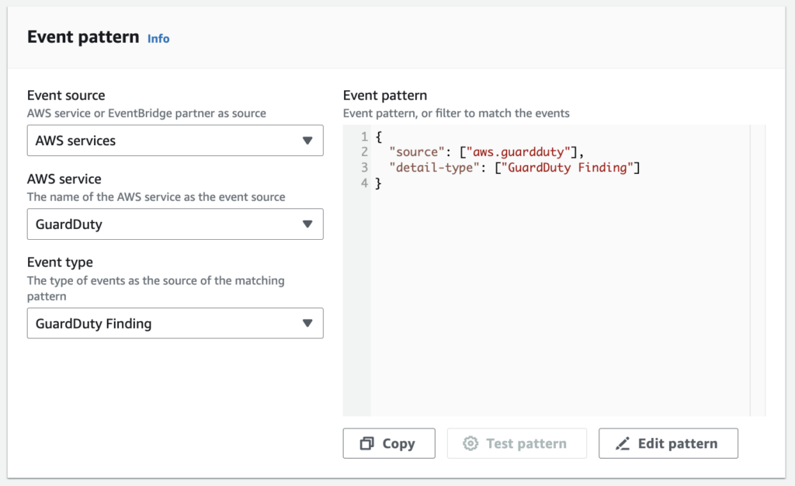

Amazon EventBridge is a serverless event bus service that makes it easy to collect and send data from across your applications and services to any destination. Use EventBridge to seamlessly deliver real-time data from your application to Coralogix for monitoring and analysis.

## Requirements

- AWS Account 

- Amazon EventBridge Bus created

## Instructions

Go to EventBridge -> API Destinations, and create a new API Destination.  

  
  
For **API destination endpoint**, select the URL below associated with your Coralogix [domain](https://coralogixstg.wpengine.com/docs/coralogix-domain/).

<table><tbody><tr><td><strong>Coralogix Domain</strong></td><td><strong>URL</strong></td></tr><tr><td>coralogixstg.wpengine.com</td><td>https://aws-events.coralogixstg.wpengine.com/aws/event</td></tr><tr><td>coralogix.us</td><td>https://aws-events.coralogix.us/aws/event</td></tr><tr><td>eu2.coralogixstg.wpengine.com</td><td>https://aws-events.eu2.coralogixstg.wpengine.com/aws/event</td></tr><tr><td>coralogix.in</td><td>https://aws-events.app.coralogix.in/aws/event</td></tr><tr><td>coralogixsg.com</td><td>https://aws-events.coralogixsg.com/aws/event</td></tr></tbody></table>

We will need to create a new connection:

If you would like to specify the application name and the subsystem name.

Click on Invocation Http Parameters and add 2 parameters as shown in the screen shot below. The values can be anything you would like to identify the logs with.

For **Authorization type** you need to select API Key.  
API Key Name will be x-amz-event-bridge-access-key and you will use Coralogix “Send your Data” API Key  (You can get it by going to the Data Flow menu in Coralogix and navigating to API Keys).

We now need to create a rule to route the events into the API Destination.

- On the **Buses** section, select **Rules**

- Click on **Create rule**

- Give the rule a name, select the correct **Event bus**. Click **Next.**

- For **Event pattern** (source), scroll down and select the desired source
    - For example GuardDuty Findings

- For target, select EventBridge API destination

Every event that goes to the selected bus will be sent to Coralogix.

## Notes

A “resources” key is present in the AWS Eventbridge and [Cloudtrail](https://coralogixstg.wpengine.com/docs/aws-cloudtrail-data-collection-options/) integrations. If you are integrating both EventBridge and CloudTrail logs, create a parsing rule to rename the mentioned field to avoid mapping conflicts.

## **Support**

**Need help?**

Our world-class customer success team is available 24/7 to walk you through your setup and answer any questions that may come up.

Feel free to reach out to us **via our in-app chat** or by sending us an email at [support@coralogixstg.wpengine.com](mailto:support@coralogixstg.wpengine.com).
