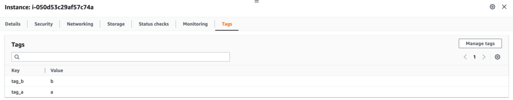
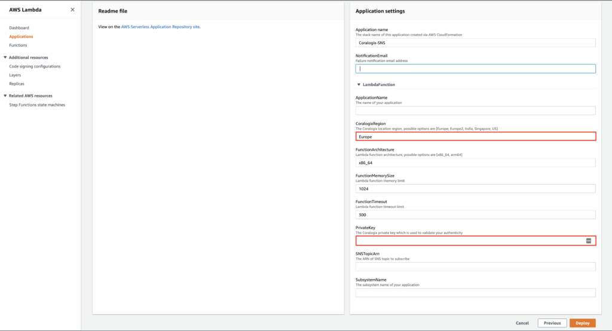
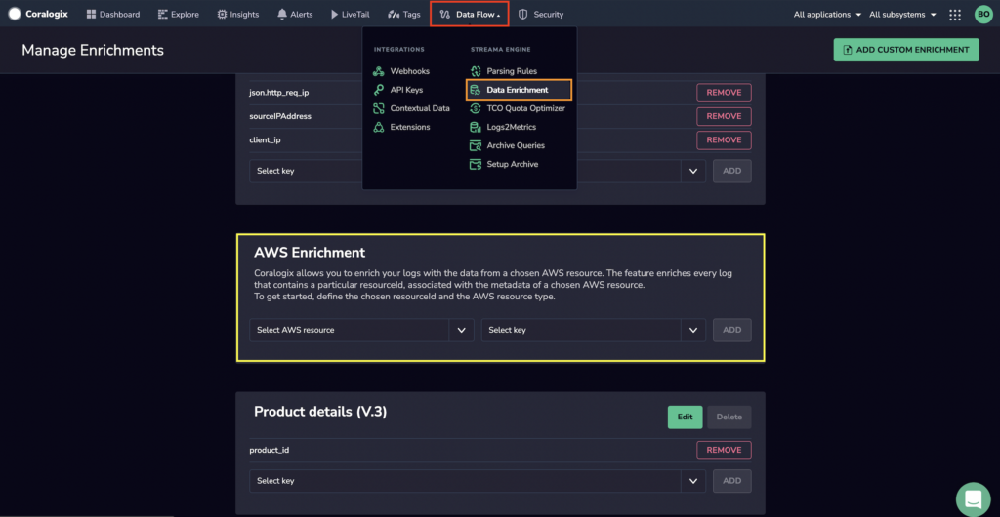

Coralogix now offers **AWS Resource Enrichment**, allowing you to enrich your logs with tags from Amazon Web Services (AWS) EC2 instances. Use this feature to **connect your business and operation metadata** from AWS and gain greater insight into your data.

## Overview

The feature enriches every log containing the following fields with metadata.

<table><tbody><tr><td><code>ec2_instance_id</code></td><td>OpenTelemetry</td></tr><tr><td><code>instance_id</code></td><td>Fluentd</td></tr><tr><td><code>ec2_instance_id</code></td><td>Fluent Bit</td></tr></tbody></table>

**Sample Otel Log Before Enrichment**

```
{
	resource:{
		attributes:{
			cloud.availability_zone:us-east-1b
			cloud.platform:aws_ec2
			cloud.provider:aws
			cloud.region:us-east-1
			ec2_instance_id:i-0c352ce4c433c58a5
			host.image.id:ami-051f7e7f6c2f40dc1
			host.name:ip-172-31-37-204.ec2.internal
			host.type:t2.micro
		}
	}
	scope:{
		attributes:{}
	}
	resourceSchemaUrl:<https://opentelemetry.io/schemas/1.6.1>
		logRecord:{
			attributes:{
				log.file.name:log2.log
				log.file.path:log2.log
			}
		body:{
			account_id:035955823196
			application_name:my application test
			ec2_instance_type:t2.micro
			ec2_region:us-east-1
			hosename:ip-172-31-37-204.ec2.internal
			image_id:ami-051f7e7f6c2f40dc1
			kubernetes:{
				container_name:service-0
				docker_id:12345186e060681175942786de75a102c679f13c3f0fb330231bdd94c5570e2
				labels:{
					app.kubernetes.io\\/managed-by:Helm
					statefulset.kubernetes.io\\/pod-name:service-0
				}
				namespace_name:default
				pod_id:123456-aefb-456e-b315-77b014de9d5b
				pod_name:service-0
				}
			log:[INFO] 2022-11-15T12:55:36,768 kafka.streams.processor.internals.StateDirectory service-0 stream-thread [categorization-0-CleanupThread] Deleting obsolete state directory 0_2 for task 0_2 as 32827574178ms has elapsed (cleanup delay is 600000ms).
			platform:aws_ec2
			stream:stdout
			time:2022-11-15T12:55:36.768697532Z
		}
	observedTimeUnixNano:1694069570457198600
	}
}

```

**AWS Enrichment**



**Sample Otel Log After Enrichment**

```
{
	resource:{
		attributes:{
			ec2_instance_id_aws:{ ##enrichment part
				companyId:32757
				resourceId:i-0c352ce4c433c58a5
				resourceType:aws:ec2:instance
				tags:{
					tag_a:a
					tag_b:b
					}
			}
			cloud.availability_zone:us-east-1b
			cloud.platform:aws_ec2
			cloud.provider:aws
			cloud.region:us-east-1
			ec2_instance_id:i-01s32s14p423a98a5
			host.image.id:ami-051f7e7f6c2f40dc1
			host.name:ip-172-62-93-414.ec2.internal
			host.type:t2.micro
		}
	}
	scope:{
		attributes:{}
	}
	resourceSchemaUrl:<https://opentelemetry.io/schemas/1.6.1>
		logRecord:{
			attributes:{
				log.file.name:log.log
				log.file.path:log.log
			}
		body:{
			kubernetes:{
				container_name:service-0
				docker_id:12345186e060681175942786de75a102c679f13c3f0fb330231bdd94c5570e2
				labels:{
					app.kubernetes.io\\/managed-by:Helm
					statefulset.kubernetes.io\\/pod-name:service-0
				}
				namespace_name:default
				pod_id:123456-aefb-456e-b315-77b014de9d5b
				pod_name:service-0
				}
			log:[INFO] 2022-11-15T12:55:36,768 kafka.streams.processor.internals.StateDirectory service-0 stream-thread [categorization-0-CleanupThread] Deleting obsolete state directory 0_2 for task 0_2 as 32827574178ms has elapsed (cleanup delay is 600000ms).
			platform:aws_ec2
			stream:stdout
			time:2022-11-15T12:55:36.768697532Z
		}
	observedTimeUnixNano:1694069570457198600
	}
}

```

## Prerequisites

- Coralogix [account](https://signup.coralogixstg.wpengine.com/#/) set up in the [domain](https://coralogixstg.wpengine.com/docs/coralogix-domain/) corresponding to the region where your data is stored

- Coralogix [Send-Your-Data API key](https://coralogixstg.wpengine.com/docs/private-key/)

## Setup

### Installation & Configuration

We **strongly recommend** installing and configuring with OpenTelemetry. The default example below uses the configuration for [OpenTelemetry](https://coralogixstg.wpengine.com/docs/opentelemetry/).

**STEP 1**. Ensure your logs contain a key with EC2 instance ID value:

<table><tbody><tr><td><code>ec2_instance_id</code></td><td><a href="https://coralogixstg.wpengine.com/docs/opentelemetry/"><strong>OpenTelemetry</strong></a></td></tr><tr><td><code>instance_id</code> (default key name) using Fluent-plugin-ec2-metadata <a href="https://github.com/takus/fluent-plugin-ec2-metadata">plugin</a></td><td><a href="https://coralogixstg.wpengine.com/docs/fluentd/"><strong>FluentD</strong></a></td></tr><tr><td><code>ec2_instance_id</code></td><td><strong><a href="https://coralogixstg.wpengine.com/docs/fluent-bit/">Fluent Bit</a></strong></td></tr></tbody></table>

**STEP 2**. Add the resourcedetection and transform processors, enable the desired attributes, and add it to your config file. [FluentD metadata labels](https://github.com/takus/fluent-plugin-ec2-metadata) and [Fluent Bit metadata labels](https://docs.fluentbit.io/manual/pipeline/filters/aws-metadata) are configured differently.

You must enable `host.id` for the enrichment to work.

### OpenTelemetry Example

```
processors:
  resourcedetection:
    detectors: [ec2]
    override: true
    ec2:
      resource_attributes:
        host.id:
          enabled: true
        host.name:
          enabled: true
        host.image.id:
          enabled: true
        host.type:
          enabled: true
        cloud.region:
          enabled: true
        cloud.account.id:
          enabled: true
        cloud.availability_zone:
          enabled: true
  transform:
    error_mode: ignore
    log_statements:
      - context: log
        statements:
          - set(resource.attributes["ec2_instance_id"],resource.attributes["host.id"])
          - delete_key(resource.attributes, "host.id")

```

### Fluent Bit Example

**STEP 1**. Add the AWS filter with the desired additional labels.

```
[FILTER]
        Name aws
        Match *
        ec2_instance_type true
        account_id true
        hostname true

```

**STEP 2**. Specify the desired AWS metadata labels under the nested filter as part of the nest operation defining root fields.

```
[FILTER]
        Name        nest
        Match       kube.*
        Operation   nest
        Wildcard    kubernetes
        Wildcard    account_id
        Wildcard    hostname
        Wildcard    az
        Wildcard    ec2_instance_type
        Wildcard    ec2_instance_id
        Wildcard    log
        Wildcard    log_obj
        Wildcard    stream
        Wildcard    time
        Nest_under  json

```

### AWS Lambda Deployment

**STEP 1**. Deploy the [AWS lambda function](https://serverlessrepo.aws.amazon.com/applications/eu-central-1/597078901540/Coralogix-Resource-Metadata) running in your AWS account. The platform collects logs from a chosen EC2 instance in your AWS account and sends them to Coralogix, enriching them with tags associated with your instance.

**STEP 2**. Fill in the **Application settings** fields.

- Input the Coralogix [domain](https://coralogixstg.wpengine.com/docs/coralogix-domain/) within which your account has been created in **CoralogixRegion**.

- Input your Coralogix [Send-Your-Data API key](https://coralogixstg.wpengine.com/docs/private-key/) in **ApiKey**.

- Do **not** change the default settings for the **FunctionMemorySize** and **FunctionTimeout.**



**STEP 3**. Deploy your application to collect tags. It will collect tags every 10 minutes and send them to Coralogix.

## AWS Enrichment

**STEP 1**. From your Coralogix toolbar, navigate to **Data Flow** > **Data Enrichment**. Scroll down the page to view the AWS Enrichment Option.



**STEP 2**. Select the chosen AWS resource type.

**STEP 3**. Select the key with your EC2 instance ID.

<table><tbody><tr><td><code>resource.attributes.ec2_instance_id</code></td><td>OpenTelemetry</td></tr><tr><td><code>ec2_instance_id</code></td><td>Fluent Bit</td></tr><tr><td><code>instance_id</code></td><td>Fluentd</td></tr></tbody></table>

**Note**: If you have modified the default option, you may have a different key.

**STEP 4**. Add the enrichment.

**STEP 5**. Logs associated with the chosen AWS resource should now appear enriched with AWS tags in your dashboard. To view them, navigate to **Explore** > **Logs** or to [LiveTail](https://coralogixstg.wpengine.com/docs/coralogix-live-tail/).

## Limitations

**AWS Resource Enrichment** feature grants the following:

- Active resources (existing in the last 24h) / Coralogix team: 100,000

- 50 tags/resources (equal to AWS limits)

- Tag key length <= 127 (equal to AWS limits)

- Tag value length <= 255 (equal to AWS limits)

## Additional Resources

<table><tbody><tr><td><strong>GitHub</strong></td><td><strong><a href="https://github.com/coralogix/coralogix-aws-serverless/tree/master/src/resource-tags">Lambda Documentation for Coralogix AWS Enrichment</a><br><a href="https://serverlessrepo.aws.amazon.com/applications/eu-central-1/597078901540/Coralogix-Resource-Tags">AWS: Coralogix-Resource-Tabs Application</a></strong></td></tr></tbody></table>

## **Support**

**Need help?**

Our world-class customer success team is available 24/7 to walk you through your setup and answer any questions that may come up.

Feel free to reach out to us **via our in-app chat** or by emailing [support@coralogixstg.wpengine.com](mailto:support@coralogixstg.wpengine.com).
