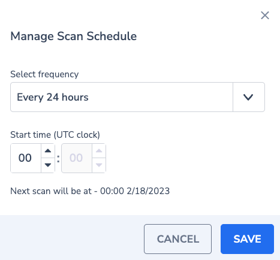

Security Posture Management (CSPM) helps to mitigate and minimize cloud data security breaches and to assess the overall posture of the entire cloud environment against best practices and compliance standards to help remediate issues.

CSPM tools verify that cloud configurations follow security best practices and compliance standards such as CIS, Azure, and GCP benchmarks as well as PCI and HIPAA frameworks. As companies are increasingly moving to the cloud, CSPM is becoming a necessary aspect of security insights.

The CSPM can be installed using a Docker container

Coralogix GRPC endpoints

<table><tbody><tr><td>Ireland</td><td>ng-api-grpc.coralogixstg.wpengine.com</td></tr><tr><td>Stockholm</td><td>ng-api-grpc.eu2.coralogixstg.wpengine.com</td></tr><tr><td>Singapore</td><td>ng-api-grpc.coralogixsg.com</td></tr><tr><td>Mumbai</td><td>ng-api-grpc.app.coralogix.in</td></tr><tr><td>United States</td><td>ng-api-grpc.coralogix.us</td></tr></tbody></table>

For each installation method, we need to pass the following environment variables:

<table><tbody><tr><td>API_KEY</td><td>Under "Send your data" on your Coralogix account</td></tr><tr><td>APPLICATION_NAME</td><td>Set the application name</td></tr><tr><td>SUBSYSTEM_NAME</td><td>Set the subsystem name</td></tr><tr><td>COMPANY_ID</td><td>The company ID from the settings screen in your Coralogix account</td></tr><tr><td>CORALOGIX_ENDPOINT_HOST</td><td>Coralogix GRPC endpoint</td></tr><tr><td>CLOUD_PROVIDER</td><td>The Cloud Provider that CSPM will be deployed into in lowercase (e.g. aws, gcp, etc)</td></tr><tr><td>TESTER_LIST</td><td>If specified, will run the tests on the specified service, otherwise will run tests on all the GCP services. leave empty to run all testers, otherwise, comma separated per tester name without spaces</td></tr><tr><td>REGION_LIST</td><td>If specified, will check only the specified regions (For global services like IAM and DNS, make sure you add region "global"). Otherwise, the tests will be conducted in all regions. leave empty to run on all regions, otherwise, comma separated per region name without spaces</td></tr><tr><td>GOOGLE_APPLICATION_CREDENTIALS</td><td>Path to credentials file inside the container</td></tr><tr><td>CORALOGIX_ALERT_API_KEY</td><td>(Optional parameter) Under "Alerts, Rules and Tags API Key" on your Coralogix account.<br>When providing this variable, a custom enrichment for failed resources will be created in Coralogix's account at the end of each run if specified</td></tr></tbody></table>

## Installing as a Docker container

### Prerequisites

1. Verify the following **API**s are enabled on the project before running
    - Cloud Resource Manager API
    
    - API Keys API
    
    - Cloud SQL Admin API
    
    - Compute Engine API
    
    - Cloud Key Management Service (KMS) API
    
    - BigQuery API
    
    - Kubernetes Engine API

3. Create a **Role** with the [following permissions](https://github.com/coralogix/snowbit-cspm-policies/blob/master/GCP/cspm-gcp-permissions.txt) (IAM & Admin > Roles)
    - If you have access to use **gcloud** command and wish to automate the role creation process, download the [following file](https://github.com/coralogix/snowbit-cspm-policies/blob/master/GCP/cspm-gcp-permission-document.yml)
    
    - Now run the command **_gcloud iam roles create test\_coralogix\_role1 --project --file=/path/to/yaml.yml_**

5. Create a **service account** and attach the previously created role (IAM & Admin > Service Accounts)

7. Create **VM Instance**
    - Attach the service account (3) to the instance
    
    - E2-small is sufficient
    
    - Internet connectivity

9. Docker installed on the VM instance - refer to [Docker documentation](https://docs.docker.com/engine/install/ubuntu/)

Note that the instance type will affect the run time, so it's up to a personal preference and is affected by the environment size.

### Deploying

After prerequisites are met, download the docker image using the following command (if the following command hasn't run, the image will still be downloaded automatically in the next step):

```
docker pull coralogixrepo/snowbit-cspm
```

In order to automate the process, use Crontab in the following manner:

Create the crontab using your favorite editor

```
sudo crontab -e
```

Inside the document, on the bottom, paste the following one-liner (note that the API\_KEY and the CORALOGIX\_ENDPOINT\_HOST fields are mandatory)

```
*/10 * * * *  docker rm snowbit-cspm ; docker rmi coralogixrepo/snowbit-cspm:latest ; docker run --name snowbit-cspm -d -e PYTHONUNBUFFERED=1 -e CLOUD_PROVIDER="gcp" -e COMPANY_ID=<coralogix_company_ID> -e CORALOGIX_ENDPOINT_HOST="coralogix_grpc_endpoint" -e APPLICATION_NAME="application_name" -e SUBSYSTEM_NAME="subsystem_name" -e TESTER_LIST="" -e API_KEY="send_your_data_api_key" -e REGION_LIST="" -e GOOGLE_APPLICATION_CREDENTIALS="path_to_credentials_file_in_the_container" -v <local_folder_that_contains_gcp_credentials>:<location_to_map_the_credentials_inside_the_container> coralogixrepo/snowbit-cspm
```

## Configuring the scan settings

Inside the security tab in your Coralogix account, you will find the **SCAN SETTINGS** button:

1. Scan Now will start the scan of the selected environment(s) in up to 10 minutes from pressing (according to the configured cronjob)

3. Scan Schedule allows choosing the frequency of the scans, and the start time of each scan. the default is every 24 hours


