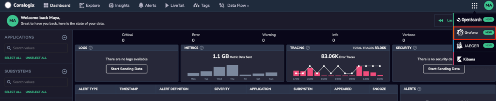
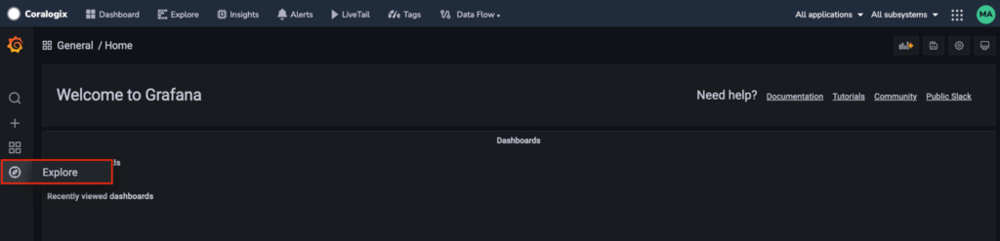

[Amazon CloudWatch](https://docs.aws.amazon.com/AmazonCloudWatch/latest/monitoring/WhatIsCloudWatch.html) monitors your Amazon Web Services (AWS) resources and applications you run on AWS in real time. Use the Coralogix destination to easily forward metrics for your AWS resources to Coralogix using CloudWatch Metric Stream and Firehose Delivery Stream.

This guide demonstrates how to:

- Use CloudWatch to collect and track metrics and send them to Coralogix

- Visualize metrics in your Coralogix dashboard

- Import pre-built dashboards and set up alerts in your Coralogix account

## Metrics Collection

There are two ways of sending AWS service metrics to Coralogix:

- **Real-time CloudWatch metrics processing using CloudWatch Metric Stream and Firehose Delivery Stream**. Opt for this if you’d like to use a native AWS solution without an agent. Use the [Amazon CloudWatch pricing calculator](https://aws.amazon.com/cloudwatch/pricing/) to estimate the costs of this option. The instructions below guide you through **this option**.

- **Poll CloudWatch metrics using [Telegraf](https://docs.influxdata.com/telegraf/v1.24/install/#installation)**. [Opt for this](https://coralogixstg.wpengine.com/docs/collect-cloudwatch-metrics-telegraf/) if you are already using this shipper or seeking to reduce costs.

## Configuration

1\. Set up [CloudWatch Metric Stream and Firehose Delivery Stream](https://coralogixstg.wpengine.com/docs/amazon-kinesis-data-firehose-metrics/).

2\. Identify the [AWS services that publish metrics to CloudWatch and their namespaces](https://docs.aws.amazon.com/AmazonCloudWatch/latest/monitoring/aws-services-cloudwatch-metrics.html). Use them in your configuration to collect the metrics.

**Note:** Namespaces are case-sensitive.

## Dashboard

1\. Download and import the metric stream version of your RDS dashboard.

[Download JSON](/wp-content/uploads/2022/12/rds_metric_stream-1-1.json)

2\. Download and import the metric stream version of ElastiCache dashboard.

[Download JSON](/wp-content/uploads/2022/12/elasti_cache_metric_stream-1.json)

## **Alerts**

Use PromQL to create metrics alerts:

- RDS CPU utilization above 80%

```
1avg(amazonaws_com_AWS_RDS_CPUUtilization{DBInstanceIdentifier!=""}) by (DBInstanceIdentifier)
```

- RDS Writer CPU utilization above 90%

```
1avg(amazonaws_com_AWS_RDS_CPUUtilization{DBClusterIdentifier!="",Role="WRITER"}) by (Role,DBClusterIdentifier)
```

- ElastiCache miss above 50%

```
1(sum(amazonaws_com_AWS_ElastiCache_CacheMisses_sum{})/(sum(amazonaws_com_AWS_ElastiCache_CacheHits_sum{})+sum(amazonaws_com_AWS_ElastiCache_CacheMisses_sum{})))*100
```

## **Validation**

To validate your configuration, access your Coralogix - Grafana dashboard.

1\. On the right-hand corner of your dashboard, click on the **Grafana** drop-down tab.



2\. Once you’ve accessed your Coralogix-Grafana dashboard, click on **Explore** tab in the left-hand browser.



3\. Click on the drop-down arrow of the Metrics browser and input `` `RDS` `` (RDS metrics) and `` `ElastiCache` `` (ElastiCache metrics) in the “Select a Metric” column.

## Limitations

CloudWatch Metric Streams does not send metrics that are older than 2 hours. This means that some CloudWatch metrics are calculated at the end of a day and reported with the beginning timestamp of the same day. This includes S3 daily storage metrics and some billing metrics.

Should you need these metrics, we **recommend** using [Cloudwatch Exporter using Prometheus](https://github.com/prometheus/cloudwatch_exporter) alongside our new CloudWatch integration designed to retrieve those metrics. For updated information, contact **Coralogix Support**.

## Support

**Need help?**

Our world-class customer success team is available 24/7 to walk you through your setup and answer any questions that may come up.

Feel free to reach out to us **via our in-app chat** or by sending us an email at [support@coralogixstg.wpengine.com](mailto:support@coralogixstg.wpengine.com).
