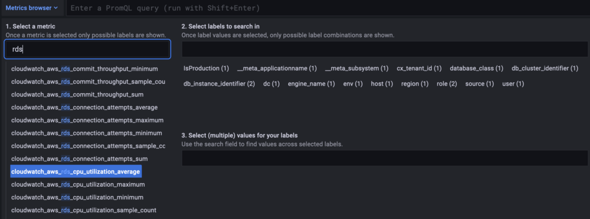

[Amazon CloudWatch](https://docs.aws.amazon.com/AmazonCloudWatch/latest/monitoring/WhatIsCloudWatch.html) monitors your Amazon Web Services (AWS) resources and applications you run on AWS in real time. Use the Coralogix destination to easily forward metrics for your AWS resources to Coralogix using [Telegraf](https://www.influxdata.com/time-series-platform/telegraf/).

This guide demonstrates how to:

- Use CloudWatch to collect and track metrics and send them to Coralogix using Telegraf

- Visualize metrics in your Coralogix dashboard

- Import pre-built dashboards and set up alerts in your Coralogix account

## Metrics Collection

There are two ways of sending AWS service metrics to Coralogix:

- **Real-time CloudWatch metrics processing using CloudWatch Metric Stream and Firehose Delivery Stream**. [Opt for this](https://coralogixstg.wpengine.com/docs/cloudwatch-metric-firehose-delivery-stream/) if you’d like to use a native AWS solution without an agent by [setting up a CloudWatch metric stream and Firehose delivery steam](https://coralogixstg.wpengine.com/docs/amazon-kinesis-data-firehose-metrics/). Use the [Amazon CloudWatch pricing calculator](https://aws.amazon.com/cloudwatch/pricing/) to estimate the costs of this option.

- **Poll CloudWatch metrics using [Telegraf](https://docs.influxdata.com/telegraf/v1.24/install/#installation)**. Opt for this if you are already using this shipper or seeking to reduce costs. The instructions below guide you through **this option**.

## Prerequisites

1\. Install [Telegraf](https://docs.influxdata.com/telegraf/v1.24/install/#installation).

2\. Identify the [AWS services that publish metrics to CloudWatch and their namespaces](https://docs.aws.amazon.com/AmazonCloudWatch/latest/monitoring/aws-services-cloudwatch-metrics.html). Use them in your configuration to collect the metrics.

**Note:** Namespaces are case-sensitive.

## Configuration

1\. Create a configuration file. The example below reads and sends RDS and ElastiCache metrics to Coralogix in 5-minute intervals.

```
# Global tags can be specified here in key="value" format.
[global_tags]
  dc = "us-east-2" 
  user = "$USER"
  env = "CoE"

# Configuration for telegraf agent
[agent]
  interval = "10s"
  round_interval = true
  metric_batch_size = 1000
  metric_buffer_limit = 10000
  collection_jitter = "0s"
  flush_interval = "10s"
  flush_jitter = "0s"
  precision = "0s"

  hostname = ""
  omit_hostname = false

###############################################################################
#                            OUTPUT PLUGINS                                   #
###############################################################################

# Configuration for sending metrics to Coralogix
[[outputs.opentelemetry]]
   service_address = "coralogix-metrics.endpoint"
   insecure_skip_verify = true
   compression = "gzip"
   [outputs.opentelemetry.coralogix]
     private_key = "your-coralogix-api-key"
     application = "prod"
     subsystem = "cloudwatch"

###############################################################################
#                             INPUT PLUGINS                                   #
###############################################################################

# # Pull Metric Statistics from Amazon CloudWatch
[[inputs.cloudwatch]]
  region = "us-east-2"
  ## Amazon Credentials
  ## Credentials are loaded in the following order
  ## 1) Web identity provider credentials via STS if role_arn and
  ##    web_identity_token_file are specified
  ## 2) Assumed credentials via STS if role_arn is specified
  ## 3) explicit credentials from 'access_key' and 'secret_key'
  ## 4) shared profile from 'profile'
  ## 5) environment variables
  ## 6) shared credentials file
  ## 7) EC2 Instance Profile
  access_key = "your-aws-account-access-key"
  secret_key = "your-aws-account-secret-key"
#   # token = ""
#   # role_arn = ""
#   # web_identity_token_file = ""
#   # role_session_name = ""
#   # profile = ""
#   # shared_credential_file = ""
#
#   ## The minimum period for Cloudwatch metrics is 1 minute (60s). However not
#   ## all metrics are made available to the 1 minute period. Some are collected
#   ## at 3 minute, 5 minute, or larger intervals.
#   ## See https://aws.amazon.com/cloudwatch/faqs/#monitoring.
#   ## Note that if a period is configured that is smaller than the minimum for a
#   ## particular metric, that metric will not be returned by the Cloudwatch API
#   ## and will not be collected by Telegraf.
#   #
#   ## Requested CloudWatch aggregation Period (required)
#   ## Must be a multiple of 60s.
  period = "5m"
#
#   ## Collection Delay (required)
#   ## Must account for metrics availability via CloudWatch API
  delay = "5m"
#
#   ## Recommended: use metric 'interval' that is a multiple of 'period' to avoid
#   ## gaps or overlap in pulled data
  interval = "5m"
# Case sensitive check https://docs.aws.amazon.com/AmazonCloudWatch/latest/monitoring/aws-services-cloudwatch-metrics.html
  namespaces = ["AWS/ElastiCache","AWS/RDS"]
```

In order to send your data to Coralogix, you are **required** to declare the following variables in your configuration:

- **`service_address`**: In order to send metrics to Coralogix, you will need to include your account’s specific **[domain](https://coralogixstg.wpengine.com/docs/coralogix-domain/)** in the Coralogix endpoint: `otel-metrics.<domain>:443`.
    - For example, if you are located in Region US1, your `service_address` should appear as: `otel-metrics.coralogix.us:443`.

- **`private_key`**: Access your Coralogix [Send-Your-Data API key](https://coralogixstg.wpengine.com/docs/send-your-data-api-key/). Your key is recorded in the override file as a secret in order to ensure that this sensitive information remains protected and unexposed.

- **`application`** & **`subsystem`**: Customize and organize your data in your Coralogix dashboard using **[application](https://coralogixstg.wpengine.com/docs/application-and-subsystem-names/)** and **[subsystem](https://coralogixstg.wpengine.com/docs/application-and-subsystem-names/)** names.

**Note**: Find out more about different attributes available for the CloudWatch statistics input plugin [here](https://github.com/influxdata/telegraf/tree/master/plugins/inputs/cloudwatch).

2\. If you would like to add additional dimensions to your CloudWatch metrics, add them in the `global_tags` section of your configuration, as in the example below.

```
[global_tags]
  dc = "us-east-2"
  user = "$USER"
  env = "CoE"
```

3\. Save the configuration file and restart Telegraf. You should now see your metrics on your Coralogix dashboard.



## **Dashboard**

1\. Download and import the Telegraf version of your RDS dashboard.

[Download JSON](/wp-content/uploads/2022/12/rds_telegraf-3.json)


2\. Download and import the Telegraf version of your ElastiCache dashboard.

[Download JSON](/wp-content/uploads/2022/12/elasti_cache_telegraf-1.json)

## **Alerts**

Use PromQL to create metrics alerts:

- RDS CPU utilization above 80%

```
1avg(cloudwatch_aws_rds_cpu_utilization_average{db_instance_identifier!=""}) by (db_instance_identifier)

```

- RDS Writer CPU utilization above 90%

```
1avg(cloudwatch_aws_rds_cpu_utilization_average{db_cluster_identifier!="",role="WRITER"}) by (db_cluster_identifier)

```

- ElastiCache miss above 50%

```
1(sum(cloudwatch_aws_elasti_cache_cache_misses_sum{})/(sum(cloudwatch_aws_elasti_cache_cache_hits_sum{})+sum(cloudwatch_aws_elasti_cache_cache_misses_sum{})))*100

```

## **Validation**

To validate your configuration, access your Coralogix - Grafana dashboard.

1. On the right-hand corner of your dashboard, click on the **Grafana** drop-down tab.


2\. Once you’ve accessed your Coralogix-Grafana dashboard, click on **Explore** tab in the left-hand browser.


3\. Click on the drop-down arrow of the Metrics browser and input `rds` (RDS metrics) and `elasti_cache` (ElastiCache metrics) in the “Select a Metric” column.

## Additional Resources

[Getting Started with Telegraf](https://docs.influxdata.com/telegraf/v1.24/get_started/)

[Telegraf Repository](https://github.com/influxdata/telegraf)

[Enrich metrics with EC2 tags](https://github.com/influxdata/telegraf/tree/master/plugins/processors/aws/ec2)

## Support

**Need help?**

Our world-class customer success team is available 24/7 to walk you through your setup and answer any questions that may come up.

Feel free to reach out to us **via our in-app chat** or by sending us an email at [support@coralogixstg.wpengine.com](mailto:support@coralogixstg.wpengine.com).
