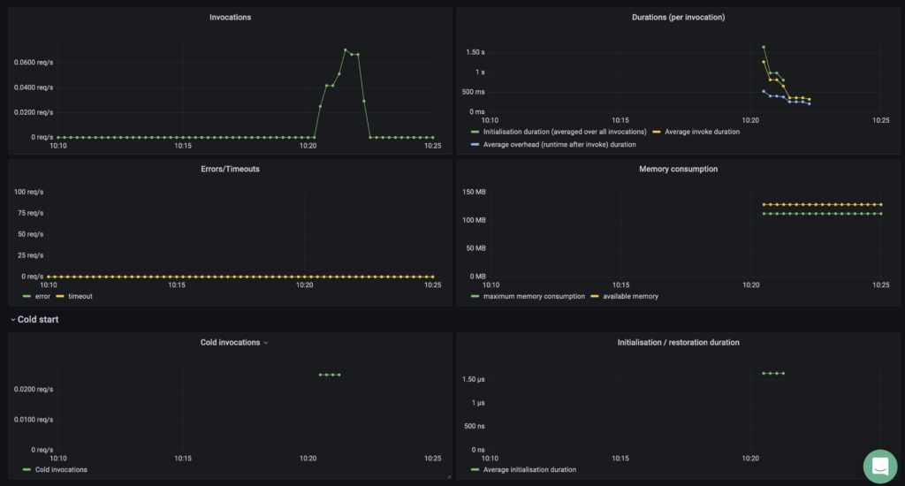
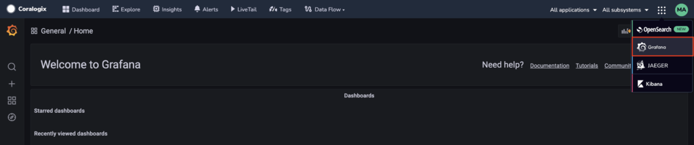
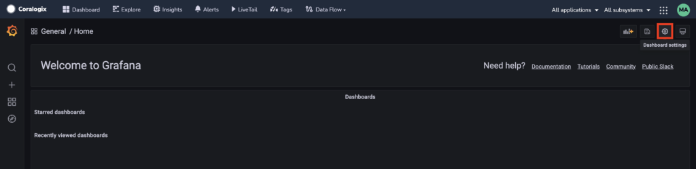
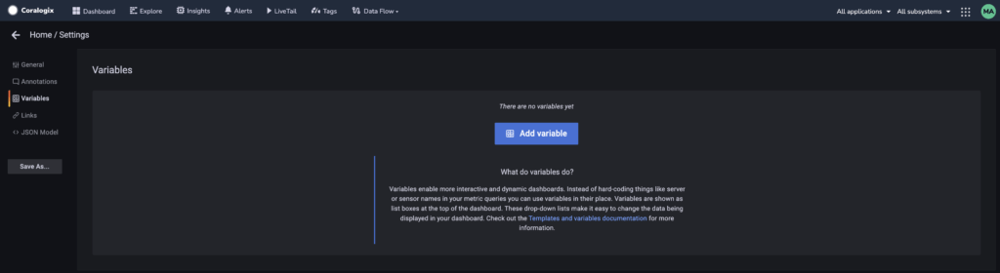
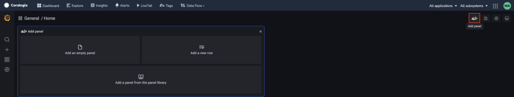

Interested in using the [Coralogix AWS Lambda Telemetry Exporter](https://coralogixstg.wpengine.com/docs/coralogix-aws-lambda-telemetry-exporter/) v.0.2.0 to collect and send us Lambda function metrics? This tutorial provides two methods for setting up a dashboard for monitoring a single Lambda function:

- Import a pre-built dashboard to Granfana (**recommended**)

- Manually create a dashboard that fits your specific needs

## Import a Pre-Built Dashboard

**STEP 1**. Download the attached [JSON file](https://coralogixstg.wpengine.com/wp-content/uploads/2024/01/AWS-Lambda-Telemetry-Multi.json).

**STEP 2**. Import the file to Grafana as a pre-built dashboard.

## Create a Dashboard

Use the example presented here to create a dashboard that fits your specific needs.

**STEP 1**. Create a new Coralogix - Grafana dashboard.

- Select **Grafana** in the upper right-hand menu of your Coralogix dashboard.

- Click **Dashboard settings**

**STEP 2.** Create a new variable

- Select **Variables** in the left-hand menu > Click **Add variable**

- Create a new variable with the input below > Click **update**
    - **Name**: `faas_name`
    
    - **Type**: `Constant`
    
    - **Value**: Input the Lambda function that you wish to monitor. (Using a constant will make it easy to replicate the dashboard for other functions in the future.)

**STEP 3.** Create panels.

- Create an ‘**Invocations’** panel. Click **Add panel** > **Add empty panel**

- Set options:
    - Panel options > Title = `Invocations`
    
    - Legend > Legend mode = `Hidden`
    
    - Standard options > Unit = `requests/sec (rps)`
    
    - Standard options > Min = `0`

- Add queries:
    - `sum(increase(faas_executions_total{faas_name="$faas_name"}[1m])) OR on() vector(0)`

- Create a ‘**Durations’** panel (per invocation). Click **Add panel** > **Add empty panel**
    - Set options:
        - Panel options → Title = `Durations (per invocation)`
        
        - Standard options → Unit = `milliseconds (ms)`
        
        - Standard options → Min = `0`
    
    - Add queries:
        - `sum(increase(faas_init_duration_ms_sum{faas_name="$faas_name"}[1m])) / sum(increase(faas_invoke_duration_ms_count{faas_name="$faas_name"}[1m]))` with Legend = `Initialisation duration (averaged over all invocations)`
        
        - `sum(increase(faas_restore_duration_ms_sum{faas_name="$faas_name"}[1m])) / sum(increase(faas_invoke_duration_ms_count{faas_name="$faas_name"}[1m]))` with Legend = `Restoration duration (averaged over all invocations)`
        
        - `sum(increase(faas_invoke_duration_ms_sum{faas_name="$faas_name"}[1m])) / sum(increase(faas_invoke_duration_ms_count{faas_name="$faas_name"}[1m]))` with Legend = `Average invoke duration`
        
        - `sum(increase(faas_overhead_duration_ms_sum{cx_subsystem_name="lambda-telemetry-test"}[1m])) / sum(increase(faas_invoke_duration_ms_count{cx_subsystem_name="lambda-telemetry-test"}[1m]))` with Legend = `Average overhead (runtime after invoke) duration`

- Create an ‘**Errors/Timeouts’** panel. Click **Add panel** > **Add empty panel**
    - Set options:
        - Panel options > Title = `Errors/Timeouts`
        
        - Standard options > Unit = `requests/sec (rps)`
        
        - Standard options > Min = `0`
    
    - Add queries:
        - `sum(increase(faas_errors_total{faas_name="$faas_name"}[1m])) OR on() vector(0)` with Label = `errors`
        
        - `sum(increase(faas_timeouts_total{faas_name="$faas_name"}[1m])) OR on() vector(0)` with Label = `timeouts`

- Create a ‘**Memory Consumption’** panel. Click **Add panel** > **Add empty panel**
    - Set options:
        - Panel options > Title = `Memory Consumption`
        
        - Standard options > Unit = `megabytes`
        
        - Standard options > Min = `0`
    
    - Add queries:
        - `max(faas_mem_usage_MB{faas_name="$faas_name"})` with Label = `maximum memory consumption`
        
        - `max(faas_mem_limit_MB{faas_name="$faas_name"})` with Label = `available memory`

- Create a ‘**Cold Invocations’** panel. Click **Add panel** > **Add empty panel**
    - Set options:
        - Panel options > Title = `Cold Invocations`
        
        - Standard options > Unit = `requests/sec (rps)`
        
        - Standard options > Min = `0`
    
    - Add queries:
        - `sum(increase(faas_init_duration_ms_count{faas_name="$faas_name"}[1m]))` with Label = `Cold invocations`
        
        - `sum(increase(faas_restore_duration_ms_count{faas_name="$faas_name"}[1m]))` with Label = `Restorations`

- Create an ‘**Initialization / Restoration Duration’** panel. Click **Add panel** > **Add empty panel**
    - Set options:
        - Panel options > Title = `Initialization / Restoration Duration`
        
        - Standard options > Unit = `milliseconds (ms)`
        
        - Standard options > Min = `0`
    
    - Add queries:
        - `sum(increase(faas_init_duration_ms_sum{faas_name="$faas_name"}[1m])) / sum(increase(faas_init_duration_ms_count{faas_name="$faas_name"}[1m]))` with Label = `Cold invocations`
        
        - `sum(increase(faas_restore_duration_ms_sum{faas_name="$faas_name"}[1m])) / sum(increase(faas_restore_duration_ms_count{faas_name="$faas_name"}[1m]))` with Label = `Average restoration duration`

**STEP 4.** Organize panels.

- Click **Add panel** > **Add new row**

- Set Title: `Cold start`

- Adjust the panels as displayed in the image below

**STEP 5.** Enjoy your Lambda Function Dashboard!

## Support

**Need help?**

Our world-class customer success team is available 24/7 to walk you through your setup and answer any questions that may come up.

Contact us **via our in-app chat** or by emailing [support@coralogixstg.wpengine.com](mailto:support@coralogixstg.wpengine.com).
