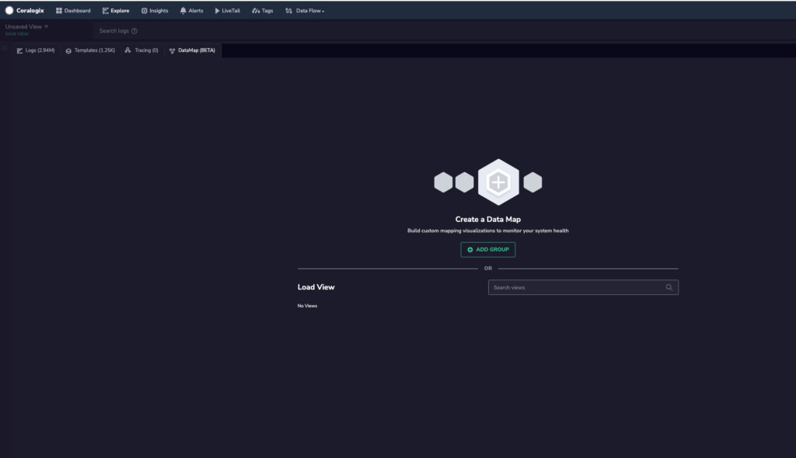
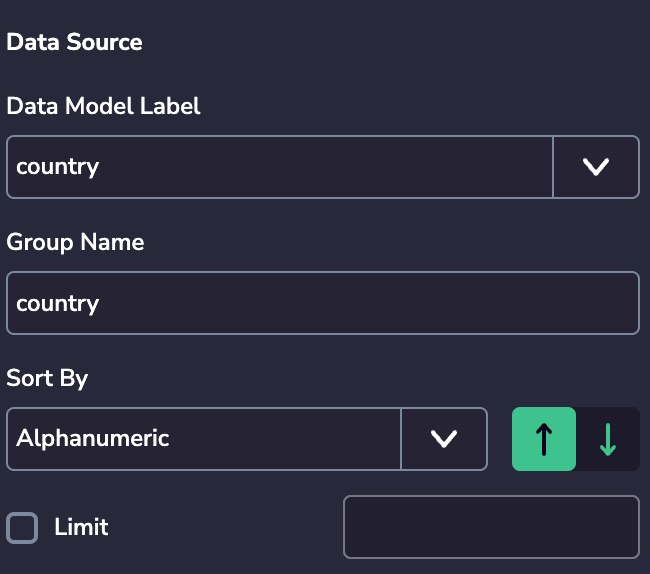
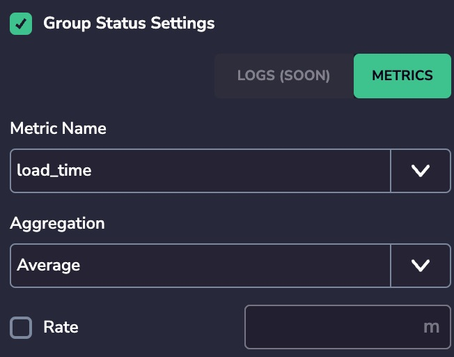
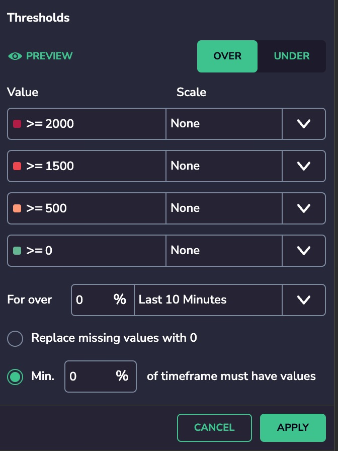
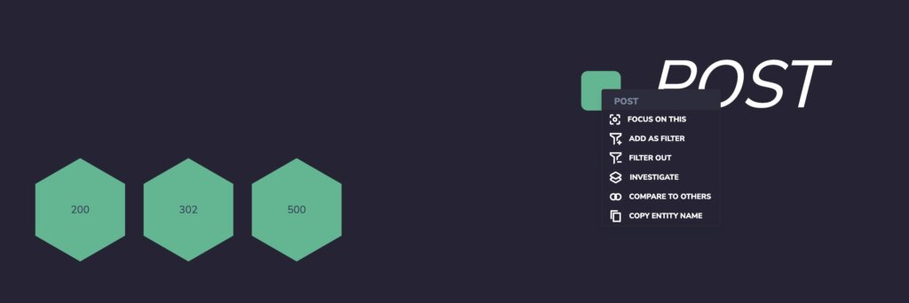
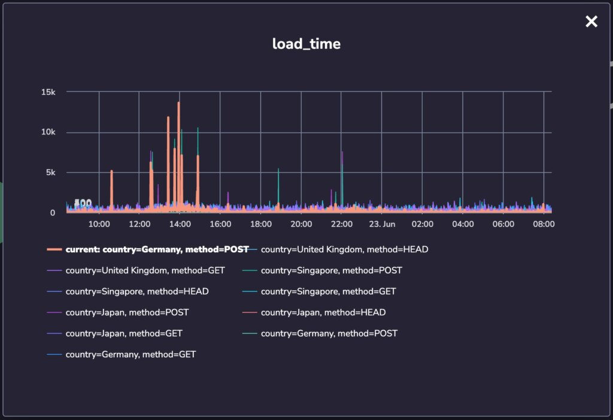
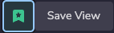
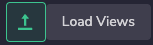

DataMap is a new way to create a visual layer for your data, whether logs, metrics, or security. This enables you to combine infrastructure metrics, business metrics, and log data, and then compose maps that represent the structure and quality of your business.

DataMaps are unlimited. Any metric, label, or log key can be utilized to represent a different way for you to understand your data. 

By creating multiple POVs, based on different perspectives and goals, you can unlock more dimensions of the same log or metric records. 

**Example #1:** 

A host can represent a dimension you want to monitor with criteria based on infrastructure metrics, but it is also the home of your k8s pods and can be used as a way to group them under a cloud resource. 

**Example #2:** 

A log key representing 'country' can be used to monitor the performance that your users are experiencing based on their location. It can also be used as the drill-down layer when you want to check which countries are affected by a specific problematic k8s pod. 

DataMap consists of a **base metric** and **groups/labels** associated with them which define the map hierarchy.

It allows you to enrich any structure with a health status by applying metric or log-based thresholds to each hierarchy level in your map.

## Setup

- Under the Explore section - Click “DataMap” 

- Click on “+New Group” and choose the base Metric / Log criteria that will be used to define the structure of the map.

- Clicking  “Generate groups” will automatically retrieve, choose & arrange default labels from the chosen base metric or log criteria.  
      
    You can also customize the groups by choosing different labels and changing the order according to the map you want to build.

## Data source

**Group Name** - You can set any group name

**Sort By** - You can sort the metric values Alphanumeric, Direct Children Count, or Status

**Limit** - Limits the hierarchy level shown

## Group Status Settings

**Metric Name** - you can define the separate metric for the group

**Aggregation** - choose one of aggregations: Average, Maximum, Minimum, Count, Sum

**Rate** - set a rate in minutes

## Thresholds

**Preview** - When you manage a particular metric in the edit window, you can preview actual values so you can decide what thresholds to use by viewing actual values.

**Value** - set a threshold value and choose the scale if needed. Instead of writing 1000000000 you can put 1 and choose Giga as its scale. Scale options: None, Nano, Micro, Milli, Kilo, Mega, Giga, Tera, Peta

Each entity on the map can have 7 different colors based on thresholds and definitions: 

- Dark Grey - No threshold defined 

- Dark Red - Highest/Lowest threshold met (Negative)

- Dark Orange 

- Orange 

- Green - Highest/Lowest threshold met (Positive) 

- Grey - No threshold met 

- Stripes - No data for the selected timeframe 

These thresholds can be set for independent criteria for each group.

**For over X % Last Y Minutes** \- for over X% of the values should be over/under the threshold in the last Y minutes

**Replace missing values with 0** - if you want to take null values into the threshold calculations then you need to replace them with 0 - check this parameter.

**Min. X % of timeframe must have values** - Specify the percentage how much data must have values (Note: If there is no enough data then you get No Data results. This is why you might consider to enable Replace missing values with 0)

After you add thresholds to your groups, the map colors each of the groups separately and provides a top-down view of the data structure you have created. 

Below your map, you will have an interactive legend that allows you to:

- Choose the top-level hierarchy 

- Understand the base metric/log criteria by which the group was generated

- View the threshold defined per group

- Filter into specific statuses (cmd + click allows multi-selection)

Hovering over the title will display additional information.

## Drill Down

Each element on the map can be zoomed into, investigated and compared to other cells:

When investigating a metric criteria, you will receive a 24H graph of the metric, with the thresholds marked on the graph. 

When "Compare to others" is clicked then you will receive a 24H graph with metrics so you can compare the chosen cell to a random 10 series from the same group, and see how it differs from the rest.

Save view - With save view you can share or back up a copy of your views.

Load view - allows you to import a view from another team or upload a backup copy

## DataMap Label Mapping

_When to use DataMap Label Mapping?_

The **DataMap Label Mapping** feature has been introduced to address the following scenario:  
  
1\. Metrics have been defined by one or several teams for the same system (for example a Kubernetes cluster).  
  
2\. At least one (or more) labels used to define the metrics use different names for the same information.

3\. Using DataMap Label Mapping we can “join” those metrics, which would otherwise appear to be unrelated in a DataMap.

Let’s illustrate this feature with the following example.

Please consider the following set of metrics:  
1\. elasticsearch\_os\_load15 (partial columns included in the screenshot):  
  
2\. elastic\_client\_proxy\_client\_failures (partial columns included in the screenshot):

Please note how both CX\_LEVEL and CX\_ENV\_ID contain the same information.

3\. Now let’s look at a portion of the DataMap definition:Please note how it indicates: “1 labels were renamed”.

4\. If we drill down into this by clicking “EDIT”, we will see how the Label Mapping was defined:

**Now if you need to do the same for your DataMap, please follow these steps:**

1. From the “Group Status Settings” of the label you would like to create the Data Mapping for, please click the 3 dots on the right side:

3. Select “LABEL MAPPING”:

5. Define the Mapping matching the correct labels:

7. Click “SAVE” on the button right of the UI:

That’s it; you have successfully created your DataMap Label Mapping.

Are you interested in using the DataMap feature?
