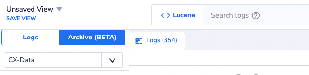
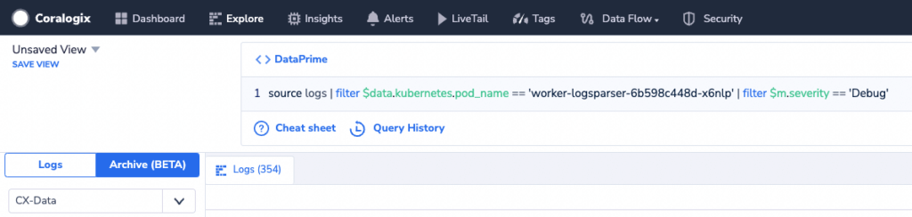
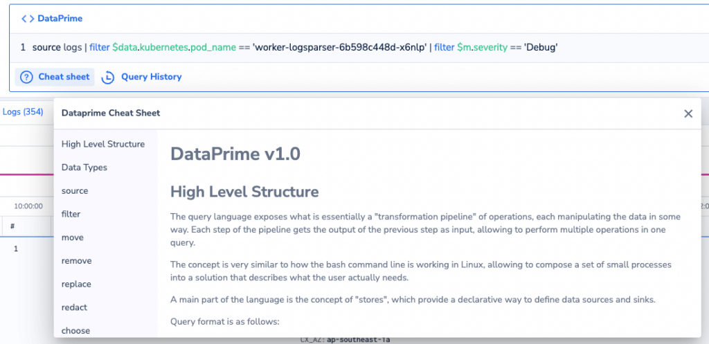

**DataPrime** is Coralogix's next-generation query and data discovery language. It's a piped language that provides users with a simple yet powerful way to describe event transformations and aggregations. The balance between simplicity and power is achieved by having a rather small set of idioms that encapsulate event structure transformation while supporting the use of standard JavaScript expressions to describe value transformations.

DataPrime is currently enabled to 'Explore' your logs in archive mode. To query your archive with DataPrime, enable the [CX-Data format bucket](https://coralogixstg.wpengine.com/docs/archive-query-from-logs-screen/#:~:text=the%20following%20screen%3A-,(BETA)%20CX%2DData%20Archive%20Format,-Note%3A%20This%20new).

## Overview

Use our innovative DataPrime syntax language not only to query your data, but **transform** it using a series of operations in a manner that it meaningful for you.

Use DataPrime to:

- **Calculate.** Take a set of data and filter on top of it.

- **Extract.** Apply logic to unstructured data and transform it into calculable numbers.

- **Aggregate**. Generate new analytics for your business.

- **Transform Data**. Transform data with functions creating new fields or replacing existing ones.

The language operates in a manner similar to the bash command line in Linux, allowing the user to compose a set of small processes to achieve a particular goal.

## Query Format

Query format is as follows:

```
source logs | operator ... | operator ... | operator | ...

```

Any whitespace between operators is ignored, allowing you to write queries as readable, multiline queries. For example:

```
source logs
  | operator1 ....
  | operator2 ....
  | ...

```

## Data Types

These are the data types currently supported:

- `string`

- `number`/`num` - A number (double or integer)

- `boolean` - A boolean type, with `true` or `false` values

- `null` - A null value

- `timestamp` - A UTC timestamp in nanoseconds

- `interval` - A time span in nanoseconds

## Language Constructs

All language constructs that are supported:

- Constants: strings, numbers, booleans, regular expressions, `null`

- Nested field access

- Basic math operations: `+`, `-`, `*`, `\`, `%`

- Boolean operations: `&&`, `||`, `!`

- Equality and comparison: `==`, `!=`, `<`, `<=`, `>`, `>=`

- Text search: `~`, `~~`

- String interpolation

- Timestamp expressions and interval literals

- Casting an expression to a desired data type: e.g. `$d.temperature:number`. Type inference is automatically applied when possible to reduce the need for casting.

## Field Access

Accessing nested data is done by using a keypath, similar to any programming language or json tool. Keys with special characters can be accessed using a map-like syntax, with the key string as the map index, e.g. `$d.my_superkey['my_field_with_a_special/character']`.

```
$m.timestamp
$d.my_superkey.myfield
$d.my_superkey['my_field_with_a_special/character']
$l.applicationname

```

## String Interpolation

- `` `this is an interpolated {$d.some_keypath} string` `` - `{$d.some_keypath}` will be replaced with the evaluated expression that is wrapped by the brackets

- ``` `this is how you escape \{ and \} and \`` ``` - Backward slash (`\`) is used to escape characters like `{`, `}` that are used for keypaths.

## Text Search

Boolean expressions for text search:

- `$d.field ~ 'text phrase'` - case-insensitive search for a text phrase in a specific field.

- `$d ~~ 'text phrase'` - case-insensitive search for a text phrase in `$d`.

## Timestamp Expressions

Expressions prefixed by `@` are timestamp expressions and always return a timestamp. They can be either literals (`@number` or `@'string'`) which are validated at query compilation time, or dynamic expressions (`@expression`) which is evaluated at query runtime based on the expression's data type.

- Number timestamp literals:
    - Seconds (10 digits), e.g. `@1234567890`
    
    - Milliseconds (13 digits), e.g. `@1234567890123`
    
    - Microseconds (16 digits), e.g. `@1234567890123456`
    
    - Nanoseconds (19 digits), e.g. `@1234567890123456789`

- String timestamp literals:
    - ISO 8601 dates, e.g. \`@'2023-08-07'
    
    - ISO 8601 date/time, e.g. `@'2023-08-07T19:06:42'`
    
    - ISO 8601 date/time with time zone, e.g. `@'2023-08-07T19:06:42+03:00'`

- Dynamic expressions:
    - Numbers are interpreted as nanoseconds, e.g. `@($d.ts_millis * 1000000)`.
    
    - Strings are parsed to a timestamp on a best-effort basis, e.g. `` @`2023-08-{$d.day}` ``. For extended and customizable timestamp parsing, see parseTimestamp.
    
    - A timestamp expression of any other data type returns `null`.

## Interval Literals

An interval literal represents a span of time in a normalized and human-readable format, `NdNhNmNsNmsNusNns` where `N` is the amount of each time unit. The following rules apply:

- It consists of time unit components - a non-negative integer followed by the short time unit name. Supported time units are: `d`, `h`, `m`, `s`, `ms`, `us`, `ns`.

- There must be at least one time unit component.

- The same time unit cannot appear more than once.

- Components must be decreasing in time unit order - from days to nanoseconds.

- It can start with `-` to represent negative intervals.

## Timestamp Math

In addition to timestamp expressions and interval literals, Dataprime supports math operations between them:

- `timestamp + interval`: adds an interval to a timestamp

- `timestamp - interval`: subtracts an interval from a timestamp

- `timestamp - timestamp`: calculates the interval between two timestamps

- `timestamp / interval`: rounds a timestamp to the nearest interval

- `interval + interval`: adds two intervals together

- `interval - interval`: subtracts one interval from another

- `interval * number`: multiplies an interval by a numeric factor

## Scalar Functions

Various functions can be used to transform values. All functions can be called as methods as well, e.g. `$d.msg.contains('x')` is equivalent to `contains($d.msg,'x')`.

Returns the IP prefix of a given ip\_address with subnetSize bits (e.g.: `192.128.0.0/9`).

### UUID Functions

#### isUuid

`isUuid(uuid: string): bool`

- `interval` (required) - the interval to format.

- `scale` (optional) - the largest time unit of the interval to show. Defaults to `nano`.

```
# Example:
limit 3 | choose formatInterval(now() - $m.timestamp, 's') as i
# Results:
{ "i": "122s261ms466us27ns"  }
{ "i": "122s359ms197us227ns" }
{ "i": "122s359ms197us227ns" }
```

#### formatTimestamp

`formatTimestamp(timestamp: timestamp, format: string?, tz: string?): string`

Function parameters:

- `timestamp` (required) - the timestamp to format.

- `format` (optional) - a date/time format specification for parsing timestamps. The following format options are supported:
    - `'%Y-%m-%d'` - print the date only, e.g. `'2023-04-05'`
    
    - `'%H:%M:%S'` - print the time only, e.g. `'16:07:33'`
    
    - `'%F %H:%M:%S'` - print both date and time, e.g. `'2023-04-05 16:07:33'`
    
    - `'iso8601'` - print a timestamp in ISO 8601 format, e.g. `'2023-04-05T16:07:33.123Z'`
    
    - `'timestamp_milli'` - print a timestamp in milliseconds (13 digits), e.g. `'1680710853123'`

- `tz` (optional) - the destination time zone to convert the timestamp before formatting

```
# Example 1: print a timestamp with default format and +5h offset
limit 1 | choose $m.timestamp.formatTimestamp(tz='+05') as ts
# Result 1:
{ "ts": "2023-08-29T19:08:37.405937400+0500" }

# Example 2: print only the year and month
limit 1 | choose $m.timestamp.formatTimestamp('%Y-%m') as ym
# Result 2:
{ "ym": "2023-08" }

# Example 3: print only the hours and minutes
limit 1 | choose $m.timestamp.formatTimestamp('%H:%M') as hm
# Result 3:
{ "hm": "14:11" }

# Example 4: print a timestamp in milliseconds (13 digits)
limit 1 | choose $m.timestamp.formatTimestamp('timestamp_milli') as ms
# Result 4:
{ "ms": "1693318678696" }
```

#### parseInterval

`parseInterval(string: string): interval`

Parses an interval from a `string` with format `NdNhNmNsNmsNusNns` where `N` is the amount of each time unit. Returns `null` when the input does not match the expected format.

```
# Example 1: parse a zero interval
limit 1 | choose '0s'.parseInterval() as i
# Result 1:
{ "i": "0ns" }

# Example 2: parse a positive interval
limit 1 | choose '1d48h0m'.parseInterval() as i
# Result 2:
{ "i": "3d" }

# Example 3: parse a negative interval
limit 1 | choose '-5m45s'.parseInterval() as i
# Result 3:
{ "i": "-5m45s" }
```

Function parameters:

- `string` (required) - the input from which the timestamp will be extracted.

- `format` (optional) - a date/time format specification for parsing timestamps. The following format options are supported:
    - `'auto'` (default) - attempt to parse a timestamp on a best-effort basis
    
    - `'iso8601'` / `'iso8601bare'` - ISO 8601 format with / without a time zone resp.
    
    - `'timestamp_second'` / `'timestamp_milli'` / `'timestamp_micro'` / `'timestamp_nano'` - timestamp in seconds / milliseconds / microseconds / nanoseconds (10/13/16/19 digits) resp.
    
    - Custom [timestamp formats](https://coralogixstg.wpengine.com/docs/dataprime-specifying-timestamp-formats/)
    
    - `'format1|format2|...'` - a cascade of formats to attempt in sequence

- `tz` (optional) - a time zone override to convert the timestamp while parsing. This parameter will override any time zone present in the input. A time zone can be extracted from the string by using an appropriate format and omitting this parameter.

```
# Example 1: parse a date with the default format
limit 1 | choose '2023-04-05'.parseTimestamp() as ts
# Result 1:
{ "ts": 1680652800000000000 }

# Example 2: parse a date in US format
limit 1 | choose '04/05/23'.parseTimestamp('%D') as ts
# Result 2:
{ "ts": 1680652800000000000 }

# Example 3: parse date and time with units
limit 1 | choose '2023-04-05 16h07m'.parseTimestamp('%F %Hh%Mm') as ts
# Result 3:
{ "ts": 1680710820000000000 }

# Example 4: parse a timestamp in seconds (10 digits)
limit 1 | choose '1680710853'.parseTimestamp('timestamp_second') as ts
# Result 4:
{ "ts": 1680710853000000000 }
```

Case expressions are special constructs in the language that allow choosing between multiple options in an easy manner and in a readable way. They can be wherever an expression is expected.

## Getting Started

Find a list of namespaces, example expressions, operator syntax, and more in our [DataPrime Quick-Start Guide](/docs/dataprime-quick-start-guide/).  
  
**\[NEW\] DataPrime** now supports Data Aggregation, for more information and examples please refer to the [DataPrime Cheat Sheet](https://coralogixstg.wpengine.com/docs/dataprime-cheat-sheet/).

DataPrime and Lucene are both optional for querying your Archive and Logs (Under "Explore"). You should click the currently active language label toggle between the two languages, Clicking <>Lucene would switch to <>DataPrime and vice versa.





While in DataPrime mode, 2 additional buttons are enabled:  
\- **Cheat sheet:** A detailed sheet that includes all the schemes and language basics with examples  
\- **Query History:** For reusing your historical DataPrime queries



## Main Concepts

### Stages

A query is composed of multiple stages, e.g. (Do X and then do Y and then...). The syntax is essentially based on bash-like pipes where each stage's output is piped into the next one.

### Keypaths

DataPrime can handle fully-nested data. Nested keys are written as 'keypaths', (i.e. `key.subkey.subkey`) and are handled in a granular way, meaning that operations happen only on the relevant keys, leaving other nested keys intact.

For example, creating a new keypath `stats.mykey` will either create a new key called `mykey` in an existing `stats` superkey, or create the entire path - a top-level object called `stats` and within it, a subkey called `mykey`.

### Expressions

The language contains a small set of idioms for structure transformation. A large part of its power comes from the ability to use JavaScript-like expressions in various places throughout the language. This allows for describing rich value transformations without resorting to special language-constructs, or to actual code.

Several predefined scopes/namespaces are available for expressions. The main ones are the following:

```
$d / $data
```

The user-data. For raw data, it's the event data itself, but after aggregations, this could be the aggregation results

```
$m / $metadata
```

Engine-related event metadata, such as the `timestamp` and the `logid`

```
$l / $labels
```

User-managed event labels. Flat, key/values (strings only)

#### **Example expressions**

Refer to the `my_text` field in the input:

```
$d.my_text
```

Refer to the key `key` inside the key `stats`:

```
$d.stats.key
```

The result of multiplying the value of the `radius` key and 8:

```
$d.radius * 8
```

The logical timestamp of the event:

```
$m.timestamp
```

The application name of the event:

```
$l.applicationName
```

Evaluated expressions have a dynamic data type, similar to any javascript code. It's the job of DataPrime to track these data types when they're applied as values of keys.

### Extractions

Data extractions are natively supported by the language, and are extendable, meaning that multiple types of extractions are supported, and new ones can be added without changing the structure of the language.

**Examples of extraction types:**

Extract a string into a new object containing captured data from the string:

```
regexp
```

Extracting key-value pairs from a string into a new object:

```
kv
```

Creating a new object from a json encoded as a string:

```
jsonobject
```

Splitting a string into a new array of native elements:

```
split
```

### Store

A `Store` is the definition of some storage mechanism for data. This could be a Kafka topic or an S3 location, for example, and includes metadata about the content structure, schema, and primary key (used for enrichments).

## Limitations

### Tokenized Form

In high tier, Coralogix saves text fields longer than 256 symbols only in tokenized form, without special characters and [stop words](https://www.elastic.co/guide/en/elasticsearch/reference/current/analysis-stop-tokenfilter.html). DataPrime functions that operate on such string fields return no results.

### No Keypath Adjustments

Dataprime does not have keypath adjustments. If a keypath contains dots, you are **required** to use bracket access syntax to refer to this keypath in archive mode.

## Additional Resources

<table><tbody><tr><td><a href="https://coralogixstg.wpengine.com/docs/dataprime-quick-start-guide/">DataPrime Quick-Start Guide</a></td></tr><tr><td><a href="Glossary: DataPrime Operators &amp; Expressions">Glossary: DataPrime Operators &amp; Expressions</a></td></tr><tr><td><a href="https://coralogixstg.wpengine.com/docs/dataprime-cheat-sheet/">DataPrime Cheat Sheet</a></td></tr></tbody></table>
