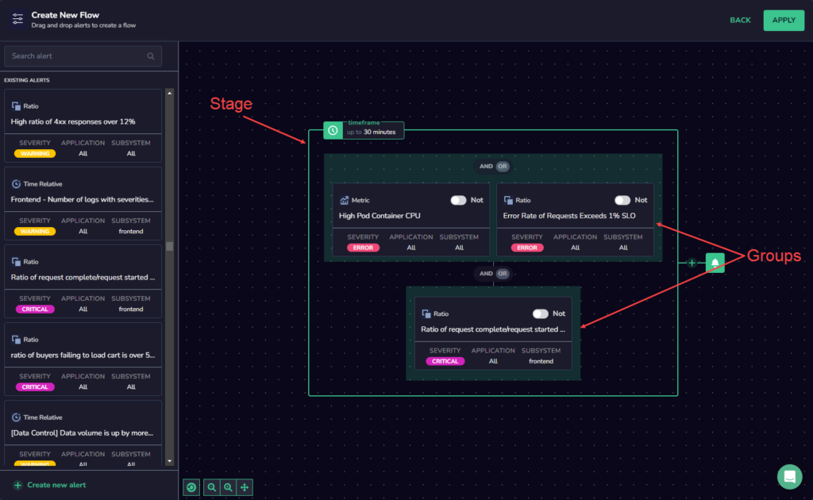
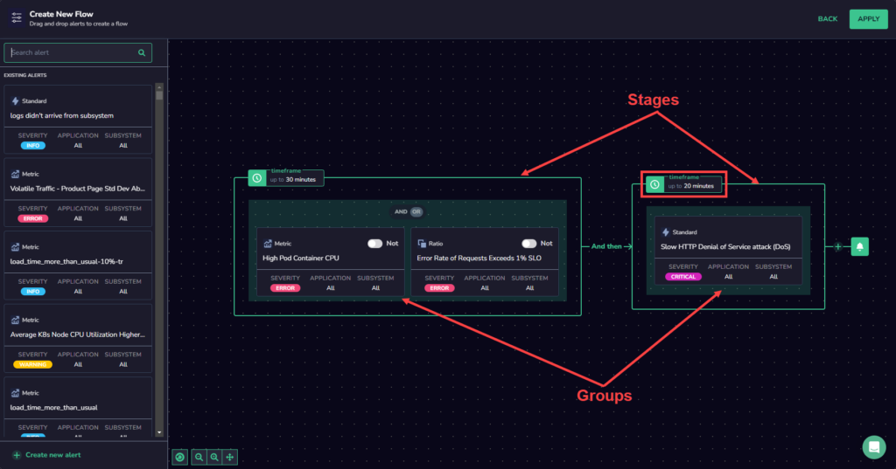
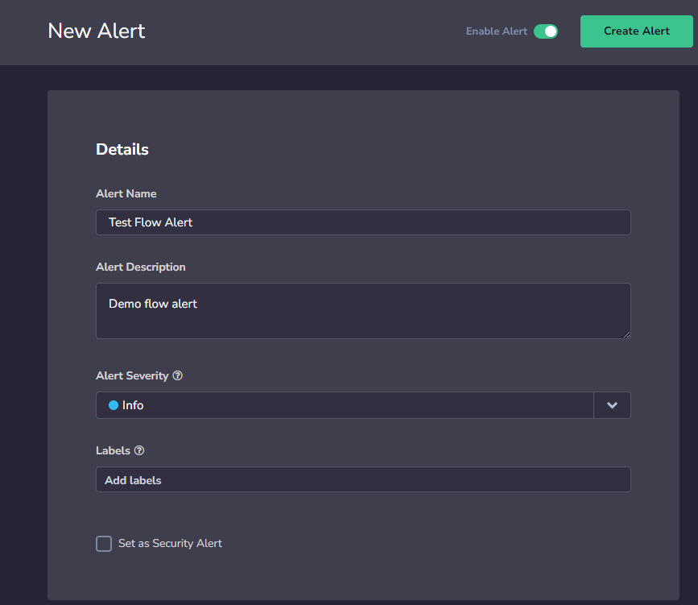
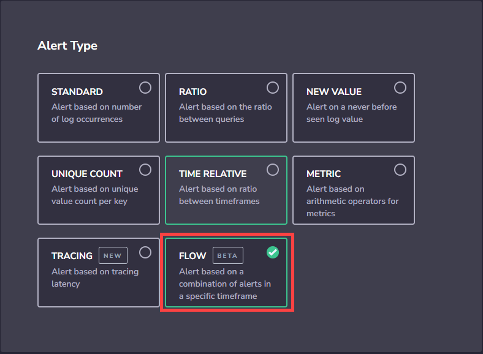
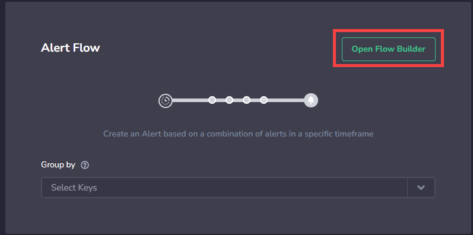
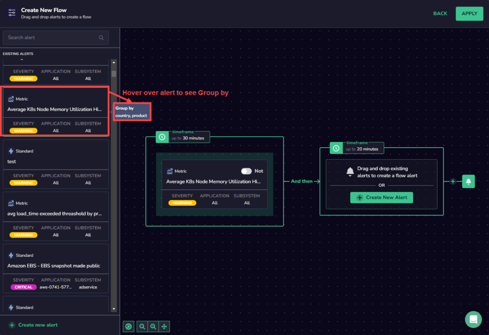
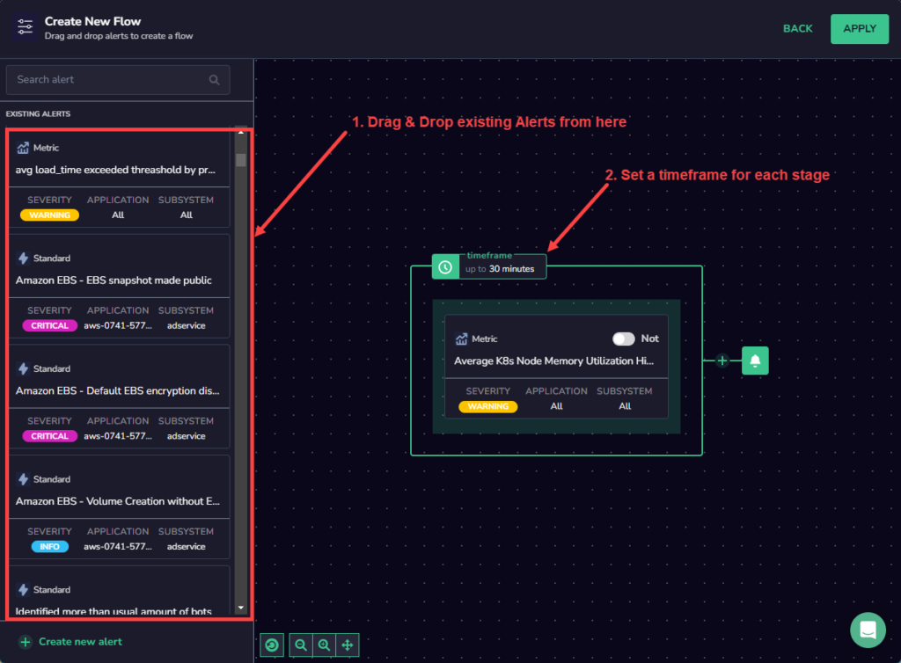
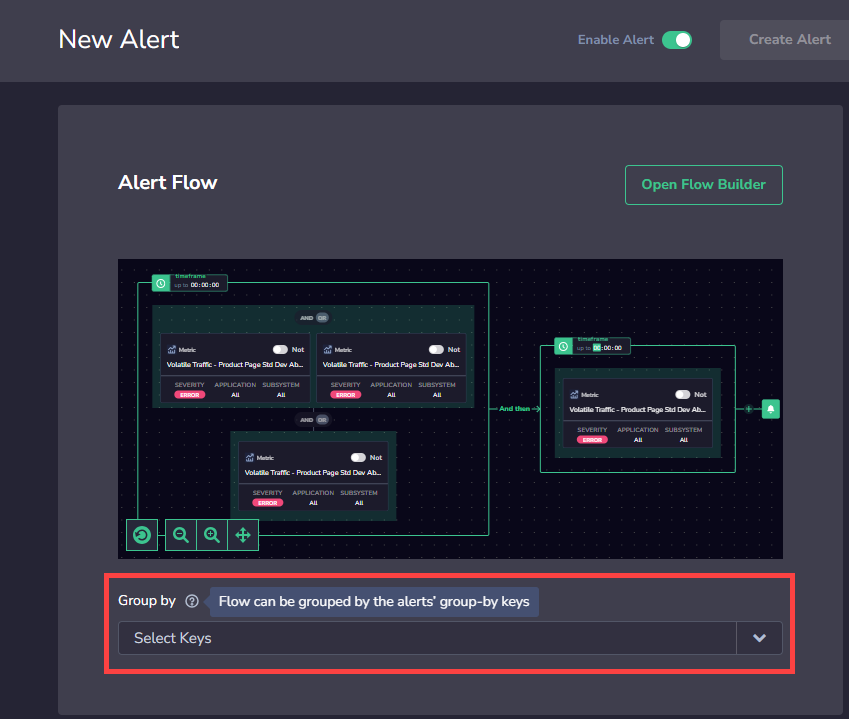
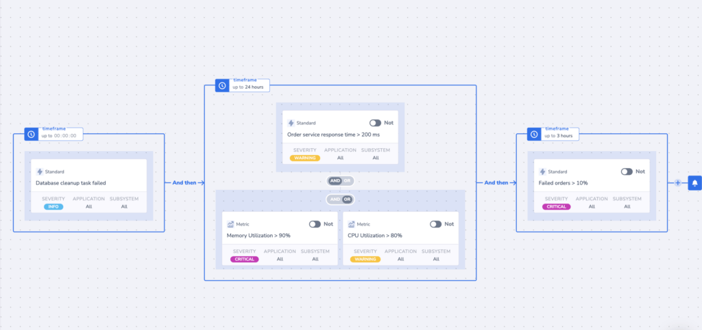

Coralogix **Flow Alerts** provide a revolutionary data monitoring and analysis approach, allowing you to harness the power of logs, metrics, traces, and security in a single, streamlined platform. They not only notify you of a problem in your system but also allow you to understand its cause and how to prevent it in the future.

## **Overview**

A Flow Alert is designed to notify you when any combination of alert events occurs in a specific **sequence** within a defined **timeframe.**

For example, to be notified of an increase in HTTP error rate caused by high CPU utilization, a Flow Alert should be configured to trigger when a high CPU utilization alert is followed by a high HTTP error rate alert within a defined timeframe.

### Benefits

Here are some significant benefits of using Flow Alerts:

- **Comprehensive Data Correlation:** With Coralogix Flow Alerts, you can correlate alerting on logs, metrics, traces, and security events. This multifaceted approach provides a holistic view of your system's performance, not just isolated slices of information, ensuring you have all the data you need to make informed decisions.

- **Advanced Root Cause Analysis:** Coralogix Flow Alerts can be configured to identify the root cause of an issue. With the ability to define an alert that already pinpoints the root cause, you can promptly respond to issues, thus reducing system downtime and enhancing operational efficiency.

- **Reduced Alert Fatigue:** Traditional monitoring systems often flood users with redundant alerts, leading to alert fatigue and the potential overlooking of critical issues. Coralogix Flow Alerts significantly reduce false alerts by applying an ordered, time-bound criteria filter. This means you only get alerted when all the set conditions are met, saving you from unnecessary notification noise.

- **Customizable Alert Sequences:** Flow Alerts' unique feature allows you to define your alerting sequence with a simple drag-and-drop interface. Create a flow that triggers only if all criteria are met by order and time, providing an intuitive and custom monitoring experience.

- **Efficient Troubleshooting:** With the ability to visualize the sequence of alerts on a canvas, troubleshooting becomes easier and more efficient. You can easily identify patterns, understand the chain of events leading to an alert, and quickly act to rectify the issue.

- **Optimized Resource Utilization:** By reducing false alerts and enabling root cause identification, you'll save significant time and resources. This optimization allows your team to focus on more strategic tasks, rather than being occupied with a constant stream of false alerts.

### Building Blocks

Coralogix provides the Flow Builder tool to visually combine, and then chain together, the [user-defined alerts](https://coralogixstg.wpengine.com/docs/coralogix-user-defined-alerts/) that will trigger a Flow Alert. The basic building blocks of the Flow Alert are **stages** and **groups**.

A group represents a logical combination of individual user-defined alerts. The group supports **OR**, **AND,** and **NOT** logical operators to combine multiple individual alerts.

A stage represents alert groups that need to trigger within a specified timeframe. Multiple groups can be present in a stage.

### Limitations

As you define a flow alert, consider the following constraints:

- The Flow Alert must have a minimum of 2 stages.

- The first stage of a flow alert can only contain 1 group.

- The duration of the timeframe in all stages cannot exceed 36 hours.

- You can combine a maximum of 30 alerts into a single Flow alert.

- The following alert types do not support the **NOT** logical operator:
    - New Value alerts
    
    - Unique Count alerts
    
    - Notify immediately
    
    - Standard alerts

## **Create a Flow Alert**

**STEP 1**. Create a new alert. Enter the Alert Name, Description, and Severity.

**STEP 2**. Select the Alert type: Flow Alert**.**

**STEP 3**. Define the Alert Flow by clicking **Open Flow Builder**.

**STEP 4**. Drag and drop existing alerts from the left-hand panel into the Flow Builder workspace area. To view a tool-tip with the details for each alert, hover over the alert. These details include the **Query**, **Conditions**, and **Group By** fields.

**STEP 5**. Organize the alerts into groups and stages as explained above. Remember to set a timeframe for each stage.

**STEP 6**. Click **Apply** to save the Alert Flow.

**STEP 7**. Select the **Group By** keys.

> Note that the available keys will be the intersection group between the different alerts. For example, if Alert A is grouped by `Region` and by `Cluster`, and Alert B is grouped by `Region` and by `Pod`, the Alert Flow will only be able to be grouped by `Region`, and not by `Cluster` or `Pod`, as that is the only **Group by** option available to both alerts in the flow. You can see which **Group by** options are available for each alert in the **Alert Builder** by hovering over the alert and viewing the **Alert Description**.
> 
> 

**STEP 8**. Define the Notification settings.

In the notification settings, you have different options, depending on whether or not you are using the **Group By** condition.

When using **Group By** conditions, you will see the following options:

- **Trigger a single alert when at least one combination of** the group by values meets the condition. A single notification, aggregating all values matching an alert query and conditions, will be sent to your Coralogix Incidents screen.

- **Trigger a separate alert for each combination that meets the condition**. Multiple individual notifications for each Group By field value may be sent to your Coralogix Incidents screen when query conditions are met. Select one or more Keys – consisting of a subset of the fields selected in the alert conditions – in the drop-down menu. A separate notification will be sent for each Key selected.

- The number of **Group By** permutations is limited to 1000. If there are more permutations, then only the first 1000 are tracked.

When **not** using the **Group By** condition, **a single alert will be triggered** and sent to your [Incidents Screen](https://coralogixstg.wpengine.com/docs/incidents/) when the query meets the condition.

You can define additional alert recipient(s) and notification channels in both cases by clicking **\+ ADD WEBHOOK**. Once you add a webhook, you can choose the parameters of your notification:

- **Notify Every**. Sets the alert cadence. After an alert is triggered and a notification is sent, the alert will continue to work, but notifications will be suppressed for the duration of the suppression period.

- **Notify when resolved**. Activate to receive an automatic update once an alert has ceased.

**STEP 9**. Create an Alert Schedule.

**STEP 10**. Create Notification Content for the Flow Alert.

**STEP 11**. Click **Create Alert**.

## View Your Alert

Our [Incidents Screen](https://coralogixstg.wpengine.com/docs/incidents/) displays all of your triggered alert events within the Coralogix platform. View all those events that are currently triggered or those triggered within a specific time frame. With easy-to-use functionalities and the ability to drill down into events of interest, the feature ensures top-notch monitoring and analysis.

## Example

The following example notifies you when successful orders are reduced due to a failed database cleanup task that occurred 24 hours earlier.

## Support

**Need help?**

Our world-class customer success team is available 24/7 to walk you through your setup and answer any questions that may come up.

Feel free to reach out to us **via our in-app chat** or by sending us an email at [support@coralogixstg.wpengine.com](mailto:support@coralogixstg.wpengine.com).
