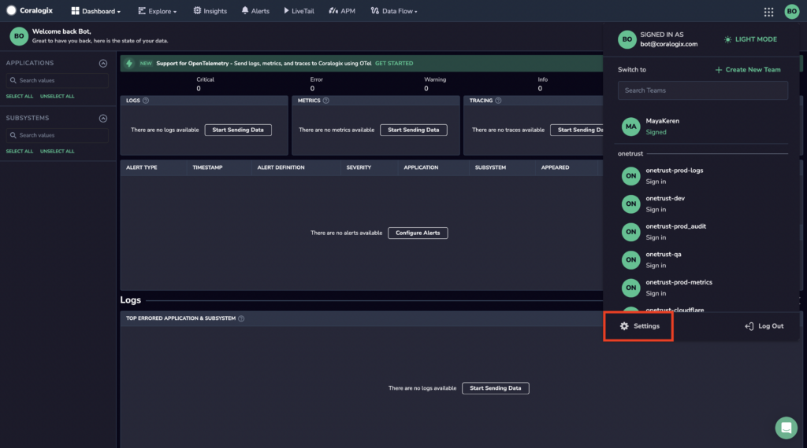
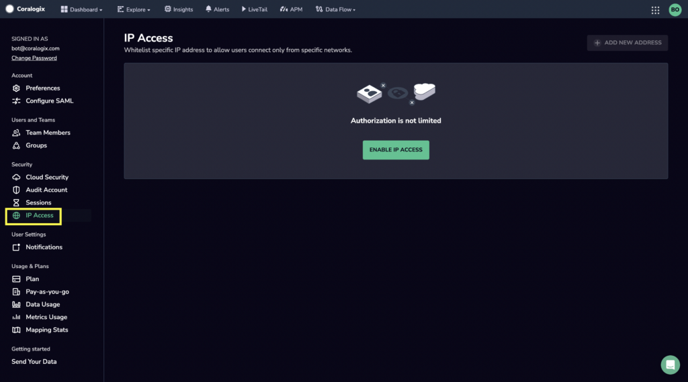
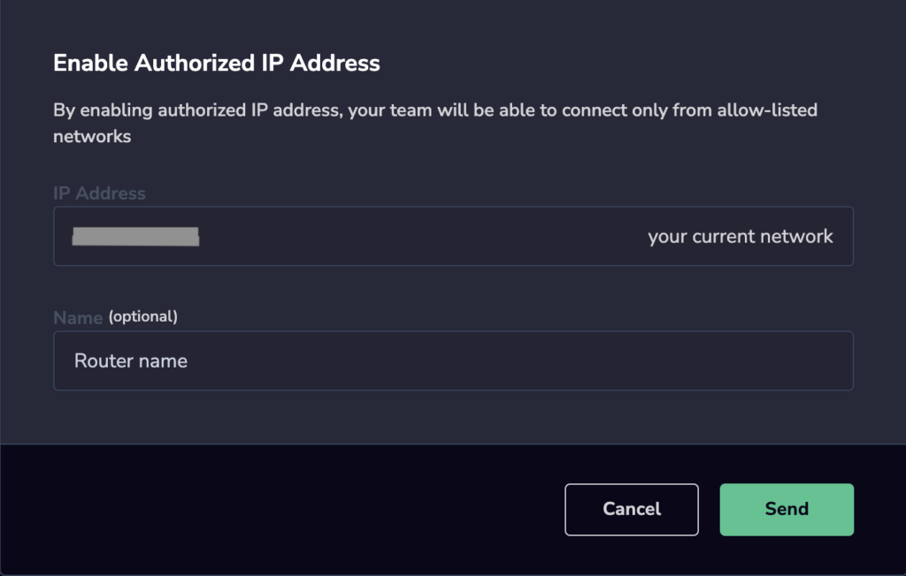

At Coralogix we take the safety and security of your information very seriously. As a result, access to your account is already protected with SHA-256 with RSA Encryption.  
  
Several of our largest customers asked for more, and we listened: They requested the ability to restrict access to their Teams from predefined IP addresses, or network ranges. That’s why we introduced the **IP Access** feature. You can think of this as an Access Control List (ACL) for Coralogix.

## Configure IP Access

**STEP 1**. Log in to your Coralogix Team.  
**STEP 2**. Navigate to settings in your Coralogix dashboard by clicking on your initials in the upper right-hand corner.

**STEP 3**. Click IP Access in the left-hand sidebar.

**STEP 4**. Click **ENABLE IP ACCESS**.

**STEP 5**. Using CIDR notation, enter the IP address of the host or networks to which you would like to restrict access. Single host addresses do not require a network mask, but you could use /32 if you choose to.  
  
For the first address defined in the ACL, configure your local network address (for example x.y.z.0/24), or at least the public IP address of the local host (a.b.c.d) currently used to access your Coralogix account (we detect this IP address automatically for you). When defining a CIDR block, we automatically display on the right side of the UI the corresponding authorized network range.

**STEP 6**. Once you have defined the desired IP address and the Name (optional), click **Send** to save the address to the ACL.

## FAQs

**What if I would like to open access to my Coralogix Team to a list of addresses (network ranges or hosts)?**

You can easily do that by creating a .csv file with any of the following structures:

- CIDR block, name

- hostIP, name

- Or you could omit the name altogether, although it is recommended to use a name, which would allow you to easily visualize in the UI which address or range of addresses belong where, for example: Engineering, Support, etc.

The following example shows what your .csv file could look like:  
  
104.18.10.234, TestPC  
104.18.11.0/24, Support  
Etc.  
  
Please note that the space between the comma (,) and the name is optional. If you omit the name, then “N/A” will be used to designate the host address or network range. Once you have created your .csv file, click **CHOOSE A CSV FILE** in the UI followed by **Open** to add. 

**Can I easily edit/** d**elete addresses / hosts previously authorized?**  
  
Yes of course, you can do that from the UI. You can also enable/disable a network range or host without deleting it.

**Does the IP Access feature supports IPv6?**  
  
Currently the IP Access feature only supports IPv4.

**What happens when I remove the last authorized network range or host?**  
  
When you do this, you will be effectively removing any ACL restriction to your system.

## **Support**

**Need help?**

Our world-class customer success team is available 24/7 to walk you through your setup and answer any questions that may come up.

Feel free to reach out to us **via our in-app chat** or by sending us an email at [support@coralogixstg.wpengine.com](mailto:support@coralogixstg.wpengine.com).
