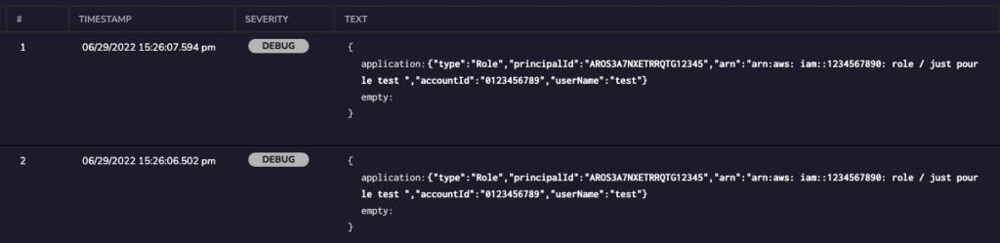

Json Stringify rule allows you to change an array or an object from a json formatted to text.

This rule helps you reduce the number of fields but still keep the data in  Coralogix to be searchable using free text search.

Steps to  configure:

1. Click on Data flow.
2. Click on parsing rules.
3. Select Stringify  Json field rule from the rules list.

4-Configure your group name, rule matchers and all you see needed for your rule.

- Source Field: the field you want to convert to text.
- Keep or delete source field option.

Select keep if you want to keep the original field with its content.

Select Delete if you want to delete the original field and its content.

- Destination field is the new field where you want the content of the source to be put under.

In the example below, I have a field called sessionIssuer which is an abject and I am going to change it to text and give it a new name called application.

## **Original Message:**

New message with delete source field selected

New message with keep source field.

In case you have more questions please contact support through chat or send us an email to [support@coralogixstg.wpengine.com](mailto:support@coralogixstg.wpengine.com).
