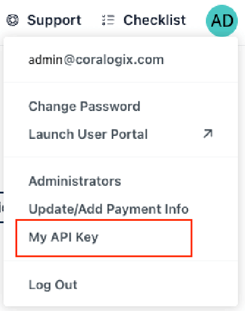

JumpCloud’s open directory platform allows the user to unify technology stack across identity, access, and device management, in a manner that doesn’t sacrifice security or functionality.

JumpCloud can be integrated to Coralogix using a designated script

### Prerequisites

1. A virtual machine used as an intermediate - It is recommended to use at least 2 vCPU and 2GB of RAM

3. Access to JumpCloud platform as Administrator for the API Key

It is recommended to create a read-only administrator account for the API key used in the integration

The API key can be found by clicking your initials on the top right of the JumpCloud platform and then clicking "My API Key"



## STEP 1. Creating the relevant files in the virtual machine

- Login to the Instance that will be used for shipping the JumpCloud logs

- Optional - Create a directory called "JumpCloud" to host all the integration files

- Copy the [script](https://github.com/coralogix/snowbit-integrations/blob/master/SIEM%20%26%20SaaS/JumpCloud/JC-DI2SIEM.ps1) content and paste it in a file called `script.ps1` on the instance in a location of your choosing

- Copy the [configuration file](https://github.com/coralogix/snowbit-integrations/blob/master/SIEM%20%26%20SaaS/JumpCloud/config_coralogix.json) content and paste it in a file called `configurations.json` on the instance in a location of your choosing

- Edit the configuration file in the following manner
    - jumpcloud.**api\_key** - Your JumpCloud admin private key.
    
    - siem.headers.**private\_key** - Your Coralogix private key. can be found in your Coralogix account under **Settings > Send Your Data**. Learn more about your [Send-Your-Data API key](https://coralogixstg.wpengine.com/docs/send-your-data-api-key/).
    
    - siem.**url** - https://ingress._<coralogix domain>_/logs/datastream
        - Coralogix domain - the region-specific endpoint associated with your Coralogix Account. [](https://coralogixstg.wpengine.com/docs/coralogix-domain/)_[You can find your Domain here](https://coralogixstg.wpengine.com/docs/coralogix-domain/)._
    
    - custom\_log\_fields.**reqHost** - Application name
    
    - custom\_log\_fields.**customField** - Subsystem name

## STEP 2. Installing PowerShell (Non Windows)

In non-Windows operation systems, install PowerShell on the instance by copying and running the following script

```
# Update the list of packages
sudo apt-get update
# Install pre-requisite packages.
sudo apt-get install -y wget apt-transport-https software-properties-common
# Download the Microsoft repository GPG keys
wget -q "https://packages.microsoft.com/config/ubuntu/$(lsb_release -rs)/packages-microsoft-prod.deb"
# Register the Microsoft repository GPG keys
sudo dpkg -i packages-microsoft-prod.deb
# Update the list of packages after we added packages.microsoft.com
sudo apt-get update
# Install PowerShell
sudo apt-get install -y powershell
# Start PowerShell
pwsh
```

Note: After the PowerShell installation was successful, create a file called **powershell.config.json** in the correct path (the example uses PowerShell 7)

- For MacOS - /usr/local/microsoft/powershell/7

- For Linux - /opt/microsoft/powershell/7

with the following content

```
{
    "LogLevel": "Critical"
}
```

For more information, visit [Microsoft documentation](https://learn.microsoft.com/en-us/powershell/module/microsoft.powershell.core/about/about_logging_non-windows)

## STEP 3. Install the JumpCloud module

```
Install-Module -Name JumpCloud
```

## STEP 4. Creating the Crontab

- In the virtual machine instance, create a cronjob with the following command (edit according to the files paths you saved on step 1)

```
crontab -e
```

- Inside the crontab document, paste the following line

```
* * * * * /usr/bin/pwsh /home/ubuntu/script.ps1 -config_file:/home/ubuntu/configurations.json 2>&1
```

- Save & quit the crontab

After successfully completing the provided steps, logs will start to ingest to the provided Coralogix account

Log example

```
{
  "jumpcloud": {
    "initiated_by": {
      "id": "637212c33f396457d287dad6",
      "type": "admin",
      "email": "admin@coralogixstg.wpengine.com"
    },
    "geoip": {
      "country_code": "IL",
      "timezone": "Asia/Jerusalem",
      "latitude": 32.0803,
      "continent_code": "AS",
      "region_name": "Tel Aviv",
      "longitude": 34.7805,
      "region_code": "TA"
    },
    "useragent": {
      "minor": "0",
      "os": "Mac OS X",
      "os_minor": "15",
      "os_major": "10",
      "os_version": "10.15.7",
      "version": "108.0.0.0",
      "os_patch": "7",
      "patch": "0",
      "os_full": "Mac OS X 10.15.7",
      "major": "108",
      "name": "Chrome",
      "os_name": "Mac OS X",
      "device": "Mac"
    },
    "mfa": false,
    "event_type": "admin_login_attempt",
    "success": true,
    "service": "directory",
    "organization": "637212c33f396",
    "@version": "1",
    "client_ip": "10.20.30.40",
    "id": "639f9ea9ac5d37",
    "jc_timestamp": "2022-12-18T14:57:03.801Z",
    "reqHost": "jumpcloud",
    "customField": "jumpcloud",
    "severity": "info"
  }
}
```
