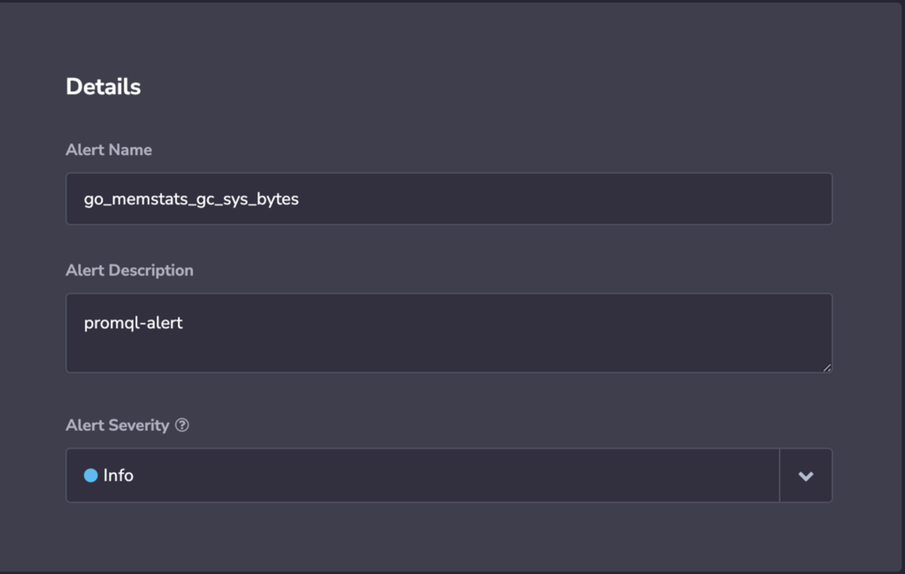
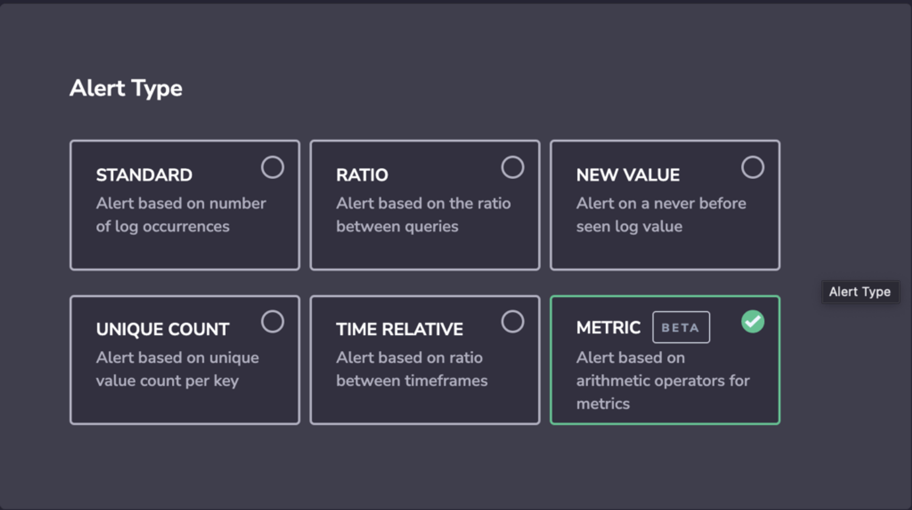
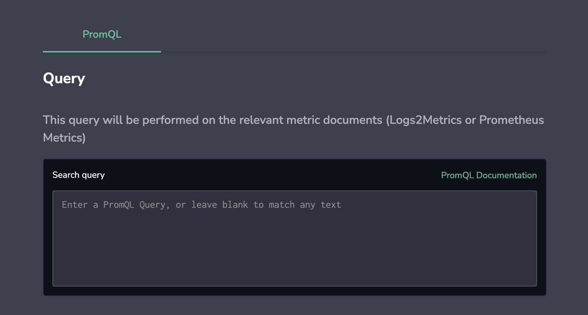
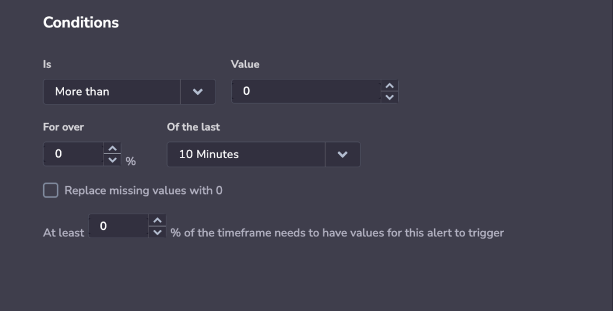
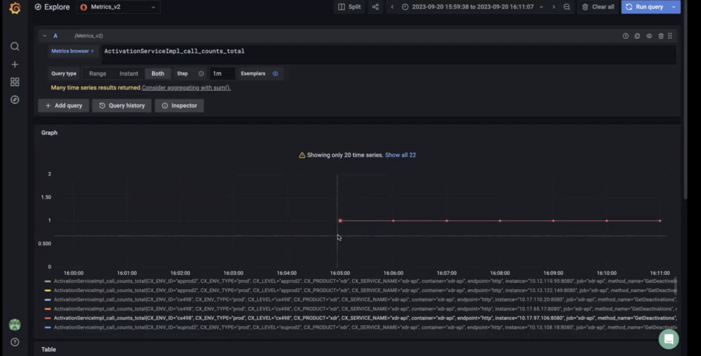
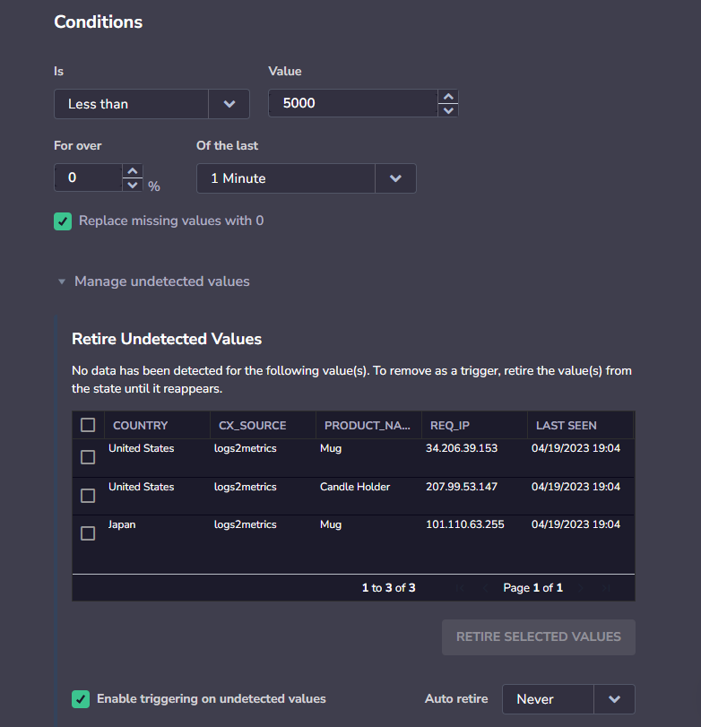
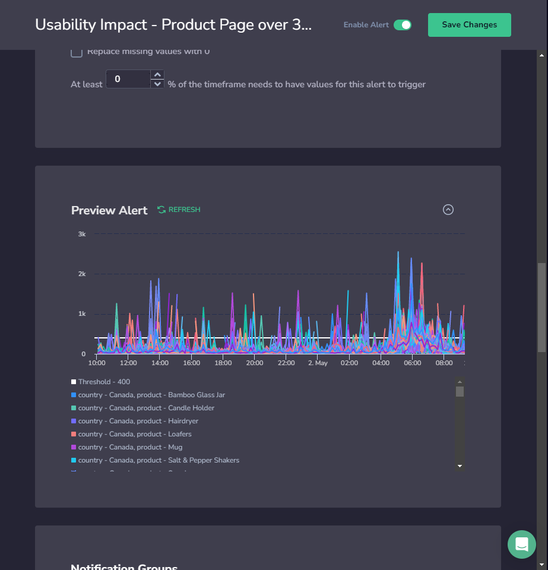
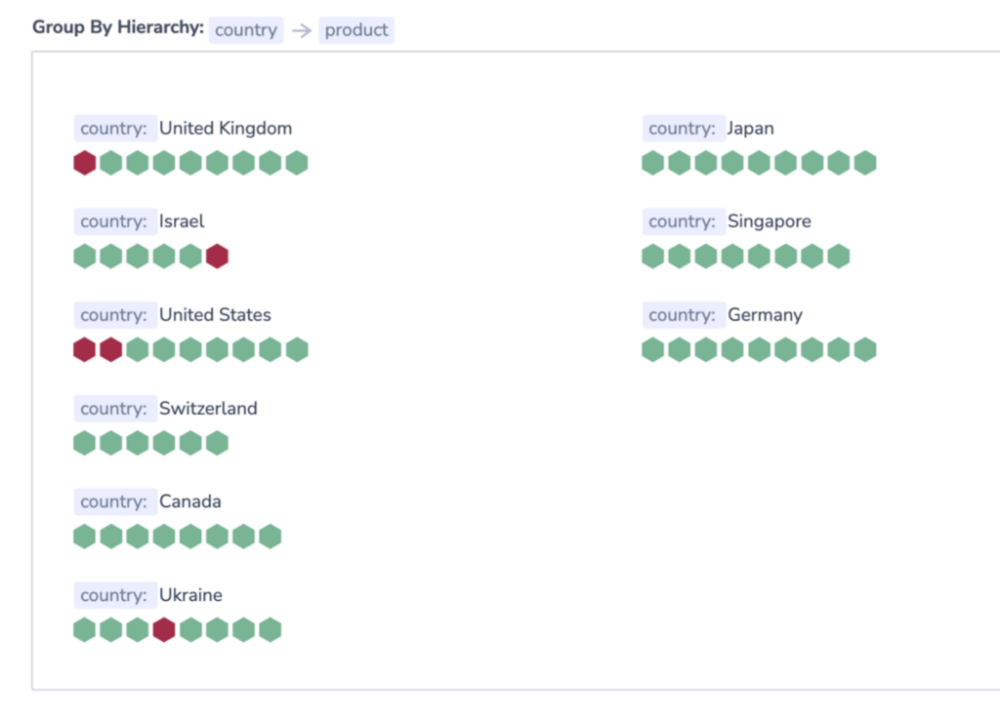

As part of [Coralogix Alerting](https://coralogixstg.wpengine.com/docs/getting-started-with-coralogix-alerts/), **metric alerts** serve as your frontline defense, ensuring your systems and applications' uninterrupted performance, reliability, and security.

## Overview

Metric alerts are notifications triggered by predefined thresholds being met or exceeded for specific metrics in your Coralogix dashboard.

Metric alerts are meticulously designed to monitor critical performance indicators surrounding infrastructure and other metrics. When specific thresholds or conditions are breached, these alerts act as our early warning system, instantly notifying our teams of potential issues requiring immediate attention. For instance, they proactively monitor server CPU utilization, response times, error rates, and resource utilization in cloud environments.

Create PromQL alerts for standard metrics, such as [Prometheus](https://coralogixstg.wpengine.com/integrations/prometheus/) or [Cloudwatch](https://coralogixstg.wpengine.com/integrations/cloudwatch-metrics/) metrics, or metrics hidden within your logs using [Events2Metrics](https://coralogixstg.wpengine.com/docs/event2metrics/)**.**

## Prerequisites

- Metrics sent to Coralogix

## Define the PromQL Query

**STEP 1**. In your Coralogix toolbar, go to **Alerts** > **Alert Management**. Click **ADD NEW ALERT**.

## Details

**STEP 2**. Set alert details: **Name**, **Description**, and **Severity**.



## Alert Type

**STEP 3**. Select **Alert Type**.



## Query

**STEP 4**. Add the [PromQL](https://prometheus.io/docs/prometheus/latest/querying/basics/) query that you would like to trigger the alert.



**Notes**:

- As you type your [PromQL](https://prometheus.io/docs/prometheus/latest/querying/basics/) query, you will immediately get auto-complete suggestions.

- Aggregate using the value of your choice: **app** name, **subsystem**, machine **id**, or otherwise. For instance, you might want to track a total exception count with a single application-wide metric and add metric labels to represent new code areas. If the exception counter was called `application_error_count` and it covered code area `x`, you can tack on a corresponding metric label.

```
application_error_count{area="x"}

```

- Use the `by` aggregation operator to choose which dimensions (metric labels) to aggregate along and how to split your \[alert notification groups\]. For instance, the query `sum by(instance) (node_filesystem_size_bytes)` returns the total `node_filesystem_size_bytes` for each instance.

## Conditions

**STEP 5**. Define the conditions for which your alert will be triggered.



### Basic Conditions

- Choose if your alert will be triggered if it is **more** or **less than** a certain value, or more than usual for a minimum threshold. When the query passes the value or minimum threshold in accordance with the conditions set, an alert will be triggered.

- Selecting the **more-than-usual** condition will trigger an alert when the number of matches is higher than normal and above a minimum threshold. Find out more [here](https://coralogixstg.wpengine.com/docs/machine-learning-metric-alert/#create-a-metric-alert-with-the-more-than-usual-condition).

- Enter a percentage (**for over x %**) and timeframe (**of the last x minutes**). This determines how much of the timeframe you want to cross the threshold for the alert to trigger.

- Select the percentage (**at least x %**) of the timeframe that needs values for the alert to trigger.

**Example**:

- I determine that over 50% of my 10-minute timeframe needs to have the set value for the alert to trigger. If I reach the value for 5 out of the 10 data points, it will be not enough to trigger an alert, as it is not over 50%. If I reach the value for 6 out of the 10 data points, an alert will be triggered, as it is over 50%.

### Percentage Values

- The **percentage values** setting is designed to disable the alert when there are not enough data points to consider the alert reliable. When the amount of data is under the set percentage, the alert will not trigger, regardless of the actual metric value and whether it is over or under a threshold.

- If the percentage is set to 0 and the query crosses the threshold once, an alert is triggered.

- If the percentage is set to 100, this means all of the time window values should cross the threshold. If at any point a value does not, an alert is triggered.

- This setting disappears when checking **replace missing values with zeros**, as it becomes irrelevant. Once missing values are replaced with zero, then there is a guarantee that 100% of the data exists.

### Replace Missing Values With 0

You have the option of **replacing missing values with 0**.

**Why replace missing values with 0?** Sometimes data may have missing values as seen in the graph below. When you don’t replace missing values with zero and leave them empty, the data you do have is considered to be 100% of the data.

Let’s say that you query for a time frame of 10 minutes. 6 data points have values and 4 data points have no values. If you haven’t replaced the missing values with 0, the 6 minutes with values will be considered 100% of the timeframe. This can lead to false triggers.



### Manage Undetected Values

If you are using the **Less than** condition, you will have the option to **manage** **undetected values**.



**Undetected values** occur when a permutation of a **Less than** alert stops being sent, causing multiple triggers of the alert (for every timeframe in which it was not sent).

When you view an alert with undetected values, you have the option to retire these values manually, or select a time period after which undetected values will automatically be retired. You can also disable triggering on undetected values to immediately stop sending alerts when an undetected value occurs.

## Preview the Queried Metric

**STEP 6**. Expand **Preview Alert** to preview the queried metric and defined threshold over the past 24 hours. The preview is limited to a maximum of 100 time series.



## Notifications

**STEP 7**. Define **Notification** settings.

In the notification settings, you have different options, depending on whether or not you are using the **Group By** condition.

### Using Group By

When using **Group By** conditions, you will see the following options:

- **Trigger a single alert when at least one combination of** the group by values meets the condition. A single notification, aggregating all values matching an alert query and conditions, will be sent to your Coralogix Incidents screen.

- **Trigger a separate alert for each combination that meets the condition**. Multiple individual notifications for each Group By field value may be sent to your Coralogix [Incidents Screen](https://coralogixstg.wpengine.com/docs/incidents/) when query conditions are met. Select one or more keys – consisting of a subset of the fields selected in the alert conditions – in the drop-down menu. A separate notification will be sent for each key selected.

- The number of **Group By** permutations is limited to 1000. If there are more permutations, then only the first 1000 are tracked.

### Not Using Group By

When not using the **Group By** condition, **a single alert will be triggered** and sent to your [Incidents Screen](https://coralogixstg.wpengine.com/docs/incidents/) when the query meets the condition.

You can define additional alert recipient(s) and notification channels in both cases by clicking **\+ ADD WEBHOOK**. Once you add a webhook, you can choose the parameters of your notification:

- **Notify Every**. Sets the alert cadence. After an alert is triggered and a notification is sent, the alert will continue to work, but notifications will be suppressed for the duration of the suppression period.

- **Notify When Resolved**. Activate to receive an automatic update once an alert has ceased.

**Notes**:

- Input **Group By** labels here as **free text**.

- The number of **Group By** permutations is limited to 1000. If there are more permutations, then only the first 1000 are tracked.

### Notification Parameters

Both notification types allow you to choose the parameters of your notification.

**STEP 1**. **Notify Every**. Sets the alert cadence. After an alert is triggered and a notification is sent, the alert will continue to work, but notifications will be suppressed for the duration of the suppression period.

**STEP 2**. **Notify when resolved**. Activate to receive an automatic update once an alert has ceased.

**STEP 3**. Define additional alert recipient(s) and notification channels by clicking **\+ ADD WEBHOOK**.

## View Your Triggered Alerts

**STEP 8**. View your triggered alerts.

### Incidents Screen

Our **Incidents** **Screen** displays all of your triggered alert events within the Coralogix platform. View all those events that are currently triggered or those triggered within a specific time frame. With easy-to-use functionalities and the ability to drill down into events of interest, the feature ensures top-notch monitoring and analysis. Find out more [here](https://coralogixstg.wpengine.com/docs/incidents/).

### Alerts Map

**Alerts Map** presents users with a visual representation of each alert status in real time. Grouping all of your alerts in a scalable, information-dense manner, this feature ensures optimal system monitoring. To access the Alerts Map feature, navigate to **Alerts** > **Alert Map**.  Find out more [here](https://coralogixstg.wpengine.com/docs/alerts-map/)**.**



## FAQs

### **Once I set up an alert, how long will it take to activate it?**

When creating an alert, it takes 15 minutes before it triggers. In most cases, it will be faster.

### **How does Coralogix define step intervals?**

For timeframes up to 30 minutes, we define steps every 1 minute.

For timeframes up to 12 hours, we define steps every 5 minutes.

For timeframes over 12 hours, we define steps every 10 minutes.

### **Why might I be missing values in my query?**

This could result from late coming data, a lag of ingestion in a system when the alert triggered.

### **How can I avoid false triggers due to missing values?**

Sometimes data may have missing values as seen in the graph below. When you don’t replace missing values with zero and leave them empty, the data you do have is considered to be 100% of the data.

Let’s say that you query for a time frame of 10 minutes. 6 data points have values and 4 data points have no values. If you haven’t replaced the missing values with 0, the 6 minutes with values will be considered 100% of the timeframe. This can lead to false triggers. To avoid this, either **replace missing values with 0** or set that **at least 100% of the timeframe needs to have values for the alert to trigger**. In the latter case, if certain points don’t exist, an alert will not be triggered.

### **How can I avoid false triggers as a result of missing values?**

Sometimes data may have missing values, as seen in the graph below. When you don’t replace missing values with zero and leave them empty, the data you do have is considered to be 100% of the data.

Let’s say that you query for a time frame of 10 minutes. 6 data points have values and 4 data points have no values. If you haven’t replaced the missing values with 0, the 6 minutes with values will be considered 100% of the timeframe, leading to false triggers.

To avoid this, either replace missing values with zero or set that at least 100% percent of the timeframe needs to have values for this alert to trigger.

### **How do I begin debugging an alert?**

We strongly recommend viewing your metric in Grafana or your Custom Dashboard in real-time. By viewing the metric, you can see if there has been a lag in ingestion or sending.

### **What if I have a metric where zero is a valid value in a timeframe? How is null evaluated in that scenario?**

Our suggestion is to use PromQL function to return a value.

## **Support**

**Need help?**

Our world-class customer success team is available 24/7 to walk you through your setup and answer any questions that may come up.

Contact us **via our in-app chat** or by emailing [support@coralogixstg.wpengine.com](mailto:support@coralogixstg.wpengine.com).
