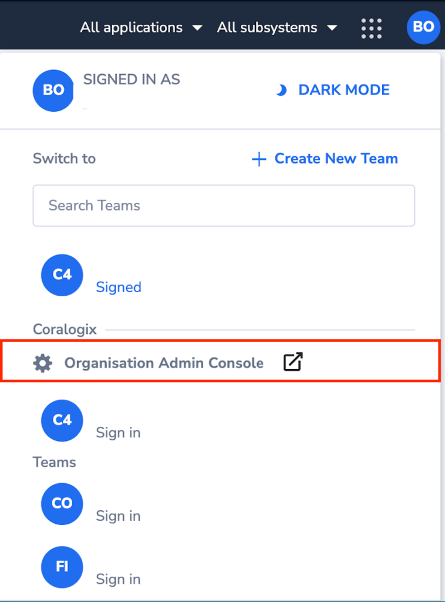
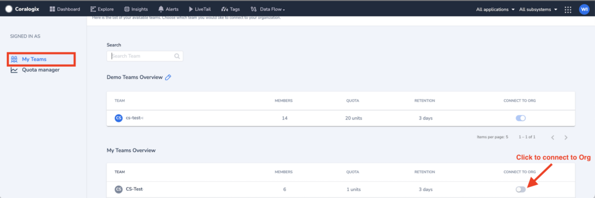
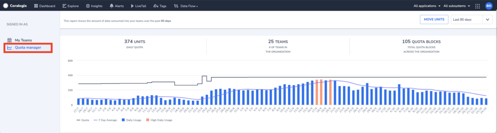
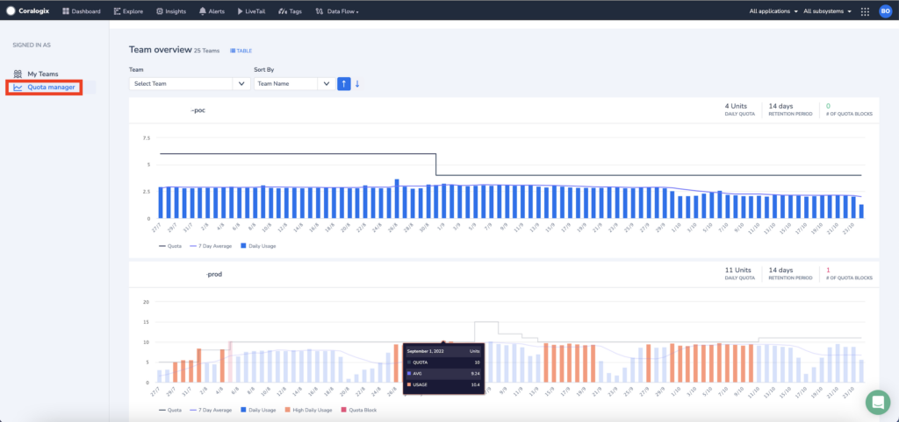
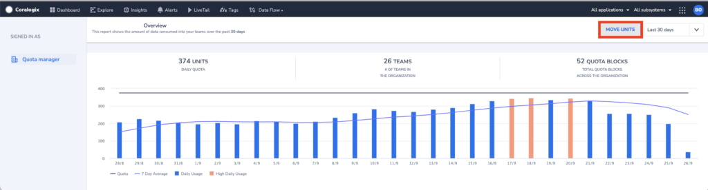
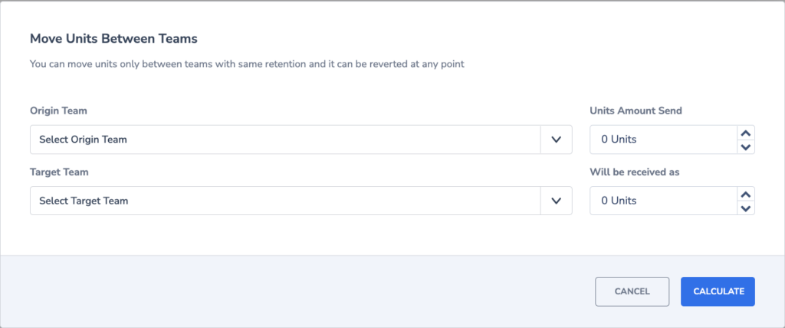

Coralogix supports multi-tenancy, allowing multiple teams to be connected under a single organization. Some companies prefer separate teams to isolate data based on the environment it originates from like: _Dev_, _QA,_ or _Production_. While others prefer to isolate the data based on organizational units like: _Infrastructure_, _Security,_ and _Application_. Coralogix allows you to associate multiple teams with an Organization.

The Organization Admin console provides a single interface for the management of all teams associated with the organization.

**NOTE - Organization management features are only visible to users who have been assigned the role of Organization-admins**

### Creating an Organization

Organizations are created upon request. Please contact us through our in-app chat, or via email at [support@coralogixstg.wpengine.com](mailto:support@coralogixstg.wpengine.com).

Once your organization has been created, navigate to the Admin Console to connect your teams.

### Admin Console

The Admin Console is visible only to **Organization-admins.** It is accessible by \*\*\*\*going to the ‘**Account**’ menu.

### My Teams

This screen lets admins select teams that will be connected to an Organization. Attaching or removing a team is done by toggling the “_Connect to Org_” switch.

**Note:** The user must be an admin on the team being connected.

### Quota Manager

This view helps the Admins easily understand the data usage trends for the entire Organization. The overview graph shows you:

1. Total quota available for the entire organization

3. Number of teams in the organization

5. Daily usage and average 7-day usage

7. Days with high data usage

9. Number of times ingestion was blocked for all teams in your organization.

**Note:** High daily usage means more than 90% of the daily quota was used.

### Quota Usage by Team

The team overview section allows you to filter the data usage statistics by team. The report is available as either a graph or a table. The report shows data usage trends per team. You will see:

1. Daily quota available

3. Retention period

5. Daily usage and average 7-day usage

7. High data usage warnings

9. Number of times ingestion was blocked

### Moving Units Between Teams

Over the course of time, you may need to optimize the quota allocation across your teams. After analyzing your data usage trends, you may discover that some teams get blocked frequently while others have excess quota allocation.

The Quota Manager lets you move quota between teams with the same retention period. To access this feature, click on “Move Units”.

On the form presented, you will be required to select:

1. Origin - Quota will be deducted from this team

3. Units - How many units (GB) to transfer from the Origin team

5. Target - This team will receive quota units from Origin

Approve the transfer to complete the process. The new quota will reflect approximately 5 minutes later.

**As always, if you have questions or suggestions, please contact us in the in-app chat or email us at [support@coralogixstg.wpengine.com](mailto:support@coralogixstg.wpengine.com).**
