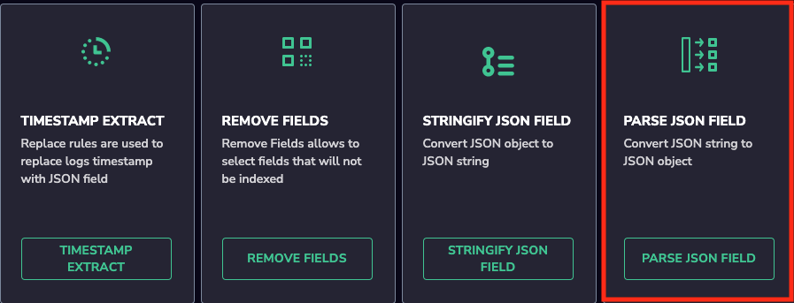
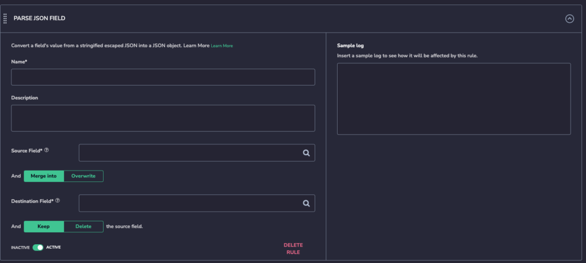
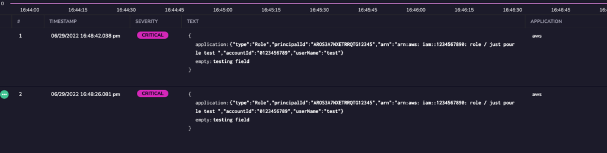

Sometimes logs might be shipped escaped or stringified. With the Parse Json field rule, you can transform these logs to Json with no effort.

Select the field that is escaped select then destination and you are all done.

## Configuration steps.

1. Click on Data flow.
2. Click on parsing rules and chose Parse Json field.

3-Complete all the needed info, group name, rules matcher, rule's name etc.

- Source field is the field you are trying to unescape.
- Merge into and Overwrite only apply if you are trying to overwrite or merge the data to an already existing field. If you are trying to create a new field these 2 options do not matter.
- Keep source field option keeps the source field and its content .
- Delete the source field it will remove the source field and its content.

In the example below we are unescaping the log and making it in Json format.

**Original Message:**

**Message after the rule:**

If you chose a destination field that will cause a mapping exception, A message will pop to let you know that you will be creating an exception if you apply this rule.

